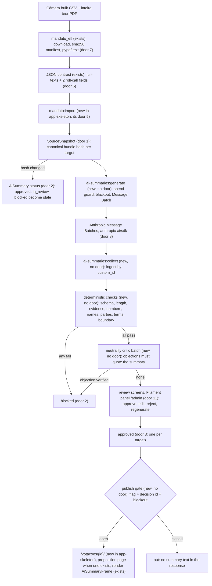
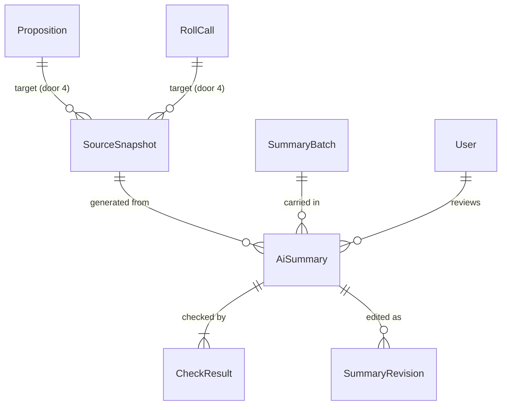

# AI summaries of propositions and roll calls

## Problem

A roll-call page today shows the official description ("Mantido o texto. Sim: 226; Não: 109;
Total: 335.") and the proposition's ementa, and nothing else. A citizen who opens the roll call
that kept a phrase in PL 4035/2023 cannot tell from the page what was being decided or what a
"Sim" meant. In that case "Sim" kept the text: the official opening line is "Votação do DTQ 1 (PL):
Destaque para Votação em Separado da expressão ...". The same gap applies to a bill. The ementa says
what the bill "dispõe sobre", and the 3 to 36 pages of articles behind `urlInteiroTeor` are a PDF
written in legislative language. The measured sample (10 voted bills) has a median of about
10,000 characters and a maximum of 126,000 (PL 2338/2023).

The v2 grilling chose this as the AI scope at launch (decision 11: plain-language summaries of
propositions and roll calls, "o que estava em jogo"). AD-014 attaches four conditions: the
summary is labelled, stored with model and source hash, published only after human review, and
only once a non-profit association exists. The legal research (section 2.3, Res. TSE 23.755/2026)
adds more. Under art. 9-I the burden of proof shifts to us, so we must show how the AI was used.
Art. 28 §1-C forbids AI that ranks or recommends. Art. 9-B §3-A forbids new synthetic content
about candidates from 72 hours before to 24 hours after each round. A3 records Politico's
unreviewed AI tools publishing errors and being shut down in 2025. A summary that invents a
number or puts a name on a vote creates a defamation risk. A table carries no such risk.

When this ships, a reviewer can approve a short, plain-language text for each bill and roll call.
Every sentence of that text has passed checks against the official text before anyone reads it.
Once the maintainer records the association and switches publication on, the roll-call page,
and later the bill page, shows the approved text inside the existing `AiSummaryFrame`. Until then, nothing is public.

## Flow

This feature reuses three things instead of rebuilding them: the ETL's download, cache and hash
manifest (AD-005) for the official PDFs, the forbidden-terms list from `site/src/lib/forbidden-terms.ts`,
and `design/components/AiSummaryFrame.vue`, which already refuses to render an unreviewed text.

Generation runs in the Laravel app, not in the Python ETL, for four reasons:

- The summary's lifecycle (state, review, reviewer, invalidation) lives in the database that only
  the app writes. A Python generator would have to read review state back or hand drafts to the
  app, which means two writers to one lifecycle.
- The ETL's output is public: it is committed and deployed by CI. An unreviewed draft written there
  is published before review, and AD-014 forbids that.
- An Anthropic key in the public repository's CI widens the secret surface. On the VPS the key
  stays in `.env`.
- The ETL keeps the job it is good at: fetching official files, hashing them and extracting text.
  Those steps are deterministic and need no key.

## Impact

| Front | What changes |
| --- | --- |
| domain | new term: `AiSummary` - one generated text for one target, one snapshot and one prompt version, with its own status; lives in the app |
| domain | new term: `SourceSnapshot` - the canonical official input of one target at one moment, identified by its SHA-256; a new hash makes earlier summaries stale |
| domain | new term: `blackout window` - 00:00 three days before to 23:59 one day after an election round, America/Sao_Paulo; nothing new is generated or published inside it |
| domain | existing term: forbidden terms - today a TS constant read only by the static site's copy scan; becomes a JSON list read by both the site test and the app's `forbidden-terms` check, same 19 terms |
| design | `AiSummaryFrame` gains `model`, `generatedAt` and `sourceLabel` props and the label copy changes (AC 35); `design/screens` and the design tests that render the sample frame branch on the old label |
| contract | adds `full-texts/{propositionId}.json` and two roll-call fields (door 6); `schema_version` bumps; the app import is its only reader |
| stored data | nothing to migrate: new tables only; the first `generate` run over the 57th legislature is the backfill (about 1,536 targets) |
| stored data | an extractor upgrade (pypdf version) changes extracted text, re-snapshots every proposition and turns approved summaries stale: re-review load, by design |
| external | only official public texts and roll-call fields are sent to the Anthropic API; no CPF, no user data (AD-003 unaffected) |

## Relations

One-way constraints:

- A snapshot is unique per (target type, house, source id, hash) (door 1).
- A summary status is one of the literal enum values (door 2).
- At most one `approved` summary exists per target (door 3).
- At most one open generation exists per (target, snapshot, prompt version) (door 5).
- A target type is `proposition` or `roll_call` and nothing else. A target is referenced by its natural key, never by row id, so the audit trail survives the import's sweep (door 4).
- A generated output is never overwritten. An edit is a new revision.

No columns and no types here.

## Surface

Only routes this adds or whose signature changes. The review screens are internal, in the `web` middleware group with a session. The public roll-call route is owned by app-skeleton (its door 10), stays in the cookie-free `public` group and gains one prop. App-skeleton has no proposition page: a proposition summary is published only once a feature adds that page, which then takes the same prop.

| Route | In | Out | Status |
| --- | --- | --- | --- |
| `GET /admin/login`, `POST /admin/login` | e-mail, password | Filament login; no registration route | `200`, `302`, `422`, `429` |
| `GET /admin/ai-summaries` | `status`, `target_type` filters, page | queue of summaries, oldest snapshot first, plus "sem texto" and "texto longo demais" targets | `200`, `302`, `403` |
| `GET /admin/ai-summaries/{summary}` | summary id | review screen (AC 25) with approve, edit, reject, regenerate actions | `200`, `302`, `403`, `404` |
| `GET /votacoes/{id}/` (app-skeleton) | roll-call id | adds prop `aiSummary`: null, or `text`, `model`, `generatedAt`, `reviewedAt`, `sourceLabel`, `officialUrl`, `reportUrl` | `200`, `404` |

## Landing

| One-way door | Literal shape | Alternative rejected |
| --- | --- | --- |
| 1. snapshot identity | `source_hash` = SHA-256 hex of canonical JSON of the official inputs (keys sorted, NFC, whitespace runs collapsed to one space); unique `(target_type, house, source_id, source_hash)` | hashing the raw PDF bytes only: a corrected ementa or roll-call field would not invalidate the summary |
| 2. status enum | `queued`, `generating`, `checking`, `blocked`, `in_review`, `approved`, `superseded`, `rejected`, `failed`, `insufficient`, `stale` | booleans `reviewed` + `published`: cannot say blocked, stale or superseded, and storing published turns a computed gate into a field that drifts |
| 3. one approved per target | partial unique index `(target_type, house, source_id) WHERE status = 'approved'`; approving a newer one sets the old to `superseded` in the same transaction | an application check before the update: two reviewers approving at once both pass it and the page has two texts |
| 4. target identity | `(target_type, house, source_id)` with `target_type` in `proposition`, `roll_call` and `house` in `camara`, `senado` (app-skeleton door 4's natural key); no foreign key to `roll_calls` or `propositions`; no person target; a new type needs a migration and an AD | Laravel `morphTo` or a foreign key to the row id: any model, a deputy included, could become a target (AD-014, grilling decision 11), and app-skeleton's import sweep deletes a roll call that leaves the contract, which would cascade into the art. 9-I audit trail |
| 5. one open generation | partial unique index `(target_type, house, source_id, source_hash, prompt_version) WHERE status IN ('queued','generating','checking')` | scheduler `withoutOverlapping()` alone: a manual run or a second worker still double-submits and double-spends |
| 6. contract additions | `full-texts/{propositionId}.json` = `{propositionId, sourceUrl, documentSha256, extractor, extractedAt, text}`; `roll-calls/{id}.json` gains `openingDescription` (bulk `ultimaAberturaVotacao_descricao`) and `lastPresentationDescription` (`ultimaApresentacaoProposicao_descricao`) | the app downloading PDFs itself: duplicates AD-005's download, hash and cache, and moves PDF parsing into PHP |
| 7. ETL extractor | `pypdf` pinned in `etl/uv.lock`; `extractor` = `"pypdf <version>"`; no OCR | poppler `pdftotext`: a system binary uv.lock does not pin, so two machines can extract the same PDF differently and invalidate every summary |
| 8. API client | composer `anthropic-ai/sdk` (official PHP SDK), Message Batches, `output_config.format` JSON schema; model `claude-opus-5-5`, effort `medium` | Laravel `Http` raw calls (re-implements batches and typed errors); a multi-provider wrapper (hides `response.model`, which art. 9-I needs exactly) |
| 9. output schema `ai-summary/v1` | `{"insufficient": bool, "headline": string, "points": [{"text": string, "evidence": [string, 1..3]}] (1..4)}`, the same for both target types; stored raw | Citations API on document blocks: it returns a 400 together with `output_config.format`, and gives no headline/points structure to bound |
| 10. prompts in the repo | `app/resources/prompts/ai-summaries/{proposition,roll-call,neutrality}/v1.md`; `prompt_version` = `"<kind>/v1"`, plus `prompt_sha256` of the rendered system prompt stored per summary | prompts in the database or in config: they would change with no diff and no review, and art. 9-I needs the exact prompt |

| 11. admin panel and reviewers | composer `filament/filament` panel at `/admin` in the `web` group; login only (users created by `php artisan make:filament-user`); Gate `review-ai-summaries` true for users whose e-mail is in `AI_SUMMARIES_REVIEWERS` (comma-separated) | `spatie/laravel-permission`: a roles system for one permission; self-registration or Fortify pages: an auth surface app-skeleton deliberately left out; putting the panel in the `public` group: it needs a session and CSRF |

- Nothing else in this change is hard to reverse. The check thresholds, lexicons, queue layout and
  command flags are reversible and get settled in the diff.

## Criteria

### S1: every target has a hashed official source, and a changed source pulls its summary (P1)

The pipeline always knows which official input a summary came from, and stops showing a summary
whose input changed.

**Acceptance Criteria**

1. WHEN `mandato:import` commits THEN the system SHALL compute each in-scope target's `source_hash` (door 1) and insert a SourceSnapshot only when that hash differs from the target's latest snapshot.
2. The system SHALL treat as in scope exactly the Câmara propositions of type PL, PLP, PEC, MPV or PDL linked to at least one `PLEN` roll call with at least one vote record, and every `PLEN` roll call with at least one vote record (measured on 2026-10-02: 411 and 1,125).
3. WHEN a target gets a new snapshot THEN the system SHALL set each of its summaries in `approved`, `in_review` or `blocked` to `stale` in the same transaction.
4. IF a proposition's extracted text has fewer than 200 non-whitespace characters THEN the system SHALL NOT queue it and SHALL list it in the queue under "sem texto".
5. IF a source bundle exceeds 400,000 characters THEN the system SHALL NOT queue it and SHALL list it in the queue under "texto longo demais".

**Independent test:** import a fixture contract, change one ementa, re-import: one new snapshot, the approved summary of that target is `stale`, the others untouched.

### S2: generation through Message Batches with full provenance (P1)

An approved summary can always be traced to the model, prompt and source that produced it.

**Acceptance Criteria**

6. WHEN `ai-summaries:generate` runs with generation enabled THEN the system SHALL submit one Message Batch with one request per target whose latest snapshot has no summary for the current prompt version outside `failed`, with `custom_id` equal to the summary id, model `claude-opus-5-5`, effort `medium` and `output_config.format` set to schema `ai-summary/v1`.
7. WHEN `ai-summaries:collect` ingests a succeeded result THEN the system SHALL store the model id returned in the response, the prompt version and `prompt_sha256`, the snapshot hash, batch id, message id, stop reason, input and output token counts, the raw output and the generation timestamp.
8. IF a result is `errored`, `expired` or `canceled`, or its stop reason is `refusal` or `max_tokens`, THEN the system SHALL set the summary to `failed` with that reason, and `generate` SHALL queue the target again until 3 failed summaries exist for the same snapshot and prompt version.
9. IF the output has `insufficient` true THEN the system SHALL set the summary to `insufficient` and SHALL NOT queue that snapshot again under the same prompt version.
10. WHEN the same result is ingested a second time THEN the system SHALL leave the summary and its check results unchanged.
11. WHEN a proposition bundle is built THEN the system SHALL wrap the text in `<dispositivo>` and `<justificacao>` parts, split at the first line matching JUSTIFICAÇÃO, JUSTIFICATIVA or EXPOSIÇÃO DE MOTIVOS (case- and accent-insensitive, digit 0 read as O).
12. WHEN a roll-call bundle is built THEN the system SHALL remove the tally pattern `Sim: n; Não: n; ... Total: n` from the official description, so that any vote count written by the model fails AC 15.
13. The automated test suite SHALL complete with 0 requests reaching the Anthropic API (HTTP fake with stray requests prevented).

**Independent test:** run `generate` and `collect` against a faked batch whose results cover succeeded, errored, refusal and insufficient: four summaries end in `checking`, `failed`, `failed`, `insufficient`, with provenance stored on the first.

### S3: deterministic checks block a summary before any human sees it as approvable (P1)

A summary with an invented number, a name, a party, a valuative word or an unverifiable quote never reaches the approve button.

**Acceptance Criteria**

14. WHEN an output is stored THEN the system SHALL run the checks `schema`, `length`, `evidence`, `numbers`, `names`, `parties`, `forbidden-terms`, `evaluative-terms` and `boundary`, and store one result per check with outcome `pass`, `warn` or `fail` and the offending excerpt.
15. IF the headline or a point text contains a digit sequence whose normalized form (thousands dots removed) does not occur in the normalized source bundle THEN `numbers` SHALL fail.
16. IF an evidence string has fewer than 20 characters, or does not occur in the source bundle after collapsing whitespace and joining hyphenated line breaks, THEN `evidence` SHALL fail.
17. IF every occurrence of an evidence string of a proposition summary lies inside `<justificacao>` THEN `boundary` SHALL fail; IF the bundle has no `<justificacao>` split THEN `boundary` SHALL record `warn`.
18. IF the headline or a point text contains a parliamentary name of any deputy, senator or president in the imported data (whole word, case- and accent-insensitive), or one of `Dep.`, `Deputado`, `Deputada`, `Senador`, `Senadora`, `Relator`, `Relatora` followed by a capitalized word, THEN `names` SHALL fail.
19. IF the headline or a point text contains an upper-case party abbreviation from the imported data that is not followed by a number (so "PL 2338/2023" passes), a `SIGLA-UF` token such as `PSOL-RJ`, or `Partido` followed by a capitalized word, THEN `parties` SHALL fail.
20. IF the headline or a point text contains a term from the shared forbidden list THEN `forbidden-terms` SHALL fail, unless the same term occurs in the source bundle, where it SHALL record `warn`.
21. IF the headline or a point text contains a term from lexicon `evaluative-terms/v1`, which includes evaluative adjectives and vote-recommendation phrases, THEN `evaluative-terms` SHALL fail, unless the same term occurs in the source bundle, where it SHALL record `warn`.
22. IF the headline exceeds 100 characters, a point text exceeds 240 characters, or headline plus points exceed 900 characters THEN `length` SHALL fail.
23. WHEN every deterministic check passes THEN the system SHALL send the summary in a neutrality batch with prompt `neutrality/v1`, discard each returned objection whose quote does not occur verbatim in the summary, and record `neutrality` as `fail` when at least 1 objection remains, otherwise `pass`.
24. IF any check outcome is `fail` THEN the system SHALL set the summary to `blocked`; WHEN all outcomes are `pass` or `warn` THEN it SHALL set `in_review`.

**Independent test:** feed hand-written outputs (one per rule, plus one clean) through the checks with no API call: each faulty output is `blocked` by exactly its check, and the clean one reaches the neutrality step.

### S4: a named person reviews, edits, rejects or approves (P1)

Nothing becomes `approved` without a human act on the record.

**Acceptance Criteria**

25. WHEN a reviewer opens a summary THEN the screen SHALL show the ementa, a link to the official document, the source bundle with each evidence string highlighted, the summary, every check result with its excerpt, the model id, prompt version, the first 12 characters of the snapshot hash and the generation date.
26. IF a user without permission `review-ai-summaries` requests a review route THEN the system SHALL answer 403, and a guest SHALL be redirected (302) to login.
27. WHEN a reviewer approves an `in_review` summary whose snapshot is the target's latest THEN the system SHALL set it to `approved` and store reviewer id, review timestamp and the SHA-256 of the approved text; IF the snapshot is no longer the latest THEN the system SHALL refuse with "A fonte mudou; gere um novo resumo".
28. IF two approvals for the same target run concurrently THEN exactly 1 SHALL succeed and the other SHALL show "Já existe um resumo aprovado para este item".
29. WHEN a reviewer saves an edit THEN the system SHALL keep the generated output unchanged, store the text as a new revision with the editor id, set `edited` true and rerun every deterministic check (AC 15 to 22) on it; the approve action SHALL be offered only while all of them pass.
30. WHEN a reviewer rejects a summary THEN the system SHALL require one reason from `factual-error`, `not-neutral`, `incomplete`, `unreadable`, `other` (free text required for `other`) and set `rejected`.
31. WHEN a reviewer asks to regenerate a `blocked`, `rejected`, `failed` or `stale` summary THEN the system SHALL queue a new summary for the target's latest snapshot and leave the old row unchanged.
32. WHEN a reviewer triggers approve, reject or regenerate THEN the screen SHALL ask for confirmation in a modal before acting.

**Independent test:** as a reviewer, edit a clean summary to add "o polêmico projeto": approve disappears; revert the edit, approve; open the same target as a second reviewer: no approve.

### S5: publication stays shut until the association, and the label carries the record (P1)

The approved text reaches the public only through the gate AD-014 sets, framed and labelled.

**Acceptance Criteria**

33. WHILE `ai_summaries.publish` is false the system SHALL send no summary text in the HTML or the Inertia props of any public page.
34. IF `ai_summaries.publish` is true and `ai_summaries.publish_decision` is empty THEN the system SHALL behave as if publish were false and log `ai_summaries.publish_without_decision` at error level.
35. WHERE publishing is enabled the roll-call page `/votacoes/{id}/` (and the proposition page, once a feature adds it) SHALL render only an `approved` summary whose snapshot is the target's latest, inside `AiSummaryFrame`, with the label "Resumo gerado por IA (<modelo>) em DD/MM/AAAA a partir do <fonte>, revisado por uma pessoa em DD/MM/AAAA. Pode conter erros; confira o texto oficial." and the links "Ler o texto oficial" and "Reportar erro neste resumo", where <fonte> is "texto apresentado em DD/MM/AAAA" for a proposition and "registro oficial da votação" for a roll call.
36. WHILE the Brasília time is inside a blackout window around a configured round date (initially 2026-10-25, 2028-10-01, 2028-10-29, 2030-10-06, 2030-10-27) the system SHALL submit no batch and SHALL publish no summary approved after the window began.
37. The public page SHALL show no evidence strings, check results, reviewer identity or prompt text.

**Independent test:** with a fixture approved summary, request the roll-call page under the three gate states (flag off; flag on without decision; flag on with decision) and at a frozen time inside 2028-09-29..2028-10-02: the text appears only in the third state outside the window.

### S6: spend is capped and every run leaves a trail (P2)

The maintainer decides the spend, and every cent of it is accounted for.

**Acceptance Criteria**

38. IF `ai_summaries.monthly_usd_cap` is 0 or `ANTHROPIC_API_KEY` is empty THEN `ai-summaries:generate` SHALL submit nothing, print `geração desligada: <motivo>` and exit 0.
39. WHEN `ai-summaries:generate --dry-run` runs THEN it SHALL print the number of targets per type and the estimated USD (input as characters / 3 plus prompt tokens, output as `max_tokens`, at the configured batch prices), and SHALL submit nothing, even with the cap at 0.
40. IF this month's estimated spend plus the next batch's estimate exceeds the cap THEN `generate` SHALL submit only the oldest-snapshot targets that fit and print how many it deferred.
41. WHEN a batch is submitted or collected THEN the system SHALL log one structured line with batch id, request count, succeeded, errored, input tokens, output tokens and estimated USD.
42. WHEN `ai-summaries:audit {summary}` runs THEN it SHALL print one JSON object with target, snapshot hash, official source URL, model, prompt version and `prompt_sha256`, generation timestamp, check results, reviewer id, review timestamp, `edited` and the approved text, and exit 0; IF the id does not exist THEN it SHALL exit 1.

**Independent test:** set the cap to the dry-run estimate of 10 targets with 20 queued: one batch of 10 is submitted against the fake, 10 are deferred, and one log line is written.

## Out of scope

| Excluded | Why |
| --- | --- |
| Senado and Presidência targets | etl-senado is still being planned and its text formats are unknown; a new target type is one enum value plus an AD (door 4) |
| Summary of the substitutivo or final wording | `urlInteiroTeor` is the text as presented; what the plenary passed lives in other documents, and AC 35's label names the source honestly meanwhile |
| OCR of scanned PDFs | adds a model of its own and new error modes; AC 4 lists these targets for a human |
| Per-parliamentarian summary, natural-language search, chat | grilling decision 11 and art. 28 §1-C |
| Publishing without human review when checks pass (the Plenarwatch model) | AD-014 requires review |
| Public AI-policy page and "O que achou deste resumo?" feedback | public copy belongs with go-live, after the association; listed as a go-live dependency |
| A quality evaluation run against the real API | it spends money, which stays with the maintainer; the dry run (AC 39) gives the number to decide on |

## Assumptions

| Assumption | Chosen default | Rationale | Confirmed? |
| --- | --- | --- | --- |
| Model | `claude-opus-5-5` at effort `medium`, Batch API: about US$58 per full pass of the 57th Câmara, about US$88 with a 1.5x regeneration margin. `claude-sonnet-5-5` would cost about US$29 | the claude-api skill's default model (cached table 2026-09-25: Opus 5.5 US$4/US$20 per MTok, Sonnet 5.5 US$2/US$10, batch 50% off every token). The arithmetic is in Sources | y |
| Token arithmetic | 3 characters per token. Proposition: 8k in / 2k out. Roll call: 3k in / 1.5k out. Neutrality: 2.5k in / 0.8k out. Volumes 411 + 1,125 | measured sizes (median about 10k characters, maximum 126k). Thinking cannot be disabled on Opus 5.5, so the output figures include it. `count_tokens` needs a key, so it is not run here | y |
| Refusal fallback | no server-side `fallbacks`; a refusal is `failed` (AC 8) and visible in the queue | the label and art. 9-I need the exact model that wrote the text, and the fallback beta's behaviour inside batches is not documented in the skill | y |
| Where generation runs | Laravel queued commands on the VPS, scheduled every 10 minutes; ETL only extracts text | Flow, four reasons | y |
| Review UI | this feature adds Filament (door 11), as in the grilling's unconfirmed default | grilling 05, "Painel de correções"; the approved app-skeleton plan adds no auth and no admin | y |
| Reviewers | e-mails listed in `AI_SUMMARIES_REVIEWERS`; initially the maintainers, as identified natural persons | a reviewer is accountable for the text, and a list in `.env` is auditable without a roles system | y |
| Where the proposition summary shows before a proposition page exists | nowhere public; it is generated and reviewed, and the roll-call page shows only the roll-call summary | app-skeleton ships only `/deputados/{id}/` and `/votacoes/{id}/`; reusing the proposition text on the roll-call page would mix two reviewed objects in one frame | y |
| Prompt version change | does not stale an approved summary; new generations use the new version; a re-run is a manual command | an approved text stays valid for its unchanged source | y |
| Edited summary and the critic | an edit reruns the deterministic checks only, not the neutrality batch | the editor is a human, and a rerun would spend money on every keystroke saved | y |
| Evidence strings on the public page | not shown (AC 37) | they can carry names from official text (for example the rapporteur in roll-call fields); the reviewer sees them | y |
| Forbidden-terms single source | reuse app-skeleton's `app/config/forbidden-terms.php` and its parity test against `site/src/lib/forbidden-terms.ts`; no new `policy/` file and no change to `site/` | changed by the orchestrator at approval: app-skeleton already builds that copy and its parity test, and the live MVP stays untouched | y |
| Verification profile | `standard`, above the AGENTS.md `light` default | the checks are the part a parliamentarian can contest, as with etl-camara | y |
| Initial evaluative lexicon | seed list in `evaluative-terms/v1`: polêmico, controverso, histórico, absurdo, infelizmente, felizmente, benéfico, prejudicial, retrocesso, avanço, ataque, golpe, privilégio, mamata, jabuti, pauta-bomba, deveria, recomendamos, vale a pena, vote | the minimum Plenarwatch-style list; extended in the diff with tests | y |

**Open questions:**

| # | Kind | Question | Until answered |
| --- | --- | --- | --- |
| 1 | blocks go-live | Has the non-profit association been constituted, and which AD records it? | `ai_summaries.publish` stays false and `publish_decision` empty (AC 33, 34) |
| 2 | blocks go-live | Will the maintainer issue an Anthropic key and set a monthly cap? | `generate` prints "geração desligada" (AC 38); the dry run still estimates |
| 3 | blocks go-live | Which named persons review? | no `review-ai-summaries` holder, so nothing can be approved |

Resolved on 2026-10-02 by the orchestrator under the maintainer's delegation (`research/decisions-log.md`): (4) yes, drafts may be generated and reviewed before the association exists, with nothing published, but only once question 2 is answered, since generation spends money; (5) door 6 lands inside contract-v3's schema version 3, not as a later bump; (6) `generate` and `collect` run by hand until the deploy feature schedules them. Questions 1 to 3 are outside the delegation (legal identity, spending, named persons) and stay with the maintainer.

**Approval:** approved by the orchestrator under the maintainer's delegation on 2026-10-02. Build starts after app-skeleton lands (models, `mandato:import`) and after contract-v3 carries door 6.

## Observable

| Surface | Decision | Landing |
| --- | --- | --- |
| screen review queue | empty state | text "Nenhum resumo aguardando revisão" when no row matches; AC 4 and 5 rows show even when no summary exists |
| screen review queue | loading and error states | existing - Filament table defaults (door 11) |
| screen review queue | unauthorised | AC 26 |
| screen review queue | density and ordering | oldest snapshot first, filters `status` and `target_type`, 25 rows per page (Surface) |
| screen review detail | destructive action confirms | AC 32 |
| screen review detail | stale source while open | AC 27 |
| screen review detail | concurrent reviewers | AC 28 |
| public roll-call page (and proposition page later) | empty state (no published summary) | AC 33 and 35 - the frame is absent, and `AiSummaryFrame` already renders nothing without `reviewedAt` |
| public roll-call page (and proposition page later) | error and loading states | n/a - the summary is server-rendered with the page and has no request of its own |
| document: frame label | structure, tone, next action | AC 35 - descriptive, names model, dates and source; next action is reading the official text or reporting an error |
| document: summary text | depth and tone | AC 18 to 23 - at most 900 characters, no names, parties or evaluative terms |
| command `ai-summaries:generate` | output, flags, exit codes | AC 38, 39 and 40; `--dry-run`, `--limit=N` (default: all that fit the cap) |
| command `ai-summaries:generate` | fails halfway | AC 8 - a batch is atomic on submission; per-item failures go to `failed` and are retried |
| command `ai-summaries:collect` | output and exit codes | AC 41; exit 0 when a batch is still processing, exit 1 on an API error after the SDK retries |
| command `ai-summaries:audit` | output and exit codes | AC 42 |
| all new admin routes | versioning, rate limits | n/a - internal screens for a handful of authenticated reviewers |

## Sources

- `.specs/STATE.md` AD-014 and `research/05-grilling-escopo-v2.md` decisions 7 and 11 - scope, conditions and the association gate.
- `research/01-pesquisa-juridica.md` section 2.3 (Res. 23.755/2026: art. 9-B §3-A, 9-I, 28 §1-C) and its checklist "Quando entrar IA" - label, data-first pipeline, blackout windows, kept records.
- `research/design-anexos/a3-pares-internacionais.md` 1.16 and idea 5 - Plenarwatch's blocking checks (numbers from the official file, verbatim quotes, no member names, a neutrality critic that must quote).
- Cost arithmetic, Opus 5.5 batch (US$2 per MTok in, US$10 per MTok out):
  - propositions: 411 x 8k = 3.29 MTok in (US$6.58), 411 x 2k = 0.82 MTok out (US$8.22);
  - roll calls: 1,125 x 3k = 3.38 MTok in (US$6.75), 1,125 x 1.5k = 1.69 MTok out (US$16.88);
  - neutrality: 1,536 x 2.5k = 3.84 MTok in (US$7.68), 1,536 x 0.8k = 1.23 MTok out (US$12.29);
  - total US$58.40. Volumes are from the local bulk files 2023-2026, measured 2026-10-02.
  - Prices: the claude-api skill model table (cached 2026-09-25), with the batch discount from its `shared/cost-optimization.md` section 2.5. Re-check against https://platform.claude.com/docs/en/about-claude/pricing.md before any spend.
- `.worktrees/app-skeleton/.specs/features/app-skeleton/plan.md` (approved 2026-10-02, `7589df9`) - `mandato:import` and its sweep, natural keys `(house, source_id)`, `/votacoes/{id}/` in the cookie-free `public` group, no auth and no proposition page.
- Câmara API, checked 2026-10-02: `GET /api/v2/proposicoes/{id}` exposes `urlInteiroTeor`, which serves `application/pdf` with a text layer, and `texto` and `justificativa` come back null. `GET /api/v2/votacoes/{id}` exposes `descUltimaAberturaVotacao` and `ultimaApresentacaoProposicao`, and the bulk CSV carries the same two fields.
