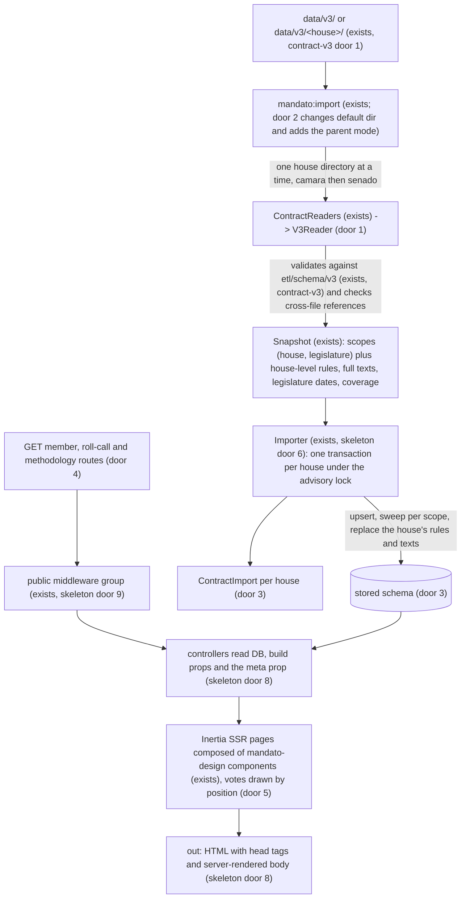
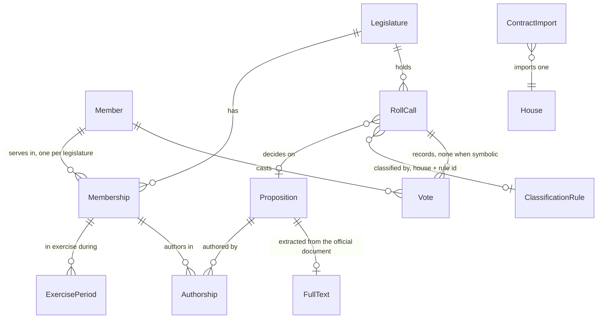

# app-contract-v3: the app reads contract v3, both houses and both legislatures

## Problem

The app imports only `schema_version` 2 (app-skeleton door 5: `SUPPORTED_SCHEMA_VERSIONS = [2]`, the v2 reader stamps house `camara` and legislature 57). That contract has one house, one legislature and flat indicators. The ETL now publishes contract v3 (AD-016, AD-017) in one directory per house, `data/v3/camara/` and `data/v3/senado/`. Each directory has mandates per legislature, indicators on two bases (`all` and `merit`), roll calls with `ballot` and `kind` assigned by a published rule table, vote `position` next to the official value, Senate absence codes generalised to "Licença" (AD-018), nullable symbolic counts and proposition full texts. None of it reaches a page. A visitor who looks up one of their three senators finds no page. A deputy re-elected on 2027-02-01 would have nowhere to show the 58th legislature apart from the 57th. The numbers the skeleton shows are v2's: alignments counted across committees, procedural requests weighted like final votes (570 of the 1,123 Câmara nominal plenary roll calls are procedural, contract-v3 Problem). Their methodology link points to the live MVP page, which describes v2's rules and not v3's.

Who pays: the maintainer, who has a fixed date (2027-02-01, v2 grilling decision 2). So do two approved features that cannot start without this one. Meus-eleitos reads `ballot`, `kind`, `position` and Senate members ("Build order" assumption). Ai-summaries hashes the full texts and roll-call descriptions at import time (its S1). The source gives no other evidence.

When this ships, `php artisan mandato:import` loads `data/v3/camara/` and `data/v3/senado/`, each house in its own transaction. Deputies and senators have pages per legislature. Every indicator shows both bases, named for what they contain. Senate roll calls have their own pages. `/metodologia/` renders the classification rules the ETL published, with each indicator's definition in v3 terms.

## Flow

This reuses the app-skeleton's import command, advisory lock, per-scope transaction and sweep (its doors 5 and 6), the `opis/json-schema` validator pointed at contract-v3's `etl/schema/v3/` files, the cookie-free `public` group and Blade-rendered meta (skeleton doors 8 and 9), and the `mandato-design` components. Every count is copied from the contract and none is recomputed in PHP, so the method lives only in the ETL.

## Impact

| Front | What changes |
| --- | --- |
| domain | existing term: `Membership` (the contract's mandate) meant "member in legislature 57 with v2 indicators"; it now carries the mandate's own party and UF, its exercise periods, each indicator on the `all` and `merit` bases, and a nullable symbolic count. Who branches on it today: the skeleton's profile controller; meus-eleitos AC 22 ("latest membership in the current legislature") after this lands |
| domain | existing term: `Vote.vote` (official string) becomes `official` plus `position`. Who branches on it: the skeleton's roll-call grouping (its AC 19) and `design/components/vote.js` `voteCase`, which `MandateScore` and `VoteMark` call; meus-eleitos AC 35 reads the `vote.js` label |
| domain | existing term: `RollCall.secret` (boolean) becomes `ballot` (`nominal`, `secret`, `symbolic`). Who branches: the skeleton's roll-call page (its AC 20, 22) and `MandateScore`'s `secret` input |
| domain | new term: `kind` and `ClassificationRule` - the published rule that classified a roll call; `merit` = `kind` in `final`, `amendment`. Meus-eleitos' `scope merit` filters on it |
| domain | existing term: `ContractImport` was one per run; it is now one per house per run, carrying the house. The skeleton's footer read "the latest import"; it now reads the latest of the page's house. Meus-eleitos' cursor (`max(contract_imports.id)`) stays monotonic |
| stored data | a migration empties the eight contract tables before reshaping them (door 3); the next `mandato:import` refills them. No production database exists (deploy is a later feature) and no table references `members` yet (meus-eleitos builds after this) |
| app-skeleton code | `V2Reader` and its tests are deleted (door 1); the importer and page tests move from `site/tests/fixtures/out` to v3 fixtures. Skeleton criteria superseded here: AC 1, 2, 3 (message now `expected one of: 3`), 12, 14, 18 to 22 and 27; the rest still hold |
| methodology links | every `methodUrl` moves from `https://augusto-dmh.github.io/mandato-aberto/metodologia/#...` (skeleton assumption) to the app's `/metodologia/#...`; the MVP page describes v2 rules that no longer match the numbers |
| `design/` | `vote.js` gains a position-keyed encoding; `VoteMark` and `MandateScore` gain `house`, `position`, `official` inputs, additively (door 5). The prototype (`design/scripts/contract.mjs`, `design/screens/*`) keeps reading v2 through the old inputs |
| `etl/`, `site/`, `data/` | untouched. `etl/schema/v3/*.json` becomes read at import time, so a v3 schema change is also an app change, as v2's was |
| CI | nothing new; job `app` runs the new tests. Sail already mounts `../data` and `../etl` read-only (skeleton door 11) |
| dependency on other features | needs app-skeleton and contract-v3 merged first (the reader seam, the stored schema, `etl/schema/v3/`); etl-senado only for real Senate data, not for the tests |

## Relations

One-way constraints (door 3): `ClassificationRule` unique on house + rule id, kept in the order the contract lists it. `FullText` at most one per proposition, deleted with it. `ExercisePeriod` unique on membership + start, deleted with its membership. `ContractImport` names exactly one house. `ballot`, `kind`, `position` and `partyMajority` hold only the contract's literal enum values, enforced by database checks. A roll call's three tallies are all absent or all present. A membership's symbolic count may be absent, and absent never means zero (contract-v3 door 9). A roll call names its rule by id with no foreign key, because a house's rules are replaced as a set on each import. The skeleton's unique keys are unchanged. No columns and no types here.

## Surface

Only routes this adds or whose signature changes. Every route is `GET`, in the cookie-free `public` group, and answers with and without the trailing slash (skeleton AC 28).

| Route | In | Out | Status |
| --- | --- | --- | --- |
| `GET /deputados/{id}/` | `id` digits, Câmara member id | HTML (Inertia `Members/Show`, latest mandate) · `meta` prop · `X-Inertia` JSON on Inertia visits | `200`, `404` |
| `GET /deputados/{id}/legislatura/{n}/` | `id` digits, `n` digits, a legislature the member holds | HTML (Inertia `Members/Show`, mandate `n`) · `meta` prop | `200`, `404` |
| `GET /senadores/{id}/` | `id` digits, Senate `CodigoParlamentar` | HTML (Inertia `Members/Show`, latest mandate) · `meta` prop | `200`, `404` |
| `GET /senadores/{id}/legislatura/{n}/` | `id` digits, `n` digits | HTML (Inertia `Members/Show`, mandate `n`) · `meta` prop | `200`, `404` |
| `GET /votacoes/{id}/` | `id` `digits-digits`, Câmara roll-call id | HTML (Inertia `RollCalls/Show`, now with `ballot`, `kind`, `kindRule`, positions) · `meta` prop | `200`, `404` |
| `GET /senado/votacoes/{id}/` | `id` digits, Senate `codigoSessaoVotacao` | HTML (Inertia `RollCalls/Show`) · `meta` prop | `200`, `404` |
| `GET /metodologia/` | none | HTML (Inertia `Methodology/Show`): indicator definitions, both houses' rule tables, coverage · `meta` prop | `200` |

The import command's signature, default directory and exit codes are door 2. The maintainer calls it, and later the deploy feature's scheduler does. It is never called over HTTP.

## Landing

| One-way door | Literal shape | Alternative rejected |
| --- | --- | --- |
| 1. The app reads v3 only; the v2 reader is dropped | `ContractReaders::SUPPORTED_SCHEMA_VERSIONS = [3]`; `match ($version) { 3 => app(V3Reader::class), default => null }`; `app/app/Contract/V2Reader.php` and its tests deleted; `V3Reader::read(string $houseDir): Snapshot` yields one scope per `meta.legislatures[].id` for `meta.house`, plus the house-level records (legislature dates, rules, full texts, coverage, `classification.version`); validation with `opis/json-schema` against `config('mandato.schema_dir') . '/v3/<name>.schema.json'` before any write | keeping `V2Reader` until the MVP retires: the ETL keeps emitting v2 for `site/`, which reads files and never the app (AD-016), so nothing consumes a v2 import into the app; keeping it would make every column added here nullable for v2's sake and make every page branch on which version wrote a row, and a v2 import after a v3 one would overwrite (`camara`, 57) with numbers on a different base. Mapping v2 into v3 rows: v2 has no `ballot`, `kind` or `position`, so the mapping would invent a classification |
| 2. Import command over per-house directories | `php artisan mandato:import {dir?} {--dry-run}`; `dir` default `config('mandato.contract_dir')` = `base_path('../data/v3')`. A `dir` with `meta.json` is one house. Otherwise the command imports `dir/camara` then `dir/senado`, each that holds a `meta.json`, each validated and committed in its own transaction, all under one `pg_try_advisory_lock` taken once per run. Exit `0` when every house imported, `1` when any house was refused or failed (houses already committed stay), `2` when `dir` does not exist (`Command::INVALID`) | one transaction over both houses: a Senate schema error would block the daily Câmara update, the failure contract-v3 door 1 avoids in the ETL. One invocation per house only: the deploy scheduler would have to know the list of houses. Discovering any subdirectory: a stray `data/v3/tmp/` would be imported as a house |
| 3. Stored schema for v3 | one migration that first deletes every row of `votes`, `authorships`, `roll_calls`, `memberships`, `propositions`, `members`, `contract_imports`, `legislatures`, then: `legislatures` + `starts_on`, `ends_on` not null; `members` + `photo_url`; `memberships` drops `participation_count`..`party_alignment_total` and gains `{participation,government_alignment,party_alignment}_{all,merit}_{count,total}` not null, `party`, `uf` not null, `symbolic_merit` nullable; new `exercise_periods` (`membership_id` cascade, `starts_at`, `ends_at`, unique `(membership_id, starts_at)`); `roll_calls` drops `secret`, gains `ballot` check `in ('nominal','secret','symbolic')`, `kind` check `in ('final','amendment','procedural','unclassified')`, `kind_rule` nullable, `opening_description`, `last_presentation_description` nullable, tallies nullable with check `(tally_yes is null) = (tally_no is null) and (tally_no is null) = (tally_others is null)`, `government_orientation` check `in ('yes','no','abstention','obstruction','free')`; `votes` renames `vote` to `official`, gains `position` check `in ('yes','no','abstention','obstruction','presiding','secret','notVoting')`, same check on `party_majority`; `propositions` + `type`, `number`, `year`, `presented_on`, `status`, `source_url`; `authorships` + `first_signer`; new `classification_rules` (`house` check, `rule_id`, `position`, `kind`, `field`, `pattern`, `description`, unique `(house, rule_id)`); new `full_texts` (`proposition_id` unique, cascade, `source_url`, `document_sha256`, `extractor`, `extracted_at`, `text`); `contract_imports` + `house` not null with check, `classification_version`, `coverage` `jsonb` (the meta's `coverage` verbatim) | backfilling v2 rows into the new columns: there is no `ballot`, `kind`, `merit` or `position` in v2, so a backfill would write classifications nobody computed. Keeping v2 rows beside nullable v3 columns: every page branches on a row's origin. Pt-BR or PHP-cased enum values: a second vocabulary to translate at import and in meus-eleitos' queries. Full texts read from `data/v3/<house>/full-texts/` at request time: the ETL swaps that directory daily, and ai-summaries hashes the text at import commit (its S1) |
| 4. Public URL shapes for the Senate and for legislatures | `Route::get('/senadores/{id}/', ...)->whereNumber('id')->name('senators.show')`; `/senadores/{id}/legislatura/{n}/` `->whereNumber(['id','n'])->name('senators.legislature')`; `/deputados/{id}/legislatura/{n}/` `->name('deputies.legislature')`; `Route::get('/senado/votacoes/{id}/', ...)->whereNumber('id')->name('senate-roll-calls.show')`; `/metodologia/` `->name('methodology')`; the canonical of a member's latest-legislature path is the bare member path, every other legislature path is its own canonical; `App\Support\PublicUrl::member(house, id)` and `::rollCall(house, id)` are the only builders of these paths | one `/votacoes/{id}/` for both houses told apart by id shape: Senate `"6923"` and a Câmara id without a suffix would collide, and the house would be invisible in a shared link. `/votacoes/senado/{id}/`: the bare `/votacoes/` list, when one exists, would mean both "Câmara" and "all". `/parlamentares/{house}/{id}/`: breaks every MVP `/deputados/` link (skeleton door 10). `?legislatura=58`: the skeleton's canonical drops the query, so a shared 57th link would preview the 58th title |
| 5. Votes drawn by position, labelled by house | `design/components/vote.js` exports `positionCase({house, position, official})` returning `{kind, label}`: marks `yes` bar up, `no` bar down, `abstention` hollow square, `obstruction` hatched square, `presiding` small dot, `secret` and `notVoting` a gap. Labels: Câmara as today's `voteCase` (`Sim`, `Não`, `Abstenção`, `Obstrução`, `Art. 17 (presidente da sessão)`, `Votação secreta`, `Registro sem voto`). Senate `presiding` `Presidente da sessão (art. 51 RISF)`, `secret` `Votou (votação secreta)`, `notVoting` `Sem voto: <descrição>` with `P-NRV` `Presente, não registrou voto`, `AP` `Atividade parlamentar`, `MIS` `Missão da Casa no País ou no exterior`, `NCom` `Não compareceu`, `NA` `Dispositivo não citado`, `Licença` `Licença`, and any other official value verbatim. `VoteMark` and `MandateScore` accept `house`, `position`, `official` beside the old `vote`/`secret` inputs | the app mapping positions back to Câmara strings: a Senate presiding vote would read "Art. 17", a Câmara rule. Labels kept in the app: two encodings, and the design verification no longer covers what ships (skeleton door 2). Replacing `vote`/`secret`: breaks the prototype, which reads v2 until `site/` retires |
| 6. Senate non-vote records outside the roll-call page (added while deriving checks, from resolved open question 2) | `positionCase({house: 'senado', position: 'notVoting', official: null})` returns `{kind: 'not-voting', label: 'Não registrou voto'}`; the member controller sends every Senate `notVoting` vote with `official: null`, so the official code reaches neither the member page's HTML nor its Inertia props; the Senate roll-call page writes `Registro do Senado: <door 5 description>` (the official value verbatim when door 5 has no description) in a `.ma-muted` note beside each `notVoting` row, and its `VoteMark` keeps door 5's `Sem voto: <descrição>` label | sending `official` to the member page and hiding the label in Vue: the code still ships in the page's JSON, which every shared link carries. A second label function in `vote.js`: two encodings of one mark, and the design tests would cover only one of them. Rewriting door 5's `notVoting` label to `Não registrou voto` everywhere: the roll-call page would lose the official wording the resolution keeps there |

- Nothing else in this change is hard to reverse

## Criteria

### S1: Each house directory loads on its own (P1)

`mandato:import` turns a v3 house directory into rows, refuses what does not hold together, and leaves the other house alone.

**Acceptance Criteria**

1. WHEN `php artisan mandato:import <houseDir>` runs on a directory whose `meta.json` has `schema_version` 3 and whose files all validate against `etl/schema/v3` THEN the system SHALL persist, for `meta.house`, one `Member` per `members.json` entry, one `Membership` per mandate with its `party`, `uf`, the `count` and `total` of both bases of `participation`, `governmentAlignment` and `partyAlignment`, `symbolicMerit`, `authoredCount`, `firstSignerCount` and `requirementsCount`, and one `ExercisePeriod` per `exercisePeriods` entry, and SHALL exit 0
2. WHEN that import runs THEN the system SHALL persist one `RollCall` per `roll-calls.json` entry with `legislature`, `date`, `organ`, `description`, `approved`, `ballot`, `kind`, `kindRule`, `tallies`, `governmentOrientation` and `sourceUrl`, plus `openingDescription` and `lastPresentationDescription` from `roll-calls/<id>.json`, and one `Vote` per entry of that file's `votes` with `official`, `position`, `party` and `partyMajority`
3. WHEN that import runs THEN the system SHALL persist one `Proposition` per `propositions.json` entry, one `ClassificationRule` per `classification-rules.json` entry in file order, and one `FullText` per `full-texts/<propositionId>.json` with `sourceUrl`, `documentSha256`, `extractor`, `extractedAt` and `text`
4. WHEN a proposition author's `memberId` holds a mandate in the legislature whose dates contain the proposition's `presentedAt` THEN the system SHALL persist one `Authorship` on that membership with `firstSigner`; IF `presentedAt` is null or no such mandate exists THEN it SHALL persist no `Authorship` for that author
5. WHEN `symbolicMerit` or `tallies` is `null` in the contract THEN the stored value SHALL be null, never 0
6. WHEN a house import succeeds THEN the system SHALL print `Imported schema_version 3 <house> generated <generatedAt>: <n> members, <n> mandates, <n> roll calls, <n> votes, <n> propositions, <n> full texts` and record one `ContractImport` with that house, `schema_version`, `generatedAt`, the SHA-256 of `meta.json`, `classification.version`, `coverage` as published and those counts
7. IF `meta.json` has a `schema_version` other than 3, 2 included, THEN the system SHALL exit 1, print `schema_version <v> is not supported; expected one of: 3` to stderr, and leave every table's row count unchanged
8. IF any file of the house directory, `roll-calls/<id>.json` and `full-texts/<id>.json` included, is missing or fails its schema THEN the system SHALL exit 1, print the file path and the first failing JSON pointer to stderr, and change no row of that house
9. IF a vote's `official` is `LS`, `LP` or `LAP` THEN the system SHALL refuse the house directory as in AC 8 and store no vote with that value (AD-018)
10. IF a reference does not resolve (a vote or author `memberId` absent from `members.json`; a `nominal` or `secret` roll call without its `roll-calls/<id>.json`, or such a file for a `symbolic` roll call or an id absent from `roll-calls.json`; a `kindRule` absent from `classification-rules.json`; a record whose `house` differs from `meta.house`; a roll call or mandate whose `legislature` is absent from `meta.legislatures`; a full text whose `propositionId` is absent from `propositions.json`) THEN the system SHALL exit 1, print `<file>: <reason>: <id>` to stderr, and change no row of that house
11. IF `meta.legislatures` gives a legislature number dates other than the stored ones THEN the system SHALL exit 1, print `legislature <n> dates differ: stored <start>..<end>, contract <start>..<end>` and change no row of that house
12. WHEN the same house directory is imported twice THEN the system SHALL leave the row count and every non-timestamp column of `members`, `memberships`, `exercise_periods`, `roll_calls`, `votes`, `propositions`, `authorships`, `classification_rules` and `full_texts` identical after the second run
13. WHEN a house directory omits a roll call, vote, mandate, exercise period or authorship that the previous import had for a (house, legislature) listed in its `meta.legislatures` THEN the system SHALL have no such row after the import, and SHALL keep the `Member` and `Proposition` rows
14. WHEN a house directory's `meta.legislatures` omits a legislature that has stored rows of that house THEN the system SHALL leave those rows unchanged
15. WHEN a house is imported THEN its `ClassificationRule` rows SHALL equal exactly the file's rules in file order, its `FullText` rows SHALL equal exactly the files under `full-texts/`, and no row of the other house SHALL change
16. WHEN `mandato:import <dir>` runs on a directory without `meta.json` THEN the system SHALL import `<dir>/camara` and then `<dir>/senado`, each that holds a `meta.json`, each in its own transaction, and print one AC 6 line per imported house
17. IF one house of a parent-directory run is refused or fails THEN the system SHALL keep the other house's committed import, print the failing house directory and its error to stderr, and exit 1
18. IF a directory without `meta.json` has neither `camara/meta.json` nor `senado/meta.json` THEN the system SHALL exit 1 and print `no contract found in <dir>` to stderr
19. WHEN `mandato:import` runs without an argument THEN the system SHALL read `base_path('../data/v3')`
20. WHEN `--dry-run` is given THEN the system SHALL run every check of AC 7 to 11 for each house, print each house's counts prefixed `Would import`, write no row, and exit as a real run would

**Independent test:** import the v3 fixtures of both houses from their parent directory and dump the tables. Import them again and compare the dumps. Break one Senate vote's `memberId` and re-run: the Câmara rows are unchanged, the Senate rows are unchanged, and the exit code is 1.

### S2: The stored schema holds only what v3 can say (P1)

The migration replaces v2-shaped rows with a schema whose checks refuse anything outside the contract's vocabulary.

**Acceptance Criteria**

21. WHEN the migration runs on a database holding rows from a `schema_version` 2 import THEN the eight contract tables SHALL hold 0 rows afterwards, and a v3 import into that database SHALL exit 0
22. IF a write stores a roll call whose `ballot` or `kind` is outside the door 3 values, a vote whose `position` or `party_majority` is outside the position values, or a roll call with some tallies null and others not THEN the database SHALL reject it with a check-constraint violation

**Independent test:** migrate, insert one invalid row per check through the query builder, and expect four `QueryException`s.

### S3: Member pages for both houses, one per legislature (P1)

A deputy or a senator has a page per mandate. The bare address shows the latest mandate.

**Acceptance Criteria**

23. WHEN `GET /deputados/{id}/` is requested for an imported Câmara member THEN the system SHALL respond 200 with Inertia component `Members/Show` for the mandate with the highest legislature number, the name in the only `<h1>`, and the eyebrow `Câmara dos Deputados · {n}ª legislatura · {party} · {uf}` with that mandate's party and UF
24. WHEN `GET /senadores/{id}/` is requested for an imported Senate member THEN the system SHALL respond as AC 23 with the eyebrow `Senado Federal · {n}ª legislatura · {party} · {uf}`
25. WHEN `GET /deputados/{id}/legislatura/{n}/` or `/senadores/{id}/legislatura/{n}/` is requested for a mandate the member holds THEN the system SHALL respond 200 rendering mandate `n`
26. WHEN the member holds more than one mandate THEN the page SHALL render a `<nav aria-label="Legislaturas">` listing each mandate as `{n}ª legislatura ({start year}–{end year})`, newest first, each linking to the member's legislature path, the rendered one marked `aria-current="page"`
27. WHEN the member holds exactly one mandate THEN the page SHALL render `{n}ª legislatura ({start year}–{end year})` as text and no `Legislaturas` nav
28. WHEN a member page renders THEN the head SHALL hold `<title>{name} ({party}-{uf}) na {n}ª legislatura - Mandato Aberto</title>`, `og:title` without the suffix, and the skeleton's description with `na Câmara dos Deputados` or `no Senado Federal` by house, in `description` and `og:description`
29. WHEN the rendered mandate is the member's latest THEN `canonical` and `og:url` SHALL be `{APP_URL}/deputados/{id}/` or `{APP_URL}/senadores/{id}/` on both the bare and the legislature path, and WHEN it is an earlier mandate THEN they SHALL be `{APP_URL}/{deputados|senadores}/{id}/legislatura/{n}/`
30. IF `{id}` is not all digits, is not an imported member of the route's house (a Senate id under `/deputados/` included), or `{n}` is not a legislature the member holds, THEN the system SHALL respond 404 with the skeleton's "Página não encontrada" page
31. WHEN a member page renders THEN `MandateScore` SHALL draw one column per plenary roll call of the rendered legislature in which the member has a vote, oldest first, each drawn by door 5 and linking to `/votacoes/{id}/` (Câmara) or `/senado/votacoes/{id}/` (Senado)
32. The footer of a Câmara page SHALL read `Dados abertos da Câmara dos Deputados, coletados em DD/MM/AAAA`, and of a Senate page `Dados abertos do Senado Federal, coletados em DD/MM/AAAA`, with the Brasília date of the `generatedAt` of that house's latest `ContractImport`
33. The system SHALL render `OfficialPhoto` without `src` on the member pages of both houses, and those pages SHALL contain no `` whose `src` is outside the app's origin

**Independent test:** import fixtures in which one deputy holds mandates in 57 and 58 and one senator holds a 57th only. Request the bare and the legislature paths of each, read status, `<h1>`, eyebrow, nav and canonical. Request the senator's id under `/deputados/` and expect 404.

### S4: Both bases, described plainly (P1)

Every indicator shows the votes on proposals and amendments, then all nominal votes. The page says what separates them, and no copy ranks one above the other.

**Acceptance Criteria**

34. WHEN a member page renders THEN for each of `Participação em votações nominais do plenário`, `Votos iguais à orientação do governo` and `Votos iguais à maioria do próprio partido` it SHALL render two `NDeM`: first labelled `nas votações sobre propostas e emendas` with the `merit` count and total, then `em todas as votações nominais do plenário` with the `all` count and total, each note's `methodUrl` `{APP_URL}/metodologia/#participacao`, `#alinhamento-governo` or `#alinhamento-partido`
35. WHEN a member page renders THEN it SHALL render once, before the indicators: `Votações sobre propostas e emendas são as que decidem um projeto, uma proposta de emenda à Constituição, uma medida provisória, uma emenda ou um destaque. As demais votações nominais tratam de procedimento, como requerimentos e recursos. A classificação segue regras publicadas.`, with `regras publicadas` linking to `/metodologia/#classificacao`
36. IF a basis has total 0 THEN its `NDeM` SHALL render "Sem base de cálculo no período" and no number
37. WHEN `symbolicMerit` is an integer `n` greater than 0 THEN the page SHALL render `Durante o exercício nesta legislatura, o plenário também decidiu {n} votações simbólicas sobre propostas e emendas. Votação simbólica não registra o voto de cada parlamentar.` (`1 votação simbólica` when `n` is 1), and WHEN it is 0 THEN `Nenhuma votação simbólica sobre propostas e emendas ocorreu no plenário durante o exercício nesta legislatura.`
38. IF `symbolicMerit` is null THEN the page SHALL render `O Senado Federal não publica votações simbólicas como registros de votação; por isso elas não aparecem aqui.` (`A Câmara dos Deputados` for a Câmara mandate) and no number
39. The HTML of every member, roll-call and methodology page SHALL contain none of `importante`, `importantes`, `relevante`, `relevantes`, nor any term of the skeleton's forbidden list, as whole words, case- and accent-insensitively

**Independent test:** render a mandate whose `merit` and `all` differ (for example 3 of 4 and 7 of 10), one with a merit total of 0, and one Senate mandate with `symbolicMerit` null. Read the six numbers in order, the empty-state text and the Senate sentence.

### S5: Roll-call pages for both houses (P1)

Every roll call says how it was voted, what the rule says it decided, and how each member voted, by position.

**Acceptance Criteria**

40. WHEN `GET /senado/votacoes/{id}/` is requested for an imported Senate roll call THEN the system SHALL respond 200 with Inertia component `RollCalls/Show`, the heading of AC 41, and each voter's row linking to `/senadores/{memberId}/`
41. WHEN a roll-call page renders THEN its `<h1>` SHALL be `{type} {number}/{year}` of the proposition or, without one, `{ballot label} de DD/MM/AAAA`, with ballot labels `Votação nominal`, `Votação secreta`, `Votação simbólica`
42. WHEN a roll-call page renders THEN it SHALL show `{ballot label} · {kind label}` with kind labels `Decisão sobre a proposta` (`final`), `Emenda, destaque ou parte do texto` (`amendment`), `Procedimento` (`procedural`), `Sem regra correspondente` (`unclassified`), followed by a link `regra {kindRule}` to `/metodologia/#regra-{house}-{NN}`, or for `unclassified` a link `como as votações são classificadas` to `/metodologia/#classificacao`
43. WHEN a `nominal` or `secret` roll call has votes THEN the page SHALL group them by `position` in the order `yes`, `no`, `abstention`, `obstruction`, `presiding`, `secret`, `notVoting`, headed `Sim`, `Não`, `Abstenção`, `Obstrução`, the house's door 5 `presiding` label, `Deputados que votaram` or `Senadores que votaram`, and `Sem voto registrado`, names in pt-BR alphabetical order, each row a `VoteMark` with the door 5 label
44. IF the roll call is `symbolic` THEN the page SHALL render `Votação simbólica: não há registro do voto de cada parlamentar nem placar.`, no `TallyBar` and no group
45. IF a `secret` roll call has null tallies THEN the page SHALL render `Placar não publicado pela Casa.` and no `TallyBar`
46. WHEN the Senate roll-call page renders THEN the head SHALL hold the skeleton's tags with title `{heading}: como cada senador votou` (`secret`: `{heading}: votação secreta`, `symbolic`: `{heading}: votação simbólica`) and `canonical` and `og:url` `{APP_URL}/senado/votacoes/{id}/`; the Câmara page SHALL use `{heading}: votação simbólica` for a symbolic roll call and otherwise keep the skeleton's titles
47. IF `{id}` is not an imported roll call of the route's house, or does not match `[0-9]+-[0-9]+` (Câmara) or `[0-9]+` (Senado), THEN the system SHALL respond 404 with the skeleton's "Página não encontrada" page
48. The function `positionCase` in `design/components/vote.js` SHALL return, for every (house, position) pair and every Senate `official` listed in door 5, the mark and label door 5 gives, and for a Câmara vote the same label `voteCase` returns for the equivalent official value

**Independent test:** import the fixtures, then request a Câmara nominal roll call, a Câmara symbolic one, a Senate secret one with `Votou` and `Licença` entries, and a Câmara id under `/senado/votacoes/`. Read the headings, groups, labels and statuses.

### S6: The methodology page shows the rules in force (P1)

`/metodologia/` explains each v3 number and lists every classification rule the import stored, so anyone can re-run a rule against the official text.

**Acceptance Criteria**

49. WHEN `GET /metodologia/` is requested THEN the system SHALL respond 200 with Inertia component `Methodology/Show`, `<h1>` `Metodologia`, and sections with ids `bases`, `participacao`, `alinhamento-governo`, `alinhamento-partido`, `votacoes-simbolicas`, `proposicoes`, `tipos-de-votacao`, `classificacao`, `registros-sem-voto`, `cobertura`, in that order, each holding the copy of the table below for its id
50. WHEN a house has a `ContractImport` THEN the `classificacao` section SHALL render a heading `Regras da Câmara dos Deputados, versão {v}` or `Regras do Senado Federal, versão {v}` with `v` from that house's latest import, and a table with one row per stored rule in stored order, columns `Regra`, `Tipo`, `Campo`, `Padrão`, `Descrição`, row id `regra-{house}-{NN}`, the kind in the AC 42 labels and the pattern in `<code>`
51. IF a house has no `ContractImport` THEN its part of `classificacao` and of `cobertura` SHALL read `Ainda não há dados importados do Senado Federal.` (or `da Câmara dos Deputados`) and render no table
52. WHEN the `cobertura` section renders THEN it SHALL show one row per house and legislature of each house's latest import, columns `Casa`, `Legislatura`, `Dados até`, `Nominais`, `Secretas`, `Simbólicas`, `Sem regra correspondente`, with `não publicadas pela Casa` where the symbolic count is null
53. WHEN the methodology page renders THEN the head SHALL hold `<title>Metodologia - Mandato Aberto</title>` and `canonical` and `og:url` `{APP_URL}/metodologia/`
54. The system SHALL render every `methodUrl` starting with `{APP_URL}/metodologia/#`, and SHALL render no link to `augusto-dmh.github.io/mandato-aberto/metodologia`

Methodology copy (AC 49):

| Section id | Copy |
| --- | --- |
| `bases` | `Cada indicador aparece em duas bases. "Todas as votações nominais do plenário" conta toda votação nominal ou secreta do plenário. "Votações sobre propostas e emendas" conta só as classificadas como decisão sobre a proposta ou como emenda, destaque ou parte do texto, pelas regras publicadas nesta página. Nenhuma pessoa escolhe votação por votação.` |
| `participacao` | `Base: votações nominais e secretas do plenário na legislatura, realizadas enquanto o parlamentar estava em exercício. Conta: aquelas com voto registrado, inclusive a presidência da sessão e o voto em votação secreta. Licenças, missões e registros sem voto entram na base e não na conta.` |
| `alinhamento-governo` | `Base: votos Sim, Não, Abstenção ou Obstrução do parlamentar em votações do plenário em que o governo orientou Sim, Não, Abstenção ou Obstrução. Conta: votos iguais à orientação do governo. Votações secretas e orientações "Liberado" ficam fora da base.` |
| `alinhamento-partido` | `Base: votos Sim, Não, Abstenção ou Obstrução do parlamentar em votações do plenário em que a maioria dos demais membros do mesmo partido votou uma dessas opções, sem empate. Conta: votos iguais a essa maioria.` |
| `votacoes-simbolicas` | `Na votação simbólica, o plenário decide sem registrar o voto de cada parlamentar. A página do parlamentar informa quantas votações simbólicas sobre propostas e emendas ocorreram durante o exercício; esse número não entra em nenhum indicador. O Senado Federal não publica votações simbólicas como registros de votação.` |
| `proposicoes` | `Contamos as proposições apresentadas dentro da legislatura. Câmara: PL, PLP, PEC, PDL e PRC como autoria; REQ, RIC e INC como requerimentos. Senado: PL, PLP, PEC, PDL e PRS como autoria; RQS, REQ e INS como requerimentos.` |
| `tipos-de-votacao` | `Nominal: cada voto fica registrado com o nome do parlamentar. Secreta: a Casa registra quem votou, não como votou. Simbólica: o resultado é proclamado sem registro individual.` |
| `classificacao` | `As regras são aplicadas na ordem da tabela ao texto oficial da votação, sem acentos, em minúsculas e com espaços simples; vale a primeira que corresponder. Uma votação sem regra correspondente entra em "todas as votações nominais do plenário" e fica fora da base de propostas e emendas.` |
| `registros-sem-voto` | the door 5 labels of both houses as a table `Casa`, `Registro oficial`, `Como aparece aqui`, then `O Senado publica o tipo de licença de cada senador; aqui todas as licenças aparecem como "Licença".` |
| `cobertura` | `Quantas votações cada importação trouxe, por Casa e legislatura.` followed by the AC 52 table |

**Independent test:** import only the Câmara fixture and request `/metodologia/`: the Câmara rule table matches the fixture's rules row by row, and the Senate parts read "Ainda não há dados importados". Then import the Senate fixture and the Senate table appears.

### S7: New pages keep the skeleton's guarantees (P1)

Shared links still get a complete, cookie-free page.

**Acceptance Criteria**

55. The system SHALL send no `Set-Cookie` header on any response of the Surface routes or their 404s
56. WHILE the Inertia SSR server is running THEN the initial HTML of every Surface route SHALL contain the page's `<h1>` text and every number of AC 34 and AC 52 inside the app root element
57. IF the SSR server is unreachable THEN every Surface route SHALL still respond 200 with the head tags of AC 28, AC 29, AC 46 and AC 53
58. WHEN a Surface route is requested without the trailing slash THEN the system SHALL respond 200 with the same canonical as the slash form

**Independent test:** with SSR up, `curl` one page per route and grep the `<h1>`; stop SSR and `curl` again for the head tags; `curl -I` for `Set-Cookie`.

## Out of scope

| Excluded | Why |
| --- | --- |
| Per-bench orientations on the roll-call page | the importer validates them but no page reads them yet; storing them waits for the page that shows them |
| Committee votes in the profile's partitura | the indicators are plenary-only (contract-v3 assumption); committee roll calls keep their own pages |
| Lists of symbolic roll calls per member | the contract counts them per mandate but links no member to them; the profile states the count |
| Home, search, listings of deputies, senators or roll calls | later features; this one only adds the per-record pages and the methodology |
| Proposition pages | no feature has planned them; ai-summaries publishes proposition summaries when one does |
| Linking a deputy who becomes a senator | contract-v3 excludes cross-house identity (AD-003 rules out CPF) |
| Presidência | not a house (contract-v3 door 3); its entity lands in a later contract version |
| Senate full texts | etl-senado open question 3: the Câmara first |
| Retiring `site/` or the ETL's v2 emission | the feature that puts the app at the public address (AD-016) |
| Official photos and share cards | photo-cache and card features (skeleton out of scope) |
| A toggle between bases on the partitura | the partitura draws every plenary vote; the bases are separated in the indicators |

## Assumptions

| Assumption | Chosen default | Rationale | Confirmed? |
| --- | --- | --- | --- |
| Verification profile | `ui` | three new screens and a reworded profile, where the risk is copy and arrangement (descriptive bases, no ranking), plus the importer; `ui` enumerates copy per screen, which `standard` does not | y |
| Fate of the v2 reader | dropped in this feature (door 1); the ETL keeps emitting v2 for `site/` only | nothing reads a v2 import in the app, and keeping it would make every new column nullable and every page branch on a row's origin | y |
| Senate roll-call path | `/senado/votacoes/{id}/` (door 4) | the house is readable in a shared link, and a future `/votacoes/` list keeps meaning the Câmara's | y |
| Legislature paths | `/deputados/{id}/legislatura/{n}/`; the bare path shows the latest mandate | each legislature gets a shareable canonical URL, and links shared before 2027-02-01 keep a stable 57th URL | y |
| Default mandate | the highest legislature number the member holds; the app reads no clock to decide | the ETL lists the 58th only once its start has passed (contract-v3 AC 9), so the 58th appears on 2027-02-01 with no app change | y |
| Base order and names | `merit` first as `nas votações sobre propostas e emendas`, `all` second as `em todas as votações nominais do plenário`; no "mérito" and no "importantes" in copy | names say what the base contains instead of judging it; merit first matches meus-eleitos' default scope `merit` | y |
| Eyebrow | `{house name} · {n}ª legislatura · {party} · {uf}` for both houses, replacing the skeleton's `Deputado federal · ...` | the contract carries no gender (etl-senado door 1 never reads it), so a gendered title would be wrong for some members; the legislature has to be visible | y |
| Senate absence labels | the Senate's own description of each code (door 5), `Licença` for LS, LP and LAP | the official wording, not ours; AD-018 already generalised the sensitive codes | y |
| Pages for symbolic roll calls | rendered (AC 44) | the Câmara publishes them as roll calls and the contract carries them; a 404 would hide a decision that exists | y |
| Authorship attachment | the membership of the legislature containing `presentedAt`; otherwise no row (AC 4) | the mandate counts already come from the contract, and authorship rows feed only later pages | y |
| Migration empties the contract tables | yes (door 3) | they are a derived copy of the contract; no production database exists and nothing references `members` yet | y |
| Test data | app-owned v3 fixtures `app/tests/fixtures/v3/{camara,senado}/`, each validated by the importer itself, plus one test importing `etl/tests/fixtures/v3/senado/` in place | the Câmara v3 output exists only as Python-built test data; the importer's schema validation stops the app fixtures drifting, and the in-place Senate test proves the ETL's own shape loads | y |

**Open questions:**

| # | Kind | Question | Until answered |
| --- | --- | --- | --- |
| 1 | blocks go-live | Inherited from contract-v3 open question 2: has the maintainer reviewed the pt-BR `description` of each classification rule? The methodology page publishes them verbatim | `/metodologia/` is built and tested, but it goes public only with the app (deploy feature), after that review |

Resolved on 2026-10-02 by the orchestrator under the maintainer's delegation (`research/decisions-log.md`): (2) the Senate's official label (`NCom` "Não Compareceu" and the other non-vote codes AD-018 does not generalise) appears only on the Senate roll-call page, next to the senator's row, prefixed "Registro do Senado:" in the muted style; profiles, indicators, cards and e-mails say "não registrou voto". Reason: the official wording is a fact the page can carry with its source, but repeated out of context on a person's profile it reads as an accusation (research 06, section 6, on "ausências não justificadas").

**Approval:** approved by the orchestrator under the maintainer's delegation on 2026-10-02, every assumption confirmed. Build starts after app-skeleton and contract-v3 land.

## Observable

| Surface | Decision | Landing |
| --- | --- | --- |
| screen `member` (deputy and senator) | empty state | AC 36 (basis with total 0), AC 31 (no votes: `MandateScore` renders no column), AC 38 (no symbolic data) |
| screen `member` | loading state | n/a - server-rendered first response (AC 56); Inertia's progress bar covers later visits |
| screen `member` | error state | AC 30 (404), AC 57 (SSR down) |
| screen `member` | unauthorised state | n/a - public, read-only, no account |
| screen `member` | density and ordering | AC 26 (mandates newest first), AC 31 (oldest first), AC 34 (merit then all) |
| screen `member` | destructive action confirms | n/a - no action changes data |
| screen `roll call` (both houses) | empty state | AC 44 (symbolic), AC 45 (no tally); the skeleton's AC 21 for a ballot with no vote record |
| screen `roll call` | loading state | n/a - server-rendered (AC 56) |
| screen `roll call` | error state | AC 47, AC 57 |
| screen `roll call` | unauthorised state | n/a - public, read-only |
| screen `roll call` | density and ordering | AC 43 |
| screen `roll call` | destructive action confirms | n/a - no action changes data |
| screen `methodology` | empty state | AC 51 |
| screen `methodology` | loading and error states | n/a - server-rendered static copy plus stored rules; no input to fail on |
| screen `methodology` | unauthorised state, destructive action | n/a - public, read-only |
| screen `methodology` | density and ordering | AC 49 (section order), AC 50 (rule order as stored) |
| document `methodology` copy | structure, tone, depth, what the reader does next | AC 49 table; the reader re-runs a rule against the official text linked from each roll-call page (AC 42) |
| all Surface routes | response shape | AC 23 to 29, 40 to 46, 49 to 53 |
| all Surface routes | error shape and codes | AC 30, AC 47 (HTML 404 in pt-BR) |
| all Surface routes | who may call it | n/a - public pages, cookie-free (AC 55) |
| all Surface routes | versioning | AC 58 and door 4: path shapes do not version |
| all Surface routes | rate limits | n/a - none in the app; the deploy feature puts limits in front of it (skeleton) |
| command `mandato:import` | output format and verbosity | AC 6, AC 20 (stdout lines), AC 7 to 11, 17, 18 (stderr) |
| command `mandato:import` | every flag and its default | AC 19 (`dir` default `../data/v3`), AC 20 (`--dry-run`) |
| command `mandato:import` | exit codes | AC 1 (0), AC 7 to 11, 17, 18 (1), skeleton AC 5 (2, directory not found) |
| command `mandato:import` | what it prints when it fails halfway | AC 17 (house committed, the other named), skeleton AC 8 (rollback) |
| collection: a member's mandates | grouping, naming, ordering, duplicates | AC 26, 27; one mandate per (member, legislature) is the skeleton's unique key |
| collection: roll-call votes by position | grouping, naming, ordering, the exception | AC 43; an unknown official value falls back to its verbatim text (door 5) |
| collection: classification rules | ordering, duplicates | AC 15, AC 50 (file order; unique house + rule id, door 3) |

## Sources

- `.worktrees/contract-v3/.specs/features/contract-v3/plan.md` (approved 2026-10-02) doors 1 to 10 and `.specs/STATE.md` AD-016 to AD-018: the v3 layout, shape, nullable symbolic counts and generalised leave codes this reader binds to
- `.worktrees/app-skeleton/.specs/features/app-skeleton/plan.md` (approved 2026-10-02) doors 4 to 10: the stored schema, the import seam and sweep, and the public-page guarantees this feature extends
- `.worktrees/meus-eleitos/.specs/features/meus-eleitos/plan.md` "Build order" and open question 4, and `.worktrees/ai-summaries/.specs/features/ai-summaries/plan.md` S1 and door 6: the fields the two dependent features read from this one
