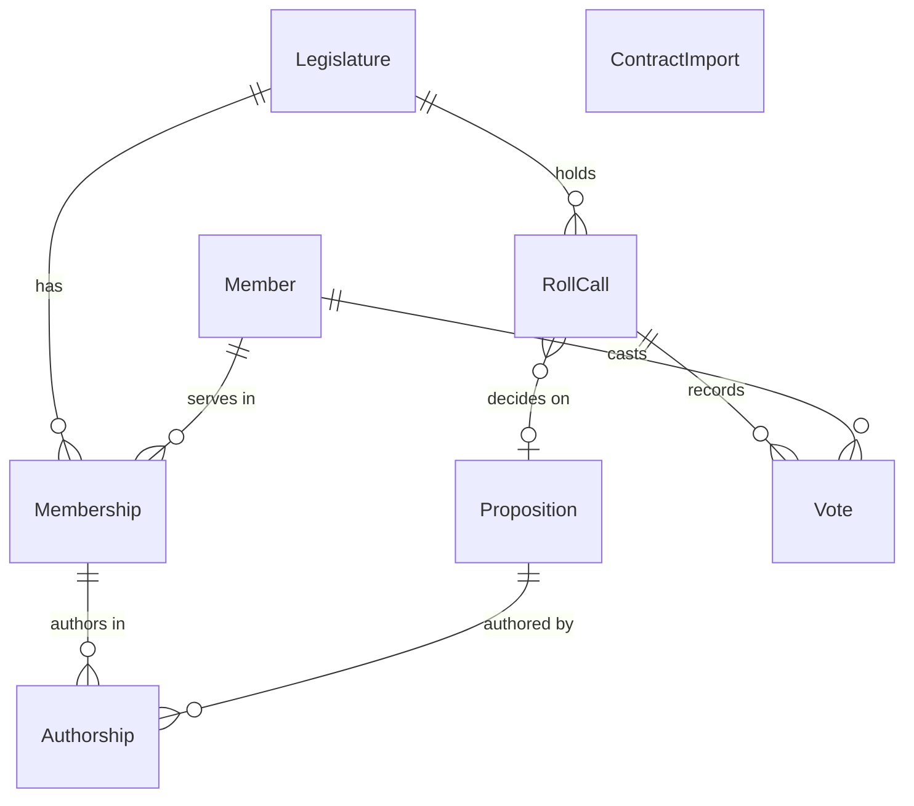

# App skeleton

## Problem

The v2 is decided (AD-013: one Laravel monolith with Inertia, Vue and SSR on PostgreSQL) and its
design system is verified (`design/`, AD-015), but nothing can render a page from a database yet.
Every v2 feature on the roadmap (Senado and Presidência coverage, AI summaries, accounts, alerts,
exports) needs the same three things first: a place to store the ETL contract, a way to load it,
and a page that renders it with the design components and survives being shared. Today each of
those features would have to invent them, and the first one to do so would set the precedent for
the stored schema, the import semantics and the share meta tags by accident.

Who pays: the maintainer, alone, with a fixed date - 2027-02-01, start of the 58th legislature
(v2 grilling, decision 2). The source gives no other evidence; the cost is calendar.

When this ships, `app/` is a running Laravel application: `php artisan mandato:import` loads the
current ETL contract into PostgreSQL idempotently, and `/deputados/{id}/` and `/votacoes/{id}/`
render server-side with the Plenário components, with per-page title, description, canonical and
Open Graph tags in the HTML, and no cookie - the same public path shapes as the live MVP, so a
redirect from the old origin is an origin swap.

## Flow

Reuses the ETL's own JSON Schema files (`etl/schema/*.json`) as the import validator, the design
package's components, tokens and formatters (`mandato-design`, design-system door 1) for every
number and vote drawn, and the MVP's contract fixture (`site/tests/fixtures/out`, validated against
the contract in CI) as the test data - nothing here re-describes the contract or redraws a vote.

1. contract directory (`data/out/`, exists, written by `mandato-etl build`) -> `mandato:import` command (door 5) - reads `meta.json`, refuses an unsupported `schema_version`, picks the reader for that version (door 5)
2. version reader (door 5) - validates every file against `etl/schema/*.json` with `opis/json-schema` (door 7) before any write, normalises records to house + legislature scope (v2 contract: `camara`, 57)
3. importer (door 6) - one transaction under a PostgreSQL advisory lock: upserts by natural key, sweeps rows of the same scope the snapshot no longer has, records a `ContractImport` (door 4)
4. `GET /deputados/{id}/`, `GET /votacoes/{id}/` -> routes in the cookie-free `public` middleware group (door 9, door 10) -> controller reads `Member`/`Membership`/`RollCall` (door 4), builds props and the `meta` prop
5. Inertia response (door 1) -> Blade root view writes title, description, canonical and Open Graph from the `meta` prop (door 8); the page body is rendered by the Inertia SSR server from `resources/js/Pages/*.vue` composed of `mandato-design/components/*` (door 2)
6. out: HTML with head tags and server-rendered body; if the SSR server is down, the same head tags and a client-rendered body

## Impact

| Front | What changes |
| --- | --- |
| domain | new term: `Member` - a parliamentarian in one house, identified by the house's own id; the contract's "deputy" is a `Member` with house `camara` |
| domain | new term: `Membership` - a member in one legislature; carries the indicators the contract computes over that legislature (AD-004 count and total) |
| domain | new term: `House` - `camara` or `senado`; Presidência is not a house and gets its own entity in its own feature |
| domain | new term: `ContractImport` - one successful run of `mandato:import`, with the contract's `schema_version`, `generatedAt` and hash (AD-005 provenance) |
| stored data | new database; nothing to migrate. The first import fills it from the current contract |
| `design/` | `package.json` `exports` gains `"./styles/*": "./styles/*"` (additive): the README tells pages to load `styles/components.css` but the package does not export it today |
| `site/` | untouched. Its fixture `site/tests/fixtures/out` becomes read by the app's tests; when `site/` is retired the fixture moves to `etl/` first |
| `etl/` | untouched; `etl/schema/*.json` becomes read at import time, so a schema change is now also an app change |
| CI | `.github/workflows/ci.yml` gains job `app`; existing jobs untouched |
| repo root | `.gitignore` gains `app/vendor/`, `app/public/build/`, `app/bootstrap/ssr/` |

## Relations

One-way constraints (door 4): `Member` unique on house + source id; `RollCall` unique on house +
source id; `Proposition` unique on house + source id; `Membership` unique on member + legislature;
`Vote` unique on roll call + member; `Authorship` unique on membership + proposition; `Legislature`
keyed by its number; house restricted to `camara`, `senado`; every source id stored as text. No
columns and no types here.

## Surface

| Route | In | Out | Status |
| --- | --- | --- | --- |
| `GET /deputados/{id}/` | `id` digits, Câmara member id | HTML (Inertia `Deputies/Show`) · `meta` prop · `X-Inertia` JSON on Inertia visits | `200`, `404` |
| `GET /votacoes/{id}/` | `id` `digits-digits`, Câmara roll-call id | HTML (Inertia `RollCalls/Show`) · `meta` prop · `X-Inertia` JSON on Inertia visits | `200`, `404` |

The import command's signature, flags and exit codes are door 5; it is called by the maintainer and, later, by the deploy feature's scheduler, never over HTTP.

## Landing

| One-way door | Literal shape | Alternative rejected |
| --- | --- | --- |
| 1. Framework and runtime versions (verified 2026-10-02 on Packagist, npm and php.net) | `app/composer.json`: `"php": "^8.4"`, `"laravel/framework": "^13.34"`, `"inertiajs/inertia-laravel": "^3.5"`, dev `"pestphp/pest": "^5.3"`, `"pestphp/pest-plugin-laravel": "^5.0"`, `"larastan/larastan": "^3.12"`, `"laravel/pint": "^1.32"`, `"laravel/sail": "^1.68"`; `app/package.json`: `"vue": "^3.5.43"`, `"@inertiajs/vue3": "^3.8"`, `"@inertiajs/vite": "^3.8"`, `"vite": "^8.3"`, `"laravel-vite-plugin": "^3.2"`, `"@vitejs/plugin-vue": "^6.0.9"`; runtime PHP 8.5 in Sail and CI, Node 24; created from plain `laravel/laravel` v13 with Inertia installed by hand | Laravel Vue starter kit: brings Tailwind, shadcn-vue and Fortify auth pages that compete with the design tokens and add an auth surface nobody asked for yet; Laravel 12: older line, every later feature would pay the upgrade; PHP floor `^8.3`: Pest 5 requires `^8.4` |
| 2. The app consumes the design package | `app/package.json` `"mandato-design": "file:../design"`; pages import `mandato-design/components/NDeM.vue` etc., `mandato-design/tokens.css`, `mandato-design/styles/components.css`; `vite.config.js` `ssr.noExternal: ['mandato-design']`; app pages reproduce the arrangement of `design/screens/Profile.vue` and `RollCall.vue` without the prototype chrome | copying components into `app/`: two copies drift and the design verification no longer covers the shipped pages; exporting `design/screens/*`: they carry prototype-only copy ("Protótipo") and props shaped by `contract.mjs`, not by the database |
| 3. Database engine, also in tests | PostgreSQL 18 (`postgres:18-alpine`, Sail's stub); `DB_CONNECTION=pgsql`; tests run against the `testing` database Sail creates, CI against a `postgres:18` service | SQLite for tests: `upsert` conflict handling, the sweep and the advisory lock would be proven on an engine production never runs; PostgreSQL 19: still beta (19 Beta 4, 2026-09-24) |
| 4. Stored schema (see Relations) | tables `legislatures`, `members`, `memberships`, `propositions`, `roll_calls`, `votes`, `authorships`, `contract_imports`; unique `(house, source_id)` on `members`, `roll_calls`, `propositions`; unique `(member_id, legislature_number)`, `(roll_call_id, member_id)`, `(membership_id, proposition_id)`; `house` check `in ('camara','senado')`; `source_id` `text` | a `deputies` table keyed by the Câmara id: rebuilt in February when Senado arrives (AD-014, research 04 "Legislatura vira entidade de primeira classe"); integer source ids: Câmara roll-call ids are `2412345-67` |
| 5. Import command and version seam | `php artisan mandato:import {dir?} {--dry-run}`, `dir` default `config('mandato.contract_dir')` = `base_path('../data/out')`; `SUPPORTED_SCHEMA_VERSIONS = [2]`; one `ContractReader` per version yielding the same normalised records; v2 reader stamps house `camara`, legislature `57`; exit `0` success, `1` refused or failed, `2` usage error (Symfony `Command::INVALID`) | the Python ETL writing to PostgreSQL: couples the ETL to the app's schema and breaks AD-002; one reader that branches on version inside: contract v3 (house and legislature dimensions, planned in parallel) would turn it into a conditional per field |
| 6. Import semantics: snapshot of a scope | per (house, legislature) in the contract: upsert by natural key, then delete `memberships`, `roll_calls`, `votes`, `authorships` of that scope absent from the snapshot; `members` and `propositions` are never swept; one transaction; `pg_try_advisory_lock` around it | append-only upsert: a vote the ETL corrects away (AD-008) stays on the site forever; truncate and reload: takes an exclusive lock that blocks every page for the whole load, and cascades into future rows that reference members (delivery 2, "meus eleitos") |
| 7. JSON Schema validator dependency | `"opis/json-schema": "^2.6"` (draft 2020-12, the draft `etl/schema` declares) validating each file against `config('mandato.schema_dir')` = `base_path('../etl/schema')` | `justinrainbow/json-schema`: its README stops at draft 2019-09; hand-written PHP checks: a second description of the contract that drifts; shelling out to `mandato-etl validate`: the app server would need the Python toolchain |
| 8. Share meta come from the server, not from the SSR node | every public page passes a `meta` prop `{title, description, path}`; `resources/views/app.blade.php` renders `<title>`, `description`, `canonical`, `og:type`, `og:site_name`, `og:locale`, `og:title`, `og:description`, `og:url`, `twitter:card` from `$page['props']['meta']`; pages render no `<Head>` for those tags; client navigation sets `document.title` from the prop | Vue `<Head>` only: the tags exist in the HTML only while the Node SSR server is up, so an SSR outage silently strips every link preview (Inertia v3 docs: SSR supplies head elements; the Blade fallback renders only when SSR is inactive) |
| 9. Public pages are cookie-free | `bootstrap/app.php` defines middleware group `public` = `SubstituteBindings`, `HandleInertiaRequests`; the two routes use it; the `web` group (session, CSRF, cookie encryption) is kept for later account routes | the `web` group: sets `laravel_session` and `XSRF-TOKEN` on every page view, contradicting the published privacy page ("O site não grava cookie nem guarda nada no seu navegador", `site/src/pages/dados-e-privacidade.astro`) |
| 10. Public URL shapes | `Route::get('/deputados/{id}/', ...)->whereNumber('id')->name('deputies.show')`; `Route::get('/votacoes/{id}/', ...)->where('id', '[0-9]+-[0-9]+')->name('roll-calls.show')`; canonical and `og:url` are `APP_URL` + the trailing-slash path; the trailing-slash redirect rule is removed from `public/.htaccess` | new paths (`/deputies/{id}`, `/camara/...`): breaks every link already shared from the MVP; no-slash canonical: differs from the MVP's canonical, so search engines see a new URL |
| 11. Local development runs in Sail | `app/compose.yaml` from Sail with services `laravel.test` (runtime 8.5) and `pgsql`; extra mounts `../design:/var/www/design`, `../etl:/var/www/etl:ro`, `../data:/var/www/data:ro`, so `file:../design` and `../etl/schema` resolve the same inside the container | native PHP on this machine: 8.4.5 without `intl` (needed by Laravel's `Number` and by Filament later) and no PostgreSQL server installed, and installing either needs `sudo`; Sail's default single mount: `file:../design` would point outside the container |
| 12. CI job | job `app` in `.github/workflows/ci.yml`: `postgres:18` service; `shivammathur/setup-php` PHP 8.5 with `pdo_pgsql`, `intl`; Node 24; `npm ci` + `npm run build` in `design/`; `composer install`; `pint --test`; `phpstan analyse`; `npm ci` + `npm run build` (client and SSR) in `app/`; `php artisan inertia:start-ssr &`; `php artisan test` | a separate workflow file: the commit-message and other jobs already share `ci.yml`; no SSR server in CI: the SSR criterion would have no proof |

- Nothing else in this change is hard to reverse

## Criteria

### S1: The contract loads into PostgreSQL (P1)

`mandato:import` turns the ETL's JSON into rows, refuses what it does not understand, and can be run every day without drift.

**Acceptance Criteria**

1. WHEN `php artisan mandato:import <dir>` runs on a contract whose `meta.json` has `schema_version` 2 and whose files all validate THEN the system SHALL persist one `Member` with house `camara` per entry of `deputies.json`, one `Membership` in legislature 57 per member with its `participation`, `governmentAlignment` and `partyAlignment` count and total, one `RollCall` per entry of `roll-calls.json`, one `Vote` per entry of each `deputies/{id}.json` `votes`, one `Authorship` per entry of `authored`, and SHALL exit 0
2. WHEN an import succeeds THEN the system SHALL print one line `Imported schema_version 2 generated <generatedAt>: <n> members, <n> roll calls, <n> votes, <n> propositions` and record a `ContractImport` with `schema_version`, `generatedAt`, the SHA-256 of `meta.json` and those counts
3. IF `meta.json` has a `schema_version` outside the supported set THEN the system SHALL exit 1, print `schema_version <v> is not supported; expected one of: 2` to stderr, and leave every table's row count unchanged
4. IF any contract file is missing or fails its JSON Schema THEN the system SHALL exit 1, print the file path and the first failing JSON pointer to stderr, and leave every table's row count unchanged
5. IF the directory argument does not exist THEN the system SHALL exit 2 and print `contract directory not found: <dir>` to stderr
6. WHEN the same contract is imported twice THEN the system SHALL leave the row count and every non-timestamp column of `members`, `memberships`, `roll_calls`, `votes`, `propositions` and `authorships` identical after the second run
7. WHEN a contract omits a roll call, vote, membership or authorship that the previous import of the same house and legislature had THEN the system SHALL have no such row after the import, and SHALL keep the `Member` and `Proposition` rows
8. IF a database write fails during an import THEN the system SHALL roll back so every table equals its state before the run, and exit 1
9. IF another import holds the import lock THEN the system SHALL exit 1, print `another import is running` to stderr, and write no row
10. WHEN `--dry-run` is given THEN the system SHALL validate every file, print the counts it would import, write no row, and exit 0 or 1 as a real run would
11. The system SHALL persist no field of `candidacy2026` and no CPF; the import writes only the fields named in AC 1 and the roll-call, proposition and authorship fields the two pages read

**Independent test:** run the import twice on `site/tests/fixtures/out`, compare table dumps, then run it on a copy with `schema_version` 3.

### S2: The deputy profile renders from the database (P1)

`/deputados/{id}/` shows what the MVP profile showed, drawn with the design components.

**Acceptance Criteria**

12. WHEN `GET /deputados/{id}/` is requested for an imported Câmara member THEN the system SHALL respond 200 with Inertia component `Deputies/Show` and HTML holding the name in the only `<h1>`, the eyebrow `Deputado federal · {party} · {uf}`, three `NDeM` blocks with the membership's count and total, and the authored, first-signer and requirements counts
13. WHEN the profile renders THEN the system SHALL render one `MandateScore` column per vote, oldest first, each linking to `/votacoes/{rollCallId}/`, and the equivalent table
14. WHEN the profile renders THEN the head SHALL hold `<title>{name} ({party}-{uf}) na 57ª legislatura - Mandato Aberto</title>`, `og:title` `{name} ({party}-{uf}) na 57ª legislatura`, the description `Votos, participação em votações nominais e proposições de {name} ({party}-{uf}) na Câmara dos Deputados, com dados oficiais e a base de cada número.` in `description` and `og:description`, `canonical` and `og:url` equal to `{APP_URL}/deputados/{id}/`, `og:type` `website`, `og:site_name` `Mandato Aberto`, `og:locale` `pt_BR`, `twitter:card` `summary`
15. IF a membership indicator has total 0 THEN the profile SHALL render "Sem base de cálculo no período" for it and no number
16. The profile SHALL render `OfficialPhoto` without `src` (initials frame) and SHALL contain no `` whose `src` is outside the app's origin
17. IF `{id}` is not an imported Câmara member, or is not all digits, THEN the system SHALL respond 404 with a page in pt-BR whose `<h1>` is "Página não encontrada"

**Independent test:** import the fixture, request `/deputados/101/` and `/deputados/999999/`, read status and HTML.

### S3: The roll-call page renders from the database (P1)

`/votacoes/{id}/` shows the result and how every deputy voted.

**Acceptance Criteria**

18. WHEN `GET /votacoes/{id}/` is requested for an imported roll call THEN the system SHALL respond 200 with Inertia component `RollCalls/Show`, the proposition title in the `<h1>` or, without a proposition, `Votação nominal de DD/MM/AAAA`, the result label `Aprovada`, `Rejeitada` or `Resultado não informado`, and a `TallyBar` with the stored yes, no and others counts written out
19. WHEN an open roll call renders THEN the system SHALL list the deputies in groups ordered `Sim`, `Não`, `Abstenção`, `Obstrução`, `Artigo 17`, empty, then any other value alphabetically, names in pt-BR alphabetical order inside a group, each row a `VoteMark` and a link to `/deputados/{deputyId}/`
20. IF the roll call is secret THEN the system SHALL render one group "Deputados que votaram" with every deputy who has a vote record and no vote option
21. IF the roll call has no vote record THEN the page SHALL render "Nenhum voto individual registrado nesta votação" and no group
22. WHEN the roll-call page renders THEN the head SHALL hold the tags of AC 14 with title `{heading}: como cada deputado votou` (secret: `{heading}: votação secreta`), the MVP's description for that case, and `canonical` and `og:url` equal to `{APP_URL}/votacoes/{id}/`
23. IF `{id}` is not an imported roll call or does not match `digits-digits` THEN the system SHALL respond 404 with the page of AC 17

**Independent test:** import the fixture, request an open, a secret and an unknown roll call.

### S4: Shared links get a complete page (P1)

What a crawler or a reader without JavaScript receives.

**Acceptance Criteria**

24. WHILE the Inertia SSR server is running THEN the HTML of `/deputados/{id}/` and `/votacoes/{id}/` SHALL contain the page's `<h1>` text and every number of AC 12 and AC 18 inside the app root element in the initial response
25. IF the SSR server is unreachable THEN the system SHALL still respond 200 with every head tag of AC 14 and AC 22
26. The system SHALL send no `Set-Cookie` header on any response of `/deputados/{id}/`, `/votacoes/{id}/` or their 404s
27. The footer of both pages SHALL read `Dados abertos da Câmara dos Deputados, coletados em DD/MM/AAAA` with the Brasília date of the latest `ContractImport`'s `generatedAt`
28. WHEN `GET /deputados/{id}` or `/votacoes/{id}` is requested without the trailing slash THEN the system SHALL respond 200 with the same canonical as the slash form

**Independent test:** build the SSR bundle, start `inertia:start-ssr`, `curl` a profile; stop it, `curl` again; `curl -I` for `Set-Cookie`.

### S5: Quality gates run on every PR (P2)

The skeleton ships the gates every later feature inherits.

**Acceptance Criteria**

29. WHEN a pull request runs CI THEN job `app` SHALL fail if `pint --test`, `phpstan analyse` at level 6, the client or SSR build, or any Pest test fails
30. The Pest suite SHALL fail when any file under `app/app`, `app/resources` or `app/lang` contains, as a whole word and case-insensitively, a term of the forbidden list, and that list SHALL hold every one of the 19 terms of `site/src/lib/forbidden-terms.ts`
31. The system SHALL ship `app/README.md` with the commands to start Sail, import the contract, run the SSR server and run the tests

**Independent test:** push a branch with a deliberately failing Pint rule and with "faltou" in a page; the job goes red on each.

## Out of scope

| Excluded | Why |
| --- | --- |
| Deploy, hosting, domain, backups, SSR process supervision in production | v2 grilling decision 4: its own feature before 2027-02-01 |
| Redirects from the GitHub Pages URLs | needs the final origin, which the deploy feature decides; door 10 keeps the paths so it is an origin swap |
| Home, search, listing, Metodologia, Correções, Quem somos, Dados e privacidade pages | later features; methodology and correction links point to the live MVP pages until then |
| Share card images (`og:image`) | card rendering is its own feature (research section 2, item 8) |
| Official photo cache served from our origin | its own feature; hotlinking adds a third-party request the privacy page does not disclose |
| Senado and Presidência import, contract v3 reader | depend on the ETL features planned in parallel; door 5 is the seam |
| Legislature selector on the profile | only one legislature exists in the v2 contract |
| Candidacy 2026 badge | the election ends 2026-10-26, before the app is public; AD-011 data stays out of the database |
| Filament, accounts, alerts, exports, AI summaries | deliveries 2 and 3, the corrections admin and AD-014 conditions |

## Assumptions

| Assumption | Chosen default | Rationale | Confirmed? |
| --- | --- | --- | --- |
| Local development | Sail is the supported path; native PHP is not documented | door 11: native 8.4.5 lacks `intl` and PostgreSQL, and fixing that needs `sudo` | y |
| PHP runtime vs floor | runtime 8.5 (latest stable, 8.5.11) in Sail and CI; floor `^8.4` in `composer.json` | Pest 5 needs 8.4; the floor lets the maintainer run tools natively if they install `intl` | y |
| Frontend language | JavaScript `<script setup>`, no TypeScript | matches `design/`, which the pages import; TypeScript 7 is two months old and `vue-tsc` support is a later choice | y |
| Larastan level | 6 | strict enough to catch nullable misuse on Eloquent without fighting magic properties on day one; raising it is a later commit | y |
| Trailing slash | both forms answer 200, canonical always with slash; no redirect middleware | the canonical tag settles duplicates; a redirect layer adds a behaviour to prove for no reader-visible gain | y |
| Test data | importer and page tests use `site/tests/fixtures/out` read in place | the `etl` CI job already validates it against the contract; a copy would drift | y |
| Forbidden-terms list | a PHP copy in `app/config/forbidden-terms.php`, plus a Pest test that it contains every term parsed from `site/src/lib/forbidden-terms.ts` while that file exists | the app cannot import TypeScript; the parity test stops the copies drifting until `site/` retires | y |
| Source of votes | votes come from `deputies/{id}.json` (they carry `partyMajority`); the roll-call files supply roll-call fields only | one source per row; the ETL's `standard` verification already proves the two lists agree | y |
| Scope of the sweep | the scope of a v2 contract is (`camara`, 57); a v3 contract declares its scopes and each is swept independently | matches the contract-v3 direction (house and legislature dimensions) without assuming its field names | y |
| Methodology and correction links | point to the live MVP (`https://augusto-dmh.github.io/mandato-aberto/metodologia/#...`), as `design/scripts/contract.mjs` does | the app has no Metodologia page yet; every number still carries its note (P1) | y |
| `twitter:card` without image | `summary` until the card feature ships `og:image` | `summary_large_image` without an image renders worse than `summary` | y |
| Queue and cache drivers | Laravel 13 defaults (`database`); no Redis | nothing in this feature queues; Redis is a deploy decision | y |

**Open questions:** none - resolved on 2026-10-02 by the orchestrator under the maintainer's delegation (`research/decisions-log.md`): (1) build for schema_version 2 with door 5 as the seam; the v3 reader is added when the contract-v3 plan is approved; (2) no hotlink: the initials frame until a photo-cache feature serves the official photo from the app's origin.

**Approval:** approved by the orchestrator under the maintainer's delegation on 2026-10-02, every assumption confirmed as written.

## Observable

| Surface | Decision | Landing |
| --- | --- | --- |
| screen `deputy profile` | empty state | AC 15 (indicator with no base), AC 13 (no votes: design `MandateScore` renders no row) |
| screen `deputy profile` | loading state | n/a - the first response is server-rendered (AC 24); Inertia's progress bar covers later visits |
| screen `deputy profile` | error state | AC 17 (404); AC 25 (SSR down still serves the page) |
| screen `deputy profile` | unauthorised state | n/a - public, read-only, no account exists |
| screen `deputy profile` | density and ordering | AC 12, AC 13 (oldest first, one column per vote) |
| screen `deputy profile` | destructive action confirms | n/a - the page has no action that changes data |
| screen `roll call` | empty state | AC 21 |
| screen `roll call` | loading state | n/a - the first response is server-rendered (AC 24) |
| screen `roll call` | error state | AC 23, AC 25 |
| screen `roll call` | unauthorised state | n/a - public, read-only |
| screen `roll call` | density and ordering | AC 19 |
| screen `roll call` | destructive action confirms | n/a - no action changes data |
| all new `GET /deputados/*`, `/votacoes/*` | response shape | AC 12, AC 18; head tags AC 14, AC 22 |
| all new `GET /deputados/*`, `/votacoes/*` | error shape and codes | AC 17, AC 23 (HTML 404 in pt-BR) |
| all new `GET /deputados/*`, `/votacoes/*` | who may call it | n/a - public pages; AC 26 keeps them cookie-free |
| all new `GET /deputados/*`, `/votacoes/*` | versioning | AC 28 and door 10: the path shape is the MVP's and does not version |
| all new `GET /deputados/*`, `/votacoes/*` | rate limits | n/a - no throttle in the skeleton; rate limiting belongs to the deploy feature, in front of the app |
| command `mandato:import` | output format and verbosity | AC 2 (one summary line), AC 3, AC 4, AC 9 (stderr messages) |
| command `mandato:import` | every flag and its default | AC 10 (`--dry-run`); door 5 (`dir` default `../data/out`) |
| command `mandato:import` | exit codes | AC 1, AC 3, AC 5, AC 8 (0, 1, 2) |
| command `mandato:import` | what it prints when it fails halfway | AC 8 (rollback, exit 1), AC 4 (file and pointer) |
| document `app/README.md` | structure, depth, what the reader does next | AC 31 |
| document `app/README.md` | tone | n/a - developer documentation in English, like `design/README.md` |

## Sources

- `.specs/STATE.md` AD-002, AD-013, AD-014, AD-015 - the contract seam, the stack, the coverage that makes house and legislature first-class, the design direction
- `research/05-grilling-escopo-v2.md` decisions 1 to 4 and the assumptions table - Laravel monolith, `app/` beside `etl/`, PostgreSQL, Pest, Larastan, Pint, deploy out of scope
- `.specs/features/design-system/plan.md` door 1 - `"mandato-design": "file:../design"`
