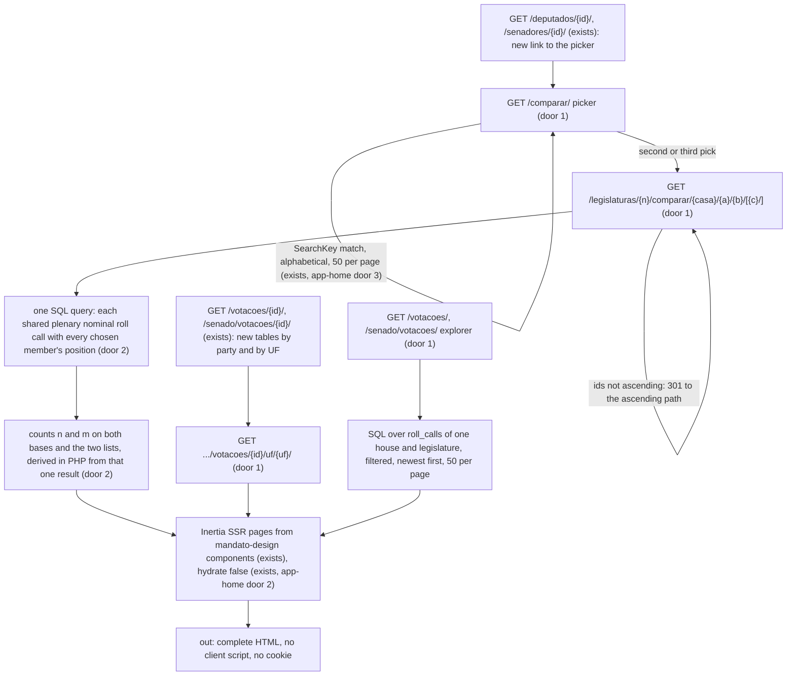

# comparador: compare members' votes and explore roll calls, without ranking anyone

## Problem

A visitor who wants to know whether their three senators voted the same way on the same matters has to open three profiles, read three partituras column by column and match roll calls by hand. The profile gives each member's own `n de m` against the government and the party majority (app-contract-v3 AC 34). It gives nothing about two named people on the same roll calls. Someone who wants to know how the 70 deputies of São Paulo voted on one proposal counts names under each position heading of the roll-call page (app-contract-v3 AC 43). Someone looking for a roll call has only two ways in: a profile's partitura or the overview's 10 latest per house (app-home AC 27). No page lists roll calls, and app-home deferred listings "with exploration (v2 grilling decision 5, delivery 3)".

The competitors already answer this, with a scale of value. Placar Político offers a two-deputy comparator on "the same ruler" next to a 1-99 score, "Recordes do mandato" and an affinity quiz. Ranking dos Políticos puts "Comparar" behind a login next to a 0-10 score (research 06, annex a2 section 1). Research 06 lists comparing members among the features the v2 must match (section 2) and names the move that differs: "Comparador sem régua de valor ... sem total, sem vencedor e sem ordenação por desempenho" (a2 section 4, move 8). The risk is concrete. GovTrack withdrew its report cards in 2024 after "most liberal senator" became campaign material (a3 section 1.2). The TSE fined a union whose site "induziam os eleitores à ideia de que a candidata representada seria a mais apta" (juridico-anexos A2, Rp 355133-33.2010). From 2027 the site belongs to an association, a legal entity under Lei 9.504 art. 57-C §1º I (v2 grilling decision 7). A comparison that reads as "this one is better" is therefore the one surface where descriptive data can turn into propaganda.

Who pays: the visitor, who cannot answer a plain factual question without doing the matching by hand, and the maintainer, who has to ship delivery 3 of the v2 (grilling decision 5) without creating the ranking that AGENTS.md, AD-004 and AD-019 forbid. The source gives no usage figure.

When this ships, a reader picks two or three members of one house in one legislature. A shareable page says in how many of the roll calls where all of them recorded a choice they voted the same, as `n de m` on the same two bases as the profile, and lists every roll call where they differed and every roll call where they agreed, each linked. `/votacoes/` and `/senado/votacoes/` list a house's plenary roll calls newest first, filtered by kind, ballot, result, year and proposition. Each roll-call page counts its votes by party and by UF in alphabetical tables, and each UF delegation has its own shareable page per roll call. Nothing in the feature orders people, scores them, colours them by party or shows a percentage.

## Flow

This reuses the v3 stored schema, `PublicUrl` and the vote labels of `positionCase` (app-contract-v3 doors 3 to 5), the roll-call heading and the ballot and kind labels (app-contract-v3 AC 41 and 42), the `public` cookie-free group and Blade meta (skeleton doors 8 and 9), app-home's script-free page switch, `SearchKey` matching, `current legislature` term and masthead (app-home doors 2 and 3, Impact, AC 43), and the design package's `NDeM`, `VoteMark` and `SourceNote`. No count is stored. Every count is computed per request from `votes` and `roll_calls`, using the definitions the ETL already uses for positions and plenary.

## Impact

| Front | What changes |
| --- | --- |
| domain | new term: `shared base` (`base comum`) - the plenary `nominal` roll calls of one house and legislature in which every compared member has a vote with `position` in {`yes`, `no`, `abstention`, `obstruction`}; `merit` shared base = the same with `kind` in {`final`, `amendment`}. Lives in the comparison query (door 2). Nobody branches on it today |
| domain | new term: `voted the same` (`votaram igual`) - a shared-base roll call in which every compared member has the same `position`; `voted differently` (`votaram diferente`) is every other shared-base roll call |
| domain | existing term: `plenary roll call` (app-home Impact: Câmara `organ` `PLEN`, every Senate roll call) - reused unchanged by the comparison, the explorer and the delegation page |
| member pages (app-contract-v3 S3) | gain one link `Comparar votos com outro parlamentar` to the picker. No other change |
| roll-call pages (app-contract-v3 S5) | gain the sections `Votos por partido` and `Votos por UF` after the position groups, for `nominal` and `secret` ballots |
| `/metodologia/` (app-contract-v3 AC 49) | gains a section `comparacao` after `cobertura`; the ten existing sections keep their ids and order |
| masthead (app-home AC 43) | gains the links `Votações` (to `/votacoes/`) and `Comparar votos` (to `/comparar/`) after `Buscar parlamentar` |
| forbidden vocabulary | the pages of this feature add a comparator list (AC 48) on top of the skeleton's 19 terms and app-home AC 38 |
| stored data | nothing: no migration, no import change. The existing indexes `votes (roll_call_id, member_id)` unique, `votes (member_id)` and `roll_calls (house, legislature_number)` serve every query |
| project decisions | on approval, `.specs/STATE.md` gains the next AD with door 4's rule, which binds later features (exports, cards, e-mails) |
| dependency on other features | builds after app-home (script-free switch, `SearchKey`, masthead, `current legislature`), which builds after app-contract-v3. Real Senate data needs etl-senado; tests do not |

## Relations

`None - no stored-data shape change`. Every page reads the app-contract-v3 schema as it is.

## Surface

Only routes this adds or whose signature changes. Every route is `GET`, in the cookie-free `public` group, and answers with and without the trailing slash (skeleton AC 28).

| Route | In | Out | Status |
| --- | --- | --- | --- |
| `GET /comparar/` | query `casa`, `legislatura`, `parlamentares` (comma-separated ids, at most 2), `q`, `pagina`, all optional | HTML (Inertia `Compare/Pick`): house, legislature, chosen members, result rows `{name, party, uf, href}`, `page`, `pages` · `meta` prop with `robots` | `200`, `404` |
| `GET /legislaturas/{n}/comparar/{casa}/{a}/{b}/` and `.../{a}/{b}/{c}/` | `n` digits; `casa` `deputados` or `senadores`; `a`, `b`, `c` member ids, distinct; query `base`, `lista`, `pagina` | HTML (Inertia `Compare/Show`): members, `merit` and `all` shared-base counts, excluded count, list rows, `page`, `pages` · `meta` prop with `robots` | `200`, `301`, `404` |
| `GET /votacoes/` and `GET /senado/votacoes/` | query `legislatura`, `tipo`, `registro`, `resultado`, `ano`, `proposicao`, `pagina`, all optional | HTML (Inertia `RollCalls/Index`): effective filters, options, rows `{date, heading, ballot, kind, result, href}`, `page`, `pages`, `total` · `meta` prop with `robots` | `200`, `404` |
| `GET /votacoes/{id}/uf/{uf}/` and `GET /senado/votacoes/{id}/uf/{uf}/` | roll-call id as in app-contract-v3 door 4; `uf` two letters, either case | HTML (Inertia `RollCalls/Delegation`): roll call, UF, counts per position, members grouped by position · `meta` prop | `200`, `301`, `404` |
| `GET /votacoes/{id}/`, `GET /senado/votacoes/{id}/` (signature change) | unchanged | props gain `byParty` and `byUf`: rows `{label, counts per position, href?}` | unchanged: `200`, `404` |
| `GET /deputados/{id}/`, `/senadores/{id}/` and their `legislatura/{n}/` (signature change) | unchanged | props gain `compareUrl` | unchanged: `200`, `404` |

## Landing

| One-way door | Literal shape | Alternative rejected |
| --- | --- | --- |
| 1. Public URL shapes for comparison, picker, explorer and delegation | `Route::get('/legislaturas/{n}/comparar/{casa}/{a}/{b}/{c?}', ...)->whereNumber(['n','a','b','c'])->whereIn('casa', ['deputados','senadores'])->name('compare.show')`, canonical with ids in ascending numeric order and a `301` from any other order; `Route::get('/comparar/', ...)->name('compare.pick')` with query keys `casa` (`camara`, `senado`), `legislatura`, `parlamentares` (`204554,220593`), `q`, `pagina`; `Route::get('/votacoes/', ...)->name('roll-calls.index')` and `Route::get('/senado/votacoes/', ...)->name('senate-roll-calls.index')` with query keys `legislatura`, `tipo` (`propostas`, `decisao`, `emenda`, `procedimento`, `sem-regra`), `registro` (`nominais`, `simbolicas`, `todas`), `resultado` (`aprovada`, `rejeitada`), `ano`, `proposicao` (`PL 2630/2020`), `pagina`; `Route::get('/votacoes/{id}/uf/{uf}/', ...)` and `/senado/votacoes/{id}/uf/{uf}/` with `uf` `[A-Za-z]{2}`, canonical upper case, `301` from lower case; `PublicUrl::comparison(house, n, ids)`, `::rollCallIndex(house)` and `::delegation(house, id, uf)` are the only builders | a bare path without legislature that shows the latest one shared (the member-page pattern of app-contract-v3 door 4): a shared "300 de 340" link would silently become "2 de 3" on 2027-02-01, and a comparison is a claim people screenshot. Members in the query string: the skeleton canonical drops the query, so every shared comparison would preview as the bare picker. One path with ids in the order picked: `A/B` and `B/A` would be two pages and two previews, and the first name would read as the challenged one. A house-free path (`/comparar/204554/5012/`): Câmara and Senate ids are independent sequences (contract-v3 door 3), and the two houses never share a roll call. `/votacoes/?casa=senado`: app-contract-v3 door 4 already fixed that `/votacoes/` means the Câmara and the Senate lives under `/senado/`. A per-party delegation path: party labels carry accents and change between legislatures (`UNIÃO`), so the slug would need a mapping table; the party table on the roll-call page answers the question |
| 2. The agreement measure and its base | for house `h`, legislature `n` and members `M` (2 or 3): base = roll calls with `house = h`, `legislature_number = n`, `ballot = 'nominal'`, plenary (Câmara `organ = 'PLEN'`), for which each member of `M` has a vote with `position in ('yes','no','abstention','obstruction')`; `m` = the size of that base, `n` = the base roll calls where every member's `position` is equal; `merit` = the same restricted to `kind in ('final','amendment')`; `excluded` = the plenary `nominal` roll calls of `h`, `n` outside the `all` base; everything is computed from one SQL query returning `(roll_call_id, date, kind, member_id, position)` rows for the base, and the counts and both lists are derived in PHP from that one result; output is integers, never a ratio | counting `notVoting` as voting differently (the Radar do Congresso's error, research 06 section 8 item 4): it measures attendance under the name of disagreement. Counting `presiding`: the chair records no choice. Including `secret` ballots: every position is `secret`, so two members would always "vote the same". Pairwise counts for three members (three numbers per page): reads as "who is closest to whom", a 3-cell similarity matrix, the heat map Fiscalize do Poder publishes. A similarity index (Cohen's kappa, a share, a 0-100 score): a composite, which move 1 and AD-004 exclude. Counts and lists from separate queries: an import committing between them would make the list length disagree with `m - n` |
| 3. Scope of one comparison | exactly one house, one legislature, 2 or 3 distinct members, each holding a `Membership` in that house and legislature; no route accepts a fourth id or a second house | two houses: no roll call is shared, and contract-v3 excludes linking a Câmara and a Senate proposition, so the base would always be 0. Four or more: the picker becomes a group to order, and three already covers "my three senators". A member compared with "their party" or "the government": the profile already gives both `n de m` (app-contract-v3 AC 34), and a party-mean comparison is TheyWorkForYou's "rebellions", a term research a1 section 2 rejects |
| 4. No ordering of people by any indicator, anywhere in this feature, as a project precedent | every list of people in this feature is ordered by name with `Collator('pt_BR')`, then source id; every table of groups (party, UF) is ordered by its label with the same collator; no `orderBy` on a count, a vote position or a derived value of a person or a group; no sort control; recorded on approval in `.specs/STATE.md` as the next AD: "Comparisons show at most three members chosen by the reader, on their shared base, as n de m with every roll call listed. No page orders, scores, ranks or colours people or parties by any indicator or similarity, and no page finds 'the most similar' member" | ordering parties by size or by Sim count: a party table ordered by Sim is a league table of who supported the proposal, which research 02 decision 11 rules out ("lista com percentuais lado a lado é quase ranking"). A "parlamentares que mais votam como X" finder: orders 512 people by similarity to one, the Placar quiz's mechanism. Ordering roll calls by "narrowest margin" or "least party uniformity" (GovTrack): spotlights dissenters, the "ranking dos desalinhados" research a3 section 3 cites |

- Nothing else in this change is hard to reverse

## Criteria

### S1: Two or three members on their shared base (P1)

A reader opens a comparison and sees how many times the chosen members voted the same, out of the roll calls where all of them recorded a choice, with every roll call one click away.

**Acceptance Criteria**

1. WHEN `GET /legislaturas/{n}/comparar/{casa}/{a}/{b}/` is requested with `a < b`, both members of the route's house holding a `Membership` in legislature `n` THEN the system SHALL respond 200 with Inertia component `Compare/Show`, the only `<h1>` `Como {A} e {B} votaram nas mesmas votações` (`Como {A}, {B} e {C} votaram nas mesmas votações` for three), names in pt-BR alphabetical order, and the eyebrow `Câmara dos Deputados · {n}ª legislatura` or `Senado Federal · {n}ª legislatura`
2. WHEN the comparison renders THEN it SHALL list each member, in pt-BR alphabetical order of name, as a link to that member's page for legislature `n` (app-contract-v3 AC 29 paths) holding the name and `{party} · {uf}` of that membership, and SHALL render no photo, no colour per member and no indicator of any single member
3. WHEN the comparison renders THEN it SHALL render two `NDeM` headed `Votaram igual`: first labelled `nas votações sobre propostas e emendas` with the `merit` shared-base `n` and `m` of door 2, then `em todas as votações nominais do plenário` with the `all` shared-base `n` and `m`. Each SHALL carry a `SourceNote` with the house's source label and URL (app-home AC 23), `collectedAt` the house's latest `ContractImport.generatedAt` and `methodUrl` `{APP_URL}/metodologia/#comparacao`
4. WHEN the comparison renders THEN it SHALL render once, under the counts, `Base: votações nominais do plenário na {n}ª legislatura com voto Sim, Não, Abstenção ou Obstrução registrado por {A} e por {B}. Ficam fora as votações secretas, a presidência da sessão e {excluded} votações em que falta um desses votos de pelo menos um dos nomes acima.` (`por {A}, por {B} e por {C}` for three; `1 votação` when `excluded` is 1)
5. A roll call SHALL count in the `all` shared base only when its `ballot` is `nominal`, it is a plenary roll call of the route's house and legislature, and every compared member has a vote on it with `position` in {`yes`, `no`, `abstention`, `obstruction`}, and SHALL count in the `merit` base only when it also has `kind` in {`final`, `amendment`}
6. A shared-base roll call SHALL count as voted the same only when every compared member's `position` is identical, so that `abstention` against `obstruction` counts as different and, for three members, two equal and one different counts as different
7. WHEN the comparison renders THEN it SHALL render two links `Votaram diferente ({m - n})` and `Votaram igual ({n})` for the base in effect, the current one marked `aria-current="page"`, and below them the list of AC 8
8. WHEN the list renders THEN each row SHALL hold the date `DD/MM/AAAA`, the heading of app-contract-v3 AC 41 linking to that roll call's page, the kind label of app-contract-v3 AC 42, and for each member in alphabetical order the name followed by a `VoteMark` with the `positionCase` label of that member's vote, rows ordered by date then roll-call id, newest first, 100 per page
9. WHEN query `lista` is `diferentes` or absent THEN the list SHALL hold exactly the base roll calls voted differently, and WHEN it is `iguais` THEN exactly those voted the same, so that the rows across all pages number `m - n` or `n` of the base in effect
10. WHEN query `base` is `propostas` or absent THEN the links of AC 7 and the list SHALL use the `merit` base, and WHEN it is `todas` THEN the `all` base; the page SHALL render links `Nas votações sobre propostas e emendas` and `Em todas as votações nominais do plenário` that switch `base` and keep `lista`
11. WHEN the list has more than 100 rows THEN the page SHALL show `Página {p} de {pages}` and links `Página anterior` and `Próxima página` that keep `base` and `lista`, each absent on the first and last page
12. WHEN the comparison renders THEN it SHALL render `Esta página põe lado a lado votos registrados. Não pontua nem ordena parlamentares. Os números de cada um, com a própria base, estão no perfil.` with the paragraph linking to `/metodologia/#comparacao`
13. WHEN the comparison renders three members THEN each member's entry SHALL carry a link `Comparar só os outros dois` to the canonical two-member path of the other two, and WHEN it renders two THEN the page SHALL carry a link `Incluir um terceiro parlamentar` to `/comparar/?casa={camara|senado}&legislatura={n}&parlamentares={a},{b}`

**Independent test:** import a fixture where deputies A and B share 6 plenary nominal roll calls with recorded choices (4 equal, 2 different, one of the different ones `abstention` against `obstruction`), plus one roll call where B has `notVoting`, one `secret` ballot and one roll call where A presided. Request the comparison and read `4 de 6`, the excluded count `3`, the two rows of `diferentes` and the four rows of `iguais`.

### S2: Empty, tiny and invalid comparisons say so (P1)

A comparison that has nothing or almost nothing to count says it in words, and an address that does not name a valid comparison does not render one.

**Acceptance Criteria**

14. IF the `all` shared base is empty THEN the page SHALL render, in place of both `NDeM`, the links and the list, `Não há votação nominal do plenário na {n}ª legislatura com voto Sim, Não, Abstenção ou Obstrução registrado por {A} e por {B}.` (three names as in AC 4) and no number
15. IF the `merit` shared base is empty and the `all` base is not THEN the `merit` `NDeM` SHALL render `Sem base de cálculo no período` and no number, and the `all` one its counts
16. WHILE the `all` shared base holds from 1 to 19 roll calls the page SHALL render, before the counts, `Base pequena: {m} votações em comum. Confira cada voto na lista abaixo.` (`1 votação em comum`), and SHALL render no such line when it holds 20 or more
17. IF the route's ids are distinct and valid but not in ascending numeric order THEN the system SHALL respond 301 to the path with the same ids in ascending order, keeping the query string
18. IF two route ids are equal, an id is not a member of the route's house, a member holds no `Membership` in legislature `n`, or `n` is not a stored legislature THEN the system SHALL respond 404 with the skeleton's `Página não encontrada` page
19. IF `base`, `lista` or `pagina` holds a value outside its allowed set (`propostas`, `todas`; `diferentes`, `iguais`; an integer from 1 to `pages`) THEN the system SHALL respond as if the parameter were absent, except that a `pagina` out of range on a non-empty list SHALL respond 404

**Independent test:** compare a deputy with a substitute who served one week (3 shared roll calls, then 0 merit), request the reversed id order, a repeated id, a senator's id under `deputados` and legislature 99, and read the small-base line, the 301 `Location` and the 404s.

### S3: Picking members without JavaScript (P1)

A reader starts from a profile or from `/comparar/` and reaches a comparison by following links, with no script and no cookie.

**Acceptance Criteria**

20. WHEN a member page renders THEN it SHALL contain one link `Comparar votos com outro parlamentar` to `/comparar/?casa={camara|senado}&legislatura={n}&parlamentares={id}` with the rendered mandate's legislature
21. WHEN `GET /comparar/` is requested THEN the system SHALL respond 200 with Inertia component `Compare/Pick`, the only `<h1>` `Comparar votos`, the paragraph `Escolha dois ou três parlamentares da mesma Casa e da mesma legislatura. A comparação conta as votações em que todos registraram voto e lista cada uma delas.`, links `Câmara dos Deputados` and `Senado Federal` that set `casa` and drop `parlamentares`, and the chosen members by name in alphabetical order
22. WHEN the picker renders THEN it SHALL contain `<form role="search" method="get" action="/comparar/">` with a text input `q` labelled `Nome`, a select `legislatura` (stored legislatures with a membership of that house, newest first, as app-home AC 2 labels them), hidden inputs keeping `casa` and `parlamentares`, and a submit button `Buscar`
23. WHEN the picker renders THEN it SHALL list the memberships of the chosen house and legislature not already chosen, filtered by `q` with app-home door 3's token match, ordered as app-home AC 15, 50 per page with app-home AC 16 paging, each row one link holding name and `{party} · {uf}` and no indicator
24. WHEN a row is followed with no member chosen THEN it SHALL lead to `/comparar/` with that member in `parlamentares`, and WHEN one or two are chosen THEN it SHALL lead to the canonical comparison path of door 1 for the chosen members plus that row's member
25. IF `casa` is absent or invalid THEN the picker SHALL use `camara`; IF `legislatura` is absent or invalid THEN the current legislature (app-home Impact); IF an id in `parlamentares` is not a membership of that house and legislature, repeats, or exceeds the second THEN the picker SHALL drop it
26. WHEN the picker renders THEN the head SHALL hold `<title>Comparar votos - Mandato Aberto</title>`, `canonical` and `og:url` `{APP_URL}/comparar/` with no query string, and `<meta name="robots" content="noindex, nofollow">`; the text of `q` SHALL appear only as the input's value and in the `data-page` props

**Independent test:** with no JavaScript, open a deputy's page, follow the link, search a second name, follow it to the comparison, follow `Incluir um terceiro parlamentar`, pick a third and read the three-member path.

### S4: Roll-call explorer for each house (P1)

`/votacoes/` and `/senado/votacoes/` list a house's plenary roll calls of one legislature, newest first, filtered by plain GET parameters.

**Acceptance Criteria**

27. WHEN `GET /votacoes/` or `GET /senado/votacoes/` is requested with no query THEN the system SHALL respond 200 with Inertia component `RollCalls/Index`, the only `<h1>` `Votações da Câmara dos Deputados` or `Votações do Senado Federal`, a link to the other house's explorer, and the plenary `nominal` and `secret` roll calls of that house in the current legislature with the line `{total} votações no plenário na {n}ª legislatura, da mais recente para a mais antiga` (`1 votação`)
28. WHEN an explorer row renders THEN it SHALL hold the date `DD/MM/AAAA`, the app-contract-v3 AC 41 heading linking to the roll-call page, `{ballot label} · {kind label}` with app-contract-v3 AC 42 labels, and `Aprovada`, `Rejeitada` or `Resultado não informado`; rows SHALL be ordered by date then id, newest first, 50 per page with app-home AC 16 paging, and the system SHALL offer no other order
29. WHEN `tipo` is `propostas`, `decisao`, `emenda`, `procedimento` or `sem-regra` THEN the system SHALL keep only roll calls with `kind` in {`final`, `amendment`}, `final`, `amendment`, `procedural` or `unclassified` respectively
30. WHEN `registro` is `nominais` or absent THEN the system SHALL keep `ballot` in {`nominal`, `secret`}; `simbolicas` keeps `symbolic`; `todas` keeps every ballot
31. WHEN `resultado` is `aprovada` or `rejeitada` THEN the system SHALL keep roll calls with `approved` true or false; WHEN `ano` is a year inside the legislature's dates THEN only roll calls of that year
32. WHEN `proposicao` matches, after app-home door 3's normalisation, `^([a-z]+) ?([0-9]+) ?/ ?([0-9]{4})$` THEN the system SHALL keep only roll calls whose proposition has that type (upper case), number and year, so `pl 2630/2020` and `PL2630 / 2020` both match `PL 2630/2020`
33. IF a filter holds a value outside its allowed set THEN the system SHALL respond 200 as if it were absent and the form SHALL show that field's default; IF `pagina` is out of range on a non-empty result THEN 404
34. IF valid filters match no roll call THEN the page SHALL render `Nenhuma votação encontrada com esses filtros.` and a link `Limpar filtros` to the house's explorer, and WHEN the house is the Senate and `registro` is `simbolicas` THEN it SHALL render `O Senado Federal não publica votações simbólicas como registros de votação.` instead
35. WHEN the explorer renders THEN it SHALL contain a GET form with selects `legislatura`, `tipo` (`Todos os tipos`, `Propostas e emendas`, `Decisão sobre a proposta`, `Emenda, destaque ou parte do texto`, `Procedimento`, `Sem regra correspondente`), `registro` (`Nominais e secretas`, `Simbólicas`, `Todas`), `resultado` (`Qualquer resultado`, `Aprovada`, `Rejeitada`), `ano`, a text input `proposicao` labelled `Proposição (ex.: PL 2630/2020)` and a submit button `Filtrar`, each field showing its effective value
36. WHEN the explorer renders THEN the head SHALL hold `<title>Votações da Câmara dos Deputados - Mandato Aberto</title>` (or `do Senado Federal`), `canonical` and `og:url` `{APP_URL}/votacoes/` or `{APP_URL}/senado/votacoes/` with no query, and `<meta name="robots" content="noindex, follow">`

**Independent test:** import fixtures with final, amendment, procedural, unclassified and symbolic Câmara roll calls across two years, then request `?tipo=propostas`, `?registro=simbolicas`, `?ano=2024&resultado=rejeitada`, `?proposicao=pl2630/2020`, `?tipo=xx` and `/senado/votacoes/?registro=simbolicas`, and read rows, order and messages.

### S5: How a party or a UF delegation voted on one roll call (P1)

Each roll-call page counts its votes by party and by UF, and each UF delegation has a page per roll call, with counts and names and no percentage.

**Acceptance Criteria**

37. WHEN a `nominal` roll-call page renders THEN it SHALL render, after the position groups, a table `Votos por partido` with columns `Partido`, `Sim`, `Não`, `Abstenção`, `Obstrução`, the house's `presiding` label, `Sem voto registrado`, one row per distinct `votes.party` of that roll call, each cell the count of that party's votes in that position written as an integer (`0` when none)
38. WHEN a `nominal` roll-call page renders THEN it SHALL render a table `Votos por UF` with the AC 37 columns headed `UF`, one row per UF of the voters' memberships in the roll call's legislature, the UF cell linking to the delegation page of door 1
39. WHEN a `secret` roll-call page with vote records renders THEN the two tables SHALL have the columns `Partido` or `UF`, `Votaram`, `Sem voto registrado`; WHEN the roll call is `symbolic` THEN neither table SHALL render
40. The party table SHALL order rows by party label with `Collator('pt_BR')`, the UF table by UF code, and neither table SHALL render a percentage, a total column, a sort control or a highlighted row
41. WHEN `GET /votacoes/{id}/uf/{uf}/` or `/senado/votacoes/{id}/uf/{uf}/` is requested for a `nominal` or `secret` roll call and a UF among its voters' memberships THEN the system SHALL respond 200 with Inertia component `RollCalls/Delegation`, the only `<h1>` `{heading}: votos da bancada de {UF}`, the line `DD/MM/AAAA · {ballot label} · {kind label}`, the counts of that UF's row of AC 38 as `{label}: {n}` in column order, the UF's members grouped by position as app-contract-v3 AC 43, each linking to the member page, and a link `Todos os votos desta votação` to the roll-call page
42. IF the delegation `uf` is two letters in lower or mixed case THEN the system SHALL respond 301 to the upper-case path; IF the roll call is `symbolic`, is not imported in the route's house, or the UF has no voter's membership in it THEN 404
43. WHEN the delegation page renders THEN the head SHALL hold `<title>{heading}: votos da bancada de {UF} - Mandato Aberto</title>`, `og:title` without the suffix, the description `Como votou cada parlamentar de {UF} em {heading}, com dados abertos da {Câmara dos Deputados|do Senado Federal}.` in `description` and `og:description`, and `canonical` and `og:url` equal to its upper-case path

**Independent test:** import a roll call with two parties, one accented (`UNIÃO`), and voters from SP and AC, then read both tables' rows, order and cells. Request `/votacoes/{id}/uf/sp/`, `/uf/SP/`, `/uf/RR/` and a symbolic roll call's `/uf/SP/`.

### S6: The method is public and the vocabulary stays descriptive (P1)

Anyone can redo the comparison from the methodology page, and no page of this feature uses the language of scores, contests or affinity.

**Acceptance Criteria**

44. WHEN `GET /metodologia/` renders THEN it SHALL render after `cobertura` a section with id `comparacao` holding `A comparação de votos usa uma Casa e uma legislatura. A base são as votações nominais do plenário em que todos os parlamentares comparados registraram Sim, Não, Abstenção ou Obstrução. "Votaram igual" conta as votações dessa base em que todos registraram a mesma opção; Abstenção e Obstrução são opções diferentes. Votações secretas, a presidência da sessão e os registros sem voto ficam fora da base, porque não mostram uma opção. Não registrar voto não conta como votar diferente. A comparação não produz nota, percentual nem ordem entre parlamentares.`
45. WHEN the comparison renders THEN the head SHALL hold `<title>Como {A} e {B} votaram nas mesmas votações da {n}ª legislatura - Mandato Aberto</title>` (three names as in AC 1), `og:title` without the suffix, the description `Votações nominais do plenário da {Câmara dos Deputados|do Senado Federal} em que {A} e {B} registraram voto, uma a uma, com dados oficiais.` in `description` and `og:description`, `canonical` and `og:url` equal to the ascending path with no query, and `<meta name="robots" content="noindex, follow">`; no head tag SHALL contain a count
46. The HTML of every page of this feature SHALL contain no `%` character, no percentage written in words, and no ratio other than the `n de m` of AC 3
47. The HTML of every page of this feature and of the roll-call pages SHALL contain no element styled by a party or a member: no colour, class or `data-` attribute derived from a party label or a member id, and the accent colour only on links and focus
48. The HTML of every page of this feature SHALL contain none of `afinidade`, `compatível`, `compatibilidade`, `semelhança`, `parecido`, `parecida`, `aliado`, `aliada`, `rival`, `adversário`, `adversária`, `dissidente`, `vencedor`, `vencedora`, `empate`, `alinhado`, `alinhada`, `alinhados`, `alinhamento`, `pontuação`, `percentual`, `mais parecido`, `menos parecido`, nor the terms of app-home AC 38 and the skeleton's forbidden list, as whole words, case- and accent-insensitively, outside official text quoted from a house

**Independent test:** render a comparison, the picker, both explorers and a delegation page, grep each body for `%`, the AC 48 list and `style=` or `data-party`, and read the methodology section.

### S7: Light, cookie-free, complete without JavaScript (P1)

The new pages keep the skeleton's and app-home's guarantees and stay inside a byte and query budget.

**Acceptance Criteria**

49. The system SHALL send no `Set-Cookie` header on any response of the Surface routes, their 301s or their 404s
50. WHILE the Inertia SSR server is running THEN the initial HTML of the picker, the comparison, both explorers and the delegation page SHALL contain the `<h1>`, every count and every list row inside the app root element, and SHALL contain no `<script src>` and no `<link rel="modulepreload">`
51. IF the SSR server is unreachable THEN those pages SHALL respond 200 with every head tag of AC 26, 36, 43 and 45 and SHALL include the client entry script
52. WHEN rendered over the budget dataset (Observable) with SSR running THEN the gzip-compressed HTML SHALL be at most 30,000 bytes for a comparison page of 100 rows, 25,000 bytes for the picker, 25,000 bytes for an explorer page and 25,000 bytes for a delegation page of 70 members
53. WHEN a comparison page renders over the budget dataset THEN the system SHALL run at most 8 SQL queries, and the counts and the list SHALL come from the same query result (door 2)
54. WHEN a Surface route is requested without the trailing slash THEN the system SHALL respond 200 (or the route's 301) with the same canonical as the slash form
55. IF the chosen house has no `ContractImport` THEN the picker and that house's explorer SHALL respond 200 with `Ainda não há dados importados da Câmara dos Deputados.` (or `do Senado Federal`) and no form and no list

**Independent test:** with SSR up, `curl` each page and grep for `<script src`; gzip the bodies against the budget; count queries with `DB::listen` on the comparison; stop SSR and `curl` again; `curl -I` for `Set-Cookie`.

## Out of scope

| Excluded | Why |
| --- | --- |
| Any ordering of people or parties by a count, a position or a similarity; a "most similar members" finder; "who votes like you" quiz | door 4 and the AD it records. The Placar quiz and its comparator are what research a2 section 4 names as the thing to differ from, and a user quiz about candidates in a campaign is an enquete under Res. TSE 23.600 art. 23 |
| Indicators of each member side by side (participation, government and party `n de m` in columns) | the Placar's "mesma régua". Each profile already gives each number on its own base (app-contract-v3 AC 34); bases differ by exercise periods, so side-by-side columns compare unequal denominators |
| Pairwise matrices, heat maps, clusters or network graphs of who votes with whom | door 2's rejection: a similarity map orders people by proximity |
| Comparing across houses, or more than three members | door 3 |
| Proposition theme filter in the explorer | contract v3 carries no theme (`etl/schema/v3/propositions.schema.json` has `type`, `number`, `year`, `summary`, `status` only). It needs the Câmara's `proposicoesTemas` and a Senate equivalent in a contract bump, an ETL feature of its own (open question 1) |
| Free-text search over roll-call descriptions | app-home door 3 sets the point (about 5,000 rows) where search needs a stored key with an index; the Câmara's plenary roll calls exceed it with symbolic ones (5,499 in the contract-v3 snapshot). The proposition filter (AC 32) covers the common lookup |
| Committee roll calls in the explorer and in comparisons | indicators and comparisons stay plenary-only (contract-v3 assumption: committee membership varies by member, so a base would not be comparable) |
| Bench orientations next to the party table | app-contract-v3 does not store them, and the design round 2 excluded "orientação por partido" (`research/decisions-log.md`, 2026-10-02) |
| Share card images and verification codes for comparisons and delegations | share-cards covers member and roll-call cards only. A comparison card circulates "n de m" without the list behind it, so it needs its own decision before any election window (open question 2) |
| Comparisons in e-mails, exports or AI summaries | meus-eleitos sends votes, not comparisons; exports are their own feature; AD-014 limits AI to summarising official texts, and Res. TSE 23.610 art. 28 §1º-C forbids AI systems that rank or compare candidates |
| Per-party or per-UF pages across roll calls (cohesion over time, a party's record) | research 02 decision 11 and app-home's out-of-scope row; the delegation page covers one roll call only |
| Candidacy data or a "candidates only" filter in the picker | candidacy stays out of the app's database (app-home out of scope); a filter for candidates would turn the picker into a campaign tool |

## Assumptions

| Assumption | Chosen default | Rationale | Confirmed? |
| --- | --- | --- | --- |
| Small-base threshold | 20 shared roll calls (AC 16) | below that one roll call moves the count by more than 5 of every 100; it flags substitutes and short exercise periods without hiding the number. TheyWorkForYou also withholds strong labels on thin records (a1 section 2) | y |
| Default list and base on the comparison | `diferentes` on the `merit` base (AC 9, 10) | what readers come for is where they differed; `merit` first matches the profile's order and meus-eleitos' default scope | y |
| Agreements listed too | yes, behind `lista=iguais` (AC 9) | without it `n` cannot be checked vote by vote, and move 1 asks that every number be recomputable by hand | y |
| Robots policy | comparisons `noindex, follow`, picker `noindex, nofollow`, explorer `noindex, follow`, delegation pages indexed (AC 26, 36, 43, 45) | 600 deputies make about 180,000 pairs per legislature; following the picker's links would have crawlers run each comparison query, and indexed "A x B" pages would become search results in a campaign. Delegation pages are bounded (27 per roll call) and are the format research a1 section 6.3 calls the most shareable without judging anyone | y |
| Counts in share previews | none: comparison head tags name members, house and legislature only (AC 45) | a preview shows a number without its base or list; under art. 57-C §1º I a legal-entity site must not read as "one is fitter" (Rp 355133-33.2010) | y |
| Election-window behaviour (2028 municipal, 2030 general) | identical all year: no date switch, no feature turned off or on by the calendar; the safeguards (doors 2 to 4, AC 45 to 48) are permanent | the legal research says the substantive law is the same on every date and only the speed of litigation changes (research 01 section 2). A toggle that is off 46 months out of 48 is untested code when it matters. Divulging parliamentary acts without asking for votes is not propaganda (Lei 9.504 art. 36-A IV); the comparator asks for nothing, scores no one and is not an enquete, since it surveys no voter (A2 section 3) | y |
| Party and UF of a vote | party = `votes.party` at the time of the vote; UF = the voter's membership UF in that legislature (AC 37, 38) | the contract records the vote's party; votes carry no UF, and the mandate's UF is what the member page shows | y |
| Explorer default ballot | `nominais` (nominal and secret) (AC 30) | symbolic decisions outnumber them about five to one in the Câmara and record no vote; app-home's latest list made the same choice (its assumption "Recent roll calls") | y |
| Page sizes | comparison list 100, picker and explorer 50 (AC 8, 23, 28) | 100 short rows fit the 30 KB budget; 50 matches app-home's search | y |
| Verification profile | `ui` | screens whose risk is copy and arrangement (anti-ranking, empty and small-base states), as app-contract-v3 and app-home chose; `light` would not enumerate copy per screen | y |

**Open questions:**

| # | Kind | Question | Until answered |
| --- | --- | --- | --- |
| 2 | open | Before 2028-08-16 (start of the 2028 campaign, Lei 9.504 art. 36), with the site held by the association: does a lawyer confirm that the comparator, as specified, is not propaganda under art. 57-C §1º I, and may comparison share cards exist? | nothing in 2027; the comparator ships with the permanent safeguards and no card. Outside the orchestrator's delegation (legal identity), so it stays with the maintainer |

Resolved on 2026-10-02 by the orchestrator under the maintainer's delegation (`research/decisions-log.md`): (1) the theme filter is out of this feature; it needs a contract version that carries proposition themes, planned when the explorer needs it. Question 2 (legal review before the 2028 window) is outside the delegation and stays with the maintainer.

**Approval:** approved by the orchestrator under the maintainer's delegation on 2026-10-02, every assumption confirmed; door 4's refusals are AD-021. Build starts after app-contract-v3 and app-home.

## Observable

| Surface | Decision | Landing |
| --- | --- | --- |
| screen `comparison` | empty state | AC 14 (no shared base), AC 15 (no merit base), AC 9 (an empty list on a base that has rows on the other list) |
| screen `comparison` | small-base state | AC 16 |
| screen `comparison` | loading state | n/a - server-rendered complete page (AC 50); no client fetch |
| screen `comparison` | error state | AC 17 (301), AC 18 (404), AC 19, AC 51 (SSR down) |
| screen `comparison` | unauthorised state | n/a - public, read-only, no account |
| screen `comparison` | density and ordering | AC 1, 2 (names alphabetical), AC 8 (newest first, 100 per page), door 4 |
| screen `comparison` | destructive action confirms | n/a - no action changes data |
| screen `picker` | empty state | AC 55 (no import); AC 23 with app-home AC 18's no-match text for a `q` with no result |
| screen `picker` | loading state | n/a - GET form answered by a server-rendered page (AC 50) |
| screen `picker` | error state | AC 25 (invalid values dropped), AC 51; a `pagina` out of range answers 404 as app-home AC 17 |
| screen `picker` | unauthorised state, destructive action | n/a - public, read-only |
| screen `picker` | density and ordering | AC 23 (alphabetical, 50 per page) |
| screen `explorer` (both houses) | empty state | AC 34 (no match, Senate symbolic), AC 55 (no import) |
| screen `explorer` | loading state | n/a - server-rendered (AC 50) |
| screen `explorer` | error state | AC 33, AC 51 |
| screen `explorer` | unauthorised state, destructive action | n/a - public, read-only |
| screen `explorer` | density and ordering | AC 28 (newest first, 50 per page, no other order) |
| screen `delegation` | empty state | AC 42 (a UF with no voter is 404, so no empty page exists) |
| screen `delegation` | loading and error states | AC 50, AC 42, AC 51 |
| screen `delegation` | unauthorised state, destructive action | n/a - public, read-only |
| screen `delegation` | density and ordering | AC 41 (positions in app-contract-v3 AC 43 order, names alphabetical) |
| screen `roll call` additions | empty state | AC 39 (symbolic: no table); a party with no vote in a position shows `0` (AC 37) |
| screen `roll call` additions | density and ordering | AC 40 |
| document `comparison` copy | structure, tone, depth, what the reader does next | AC 1 to 4, 12 (title, counts, base sentence, disclaimer), then the list (AC 8) and each roll-call page; vocabulary AC 46 to 48 |
| document `methodology#comparacao` | structure, tone, what the reader does next | AC 44; the reader redoes the count from the listed roll calls (AC 9) |
| collection `compared members` | grouping, naming, ordering | AC 1, 2 (alphabetical), door 1 (ascending ids in the path) |
| collection `compared members` | duplicates | AC 18 (a repeated id is 404), AC 25 (picker drops repeats) |
| collection `compared members` | the exception that does not fit | AC 18 (a member without a mandate in `n`); a person in both houses is two members (app-home assumption) and cannot be compared with themself across houses (door 3) |
| collection `party and UF tables` | grouping, naming, ordering, duplicates | AC 37, 38, 40; one row per distinct label |
| collection `party and UF tables` | the exception that does not fit | AC 37 (a member who changed party mid-legislature appears under the party recorded on that vote) |
| all new routes | response shape | AC 1 to 13, 21 to 24, 27 to 28, 41; head tags AC 26, 36, 43, 45 |
| all new routes | error shape and codes | AC 17, 18, 19, 33, 42 (HTML 404 in pt-BR, 301 to canonical) |
| all new routes | who may call it | n/a - public pages, cookie-free (AC 49) |
| all new routes | versioning | door 1 and AC 54: path and query shapes do not version |
| all new routes | rate limits | n/a - each request runs at most 8 bounded queries (AC 53); limits sit in front of the app (deploy feature) |
| budget dataset for AC 52, 53 | what the measurement runs on | app-home's budget dataset (600 Câmara and 81 Senate memberships, 1,500 plenary `nominal` or `secret` roll calls per house over 48 months) with a vote for every membership in exercise on each nominal roll call; the comparison measured between two members sharing 1,200 roll calls, list page 1 of `diferentes` with 100 rows; the delegation page measured for a 70-member UF |

## Sources

- `research/06-pesquisa-design-e-concorrentes.md` section 2 move 1 and section 3 P5, P13; `research/design-anexos/a2-concorrentes-brasil.md` section 4 move 8 and the Placar Político entry; `research/design-anexos/a3-pares-internacionais.md` sections 1.2 (GovTrack's withdrawn report cards), 1.5 (HowTheyVote.eu) and 3 item 1 - what the comparator offers and refuses
- `research/01-pesquisa-juridica.md` sections 2 and 3.3 and `research/juridico-anexos/A2-eleitoral.md` sections 1.1, 3 and 6 - art. 36-A IV, art. 57-C §1º I, enquetes under Res. 23.600 art. 23, the vocabulary of polls; `.specs/STATE.md` AD-004 and AD-019 (app-home worktree)
- `.worktrees/app-contract-v3/.specs/features/app-contract-v3/plan.md` doors 3 to 5, AC 34, 41 to 43 and 49, and `.worktrees/app-home/.specs/features/app-home/plan.md` doors 1 to 3, Impact and AC 15 to 18, 38 (both approved 2026-10-02) - the stored schema, paths, labels and script-free pages this feature extends
