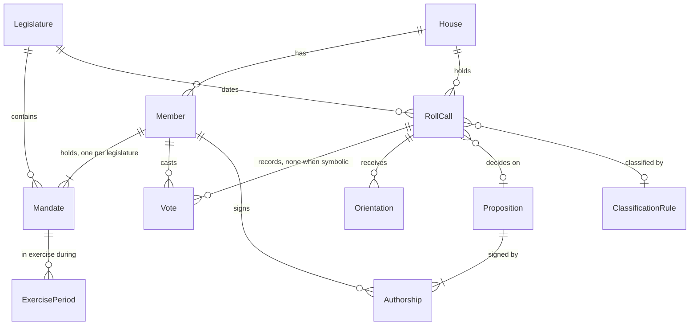

# contract-v3: the ETL contract with legislature, house and roll-call classification

## Problem

The only contract the ETL publishes today (`schema_version: 2`, `etl/schema/*.json`) describes one house in one legislature. `compute.LEGISLATURE = "57"` and `sources.camara.LEGISLATURE = "57"` are constants. Every indicator sits flat on the deputy, so a deputy re-elected for the 58th legislature, which starts on 2027-02-01 (`GET /api/v2/legislaturas/58` returns `dataInicio: 2027-02-01`, `dataFim: 2031-01-31`), would get one number that mixes two terms. Ids assume one house: a deputy is an integer and a roll call is a string. The Senate's `CodigoParlamentar` (5672 for the first senator in `/dadosabertos/senador/lista/atual.json`) and `codigoSessaoVotacao` (6923) are integers from their own sequences, so the two houses' ids can collide. The v2 app (AD-013, AD-014) has to import Câmara (57th and 58th), Senado and, later, Presidência. Without a contract that carries legislature and house, the app-skeleton importer and the etl-senado feature have nothing stable to build on. Both are being planned in parallel now.

The indicators also count every nominal plenary roll call alike. In the local snapshot (bulk files downloaded 2026-09-23, roll calls from 2023-02-01), 570 of the 1,123 nominal plenary roll calls are procedural: urgency requests, preferences, appeals, removal from the agenda. The 5,499 plenary roll calls with no individual vote record (symbolic) leave the contract entirely, so the profile cannot say they exist. Research `06` section 8 item 3 asks to classify before counting, as TheyWorkForYou did in 2024 when it moved to "action votes" after opposition parties generated motions to fill its records. The rule has to be mechanical and published, so that no person picks which votes matter.

The live MVP site reads `schema_version` 2 and refuses anything else (`site/src/lib/data.ts`, `loadContract`). `design/scripts/contract.mjs` does the same. The site stays live through the election window (first round 2026-10-04, AD-007 until 2026-10-26) until the app replaces it (AD-013).

When this ships, `mandato-etl build --contract 3` writes `data/v3/camara/`. It is a self-contained, schema-validated directory where every member has one mandate per legislature with indicators on two bases (all nominal plenary votes, and merit votes only). Every roll call carries a ballot type and a kind assigned by a published rule table. Every vote carries a house-independent position next to the official value. The Senate ETL and the app importer bind to this shape. `mandato-etl build` without the flag still writes the same v2 bytes the live site reads today.

## Flow

This reuses the download cache and manifest (`sources.camara`), the column allowlist (`readers`), the row parsing in `compute.load` and the validate-then-swap in `publish.write`. The v2 assembler `compute.assemble` stays as it is, so v2 output cannot drift.

1. `mandato-etl build --contract 3 [--house camara] [--years] [--refresh] [--out]` -> `cli` (exists) - picks the contract (door 2), rejects the candidacy flags under v3, resolves `--out` to `data/v3/<house>/`
2. `sources.camara` (exists) - the same six yearly bulk files plus `deputados.csv`. It also fetches `/deputados?idLegislatura=<n>` and each deputy's history for every legislature whose start is on or before the build date. Each file is cached in `data/raw/` and recorded in `manifest.json`
3. CSV rows -> `readers` (exists) - the allowlist gains `ultimaAberturaVotacao_descricao` (votacoes) and `proposicao_siglaTipo`, `proposicao_numero`, `proposicao_ano` (votacoesProposicoes). No column whose name contains `cpf` is added
4. `compute.load` (exists) - parses roll calls, votes, orientations and authorship for every date from 2023-02-01, tagged with the legislature by date (door 4); the v2 path still sees only the 57th
5. `classify` (door 6) - sets `ballot` (door 5) and `kind` + `kindRule` per roll call from the house's rule table; maps each official vote and orientation value to a position (door 7) and stops the build on a value outside the table
6. `contract_v3` (door 1) - builds members, mandates with per-legislature indicators on the `all` and `merit` bases (door 4), roll calls with votes, propositions with authors, the rules file and `meta.json`
7. `publish.write` (exists) - validates every document against `etl/schema/v3/*.schema.json` (door 1) in a temp dir, then swaps `data/v3/camara/` atomically
8. out: `data/v3/camara/` is read by the app importer (app-skeleton feature) and by `mandato-etl validate` (exists, now choosing the schema set by `meta.schema_version`). `data/out/` (v2) is read by `site/` (exists) and is not touched by a v3 run

## Impact

| Front | What changes |
| --- | --- |
| domain | new term: `house` - the chamber a record belongs to, `camara` or `senado`. Part of every key; lives in every v3 record |
| domain | new term: `legislature` - the four-year Congress term (57: 2023-02-01 to 2027-01-31; 58: 2027-02-01 to 2031-01-31), assigned to a roll call by its date; lives in `meta.legislatures`, `mandates[]`, roll calls |
| domain | new term: `mandate` - one member in one legislature: party and UF in that term, exercise periods, indicators. A senator elected in 2022 has a 57th and a 58th mandate |
| domain | new term: `ballot` - `nominal`, `secret` or `symbolic`, decided by the presence and content of individual vote records (door 5) |
| domain | new term: `kind` - `final`, `amendment`, `procedural` or `unclassified`, set by the first matching rule of the published table (door 6). `merit` is the basis made of `final` and `amendment` |
| domain | existing term: `participation`, `governmentAlignment`, `partyAlignment` meant the whole 57th legislature, with the alignments over every organ. In v3 they are per mandate, plenary only, with two bases. Only v2 consumers branch on the old meaning today: `site/src/lib/data.ts` and `design/scripts/contract.mjs`, which keep reading v2 |
| domain | existing term: `vote` was the official string only. In v3 it is `official` (verbatim) plus `position` (door 7). Today `compute.VALID_VOTES` and the site's vote encoding branch on the string |
| stored data | `data/out/` (v2): nothing changes. `data/v3/<house>/` is new, rebuilt from empty on each run. `data/raw/`: new cached files for the per-legislature deputy list and histories. The existing `historico/{id}.json` (filtered to the 57th) stays as the v2 path reads it; nothing to migrate |
| CI | `ci.yml` validates the v2 fixtures with `mandato-etl validate`. That keeps working because validation chooses the schema set by version. `publish.yml` keeps running the v2 build only |

## Relations

One-way constraints:
- `Member` unique per (`house`, `id`) (door 3). `Mandate` unique per (`house`, member `id`, `legislature`) (door 4). `RollCall` unique per (`house`, `id`) (door 3). `Vote` unique per (`house`, roll call `id`, member `id`), latest record wins as in v2. `Proposition` unique per (`house`, `id`).
- A `Vote` exists only when the roll call's `ballot` is `nominal` or `secret` (door 5).
- A `RollCall` points at one `ClassificationRule` by `kindRule`, or at none when `kind` is `unclassified` (door 6).

## Surface

`None - nothing consumed over a route`. The consumed signature is the v3 file contract, in Landing doors 1 to 7, and the `--contract` flag, in door 2. The command's flags and exit codes are walked in `## Observable`.

## Landing

| One-way door | Literal shape | Alternative rejected |
| --- | --- | --- |
| 1. v3 file layout, one self-contained directory per house | `data/v3/<house>/meta.json`, `members.json`, `roll-calls.json`, `roll-calls/<id>.json` (only for `ballot` `nominal` or `secret`), `propositions.json`, `classification-rules.json`. Schemas in `etl/schema/v3/{meta,members,roll-calls,roll-call,propositions,classification-rules}.schema.json`. Kebab-case file names, camelCase English keys, `additionalProperties: false` everywhere, sorted keys. Each house directory is swapped atomically by its own run | one directory written by one run for every house: a Senate API outage would stop the daily Câmara update. Per-member files as in v2: every vote would be written twice (deputy doc and roll-call doc), leaving the importer two copies to reconcile. NDJSON: a second format the in-house validator does not check. A SQLite dump: the importer needs a driver, and the Laravel migrations would mirror ETL internals |
| 2. Emission of v2 and v3 | `meta.schema_version: 3` (`const`). `mandato-etl build --contract {2,3}`, default `2`. `--out` defaults to `data/out` for 2 and `data/v3/<house>` for 3. The v2 path is frozen byte for byte until the feature that retires `site/` deletes it together with `--contract 2`. Any change to a v3 schema file bumps `schema_version`, and consumers reject a version they do not know | migrate the Astro site to v3: it changes a live site in the election window (AD-007), and AD-013 throws that site away. Stop emitting v2: `loadContract` throws on any other version, so the next daily `publish.yml` run fails and the site freezes. One run writing both: a v3 schema error would abort `publish.yml` before the v2 deploy |
| 3. Composite identity and the house enum | every record carries `"house": "camara" \| "senado"`. Member `id` is the official integer (Câmara `deputado_id`, Senate `CodigoParlamentar`). Roll-call `id` is a string (Câmara `"2497105-11"`, Senate `codigoSessaoVotacao` as decimal digits). Proposition `id` is the official integer of that house. Votes and authorship refer to a member by `memberId` within the same house | prefixed global ids (`"camara:204554"`): every consumer would parse ids. Bare numeric ids: two independent integer sequences can collide. `presidencia` in the house enum: it has no members who vote and no roll calls, so its provisional measures and vetoes need their own entity in a later version |
| 4. Mandate and indicator shape | `members[].mandates[]` = `{legislature, party, uf, exercisePeriods: [{start, end}], participation, governmentAlignment, partyAlignment, symbolicMerit, authoredCount, firstSignerCount, requirementsCount}`. Each indicator is `{"all": {"count", "total"}, "merit": {"count", "total"}}`. `meta.legislatures` = `[{id, start, end, sourceUrl}]` with 57 = `2023-02-01`..`2027-01-31` and 58 = `2027-02-01`..`2031-01-31` | flat indicators on the member (v2): cannot carry two legislatures, so a re-elected deputy's 58th number would overwrite or blend into the 57th. One basis only: `merit` alone hides the procedural record, and `all` alone lets procedural requests dominate (570 of 1,123 nominal plenary roll calls). Percentages: AD-004 |
| 5. Ballot type | `ballot` enum `nominal` \| `secret` \| `symbolic`. `nominal` = at least one vote record with a non-empty value. `secret` = vote records all empty, or no record and the last opening description contains `secreta`. `symbolic` = otherwise. `tallies` is `null` for `symbolic` and for a `secret` ballot with no records | keep emitting nominal roll calls only (v2): the 5,499 symbolic plenary decisions disappear and the profile cannot report them. A `symbolic: boolean`: cannot express a secret ballot with no records, such as `2576395-4` (an authority vote, "Votação secreta em turno único", 0 records in `/votos`) |
| 6. Kind and the published rule table | `kind` enum `final` \| `amendment` \| `procedural` \| `unclassified`, and `kindRule` = rule id (`"camara.07"`) or `null`. `classification-rules.json` = `[{id, house, kind, field, pattern, description}]`, applied in array order to the field after NFKD accent stripping, casefold and whitespace collapse; first match wins. `meta.classification.version` is an integer, and any change to a rule increments it. The `merit` basis = `kind` in {`final`, `amendment`}. Câmara ruleset version 1 is below | an editorial list of "important votes": a person picks, which research `06` section 8 item 3 forbids. Classifying by proposition type: urgency request `2351332-7` is attached to a PL. A trained classifier: neither reproducible nor publishable as a rule. Classifying in the app: indicators are counted in the ETL, so the method would split across two codebases |
| 7. Vote and orientation positions | vote = `{memberId, official, position, party, partyMajority}`. `position` enum `yes` \| `no` \| `abstention` \| `obstruction` \| `presiding` \| `secret` \| `notVoting`, and `partyMajority` uses the same enum or `null`. Câmara map: `Sim`, `Não`, `Abstenção`, `Obstrução`, `Artigo 17` -> `presiding`; empty in a `secret` ballot -> `secret`; empty elsewhere -> `notVoting`. Orientation = `{bench, official, position}` with `position` `yes` \| `no` \| `abstention` \| `obstruction` \| `free` (`Liberado`), and `governmentOrientation` = the position of the bench that casefolds to `governo`, or `null`. A value outside the map stops the build | official strings only (v2): Senate codes (`P-NRV`, `AP`, `LS`, `LP`, `Presidente (art. 51 RISF)`, seen on `/dadosabertos/votacao?dataInicio=2025-04-01`) would force every consumer to keep a map per house. Normalised position only: loses the verbatim value that provenance needs. Unknown values mapped to an `other`: an indicator would silently change meaning when a house adds a code |
| 8. Full texts and roll-call descriptions for AI summaries (added at approval from ai-summaries door 6) | `data/v3/<house>/full-texts/<propositionId>.json` = `{house, propositionId, sourceUrl, documentSha256, extractor, extractedAt, text}`, text extracted from the inteiro teor PDF with `pypdf` pinned in `etl/uv.lock`, `extractor` = `"pypdf <version>"`, no OCR; each `roll-calls/<id>.json` gains `openingDescription` (`ultimaAberturaVotacao_descricao`) and `lastPresentationDescription` (`ultimaApresentacaoProposicao_descricao`); schema `etl/schema/v3/full-text.schema.json` | the app downloading PDFs itself: duplicates AD-005's download, hash and cache; a later schema bump for these fields: the ai-summaries plan was approved on condition they land in v3 |

Câmara ruleset version 1 (door 6). `{verb}` stands for `^(?:aprovad|rejeitad|mantid|suprimid)[oa]s?(?:,[^,]*,)? (?:(?:o|a|os|as) )?`. `descricao` and `ultimaAberturaVotacao_descricao` are the `votacoes` columns. A trial run on the snapshot classified all but 7 of 6,627 plenary roll calls (1 of them nominal).

| Rule | Kind | Field | Pattern | Official example |
| --- | --- | --- | --- | --- |
| camara.01 | procedural | `ultimaAberturaVotacao_descricao` | `^votacao preliminar` | `2345378-38` |
| camara.02 | procedural | `descricao` | `apreciacao preliminar` | `2345378-38` |
| camara.03 | procedural | `descricao` | `^alteracao do regime de tramitacao` | `2485066-13` |
| camara.04 | procedural | `descricao` | `{verb}(?:requerimento\|preferencia\|recurso\|inclusao)\b` | `2351332-7`, `2400068-23` |
| camara.05 | procedural | `descricao` | `^requerimentos? (?:aprovad\|rejeitad)` | 16 rows "Requerimento aprovado, em globo" |
| camara.06 | procedural | `descricao` | `{verb}redacao final\b` | `2224999-107` |
| camara.07 | final | `descricao` | `{verb}subemenda substitutiva global\b` | `2351179-51` |
| camara.08 | amendment | `descricao` | `{verb}(?:texto\|emendas?\|subemendas?\|destaques?\|dispositivos?\|art\.?\|artigos?\|parte\|paragrafo)\b` | `2344938-60` ("Mantido o texto"), `2345368-56` |
| camara.09 | final | `descricao` | `{verb}(?:projeto\|substitutivo\|proposta\|medida provisoria\|parecer\|pec)\b` | `2357055-29`, `2337246-43`, `2196833-373` |
| camara.10 | amendment | `ultimaAberturaVotacao_descricao` | `\bdtq\b` | destaque roll calls whose `descricao` names no object |
| camara.11 | final | `ultimaAberturaVotacao_descricao` | `votacao secreta` | `2576395-4` |

- Nothing else in this change is hard to reverse. The rule patterns can be refined during the build before the first v3 publication (version stays 1). After that, each change increments `classification.version`.

## Criteria

### S1: v3 beside a frozen v2 (P1)

The live site's data stays byte-identical while a separate v3 directory appears.

**Acceptance Criteria**

1. WHEN `mandato-etl build` runs without `--contract` THEN the system SHALL write to `data/out/` the same bytes as the build at the feature's base commit, given the same raw inputs, the same clock and the same candidacy input
2. WHEN `mandato-etl build --contract 3` runs THEN the system SHALL write only `data/v3/camara/` (or the given `--out`) and SHALL leave every file under `data/out/` unchanged
3. IF `--contract 3` is combined with `--tse-csv`, `--candidacy-json` or `--export-candidacy` THEN the system SHALL exit 1, print the usage on stderr and write nothing
4. IF `--contract` is given a value other than `2` or `3`, or `--house` a value other than `camara`, THEN the system SHALL exit 1 and print the usage on stderr
5. WHEN `mandato-etl validate <dir>` runs THEN the system SHALL validate against `etl/schema/*.json` when `meta.json` has `schema_version` 2 and against `etl/schema/v3/*.json` when it has 3, and SHALL exit 1 with `unsupported schema_version <n>` on stderr for any other value
6. The system SHALL leave `site/`, `design/` and `.github/workflows/publish.yml` unchanged in this feature's diff

**Independent test:** build the v2 fixtures at the base commit and at `HEAD` and compare with `diff -r` (empty). Then run `--contract 3` on the same fixtures: `data/out/` keeps its mtimes and hashes, and `mandato-etl validate data/v3/camara` exits 0.

### S2: Legislature as a dimension (P1)

A re-elected member has one record with one mandate per term, and no number mixes terms.

**Acceptance Criteria**

7. The system SHALL assign each roll call to legislature 57 when its `date` falls in `2023-02-01`..`2027-01-31` and to 58 when it falls in `2027-02-01`..`2031-01-31`, both inclusive
8. IF a roll call dated on or after `2023-02-01` falls outside every known legislature THEN the system SHALL exit 1 naming the roll-call id and date, and SHALL leave the previous output unchanged
9. WHEN writing `meta.json` THEN the system SHALL list in `legislatures` every known legislature whose start is on or before the build date in Brasília time, each with `id`, `start`, `end` and `sourceUrl` `https://dadosabertos.camara.leg.br/api/v2/legislaturas/<id>`
10. The system SHALL write one mandate per (member, legislature) for every deputy listed by `/deputados?idLegislatura=<id>` or holding a vote record whose `deputado_idLegislatura` equals `<id>`
11. WHEN computing a mandate's `exercisePeriods` THEN the system SHALL use only history entries dated inside that legislature, and SHALL close a period still open at the earlier of the build time and the next legislature's start (`2027-02-01T00:00:00` for the 57th)
12. WHEN computing a mandate's indicators and counts THEN the system SHALL use only roll calls and propositions dated inside that mandate's legislature
13. WHEN a member holds a mandate with no roll call inside its exercise periods THEN the system SHALL write `{"count": 0, "total": 0}` for both bases of every indicator and `symbolicMerit: 0`
14. WHEN a member has vote records in more than one legislature THEN the system SHALL write one member record with `name`, `party`, `uf` and `photoUrl` from the latest vote record overall, and each mandate's `party` and `uf` from the latest vote record inside that legislature

**Independent test:** a fixture deputy with roll calls on 2027-01-20 (57th) and 2027-02-03 (58th), and a history that ends one period on 2027-02-01. The output is one member with two mandates whose `participation.all.total` values are 1 and 1, and whose 57th period ends at `2027-02-01T00:00:00`.

### S3: Ballot and kind before counting (P1)

Every roll call says whether individual votes exist and what was decided, by a rule anyone can rerun.

**Acceptance Criteria**

15. The system SHALL set `ballot` to `nominal` when at least one vote record has a non-empty value, to `secret` when every vote record is empty or when there is no record and the normalised `ultimaAberturaVotacao_descricao` contains `secreta`, and to `symbolic` otherwise
16. The system SHALL include in `roll-calls.json` every PLEN roll call dated inside a known legislature, whatever its `ballot`, and committee roll calls only when `ballot` is `nominal` or `secret`
17. WHEN classifying a roll call THEN the system SHALL apply the house's rules in array order to the NFKD accent-stripped, casefolded, whitespace-collapsed value of each rule's `field`, and SHALL set `kind` and `kindRule` from the first rule that matches
18. IF no rule matches THEN the system SHALL set `kind: "unclassified"` and `kindRule: null`, and SHALL count the roll call under `unclassified` in its `meta.coverage` row
19. WHEN classifying the official examples of Câmara ruleset version 1 (`2345378-38`, `2485066-13`, `2351332-7`, `2400068-23`, `2224999-107`, `2351179-51`, `2344938-60`, `2345368-56`, `2357055-29`, `2337246-43`, `2196833-373`, `2576395-4`) THEN the system SHALL assign each the kind its rule row names
20. The system SHALL write `classification-rules.json` with exactly the rules applied in that run, in the order applied, and `meta.classification.version` equal to the ruleset version
21. The system SHALL write in every rule's `description` a pt-BR sentence that names the official term the rule matches, and SHALL not use `importante`, `relevante`, `faltou` or `ranking` in it
22. IF `ballot` is `symbolic` THEN the system SHALL write `tallies: null` and no `roll-calls/<id>.json` file
23. WHEN `ballot` is `secret` THEN the system SHALL write the official `votosSim`, `votosNao` and `votosOutros` as `tallies` if vote records exist, and `tallies: null` if none exist

**Independent test:** a fixture with one nominal requerimento, one "Mantido o texto" destaque, one symbolic "Aprovado o Projeto", one "Alteração do Regime de Tramitação", one secret vote with no records, and one "Aprovadas." with an empty last opening. The output holds `procedural`/`camara.04`, `amendment`/`camara.08`, `final`/`camara.09` with `ballot: "symbolic"`, `procedural`/`camara.03`, `final`/`camara.11` with `tallies: null`, and `unclassified`/`null`.

### S4: Positions and indicators per mandate (P1)

Every number is a count over its base, computed per legislature, on the plenary only, with the merit basis derived from the published kinds.

**Acceptance Criteria**

24. The system SHALL write each vote with `official` equal to the source value and `position` from the Câmara map: `Sim` -> `yes`, `Não` -> `no`, `Abstenção` -> `abstention`, `Obstrução` -> `obstruction`, `Artigo 17` -> `presiding`, empty in a `secret` ballot -> `secret`, empty in any other ballot -> `notVoting`
25. IF a vote value or an orientation value is outside the house's map THEN the system SHALL exit 1 naming the value and the roll-call id, and SHALL leave the previous output unchanged
26. The system SHALL write each non-empty orientation as `{bench, official, position}`, with `Sim`, `Não`, `Abstenção`, `Obstrução` and `Liberado` mapped to `yes`, `no`, `abstention`, `obstruction` and `free`, and SHALL set `governmentOrientation` to the position of the bench that casefolds to `governo`, or `null`
27. The system SHALL set `participation.all.total` to the plenary roll calls with `ballot` `nominal` or `secret` in the mandate's legislature whose `at` falls in an exercise period, and `participation.all.count` to those where the member's `position` is any value except `notVoting`
28. The system SHALL compute `participation.merit` as `participation.all` restricted to roll calls whose `kind` is `final` or `amendment`
29. The system SHALL set `governmentAlignment.<basis>.total` to the member's plenary votes on that basis whose `position` and `governmentOrientation` are both in {`yes`, `no`, `abstention`, `obstruction`}, and `.count` to those where the two are equal
30. The system SHALL set `partyAlignment.<basis>.total` to the member's plenary votes on that basis whose `position` is in {`yes`, `no`, `abstention`, `obstruction`} and whose `partyMajority` is not `null`, and `.count` to those where the two are equal
31. WHEN computing `partyMajority` THEN the system SHALL take the most frequent position in {`yes`, `no`, `abstention`, `obstruction`} among the other members of the same party at the time of that roll call, and SHALL write `null` on a tie or when none voted
32. The system SHALL set `symbolicMerit` to the plenary roll calls with `ballot` `symbolic` and `kind` `final` or `amendment` whose `at` falls in one of the mandate's exercise periods
33. The system SHALL count `authoredCount`, `firstSignerCount` and `requirementsCount` per mandate over propositions presented inside its legislature, with the v2 type sets (`PL`, `PLP`, `PEC`, `PDL`, `PRC` authored; `REQ`, `RIC`, `INC` requirements)
34. The system SHALL write no key named `ratio`, `percent`, `percentage` or `share` in any v3 file, and every indicator basis SHALL hold exactly `count` and `total`

**Independent test:** a hand-built fixture of 3 deputies, 2 parties and 6 plenary roll calls (2 procedural, 2 final, 1 amendment, 1 symbolic final), plus 1 committee roll call. The expected `all` and `merit` counts were computed on paper and match the output exactly, and the committee vote changes no indicator.

### S5: Shape, provenance and privacy (P1)

The directory is a contract a separate application can import without reading ETL code.

**Acceptance Criteria**

35. WHEN the v3 build finishes THEN every file under `data/v3/camara/` SHALL validate against its schema in `etl/schema/v3/`, and `mandato-etl validate data/v3/camara` SHALL exit 0
36. IF any v3 document fails its schema THEN the system SHALL exit 1 naming the file and the first error, and SHALL leave the previous `data/v3/camara/` unchanged
37. WHEN writing `meta.json` THEN the system SHALL include `schema_version: 3`, `house`, `generatedAt` (UTC), `legislatures`, `coverage` (one row per legislature with `legislature`, `through` = date of the latest roll call, `rollCalls` {`nominal`, `secret`, `symbolic`}, `unclassified`, `members`), `classification` {`version`} and `sources` (the manifest entry of every file read)
38. The system SHALL write a `sourceUrl` starting with `https://` on every member (`https://www.camara.leg.br/deputados/<id>`), roll call (`https://dadosabertos.camara.leg.br/api/v2/votacoes/<id>`) and proposition (`https://www.camara.leg.br/propostas-legislativas/<id>`)
39. The system SHALL write `"house": "camara"` on every member, roll call and proposition, and no two records of the same entity SHALL share (`house`, `id`)
40. The string `cpf`, in any case, SHALL not occur as a key in any file under `data/v3/`, and no column whose name contains `cpf` SHALL be added to `readers.ALLOWLIST`
41. WHEN two v3 builds run on identical inputs and clock THEN the system SHALL produce byte-identical files: members by accent-stripped name then `id`, roll calls by `date` descending then `id`, propositions by `presentedAt` descending then `id`, votes by `memberId` ascending
42. WHEN the v3 build finishes THEN the system SHALL print on stderr one line per legislature, `camara <legislature>: <n> roll calls (<nominal> nominal, <secret> secret, <symbolic> symbolic), <u> unclassified`, unless `--quiet` is given

**Independent test:** build the v3 fixtures twice, `diff -r` is empty, `mandato-etl validate` exits 0, and `grep -ri '"cpf' data/v3` finds nothing.

### S6: The shape fits the Senate (P2)

The etl-senado feature can emit into this contract without a schema change.

**Acceptance Criteria**

43. WHEN `mandato-etl validate` runs on the hand-written fixture `etl/tests/fixtures/v3/senado/` (2 senators each with a 57th and a 58th mandate, 1 nominal roll call with official values `Sim`, `Não`, `P-NRV` and `Presidente (art. 51 RISF)`, and roll-call `id` `"6923"`) THEN the system SHALL exit 0
44. IF a v3 document carries a `house` outside {`camara`, `senado`} or a `position` outside the door 7 enum THEN `mandato-etl validate` SHALL exit 1 naming the file and the value

**Independent test:** validate the Senate fixture (exit 0), then change one `house` to `presidencia` and validate again (exit 1).

## Out of scope

| Excluded | Why |
| --- | --- |
| Senate download and mapping code | the etl-senado feature. This plan fixes the shape it emits into (S6) |
| Presidência (provisional measures, vetoes, Executive bills) | AD-014 lets it slip to March 2027; it needs an `Act` entity, which a later `schema_version` adds |
| Joint sessions of Congress (veto votes) | they belong with Presidência's vetoes and have neither a Câmara nor a Senate roll-call id |
| Linking one person across houses (a deputy who becomes a senator) | needs a match without CPF (AD-003) and a decision on what the app shows; two `Member` records until then |
| Linking one bill's Câmara and Senate proposition ids | no shared id in either API. A later version can add the link |
| Committee roll calls with no individual votes | about 10,000 a year with no individual record; they count in no indicator |
| `candidacy2026` in v3 | the v2 app launches on 2027-02-01, after the 2026 election; the badge stays in v2 only |
| The Laravel importer | the app-skeleton feature reads this contract |
| Retiring v2 and `site/` | the feature that puts the app at the public address (AD-013) |
| Daily v3 build in CI or production | deploy is out of the v2 scope until its own feature (v2 grilling Q4) |
| Legislatures before the 57th | AD-014 covers the 57th and 58th |

## Assumptions

| Assumption | Chosen default | Rationale | Confirmed? |
| --- | --- | --- | --- |
| Verification profile | `standard`, as `etl-camara` | the indicators and the classification are what a parliamentarian can contest; `light` would not notice an enum member nobody proved | y |
| `merit` basis membership | `final` plus `amendment` | a destaque or an amendment changes the text of the law (TheyWorkForYou counts amendments as action votes). Alignment compares a vote with the orientation on the same question, so the inverted "Sim keeps the text" reading does not change the count | y |
| Alignments on the plenary only | v3 counts `governmentAlignment` and `partyAlignment` on plenary roll calls only (v2 counted committees too) | committee membership varies by member, so the base would not be comparable. This is the same argument v2 used for `participation` | y |
| Legislature dates | constants in the code for 57 and 58, each with its API `sourceUrl`, checked against a recorded `/legislaturas/<id>` response in a test | the Constitution fixes the dates, and the build gains no extra API dependency | y |
| Unknown vote or orientation value | the build stops (AC 25) | a silent `other` would change what an indicator counts. The live site is untouched because the v3 run is separate (door 2) | y |
| Senate vote codes (for etl-senado) | `Sim`, `Não`, `Abstenção` -> same positions; `Presidente (art. 51 RISF)` -> `presiding`; `Votou` -> `secret`; `P-NRV`, `AP`, `LS`, `LP`, `MIS`, `NCom` and any other official non-vote code -> `notVoting`, with `official` kept | codes seen on `/dadosabertos/votacao?dataInicio=2025-04-01`; etl-senado owns the map and its tests | y |
| Senate photo URL | `https://www.senado.leg.br/senadores/img/fotos-oficiais/senador<id>.jpg` (the API gives `http://`; the `https` URL answers 200 after a redirect) | the contract keeps the `^https://` pattern from v2 | y |
| `--house` values in this feature | only `camara`; etl-senado adds `senado` to the flag | the schema already accepts `senado` (S6) | y |
| Project decisions | at approval, the orchestrator appends AD rows for door 2 (dual emission, v2 frozen) and doors 3-7 (the v3 shape); this plan does not edit `.specs/STATE.md` | parallel planners would collide on AD numbering | y |
| Output location | `data/v3/<house>/`, gitignored like `data/out/` | keeps v2 and v3 apart, so `validate_dir` never sees a file from the other version | y |

**Open questions:**

| # | Kind | Question | Until answered |
| --- | --- | --- | --- |
| 2 | blocks go-live | Who reviews the pt-BR `description` of each classification rule before the app publishes it on its methodology page? | the maintainer reviews them in this feature's pull request; they stay unpublished until then |

Resolved on 2026-10-02 by the orchestrator under the maintainer's delegation (`research/decisions-log.md`): (1) the daily `data/v3/` build belongs to the deploy feature, which owns the scheduler; until then v3 is built by hand and in CI on fixtures; (3) etl-senado answers it from the Senate API and the schema accepts either outcome; (4) `merit` keeps amendments (final plus amendment), as written. Door 8 was added at approval so the ai-summaries plan's inputs land in schema_version 3.

**Approval:** approved by the orchestrator under the maintainer's delegation on 2026-10-02, with door 8 added; AD-016 and AD-017 record doors 2 to 7 in `.specs/STATE.md`.

## Observable`.

## Landing

| One-way door | Literal shape | Alternative rejected |
| --- | --- | --- |
| 1. v3 file layout, one self-contained directory per house | `data/v3/<house>/meta.json`, `members.json`, `roll-calls.json`, `roll-calls/<id>.json` (only for `ballot` `nominal` or `secret`), `propositions.json`, `classification-rules.json`. Schemas in `etl/schema/v3/{meta,members,roll-calls,roll-call,propositions,classification-rules}.schema.json`. Kebab-case file names, camelCase English keys, `additionalProperties: false` everywhere, sorted keys. Each house directory is swapped atomically by its own run | one directory written by one run for every house: a Senate API outage would stop the daily Câmara update. Per-member files as in v2: every vote would be written twice (deputy doc and roll-call doc), leaving the importer two copies to reconcile. NDJSON: a second format the in-house validator does not check. A SQLite dump: the importer needs a driver, and the Laravel migrations would mirror ETL internals |
| 2. Emission of v2 and v3 | `meta.schema_version: 3` (`const`). `mandato-etl build --contract {2,3}`, default `2`. `--out` defaults to `data/out` for 2 and `data/v3/<house>` for 3. The v2 path is frozen byte for byte until the feature that retires `site/` deletes it together with `--contract 2`. Any change to a v3 schema file bumps `schema_version`, and consumers reject a version they do not know | migrate the Astro site to v3: it changes a live site in the election window (AD-007), and AD-013 throws that site away. Stop emitting v2: `loadContract` throws on any other version, so the next daily `publish.yml` run fails and the site freezes. One run writing both: a v3 schema error would abort `publish.yml` before the v2 deploy |
| 3. Composite identity and the house enum | every record carries `"house": "camara" \| "senado"`. Member `id` is the official integer (Câmara `deputado_id`, Senate `CodigoParlamentar`). Roll-call `id` is a string (Câmara `"2497105-11"`, Senate `codigoSessaoVotacao` as decimal digits). Proposition `id` is the official integer of that house. Votes and authorship refer to a member by `memberId` within the same house | prefixed global ids (`"camara:204554"`): every consumer would parse ids. Bare numeric ids: two independent integer sequences can collide. `presidencia` in the house enum: it has no members who vote and no roll calls, so its provisional measures and vetoes need their own entity in a later version |
| 4. Mandate and indicator shape | `members[].mandates[]` = `{legislature, party, uf, exercisePeriods: [{start, end}], participation, governmentAlignment, partyAlignment, symbolicMerit, authoredCount, firstSignerCount, requirementsCount}`. Each indicator is `{"all": {"count", "total"}, "merit": {"count", "total"}}`. `meta.legislatures` = `[{id, start, end, sourceUrl}]` with 57 = `2023-02-01`..`2027-01-31` and 58 = `2027-02-01`..`2031-01-31` | flat indicators on the member (v2): cannot carry two legislatures, so a re-elected deputy's 58th number would overwrite or blend into the 57th. One basis only: `merit` alone hides the procedural record, and `all` alone lets procedural requests dominate (570 of 1,123 nominal plenary roll calls). Percentages: AD-004 |
| 5. Ballot type | `ballot` enum `nominal` \| `secret` \| `symbolic`. `nominal` = at least one vote record with a non-empty value. `secret` = vote records all empty, or no record and the last opening description contains `secreta`. `symbolic` = otherwise. `tallies` is `null` for `symbolic` and for a `secret` ballot with no records | keep emitting nominal roll calls only (v2): the 5,499 symbolic plenary decisions disappear and the profile cannot report them. A `symbolic: boolean`: cannot express a secret ballot with no records, such as `2576395-4` (an authority vote, "Votação secreta em turno único", 0 records in `/votos`) |
| 6. Kind and the published rule table | `kind` enum `final` \| `amendment` \| `procedural` \| `unclassified`, and `kindRule` = rule id (`"camara.07"`) or `null`. `classification-rules.json` = `[{id, house, kind, field, pattern, description}]`, applied in array order to the field after NFKD accent stripping, casefold and whitespace collapse; first match wins. `meta.classification.version` is an integer, and any change to a rule increments it. The `merit` basis = `kind` in {`final`, `amendment`}. Câmara ruleset version 1 is below | an editorial list of "important votes": a person picks, which research `06` section 8 item 3 forbids. Classifying by proposition type: urgency request `2351332-7` is attached to a PL. A trained classifier: neither reproducible nor publishable as a rule. Classifying in the app: indicators are counted in the ETL, so the method would split across two codebases |
| 7. Vote and orientation positions | vote = `{memberId, official, position, party, partyMajority}`. `position` enum `yes` \| `no` \| `abstention` \| `obstruction` \| `presiding` \| `secret` \| `notVoting`, and `partyMajority` uses the same enum or `null`. Câmara map: `Sim`, `Não`, `Abstenção`, `Obstrução`, `Artigo 17` -> `presiding`; empty in a `secret` ballot -> `secret`; empty elsewhere -> `notVoting`. Orientation = `{bench, official, position}` with `position` `yes` \| `no` \| `abstention` \| `obstruction` \| `free` (`Liberado`), and `governmentOrientation` = the position of the bench that casefolds to `governo`, or `null`. A value outside the map stops the build | official strings only (v2): Senate codes (`P-NRV`, `AP`, `LS`, `LP`, `Presidente (art. 51 RISF)`, seen on `/dadosabertos/votacao?dataInicio=2025-04-01`) would force every consumer to keep a map per house. Normalised position only: loses the verbatim value that provenance needs. Unknown values mapped to an `other`: an indicator would silently change meaning when a house adds a code |
| 8. Full texts and roll-call descriptions for AI summaries (added at approval from ai-summaries door 6) | `data/v3/<house>/full-texts/<propositionId>.json` = `{house, propositionId, sourceUrl, documentSha256, extractor, extractedAt, text}`, text extracted from the inteiro teor PDF with `pypdf` pinned in `etl/uv.lock`, `extractor` = `"pypdf <version>"`, no OCR; each `roll-calls/<id>.json` gains `openingDescription` (`ultimaAberturaVotacao_descricao`) and `lastPresentationDescription` (`ultimaApresentacaoProposicao_descricao`); schema `etl/schema/v3/full-text.schema.json` | the app downloading PDFs itself: duplicates AD-005's download, hash and cache; a later schema bump for these fields: the ai-summaries plan was approved on condition they land in v3 |

Câmara ruleset version 1 (door 6). `{verb}` stands for `^(?:aprovad|rejeitad|mantid|suprimid)[oa]s?(?:,[^,]*,)? (?:(?:o|a|os|as) )?`. `descricao` and `ultimaAberturaVotacao_descricao` are the `votacoes` columns. A trial run on the snapshot classified all but 7 of 6,627 plenary roll calls (1 of them nominal).

| Rule | Kind | Field | Pattern | Official example |
| --- | --- | --- | --- | --- |
| camara.01 | procedural | `ultimaAberturaVotacao_descricao` | `^votacao preliminar` | `2345378-38` |
| camara.02 | procedural | `descricao` | `apreciacao preliminar` | `2345378-38` |
| camara.03 | procedural | `descricao` | `^alteracao do regime de tramitacao` | `2485066-13` |
| camara.04 | procedural | `descricao` | `{verb}(?:requerimento\|preferencia\|recurso\|inclusao)\b` | `2351332-7`, `2400068-23` |
| camara.05 | procedural | `descricao` | `^requerimentos? (?:aprovad\|rejeitad)` | 16 rows "Requerimento aprovado, em globo" |
| camara.06 | procedural | `descricao` | `{verb}redacao final\b` | `2224999-107` |
| camara.07 | final | `descricao` | `{verb}subemenda substitutiva global\b` | `2351179-51` |
| camara.08 | amendment | `descricao` | `{verb}(?:texto\|emendas?\|subemendas?\|destaques?\|dispositivos?\|art\.?\|artigos?\|parte\|paragrafo)\b` | `2344938-60` ("Mantido o texto"), `2345368-56` |
| camara.09 | final | `descricao` | `{verb}(?:projeto\|substitutivo\|proposta\|medida provisoria\|parecer\|pec)\b` | `2357055-29`, `2337246-43`, `2196833-373` |
| camara.10 | amendment | `ultimaAberturaVotacao_descricao` | `\bdtq\b` | destaque roll calls whose `descricao` names no object |
| camara.11 | final | `ultimaAberturaVotacao_descricao` | `votacao secreta` | `2576395-4` |

- Nothing else in this change is hard to reverse. The rule patterns can be refined during the build before the first v3 publication (version stays 1). After that, each change increments `classification.version`.

## Criteria

### S1: v3 beside a frozen v2 (P1)

The live site's data stays byte-identical while a separate v3 directory appears.

**Acceptance Criteria**

1. WHEN `mandato-etl build` runs without `--contract` THEN the system SHALL write to `data/out/` the same bytes as the build at the feature's base commit, given the same raw inputs, the same clock and the same candidacy input
2. WHEN `mandato-etl build --contract 3` runs THEN the system SHALL write only `data/v3/camara/` (or the given `--out`) and SHALL leave every file under `data/out/` unchanged
3. IF `--contract 3` is combined with `--tse-csv`, `--candidacy-json` or `--export-candidacy` THEN the system SHALL exit 1, print the usage on stderr and write nothing
4. IF `--contract` is given a value other than `2` or `3`, or `--house` a value other than `camara`, THEN the system SHALL exit 1 and print the usage on stderr
5. WHEN `mandato-etl validate <dir>` runs THEN the system SHALL validate against `etl/schema/*.json` when `meta.json` has `schema_version` 2 and against `etl/schema/v3/*.json` when it has 3, and SHALL exit 1 with `unsupported schema_version <n>` on stderr for any other value
6. The system SHALL leave `site/`, `design/` and `.github/workflows/publish.yml` unchanged in this feature's diff

**Independent test:** build the v2 fixtures at the base commit and at `HEAD` and compare with `diff -r` (empty). Then run `--contract 3` on the same fixtures: `data/out/` keeps its mtimes and hashes, and `mandato-etl validate data/v3/camara` exits 0.

### S2: Legislature as a dimension (P1)

A re-elected member has one record with one mandate per term, and no number mixes terms.

**Acceptance Criteria**

7. The system SHALL assign each roll call to legislature 57 when its `date` falls in `2023-02-01`..`2027-01-31` and to 58 when it falls in `2027-02-01`..`2031-01-31`, both inclusive
8. IF a roll call dated on or after `2023-02-01` falls outside every known legislature THEN the system SHALL exit 1 naming the roll-call id and date, and SHALL leave the previous output unchanged
9. WHEN writing `meta.json` THEN the system SHALL list in `legislatures` every known legislature whose start is on or before the build date in Brasília time, each with `id`, `start`, `end` and `sourceUrl` `https://dadosabertos.camara.leg.br/api/v2/legislaturas/<id>`
10. The system SHALL write one mandate per (member, legislature) for every deputy listed by `/deputados?idLegislatura=<id>` or holding a vote record whose `deputado_idLegislatura` equals `<id>`
11. WHEN computing a mandate's `exercisePeriods` THEN the system SHALL use only history entries dated inside that legislature, and SHALL close a period still open at the earlier of the build time and the next legislature's start (`2027-02-01T00:00:00` for the 57th)
12. WHEN computing a mandate's indicators and counts THEN the system SHALL use only roll calls and propositions dated inside that mandate's legislature
13. WHEN a member holds a mandate with no roll call inside its exercise periods THEN the system SHALL write `{"count": 0, "total": 0}` for both bases of every indicator and `symbolicMerit: 0`
14. WHEN a member has vote records in more than one legislature THEN the system SHALL write one member record with `name`, `party`, `uf` and `photoUrl` from the latest vote record overall, and each mandate's `party` and `uf` from the latest vote record inside that legislature

**Independent test:** a fixture deputy with roll calls on 2027-01-20 (57th) and 2027-02-03 (58th), and a history that ends one period on 2027-02-01. The output is one member with two mandates whose `participation.all.total` values are 1 and 1, and whose 57th period ends at `2027-02-01T00:00:00`.

### S3: Ballot and kind before counting (P1)

Every roll call says whether individual votes exist and what was decided, by a rule anyone can rerun.

**Acceptance Criteria**

15. The system SHALL set `ballot` to `nominal` when at least one vote record has a non-empty value, to `secret` when every vote record is empty or when there is no record and the normalised `ultimaAberturaVotacao_descricao` contains `secreta`, and to `symbolic` otherwise
16. The system SHALL include in `roll-calls.json` every PLEN roll call dated inside a known legislature, whatever its `ballot`, and committee roll calls only when `ballot` is `nominal` or `secret`
17. WHEN classifying a roll call THEN the system SHALL apply the house's rules in array order to the NFKD accent-stripped, casefolded, whitespace-collapsed value of each rule's `field`, and SHALL set `kind` and `kindRule` from the first rule that matches
18. IF no rule matches THEN the system SHALL set `kind: "unclassified"` and `kindRule: null`, and SHALL count the roll call under `unclassified` in its `meta.coverage` row
19. WHEN classifying the official examples of Câmara ruleset version 1 (`2345378-38`, `2485066-13`, `2351332-7`, `2400068-23`, `2224999-107`, `2351179-51`, `2344938-60`, `2345368-56`, `2357055-29`, `2337246-43`, `2196833-373`, `2576395-4`) THEN the system SHALL assign each the kind its rule row names
20. The system SHALL write `classification-rules.json` with exactly the rules applied in that run, in the order applied, and `meta.classification.version` equal to the ruleset version
21. The system SHALL write in every rule's `description` a pt-BR sentence that names the official term the rule matches, and SHALL not use `importante`, `relevante`, `faltou` or `ranking` in it
22. IF `ballot` is `symbolic` THEN the system SHALL write `tallies: null` and no `roll-calls/<id>.json` file
23. WHEN `ballot` is `secret` THEN the system SHALL write the official `votosSim`, `votosNao` and `votosOutros` as `tallies` if vote records exist, and `tallies: null` if none exist

**Independent test:** a fixture with one nominal requerimento, one "Mantido o texto" destaque, one symbolic "Aprovado o Projeto", one "Alteração do Regime de Tramitação", one secret vote with no records, and one "Aprovadas." with an empty last opening. The output holds `procedural`/`camara.04`, `amendment`/`camara.08`, `final`/`camara.09` with `ballot: "symbolic"`, `procedural`/`camara.03`, `final`/`camara.11` with `tallies: null`, and `unclassified`/`null`.

### S4: Positions and indicators per mandate (P1)

Every number is a count over its base, computed per legislature, on the plenary only, with the merit basis derived from the published kinds.

**Acceptance Criteria**

24. The system SHALL write each vote with `official` equal to the source value and `position` from the Câmara map: `Sim` -> `yes`, `Não` -> `no`, `Abstenção` -> `abstention`, `Obstrução` -> `obstruction`, `Artigo 17` -> `presiding`, empty in a `secret` ballot -> `secret`, empty in any other ballot -> `notVoting`
25. IF a vote value or an orientation value is outside the house's map THEN the system SHALL exit 1 naming the value and the roll-call id, and SHALL leave the previous output unchanged
26. The system SHALL write each non-empty orientation as `{bench, official, position}`, with `Sim`, `Não`, `Abstenção`, `Obstrução` and `Liberado` mapped to `yes`, `no`, `abstention`, `obstruction` and `free`, and SHALL set `governmentOrientation` to the position of the bench that casefolds to `governo`, or `null`
27. The system SHALL set `participation.all.total` to the plenary roll calls with `ballot` `nominal` or `secret` in the mandate's legislature whose `at` falls in an exercise period, and `participation.all.count` to those where the member's `position` is any value except `notVoting`
28. The system SHALL compute `participation.merit` as `participation.all` restricted to roll calls whose `kind` is `final` or `amendment`
29. The system SHALL set `governmentAlignment.<basis>.total` to the member's plenary votes on that basis whose `position` and `governmentOrientation` are both in {`yes`, `no`, `abstention`, `obstruction`}, and `.count` to those where the two are equal
30. The system SHALL set `partyAlignment.<basis>.total` to the member's plenary votes on that basis whose `position` is in {`yes`, `no`, `abstention`, `obstruction`} and whose `partyMajority` is not `null`, and `.count` to those where the two are equal
31. WHEN computing `partyMajority` THEN the system SHALL take the most frequent position in {`yes`, `no`, `abstention`, `obstruction`} among the other members of the same party at the time of that roll call, and SHALL write `null` on a tie or when none voted
32. The system SHALL set `symbolicMerit` to the plenary roll calls with `ballot` `symbolic` and `kind` `final` or `amendment` whose `at` falls in one of the mandate's exercise periods
33. The system SHALL count `authoredCount`, `firstSignerCount` and `requirementsCount` per mandate over propositions presented inside its legislature, with the v2 type sets (`PL`, `PLP`, `PEC`, `PDL`, `PRC` authored; `REQ`, `RIC`, `INC` requirements)
34. The system SHALL write no key named `ratio`, `percent`, `percentage` or `share` in any v3 file, and every indicator basis SHALL hold exactly `count` and `total`

**Independent test:** a hand-built fixture of 3 deputies, 2 parties and 6 plenary roll calls (2 procedural, 2 final, 1 amendment, 1 symbolic final), plus 1 committee roll call. The expected `all` and `merit` counts were computed on paper and match the output exactly, and the committee vote changes no indicator.

### S5: Shape, provenance and privacy (P1)

The directory is a contract a separate application can import without reading ETL code.

**Acceptance Criteria**

35. WHEN the v3 build finishes THEN every file under `data/v3/camara/` SHALL validate against its schema in `etl/schema/v3/`, and `mandato-etl validate data/v3/camara` SHALL exit 0
36. IF any v3 document fails its schema THEN the system SHALL exit 1 naming the file and the first error, and SHALL leave the previous `data/v3/camara/` unchanged
37. WHEN writing `meta.json` THEN the system SHALL include `schema_version: 3`, `house`, `generatedAt` (UTC), `legislatures`, `coverage` (one row per legislature with `legislature`, `through` = date of the latest roll call, `rollCalls` {`nominal`, `secret`, `symbolic`}, `unclassified`, `members`), `classification` {`version`} and `sources` (the manifest entry of every file read)
38. The system SHALL write a `sourceUrl` starting with `https://` on every member (`https://www.camara.leg.br/deputados/<id>`), roll call (`https://dadosabertos.camara.leg.br/api/v2/votacoes/<id>`) and proposition (`https://www.camara.leg.br/propostas-legislativas/<id>`)
39. The system SHALL write `"house": "camara"` on every member, roll call and proposition, and no two records of the same entity SHALL share (`house`, `id`)
40. The string `cpf`, in any case, SHALL not occur as a key in any file under `data/v3/`, and no column whose name contains `cpf` SHALL be added to `readers.ALLOWLIST`
41. WHEN two v3 builds run on identical inputs and clock THEN the system SHALL produce byte-identical files: members by accent-stripped name then `id`, roll calls by `date` descending then `id`, propositions by `presentedAt` descending then `id`, votes by `memberId` ascending
42. WHEN the v3 build finishes THEN the system SHALL print on stderr one line per legislature, `camara <legislature>: <n> roll calls (<nominal> nominal, <secret> secret, <symbolic> symbolic), <u> unclassified`, unless `--quiet` is given

**Independent test:** build the v3 fixtures twice, `diff -r` is empty, `mandato-etl validate` exits 0, and `grep -ri '"cpf' data/v3` finds nothing.

### S6: The shape fits the Senate (P2)

The etl-senado feature can emit into this contract without a schema change.

**Acceptance Criteria**

43. WHEN `mandato-etl validate` runs on the hand-written fixture `etl/tests/fixtures/v3/senado/` (2 senators each with a 57th and a 58th mandate, 1 nominal roll call with official values `Sim`, `Não`, `P-NRV` and `Presidente (art. 51 RISF)`, and roll-call `id` `"6923"`) THEN the system SHALL exit 0
44. IF a v3 document carries a `house` outside {`camara`, `senado`} or a `position` outside the door 7 enum THEN `mandato-etl validate` SHALL exit 1 naming the file and the value

**Independent test:** validate the Senate fixture (exit 0), then change one `house` to `presidencia` and validate again (exit 1).

## Out of scope

| Excluded | Why |
| --- | --- |
| Senate download and mapping code | the etl-senado feature. This plan fixes the shape it emits into (S6) |
| Presidência (provisional measures, vetoes, Executive bills) | AD-014 lets it slip to March 2027; it needs an `Act` entity, which a later `schema_version` adds |
| Joint sessions of Congress (veto votes) | they belong with Presidência's vetoes and have neither a Câmara nor a Senate roll-call id |
| Linking one person across houses (a deputy who becomes a senator) | needs a match without CPF (AD-003) and a decision on what the app shows; two `Member` records until then |
| Linking one bill's Câmara and Senate proposition ids | no shared id in either API. A later version can add the link |
| Committee roll calls with no individual votes | about 10,000 a year with no individual record; they count in no indicator |
| `candidacy2026` in v3 | the v2 app launches on 2027-02-01, after the 2026 election; the badge stays in v2 only |
| The Laravel importer | the app-skeleton feature reads this contract |
| Retiring v2 and `site/` | the feature that puts the app at the public address (AD-013) |
| Daily v3 build in CI or production | deploy is out of the v2 scope until its own feature (v2 grilling Q4) |
| Legislatures before the 57th | AD-014 covers the 57th and 58th |

## Assumptions

| Assumption | Chosen default | Rationale | Confirmed? |
| --- | --- | --- | --- |
| Verification profile | `standard`, as `etl-camara` | the indicators and the classification are what a parliamentarian can contest; `light` would not notice an enum member nobody proved | y |
| `merit` basis membership | `final` plus `amendment` | a destaque or an amendment changes the text of the law (TheyWorkForYou counts amendments as action votes). Alignment compares a vote with the orientation on the same question, so the inverted "Sim keeps the text" reading does not change the count | y |
| Alignments on the plenary only | v3 counts `governmentAlignment` and `partyAlignment` on plenary roll calls only (v2 counted committees too) | committee membership varies by member, so the base would not be comparable. This is the same argument v2 used for `participation` | y |
| Legislature dates | constants in the code for 57 and 58, each with its API `sourceUrl`, checked against a recorded `/legislaturas/<id>` response in a test | the Constitution fixes the dates, and the build gains no extra API dependency | y |
| Unknown vote or orientation value | the build stops (AC 25) | a silent `other` would change what an indicator counts. The live site is untouched because the v3 run is separate (door 2) | y |
| Senate vote codes (for etl-senado) | `Sim`, `Não`, `Abstenção` -> same positions; `Presidente (art. 51 RISF)` -> `presiding`; `Votou` -> `secret`; `P-NRV`, `AP`, `LS`, `LP`, `MIS`, `NCom` and any other official non-vote code -> `notVoting`, with `official` kept | codes seen on `/dadosabertos/votacao?dataInicio=2025-04-01`; etl-senado owns the map and its tests | y |
| Senate photo URL | `https://www.senado.leg.br/senadores/img/fotos-oficiais/senador<id>.jpg` (the API gives `http://`; the `https` URL answers 200 after a redirect) | the contract keeps the `^https://` pattern from v2 | y |
| `--house` values in this feature | only `camara`; etl-senado adds `senado` to the flag | the schema already accepts `senado` (S6) | y |
| Project decisions | at approval, the orchestrator appends AD rows for door 2 (dual emission, v2 frozen) and doors 3-7 (the v3 shape); this plan does not edit `.specs/STATE.md` | parallel planners would collide on AD numbering | y |
| Output location | `data/v3/<house>/`, gitignored like `data/out/` | keeps v2 and v3 apart, so `validate_dir` never sees a file from the other version | y |

**Open questions:**

| # | Kind | Question | Until answered |
| --- | --- | --- | --- |
| 1 | blocks go-live | Which job builds `data/v3/` every day for the app, and where does the importer read it? | the contract is built and validated locally and in CI on fixtures only; the app cannot show daily data |
| 2 | blocks go-live | Who reviews the pt-BR `description` of each classification rule before the app publishes it on its methodology page? | the descriptions are written to AC 21 and stay unpublished until reviewed |
| 3 | open | Does the Senate API expose symbolic plenary decisions at all, or only nominal ones? | `ballot: "symbolic"` and `symbolicMerit` may stay at zero for the Senate; the schema accepts either, and etl-senado records the answer |
| 4 | open | Should `merit` exclude amendments, to keep only votes on the whole proposition? | default above (final plus amendment); changing it is a method change that increments `classification.version` and needs no schema change |

## Observable

| Surface | Decision | Landing |
| --- | --- | --- |
| command `mandato-etl build --contract 3` | output format and verbosity | AC 35, 37 for the artefact; AC 42 for the log; `--quiet` behaves as in v2 |
| command `mandato-etl build --contract 3` | every flag and its default | AC 2 (`--out` default `data/v3/camara`), AC 3 (candidacy flags rejected), AC 4 (`--contract` default 2, `--house` default `camara`); `--years` and `--refresh` existing - same meaning as v2 |
| command `mandato-etl build --contract 3` | exit codes | AC 3, 4, 8, 25, 36 (1); download failure 2 existing - `sources.camara` unchanged |
| command `mandato-etl build --contract 3` | what it prints when it fails halfway | AC 8, 25, 36 (names the record and leaves the previous output intact) |
| command `mandato-etl validate` | output format, flags, exit codes | AC 5, 44 |
| document `classification-rules.json` | structure, tone, depth, what the reader does next | AC 20, 21; the reader re-runs a rule against the official `descricao` linked by `sourceUrl` (AC 38) |
| collection: roll calls by `kind` | grouping criterion | AC 17 |
| collection: roll calls by `kind` | naming | door 6 enum |
| collection: roll calls by `kind` | ordering | AC 17 (rule order); AC 41 (record order) |
| collection: roll calls by `kind` | duplicates | AC 17 (first match wins, one kind per roll call) |
| collection: roll calls by `kind` | the exception that does not fit | AC 18 |
| collection: members by legislature | grouping, duplicates | AC 10, 14 (one member, one mandate per legislature) |
| v3 directory as an import source | versioning | AC 5 and door 2 |
| v3 directory as an import source | rate limits, authorization | n/a - static files on disk, no caller at request time |

## Sources

- `research/05-grilling-escopo-v2.md` decisions 2, 6, 8, 9 - the 58th legislature, Câmara + Senado + Presidência, and Presidência slipping to March 2027
- `research/06-pesquisa-design-e-concorrentes.md` section 8 item 3 and annex `a3` section 3 idea 2 - classify before counting, with a mechanical rule
- `.specs/STATE.md` AD-002, AD-003, AD-004, AD-013, AD-014 - versioned contract, no CPF, count over total, the app replaces the site, v2 coverage
