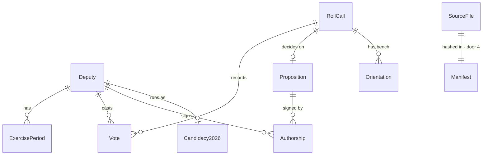

# etl-camara: Câmara open data into a versioned JSON contract

## Problem

The prototype ETL (tag `prototype-2026-09`, `etl/build.py`) already downloads the Câmara bulk files and computes four indicators for 513 deputies, but it emits Portuguese-keyed, percentage-only JSON with no schema, keeps no proof of what was downloaded when, reads the `cpf` column that the bulk file `deputados.csv` carries, and has no tests. The legal research (`research/01-pesquisa-juridica.md`) says the defence in any correction or right-of-reply request is provenance plus a published method with numerator and denominator, and that CPF must never be persisted. The grilling (`research/02-grilling-escopo-mvp.md`, decisions 3, 8, 9) fixes the coverage (Câmara, 57th legislature), the four indicators renamed, and a "candidate in 2026" badge matched without CPF. Today none of that exists in the repository: `main` has no code.

When this ships, `mandato-etl build` produces, from official sources only, a deterministic set of JSON files with `schema_version: 1` that the site feature reads through one data layer, with the four indicators as counts over totals, a raw-download manifest with hashes, and the 2026 candidacy of each deputy when the TSE file is present.

## Flow

Reuses the download-with-cache, exercise-period and party-majority logic of the prototype `etl/build.py`, ported into a package with tests instead of rewritten.

1. `mandato-etl build [--years] [--refresh] [--tse-csv] [--out]` -> `cli` (new, no door - placement per conventions) - parses flags, decides exit code
2. `cli` -> `sources.camara` (new, no door - placement per conventions) - downloads the 6 bulk CSVs per year with cache, `User-Agent`, retry; writes `data/raw/manifest.json` (door 4); fetches `/deputados` and `/deputados/{id}/historico` from the API with the same policy
3. raw CSVs -> `readers` (new, no door - placement per conventions) - streams rows through a per-file column allowlist (door 3); `cpf` never leaves this hop
4. rows -> `compute` (new, no door - placement per conventions) - exercise periods, roll calls, votes, government and party alignment, participation, authorship; every indicator as `{count, total}` (door 2)
5. `etl/inputs/tse/*.csv` (optional) -> `sources.tse` (new, no door - placement per conventions) - matches deputies on normalized civil name + birth date + UF (door 5); ambiguities reported, never guessed
6. `publish` (new, no door - placement per conventions) - writes the contract files (door 1) to a temp dir, validates each against `etl/schema/*.json`, renames over `--out`
7. out: `data/out/` read by the site feature at build time; nothing runs at request time (AD-001)

## Impact

| Front | What changes |
| --- | --- |
| domain | new term: `participation` - roll calls in PLEN in which the deputy recorded any vote value, over PLEN roll calls with nominal votes held while the deputy was in exercise; replaces the prototype's `presenca`, which the site copy must never render as "faltou" (AD-004) |
| domain | new term: `governmentAlignment` - valid votes equal to the `GOVERNO` bench orientation, over valid votes in roll calls where that orientation exists |
| domain | new term: `partyAlignment` - valid votes equal to the majority of the other members of the deputy's party in that roll call, over valid votes where such a majority exists |
| domain | new term: `exercisePeriod` - a half-open interval in which the deputy's status in the Câmara history is `Exercício`; drives `participation.total` and `inExercise` |
| domain | new term: `candidacy2026` - the deputy's 2026 candidacy from the TSE registry (office, party, ballot number, situation); `null` when the file is absent or the match is ambiguous |
| stored data | nothing to migrate - greenfield; the prototype's `site/data/*.json` layout is not read by anything and is replaced |

## Relations

One-way constraints: a `Vote` is unique per (`RollCall`, `Deputy`), latest `dataHoraVoto` wins (AC 12); `Candidacy2026` is unique per `Deputy` and absent when the match is ambiguous (door 5); every indicator on `Deputy` is a `{count, total}` pair (door 2). No columns and no types here - those live in `etl/schema/*.json` and are settled in the diff.

## Surface

`None - nothing consumed outside`. The JSON files are consumed by the site feature inside this repository; their shape is door 1 and their schemas are the contract.

## Landing

| One-way door | Literal shape | Alternative rejected |
| --- | --- | --- |
| JSON contract layout | `data/out/meta.json`, `deputies.json`, `roll-calls.json`, `deputies/{id}.json`, `roll-calls/{id}.json`; kebab-case file names, camelCase English keys, `meta.schema_version = 1`, one JSON Schema per file in `etl/schema/` | one file with everything - tens of MB the browser would fetch on every visit; SQLite - the static build and a future importer would both need a driver where JSON needs none |
| Indicator shape | `{"count": <int>, "total": <int>}` for `participation`, `governmentAlignment`, `partyAlignment`; no `ratio` field | precomputed percentage - loses the denominator the method page must show and cannot be relabelled |
| Column allowlist per source file | `readers.ALLOWLIST = {"deputados": [...without "cpf"], "votacoesVotos": [...], ...}`; a row is a dict of allowlisted keys only | reading whole rows and deleting `cpf` later - one forgotten path persists it; AD-003 |
| Raw download manifest | `data/raw/manifest.json` entries `{file, sourceUrl, sha256, bytes, downloadedAt}` written on every download; `meta.json` copies the list | no manifest - nothing proves what the indicators were computed from when a correction arrives; AD-005 |
| Cross-source match key | `(nfkd_strip_accents(civilName).casefold(), birthDate, uf)`; ambiguity leaves `candidacy2026: null` and lists the id in `meta.candidacy.ambiguous` | CPF join - the Câmara exposes it against its own FAQ and the TSE layout may drop it; AD-003 |
| Runtime dependency set | `pyproject.toml` `dependencies = []`; `pytest` and `jsonschema` in the dev group only | pandas or polars - 700 MB of CSV per run where the prototype streams in constant memory |
| Python project layout | `etl/pyproject.toml` managed by `uv`, package `mandato_etl`, console script `mandato-etl`; Python 3.13 | a single script like the prototype - no place for tests or the schema files |
| Schema validation at runtime (added while deriving checks) | `mandato_etl.schema.validate(doc, schema)` implements the JSON Schema subset the contract uses - `type` (incl. lists), `properties`, `required`, `additionalProperties: false`, `items`, `enum`, `const`, `pattern`, `minimum`, `$ref` to `#/$defs/*`; `etl/schema/*.json` use no other keyword; tests prove it agrees with `jsonschema` | `jsonschema` as a runtime dependency - contradicts the approved `dependencies = []`; skipping validation when `jsonschema` is absent - the daily build would publish unvalidated output silently |

- Nothing else in this change is hard to reverse

## Criteria

### S1: Download and snapshot (P1)

Every run either works from a verified local copy of the sources or stops before computing anything.

**Acceptance Criteria**

1. WHEN `mandato-etl build` runs with an empty `data/raw/` THEN the system SHALL download `votacoes`, `votacoesVotos`, `votacoesOrientacoes`, `votacoesProposicoes`, `proposicoes` and `proposicoesAutores` for each year in `--years` (default 2023 through the current year) plus `deputados.csv`, and write one manifest entry per file with `sourceUrl`, `sha256`, `bytes` and `downloadedAt`
2. WHEN a file is already in `data/raw/` and `--refresh` is absent THEN the system SHALL not issue an HTTP request for it
3. IF a download returns a non-2xx status after retries or times out THEN the system SHALL exit with code 2, print the failing URL on stderr and leave no `.part` or partial file in `data/raw/`
4. WHEN a request returns 429 or 503 THEN the system SHALL retry at most 3 times with delays of 1, 2 and 4 seconds before treating it as a failure
5. The system SHALL send `User-Agent: mandato-aberto-etl/<version> (+<contact URL>)` on every HTTP request
6. WHEN fetching deputy histories THEN the system SHALL run at most 4 requests concurrently and cache each response under `data/raw/historico/{id}.json`

**Independent test:** run twice against a fake HTTP server; the second run issues zero requests and the manifest hashes match the files on disk.

### S2: Deputies and exercise periods (P1)

The deputy set and the time each one was in exercise are derived from official records only.

**Acceptance Criteria**

7. The system SHALL include in `deputies.json` every deputy with at least one record in `votacoesVotos` whose `deputado_idLegislatura` is `57`
8. WHEN reading any source file THEN the system SHALL keep only the allowlisted columns of that file, and the string `cpf` SHALL not occur as a key in any file under `data/out/`
9. WHEN a deputy's history contains statuses after `2023-02-01` THEN the system SHALL compute `exercisePeriods` as half-open intervals from each `Exercício` entry to the next non-`Exercício` entry, the last one closing at the build time
10. WHEN a deputy appears in the API list `/deputados?itens=1000` THEN the system SHALL set `inExercise: true`, otherwise `false`
11. WHEN a deputy has several vote records THEN the system SHALL take `party`, `uf`, `name` and `photoUrl` from the record with the latest `dataHoraVoto`

**Independent test:** a fixture with one deputy who took leave in 2024 and returned in 2025 yields two periods and the expected `participation.total`.

### S3: Roll calls and votes (P1)

Each nominal roll call is one record with how every deputy voted.

**Acceptance Criteria**

12. IF the same deputy has two vote records in one roll call THEN the system SHALL keep the one with the latest `dataHoraVoto`
13. The system SHALL exclude roll calls dated before `2023-02-01` and roll calls with no record in `votacoesVotos`
14. WHEN writing `roll-calls/{id}.json` THEN the system SHALL include `date`, `organ`, `description`, `proposition` (`id`, `title`, `summary` or `null`), `approved`, `tallies` (`yes`, `no`, `others`), `governmentOrientation` (or `null`), `sourceUrl` and `votes` as one entry per deputy with `deputyId`, `vote` and `party`
15. WHEN writing `deputies/{id}.json` THEN the system SHALL include `votes` as one entry per roll call the deputy has a record in, with `rollCallId`, `vote`, `party` and `partyMajority` (or `null`), ordered by roll-call date descending
16. WHEN a roll call has an orientation whose `siglaBancada` casefolds to `governo` THEN the system SHALL set `governmentOrientation` to that value, otherwise `null`

**Independent test:** a fixture roll call with 5 votes, one duplicated, produces 4 entries and the expected tallies.

### S4: Indicators (P1)

The four indicators are counts over totals, reproducible from the published method.

**Acceptance Criteria**

17. The system SHALL set `participation.total` to the number of PLEN roll calls with nominal votes whose `dataHoraRegistro` falls inside one of the deputy's `exercisePeriods`, and `participation.count` to the number of those in which the deputy has a non-empty `vote`
18. The system SHALL set `governmentAlignment.total` to the deputy's votes in `{Sim, Não, Abstenção, Obstrução}` in roll calls whose `governmentOrientation` is in that same set, and `.count` to those equal to it
19. The system SHALL set `partyAlignment.total` to the deputy's votes in `{Sim, Não, Abstenção, Obstrução}` in roll calls where the other members of the same party have a strict majority value, and `.count` to those equal to it
20. WHEN computing the party majority THEN the system SHALL exclude the deputy's own vote and SHALL treat a tie or an empty set as no majority
21. The system SHALL count as `authored` the propositions of type `PL`, `PLP`, `PEC`, `PDL` or `PRC` presented on or after `2023-02-01` where the deputy is `proponente = 1`, flagging `firstSigner: true` when `ordemAssinatura = 1`, and SHALL count `REQ`, `RIC` and `INC` only as `requirementsCount`
22. IF an indicator has `total = 0` THEN the system SHALL write `{"count": 0, "total": 0}` and no other field
23. The system SHALL write no percentage or ratio for any indicator

**Independent test:** a hand-built fixture of 3 deputies and 4 roll calls whose expected counts were computed on paper matches the output exactly.

### S5: Candidacy 2026 (P2)

Deputies running in 2026 are marked from the TSE registry without touching CPF.

**Acceptance Criteria**

24. WHERE a CSV exists at `--tse-csv` THEN the system SHALL match each deputy to at most one candidacy on `(accent-stripped casefolded civil name, birth date, UF)` and write `candidacy2026` with `office`, `party`, `ballotNumber` and `situation`
25. IF `--tse-csv` is absent or the file does not exist THEN the system SHALL write `candidacy2026: null` for every deputy, print a warning on stderr and exit 0
26. IF two or more candidacies match one deputy THEN the system SHALL write `candidacy2026: null` for that deputy and list the id under `meta.candidacy.ambiguous`
27. The system SHALL read the TSE file through the column allowlist and SHALL not read a column whose name contains `CPF`

**Independent test:** a 4-row TSE fixture with one exact match, one accent-only difference, one ambiguity and one non-deputy yields two matches, one ambiguity and one ignored row.

### S6: Publish and validate (P1)

The output is a contract the site can trust and a diff a reviewer can read.

**Acceptance Criteria**

28. WHEN the build finishes THEN every file under `data/out/` SHALL validate against its JSON Schema in `etl/schema/`, and `mandato-etl validate` SHALL exit 0 on that directory
29. WHEN writing `meta.json` THEN the system SHALL include `schema_version: 1`, `generatedAt` (UTC, ISO 8601), `years`, `counts` (`deputies`, `rollCalls`, `propositions`), `sources` (the manifest entries) and `candidacy` (`file` or `null`, `matched`, `ambiguous`)
30. IF the build fails after downloading THEN the previous contents of `--out` SHALL remain unchanged
31. WHEN two builds run on identical inputs THEN the system SHALL produce byte-identical files (sorted keys, stable ordering: deputies by name, roll calls by date descending then id)
32. WHEN `--years` is given a year outside 2023 through the current year THEN the system SHALL exit with code 1 and print the usage on stderr
33. WHEN writing a deputy or roll-call record THEN the system SHALL include `sourceUrl` pointing at the official Câmara page for that deputy or roll call

**Independent test:** run the build on the fixtures, run it again, `diff -r` is empty and `mandato-etl validate` exits 0.

## Out of scope

| Excluded | Why |
| --- | --- |
| Senate data | grilling decision 3: first increment after launch, separate ETL |
| Expenses (CEAP), amendments, campaign finance | grilling decision 9: two new sources, not in the MVP |
| Official attendance from `eventosPresencaDeputados` | grilling decision 9: adds a number without absence justification; participation covers the MVP |
| Speeches, committee membership, fronts | not in any MVP decision |
| Legislatures before the 57th | grilling decision 3 |
| Automated download from the TSE portal | it blocks automated access (HTTP 403); the file is downloaded by hand |
| Any text generated by AI | AD-009 |
| Publishing `data/out/` to the site | the site feature consumes it; this feature stops at the contract |

## Assumptions

| Assumption | Chosen default | Rationale | Confirmed? |
| --- | --- | --- | --- |
| Output location | `data/out/` at the repository root, gitignored; the site reads `../data/out` at build time | keeps ETL and site decoupled (AD-002); nothing else consumes it yet | y |
| Raw cache location | `data/raw/` at the repository root, gitignored | same layout as the prototype; 700 MB do not belong in git | y |
| Roll calls in committees | included in `roll-calls.json` and in each deputy's `votes`; only PLEN counts for `participation` | the prototype does the same; committee attendance is not comparable across deputies | y |
| Vote value `Artigo 17` | counts as a recorded vote for `participation`, not as a valid vote for alignment | it is the presiding officer's record, not a position | y |
| Contact URL in the User-Agent | the repository URL until the site has a contact page | the launch feature replaces it | y |
| TSE column names | `NM_CANDIDATO`, `DT_NASCIMENTO`, `SG_UF`, `DS_CARGO`, `SG_PARTIDO`, `NR_CANDIDATO`, `DS_SITUACAO_CANDIDATURA`, read through a mapping in one place | historical layout of `consulta_cand`; the 2026 file was not readable from this environment | y |
| Photo URL | `deputado_urlFoto` from the votes file, unchanged | official URL; the site caches it (grilling premise) | y |
| Build time as "now" | `datetime.now(UTC)` injected, so tests pin it | AC 9 and 31 need a fixed clock | y |
| Log format | one line per stage on stderr, `--quiet` silences everything but errors | GitHub Actions log is the only reader | y |

**Open questions:** two, below - one blocks go-live of S5, one stays open with a default.

| # | Kind | Question | Until answered |
| --- | --- | --- | --- |
| 1 | blocks go-live | Who downloads `consulta_cand_2026_BRASIL.csv` from the TSE portal in a browser, stores the licence screenshot in `research/`, and places the file at `etl/inputs/tse/`? | S5 runs on a fixture only; the badge is `null` in production |
| 2 | open | Exact 2026 column names in the TSE file | the mapping assumption above stands; adjusting it is a one-line change |

## Observable

| Surface | Decision | Landing |
| --- | --- | --- |
| command `mandato-etl build` | output format and verbosity | AC 29 for the artefact; assumption "Log format" for the log |
| command `mandato-etl build` | every flag and its default | AC 1 (`--years`), AC 2 (`--refresh`), AC 24-25 (`--tse-csv`), assumption "Output location" (`--out`) |
| command `mandato-etl build` | exit codes | AC 3 (2), AC 32 (1), AC 25 (0 with warning) |
| command `mandato-etl build` | what it prints when it fails halfway | AC 3 (URL on stderr, no partial file), AC 30 (previous output intact) |
| command `mandato-etl validate` | output format, flags, exit codes | AC 28; no flags beyond the directory; exit 1 with the first schema error on stderr |
| collection `data/out/` | grouping criterion | door 1 - one file per entity kind, one file per deputy and per roll call |
| collection `data/out/` | naming | door 1 - kebab-case files, camelCase keys |
| collection `data/out/` | ordering | AC 31 |
| collection `data/out/` | duplicates | AC 12 (votes), AC 26 (candidacies) |
| collection `data/out/` | the exception that does not fit | AC 22 (indicator with no denominator), AC 25 (no TSE file) |
| document `etl/schema/*.json` | structure, and what the reader does next | door 1 - one schema per file; the site feature codes against them |
| screen | n/a - this feature exposes no screen |
| API | n/a - this feature exposes no route |

## Sources

- `research/02-grilling-escopo-mvp.md` decisions 3, 8, 9 and premises "Votações incluídas", "Fotos", "Atualização" - coverage, candidacy badge, indicator set
- `research/01-pesquisa-juridica.md` sections 2.3 and 5 - no CPF, descriptive indicators, provenance
- tag `prototype-2026-09` `etl/build.py` - the indicator definitions being ported
- `.specs/STATE.md` AD-001 to AD-006
