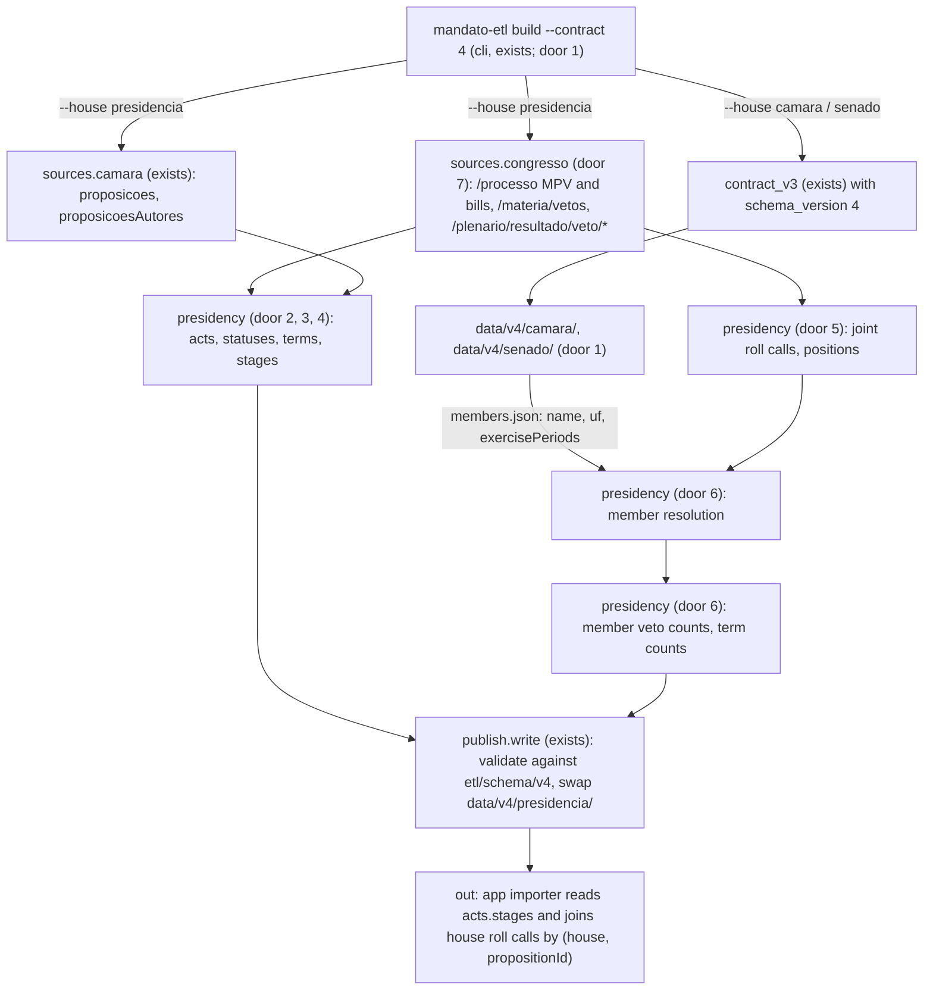
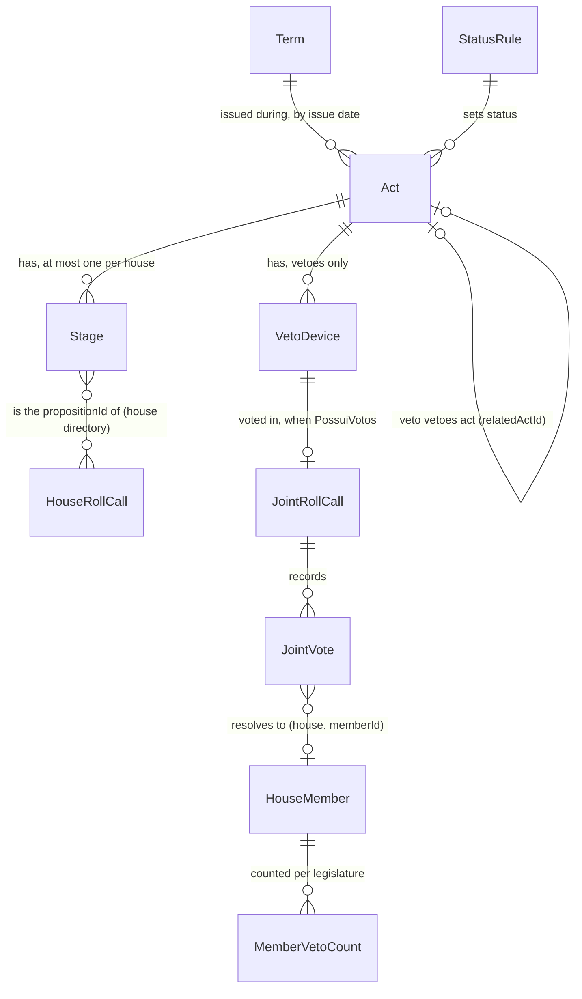

# etl-presidencia: provisional measures, vetoes and Executive bills, linked to the roll calls on them

## Problem

The v2 profile shows what deputies and senators did. It shows nothing the Presidência did, although v2 grilling decision 8 scopes the Presidência profile as provisional measures (MPs), vetoes and Executive bills, each with what Congress did with it. Research `06` move 3 ("Do Planalto ao plenário") says nobody links an Executive act to how each member voted on it. Contract v3 has no place for this. `presidencia` was rejected from the house enum (contract-v3 door 3) because it has no members and no roll calls, and joint sessions of Congress, where vetoes are decided, were left out of both houses (contract-v3 `Out of scope`).

The volume is not small (research `09`, all [V]). From 2023-01-01 to 2026-10-02 the Presidência issued 241 MPs. Of these, 53 became law, 146 lapsed, 12 were revoked and 30 are pending. There were 205 vetoes (29 total, 176 partial) over 2,558 devices: 853 kept, 357 overridden, 217 prejudged and 1,131 not yet deliberated. There were also 103 Executive bills (90 PL, 11 PLP, 2 PEC). A reader who wants to know what became of an MP has two options today. The Câmara's status field says "Aguardando Encaminhamento" for an MP that became Lei 14.696/2023, and its bulk file and API disagree about MPV 1154/2023. The other option is the Congress portal, one act at a time. Joint-session votes on vetoes exist only in the Congress data, per device, with a member's name, party and UF but no member id. No consumer can join them to a member profile.

The Presidência is the first v2 scope to slip, to March 2027 (decision 9, AD-014). The evidence gives no date sooner than that.

When this ships, `mandato-etl build --contract 4 --house presidencia` writes `data/v4/presidencia/`. It is a schema-validated directory in which every MP, veto and Executive bill of a presidential term has a lifecycle status mapped mechanically from the official decision. Each act points at the proposition ids that each house's roll calls already carry. Each veto device voted in a joint session is a roll call whose votes resolve to the same `(house, memberId)` keys as the house directories. Each member has descriptive counts of the vetoes they voted on. The house directories gain nothing but the version number.

## Flow

This reuses the download cache and manifest (`sources.camara`, including the `proposicoes` and `proposicoesAutores` yearly files it already fetches), the house builds of contract v3 (`contract_v3`, with the version as a parameter), the legislature-by-date rule (`compute.legislature_of`, contract-v3 AC 7) and the validate-then-swap in `publish.write`. Member identity is not fetched again. It is read from the house directories the same run set wrote.

1. `mandato-etl build --contract 4 --house {camara,senado}` -> `cli` (exists) -> `contract_v3` (exists) - the same house build as v3, writing `schema_version: 4` to `data/v4/<house>/` (door 1)
2. `mandato-etl build --contract 4 --house presidencia` -> `cli` (exists) - refuses to start unless `data/v4/camara/` and `data/v4/senado/` validate (door 6)
3. `sources.congresso` (door 7) - fetches the MP lists per year, the veto lists per year, the result of each veto, the votes of each voted device and the Senate process of each Executive bill. It caches each response in `data/raw/congresso/` and records it in `manifest.json`
4. `sources.camara` (exists) - the yearly `proposicoes` and `proposicoesAutores` files give the Câmara id of each MP and the Executive bills with their Câmara status
5. `presidency` (doors 2-4) - builds one act per MP, veto and bill. It sets `status` from the published status rules, assigns `termId` by the issue date and sets `stages` to the proposition id in each house
6. `presidency` (door 5) - builds one joint roll call per voted veto device and maps each official vote to a position. It stops the build on a value outside the map
7. `presidency` (door 6) - resolves each joint vote to `(house, memberId)` against the house `members.json`, then counts per member and legislature the vetoes voted on and per term the acts by status
8. `publish.write` (exists) - validates every document against `etl/schema/v4/` in a temp dir and swaps `data/v4/presidencia/` atomically
9. out: the app importer reads `acts.json`, joins `stages[]` to house `roll-calls.json` on (`house`, `propositionId`), and reads joint votes and member counts from the same directory. `data/v3/` and `data/out/` are not touched by a v4 run

## Impact

| Front | What changes |
| --- | --- |
| domain | new term: `act` - one official decision of the Presidência in scope: a provisional measure, a veto or an Executive bill (PL, PLP, PEC). Lives in `data/v4/presidencia/acts.json` |
| domain | new term: `term` - one presidential mandate (`2023-2026`: 2023-01-01 to 2027-01-04; `2027-2030`: 2027-01-05 to 2031-01-04, EC 111/2021), with its titular. An act belongs to the term in which it was issued, whoever signed it |
| domain | new term: `stage` - an act's proposition id in one house, the key on which that house's roll calls already point (`roll-calls[].propositionId`) |
| domain | new term: `joint roll call` - one veto device voted in a joint session of Congress. It carries votes from both houses. It is not a house roll call and enters no house indicator |
| domain | new term: `status` - an act's lifecycle value, mapped from the official decision by the published `status-rules.json`. It is not the Câmara's `descricaoSituacao`, which only branches internally in `site/` and `design/` today, for propositions and not for acts |
| domain | existing term: `schema_version` meant 3 for every v3 directory. In v4 every directory says 4, and the house shapes are otherwise identical to v3. Consumers that branch on it: `mandato-etl validate` (this feature extends it) and the app importer (app-skeleton, which reads 3 and must learn 4 before it reads a v4 directory) |
| domain | existing term: `house` keeps `camara` and `senado` only. A joint vote names the house the member sits in. `presidencia` and `congresso` are never house values (contract-v3 door 3) |
| stored data | `data/v4/` is new and rebuilt from empty per directory on each run. `data/v3/` and `data/out/` are not touched. `data/raw/congresso/` is a new cache. A decided veto device's votes are immutable and cached forever, while lists and pending acts are refetched. Nothing to migrate |
| CI | `ci.yml` gains the v4 fixtures under `mandato-etl validate`. `publish.yml` still runs the v2 build only |

## Relations

One-way constraints:
- `Act` unique per `id` = `<type>-<number>-<year>` (door 2). `Stage` unique per (`act id`, `house`). `VetoDevice` unique per official `identifier` (`49.23.001`). `JointRollCall` unique per `id` = device `identifier`, at most one per device (door 5). `JointVote` unique per (joint roll call, `house`, normalised name, `uf`).
- A `JointVote` has `memberId` only when exactly one member of that house with that normalised name and UF is in exercise on the session date (door 6). Otherwise `memberId` is `null` and the vote counts in no member indicator.
- `Act.termId` is set by the issue date alone (door 3). An act issued before the first known term is not written.
- `MemberVetoCount` unique per (`house`, `memberId`, `legislature`), and only for members present in that house's `members.json`.

## Surface

`None - nothing consumed over a route`. The consumed signature is the v4 file contract in Landing doors 1 to 6 and the `--contract 4` / `--house presidencia` flags in door 1. The command's flags and exit codes are walked in `## Observable`.

## Landing

| One-way door | Literal shape | Alternative rejected |
| --- | --- | --- |
| 1. Contract v4: one version for every directory, a presidency directory beside the houses | `meta.schema_version: 4` (`const`) in every v4 directory. `etl/schema/v4/` holds the seven v3 schemas unchanged except `schema_version` `const: 4`, plus `presidency-meta`, `acts`, `status-rules`, `joint-roll-calls`, `joint-roll-call` and `member-veto-counts` `.schema.json`. Layout: `data/v4/{camara,senado}/` as v3, and `data/v4/presidencia/{meta.json, acts.json, status-rules.json, joint-roll-calls.json, joint-roll-calls/<id>.json, member-veto-counts.json}`. The presidency `meta.json` has `"scope": "presidencia"` and no `house` key, and `mandato-etl validate` picks the presidency schema set on that key. `mandato-etl build --contract {2,3,4}`, default 2, with `--house presidencia` valid only with `--contract 4`. v3 keeps being emitted, unchanged, until the feature that moves the app importer to 4 removes it | adding the presidency files to v3 without a bump: breaks contract-v3 door 2 ("any change to a v3 schema file bumps `schema_version`"; `meta.house` would need a third value). A presidency directory at 4 beside house directories at 3: one import would mix versions, and the importer could not refuse a set it does not know. `presidencia` as a house: rejected by contract-v3 door 3, since it has no members and no roll calls. Freezing v3 byte for byte as with v2: no live site reads v3, so dual emission only needs to last until the importer moves |
| 2. Act identity and shape | `acts.json` = `[{id, kind, type, number, year, issuedAt, termId, summary, status, officialStatus, statusRule, statusAt, law, stages, relatedActId, vetoScope, devices, sourceUrl}]`. `id` matches `^(mpv\|vet\|pl\|plp\|pec)-[0-9]+-[0-9]{4}$` (`mpv-1154-2023`, `vet-49-2023`, `plp-93-2023`). `kind` is `provisionalMeasure` \| `veto` \| `bill`, and `type` is the official sigla `MPV` \| `VET` \| `PL` \| `PLP` \| `PEC`. `officialStatus` is the source's code or text verbatim, and `law` is the source's law name verbatim (`"Lei nº 14.600 de 19/06/2023"`) or `null`. `relatedActId` is the act a veto vetoes, when that act is in `acts.json`, else `null`, with `vetoedMatter` = `{type, number, year}` verbatim. `vetoScope` is `total` \| `partial` for vetoes, else `null`. `devices` = `[{identifier, description, text, reason, status, jointRollCallId}]` for vetoes, else `[]`. `sourceUrl` points at the Congress page for MPs and vetoes and the Câmara page for bills | one official integer id: MPs and vetoes key on the Congress `idProcesso` or legacy `codigoMateria`, bills on the Câmara id, so a single integer would mix three sequences (the collision contract-v3 door 3 avoided). One entity per kind: three importers and three schemas for the same lifecycle question, and the term counts would join three files |
| 3. Term dimension | `meta.terms` = `[{id, start, end, holder, sourceUrl}]` with `{"id": "2023-2026", "start": "2023-01-01", "end": "2027-01-04", "holder": "Luiz Inácio Lula da Silva"}` and `{"id": "2027-2030", "start": "2027-01-05", "end": "2031-01-04", "holder": null}` until the holder constant is set. A term is listed once its `start` is on or before the build date. `termId` comes from `issuedAt` = MP `dataApresentacao` (Congress), veto `DataPublicacao`, bill Câmara `dataApresentacao`. Acts with `issuedAt` before 2023-01-01 are not written | attributing acts to a person: no source names the signer, and the vice-president signs when in exercise (research `09` section 6). Assigning by legislature: the 57th starts 2023-02-01, a month after the term, and MPV 1154/2023 is from 2023-01-01. Ending the term on 2027-01-01, as the brief says: EC 111/2021 moves the inauguration to 5 January from the 2026 election on, so acts of 2027-01-01 to 04 would land in the wrong term |
| 4. Status vocabulary and the published rule table | `status` enum per kind. MP: `pending` \| `approved` \| `approvedAmended` \| `rejected` \| `lapsed` \| `revoked` \| `returned`. Veto: `pending` \| `decided`. Bill: `inProgress` \| `law` \| `vetoedTotally` \| `withdrawn` \| `archived`. Device: `kept` \| `overridden` \| `prejudged` \| `pending`. `status-rules.json` = `[{id, kind, source, field, officialValue, status, description}]`, applied by exact match on the verbatim value. MP rules on Congress `siglaTipoDeliberacao`: `APROVADO_NA_INTEGRA` -> `approved`, `APROVADO_PLV` -> `approvedAmended`, `PERDA_EFICACIA` -> `lapsed`, `REVOGADO` -> `revoked`, `REJEITADO_PLENARIO`, `REJEITADO_PLENARIO_CD`, `INADIMITIDA_URGENCIA` -> `rejected`, `IMPUGNADO_PRESIDENCIA` -> `returned`, and null with `tramitando: "Sim"` -> `pending`. Device rules on `Situacao`: `Mantido` -> `kept`, `Rejeitado` -> `overridden`, `Prejudicado` -> `prejudged`, `Não Apreciado` -> `pending`. Veto: `pending` if any device is `pending`, else `decided`. Bill: `law` when the Senate process has `normaGerada` or the Câmara status is `Transformado em Norma Jurídica`, `vetoedTotally` when a total veto in `acts.json` vetoes it, `withdrawn` on `Retirado pelo(a) Autor(a)`, `archived` on `Arquivada`, else `inProgress`. An MP or device value outside its rules stops the build. `description` is a pt-BR sentence naming the official term. `meta.statusRules.version` is an integer, incremented on any rule change | the Câmara's `descricaoSituacao` for MPs: it says "Aguardando Encaminhamento" for MPV 1177/2023, which became Lei 14.696/2023, and its bulk file and API disagree on MPV 1154/2023. Free-text statuses only: every consumer would re-derive the lifecycle. An `other` status for unknown codes: a count would silently change meaning (the contract-v3 door 7 argument). Fail-closed for bills too: the Câmara has dozens of in-progress values, all of which honestly mean "not concluded" |
| 5. Joint roll call and joint vote | `joint-roll-calls.json` = `[{id, actId, deviceIdentifier, legislature, date, session, method, question, result, tallies, votesAvailable, sourceUrl}]`, with `id` = device `identifier` (`"49.23.001"`), `method` `cedula` \| `painel`, `question: "keepVeto"`, `result` `kept` \| `overridden`, and `tallies` = `{camara: {yes, no, abstention, obstruction, blank, presiding}, senado: {…}}` counted from the votes, or `null`. `joint-roll-calls/<id>.json` = the same record plus `votes: [{house, memberId, name, party, uf, official, position}]`, sorted by `house`, then `name`. Position map on `TipoVoto`: `Sim` -> `yes`, `Não` -> `no`, `Abstenção` -> `abstention`, `Obstrução` -> `obstruction`, `Branco` -> `blank`, `Art. 17` -> `presiding`; any other value stops the build. `yes` means keep the veto. A device with no `Codigo` (total veto) gets `votesAvailable: false`, `tallies: null` and no votes file. `legislature` is set by `date` with contract-v3's rule | reusing the house `vote.position` enum: it has no `blank`, and adding one would change the house schemas for a value houses never emit. Writing joint votes into each house directory: house runs would depend on the Congress source, so an outage there would stop the daily house update (the contract-v3 door 1 argument). Keying by the distinct vote act instead of the device: the Congress publishes per device, and no field says which devices one panel vote covered |
| 6. Member resolution and the member veto counts | the presidency build reads `data/v4/camara/members.json` and `data/v4/senado/members.json` and exits 1 if either is missing or invalid. A joint vote resolves to the single member of its house whose NFKD-stripped, casefolded, whitespace-collapsed `name` equals the vote's, whose mandate `uf` equals the vote's `uf`, and whose `exercisePeriods` contain the session date. Before that match, `etl/inputs/joint-vote-aliases.json` = `[{house, name, uf, memberId, note}]` maps a joint-vote name verbatim to a member id. It starts with the four Senate names research `09` found that differ from the Senate list (`Márcio Bitar`/AC -> 285, `Janaina Carla Farias`/CE -> 6351, `Astr. Marcos Pontes`/SP -> 6009, `Prof. Dorinha Seabra`/TO -> 5386). Zero or more than one match gives `memberId: null`, counted in `meta.coverage.unmatchedVotes`. `member-veto-counts.json` = `[{house, memberId, legislature, participation, keepAll, overrideAll, mixed}]`, each `{count, total}`. Per member and veto: `participation.total` = vetoes with a joint roll call with `votesAvailable: true` dated in one of the member's exercise periods in that legislature, `participation.count` = those where the member has at least one resolved vote. For the vetoes counted in `participation.count`, `keepAll` counts those where every resolved position is `yes`, `overrideAll` those where every one is `no`, and `mixed` the rest, each with `total` = `participation.count` | fuzzy matching (edit distance, expanding `Prof.` or `Astr.`): a wrong match puts a vote on the wrong person, which is exactly what a correction request contests. Fetching member lists again from the house APIs: two member sources would drift from the ids the importer holds. A participation base with no exercise periods: absences are not recorded in joint votes, so "did not vote" could not be told from "not in office". Counting per device: VET 14/2023 alone has 397 devices, and one panel vote is repeated across the devices it covers (research `09` section 4.6). A `keepRate`: AD-004, count over total only |
| 7. A new source module and its raw cache | `sources.congresso` beside `sources.camara`. Base `https://legis.senado.leg.br/dadosabertos`, `Accept: application/json`, the ETL's existing `User-Agent`, at most 2 requests per second, and retries on 429, 503 and on a 200 with an empty or non-JSON body with the existing delays (5 of 1,201 device calls returned an empty body and succeeded on retry). Cache: `data/raw/congresso/{processo-mpv-<year>, vetos-<year>, veto-<codigo>, dispositivo-<codigo>, processo-<sigla>-<numero>-<ano>}.json`, each recorded in `data/raw/manifest.json` with URL, sha256, bytes and time (AD-005). Without `--refresh`, a cached `dispositivo-<codigo>` whose device was decided is reused, and every list and every pending act is refetched. Planalto is never called | scraping planalto.gov.br for MP texts and veto messages: it drops connections from the project's identified User-Agent (curl exit 56), and spoofing a browser is not acceptable for a public-interest scraper. One request per device on every run: 1,201 calls a day for votes that cannot change once decided |
| 8. Shape details settled while deriving the checks (added by the builder; pinned in `checks.md` C20, C28, C47, C60 before the code, recorded here after it) | Each device in `acts.json` also carries `officialStatus` (`Situacao` verbatim) and `statusRule` (`device.NN`), as AC 11 requires of devices. A veto's `officialStatus` is `null` (its status is derived from its devices by `veto.01`/`veto.02`), a bill's is the Câmara `ultimoStatus_descricaoSituacao` verbatim or `null` when empty. `statusAt` is the MP `dataDeliberacao` (null while pending), the latest `DataSessao` of a decided veto (null while pending), the date of the bill's Câmara `ultimoStatus_dataHora`. `status-rules.json` holds the whole table (21 rules: `mpv.01`-`09`, `device.01`-`04`, `veto.01`-`02`, `bill.01`-`06`), with `officialValue: null` and `source: "mandato-aberto"` for the two derived veto rules. `meta.coverage.terms[]` = `{term, provisionalMeasure: {total, <7 statuses>}, veto: {total, pending, decided, devices: {kept, overridden, prejudged, pending, total}}, bill: {total, <5 statuses>}}`. The presidency build reads the house directories beside its `--out` (`<out>/../camara`, `<out>/../senado`) | `vetoedMatter`-style per-kind objects for the coverage (one file shape per kind: the importer would branch on three shapes for one question). Devices without their own rule id: a device status could not be traced to the published rule that set it. A `--houses-dir` flag: a second path to keep consistent with `--out` for no case the default layout does not cover |

- Nothing else in this change is hard to reverse. The status rules can be refined during the build before the first v4 publication (version stays 1). After that, each change increments `statusRules.version`.

## Criteria

### S1: v4 beside v3 (P1)

House directories carry the new version and nothing else changes in them, while v3 output stays as it was.

**Acceptance Criteria**

1. WHEN `mandato-etl build --contract 4 --house camara` runs on the v3 fixtures THEN the system SHALL write `data/v4/camara/` whose files equal those of `--contract 3` on the same inputs and clock in every byte except the `schema_version` value in `meta.json`
2. WHEN any `--contract 4` build runs THEN the system SHALL leave every file under `data/out/` and `data/v3/` unchanged
3. IF `--house presidencia` is given with `--contract 2` or `--contract 3`, or `--contract` is given a value outside {`2`, `3`, `4`}, THEN the system SHALL exit 1, print the usage on stderr and write nothing
4. WHEN `mandato-etl validate <dir>` runs THEN the system SHALL validate against `etl/schema/v4/` when `meta.schema_version` is 4, choosing the presidency schema set when `meta.scope` is `presidencia` and the house set otherwise, and SHALL keep the v2 and v3 behaviour of contract-v3 AC 5
5. The system SHALL leave `site/`, `design/`, `.github/workflows/publish.yml`, `etl/schema/v3/` and `etl/schema/*.json` unchanged in this feature's diff

**Independent test:** build the v3 Câmara fixtures with `--contract 3` and `--contract 4` and diff them. The only difference is `"schema_version": 4`. Then `mandato-etl validate data/v4/camara` exits 0.

### S2: Every act with its status (P1)

Each MP, veto and Executive bill of a term appears once, with a lifecycle status anyone can re-derive from the published rules.

**Acceptance Criteria**

6. WHEN the presidency build runs THEN the system SHALL write one act for every MP returned by `/processo?sigla=MPV&ano=<year>` for each year from 2023 to the build year whose `dataApresentacao` falls in a known term
7. WHEN the presidency build runs THEN the system SHALL write one act for every veto in `/materia/vetos/<year>` for each year from 2023 to the build year whose `DataPublicacao` falls in a known term, with `vetoScope` `total` when `Total` is `Sim` and `partial` otherwise
8. WHEN the presidency build runs THEN the system SHALL write one bill act for every proposition of type `PL`, `PLP` or `PEC` in the Câmara yearly files with an author row `nomeAutor` = `Poder Executivo` and `codTipoAutor` = `30000`, whose `dataApresentacao` falls in a known term
9. IF an act's issue date is before the start of the first known term THEN the system SHALL not write it and SHALL count it in `meta.coverage.excludedBeforeFirstTerm` (fixture: `PL 1/2023`, presented 2022-12-30)
10. The system SHALL set each act's `termId` to the term whose `start`..`end` (inclusive, Brasília dates) contains its issue date, so that an act issued on 2027-01-04 belongs to `2023-2026` and one issued on 2027-01-05 to `2027-2030`
11. WHEN setting an MP's or device's `status` THEN the system SHALL apply `status-rules.json` by exact match on the verbatim official value and SHALL write the matching rule's `id` in `statusRule` and the verbatim value in `officialStatus`
12. IF an MP's `siglaTipoDeliberacao` or a device's `Situacao` matches no rule THEN the system SHALL exit 1 naming the value and the act id, and SHALL leave the previous `data/v4/presidencia/` unchanged
13. The system SHALL set a veto's `status` to `pending` when at least one of its devices is `pending` and to `decided` otherwise
14. WHEN setting a bill's `status` THEN the system SHALL use `law` if the Senate process of the same `<type> <number>/<year>` has a `normaGerada` or the Câmara status is `Transformado em Norma Jurídica`, else `vetoedTotally` if a total veto act has it as `vetoedMatter`, else `withdrawn` on `Retirado pelo(a) Autor(a)`, else `archived` on `Arquivada`, else `inProgress`
15. The system SHALL write `law` verbatim from the source's `normaGerada` when present and `null` otherwise, and an MP with status `approved` or `approvedAmended` SHALL have a non-null `law` or be counted in `meta.coverage.approvedWithoutLaw`
16. WHEN a veto's `vetoedMatter` is an MP or bill present in `acts.json` (a veto on a conversion bill names the MP itself, `MateriaVetada.Sigla` `MPV`) THEN the system SHALL set the veto's `relatedActId` to that act's id
17. The system SHALL write `status-rules.json` with exactly the rules applied, each `description` a pt-BR sentence that names the official term, and none of `derrota`, `vitória`, `fracasso`, `importante`, `aprovação do governo` or `ranking` in any description

**Independent test:** recorded responses for 6 MPs (one per MP status seen, plus one `tramitando`), 3 vetoes (total and decided, partial and mixed, partial and pending) and 4 bills (law, withdrawn, archived, in progress) give exactly the expected `status`, `statusRule` and `termId`. Swapping one `siglaTipoDeliberacao` for `XYZ` makes the build exit 1.

### S3: From the act to each house's roll calls (P1)

An act names, in each house, the proposition id that house's roll calls already carry, so the importer can list every vote on it.

**Acceptance Criteria**

18. The system SHALL write for each MP a `camara` stage whose `propositionId` is the Câmara `id` of the proposition with `siglaTipo` `MPV` and the same number and year, and a `senado` stage whose `propositionId` is the Congress process `id` from `/processo?sigla=MPV`
19. The system SHALL write for each bill a `camara` stage with its Câmara `id`, and a `senado` stage with the `id` of the `/processo?sigla=<type>&numero=<n>&ano=<y>` record whose `casaIdentificadora` is `SF`, only when one exists
20. The system SHALL write no stage for a veto, and the votes on a veto SHALL be reachable only through its devices' `jointRollCallId`
21. WHEN the house v4 fixtures contain Câmara roll calls `2345493-41` and Senate roll call `6704` with `propositionId` 2345493 and 8349431 THEN joining `mpv-1154-2023.stages` on (`house`, `propositionId`) SHALL return exactly those roll calls
22. IF an MP has no Câmara proposition with the same number and year THEN the system SHALL write the act without a `camara` stage and count it in `meta.coverage.missingCamaraStage`

**Independent test:** run the house fixtures and the presidency fixtures in one temp dir, and join `stages` to the two `roll-calls.json` with a 10-line script. The roll-call ids listed are the expected ones for one MP and one bill.

### S4: Joint-session votes on vetoes (P1)

Every veto device decided by a nominal vote is a roll call whose votes carry the same member keys as the house directories.

**Acceptance Criteria**

23. The system SHALL write one joint roll call per device with `PossuiVotos` `Sim`, with `id` equal to the device `Identificador`, `result` from the device status, `method` `cedula` for `Cédula` and `painel` for `Painel`, and `question: "keepVeto"`
24. WHEN a device has a `Codigo` THEN the system SHALL write `joint-roll-calls/<id>.json` with one vote per entry of `Votacao.Camara.Voto` (house `camara`) and `Votacao.Senado.Voto` (house `senado`), mapping `TipoVoto` by the door 5 position map
25. IF a `TipoVoto` value is outside the door 5 map THEN the system SHALL exit 1 naming the value and the device identifier, and SHALL leave the previous output unchanged
26. WHEN a voted device has no `Codigo` (a total veto) THEN the system SHALL write the joint roll call with `votesAvailable: false` and `tallies: null`, write no votes file and count it in `meta.coverage.jointRollCallsWithoutVotes`
27. The system SHALL set `tallies.<house>.<position>` to the number of that house's votes with that position, for every position in the door 5 enum
28. WHEN resolving a joint vote THEN the system SHALL set `memberId` to the one member of that house whose normalised `name`, mandate `uf` and an exercise period containing the session date all match, and SHALL set `memberId: null` when zero or several match
29. WHEN the fixture holds two Senate members named "Fernando Carvalho" from SE whose exercise periods do not overlap THEN a vote dated inside one period SHALL resolve to that member's id only
30. WHEN a joint vote's (`house`, verbatim `name`, `uf`) is listed in `etl/inputs/joint-vote-aliases.json` THEN the system SHALL set `memberId` from that entry without name matching, so that the fixture vote of `Prof. Dorinha Seabra`/TO resolves to Senate member 5386
31. IF any joint vote resolves to no member or to more than one after the aliases THEN the system SHALL print on stderr one line per unmatched (house, name, uf) with the first session date it appears on, write no output, and exit 1 (fail closed, as AD-017 does for unknown values; amended at approval). `meta.coverage.unmatchedVotes` is therefore always 0 in a published build

**Independent test:** recorded responses for one cédula device (VET 49/2023 `49.23.001`), one panel device (`46051`) and one total veto (`03.26.000`), against fixture members, give the expected per-house tallies. One unmatched name appears in the log and in `unmatchedVotes`, and the total veto has no votes file.

### S5: Descriptive counts per member and per term (P1)

Every number is a count over its base: what each member did on the vetoes they could vote on, and what became of each term's acts.

**Acceptance Criteria**

32. The system SHALL write one `member-veto-counts.json` entry per (house, member, legislature) for every mandate in the house `members.json` whose exercise periods contain the date of at least one joint roll call with `votesAvailable: true`, with `participation`, `keepAll`, `overrideAll` and `mixed` as `{count, total}` defined in door 6
33. The system SHALL count a veto once per member in `participation`, whatever the number of its devices or sessions
34. WHEN a member's resolved positions on one veto are `yes` on one device and `no` on another THEN the system SHALL count that veto in `mixed` and in neither `keepAll` nor `overrideAll`
35. The system SHALL write `meta.coverage.terms` with one row per term listing, per `kind`, `total` and a count per `status` value, plus `devices` {`kept`, `overridden`, `prejudged`, `pending`, `total`} for vetoes, and every status count of a kind SHALL sum to that kind's `total`
36. The system SHALL write no key named `ratio`, `percent`, `percentage`, `share` or `rate` in any v4 presidency file, and every count object SHALL hold exactly `count` and `total` or the per-status integers of AC 35

**Independent test:** a hand-built fixture of 2 vetoes (one with 3 devices over 2 sessions, one total with no votes) and 4 members (one keeps all, one overrides all, one splits, one out of office on the session date) gives the counts computed on paper.

### S6: Shape, provenance, privacy and determinism (P1)

The directory is a contract the importer can read without ETL code, and every record leads back to its official source.

**Acceptance Criteria**

37. WHEN the presidency build finishes THEN every file under `data/v4/presidencia/` SHALL validate against its schema in `etl/schema/v4/`, and `mandato-etl validate data/v4/presidencia` SHALL exit 0
38. IF any document fails its schema, or `data/v4/camara/` or `data/v4/senado/` is missing or fails validation, THEN the system SHALL exit 1 naming the file and the first error, and SHALL leave the previous `data/v4/presidencia/` unchanged
39. WHEN writing `meta.json` THEN the system SHALL include `schema_version: 4`, `scope: "presidencia"`, `generatedAt` (UTC), `terms`, `coverage` {`terms`, `unmatchedVotes` {`camara`, `senado`}, `excludedBeforeFirstTerm`, `missingCamaraStage`, `approvedWithoutLaw`, `jointRollCallsWithoutVotes`}, `statusRules` {`version`} and `sources` (the manifest entry of every file read)
40. The system SHALL write a `sourceUrl` starting with `https://` on every act (MP `https://www.congressonacional.leg.br/materias/medidas-provisorias/-/mpv/<codigoMateria>`, veto `https://www.congressonacional.leg.br/materias/vetos/-/veto/detalhe/<codigoVeto>`, bill `https://www.camara.leg.br/propostas-legislativas/<id>`) and on every joint roll call (`https://legis.senado.leg.br/dadosabertos/plenario/resultado/veto/dispositivo/<Codigo>`, or, when there is no `Codigo`, the veto's first `PdfsResultadoVotacao` URL, else the veto's Congress page)
41. The string `cpf`, in any case, SHALL not occur as a key in any file under `data/v4/presidencia/` or `data/raw/congresso/`, and a joint vote SHALL hold no personal field beyond `name`, `party` and `uf`
42. WHEN two presidency builds run on identical inputs and clock THEN the system SHALL produce byte-identical files: acts by `issuedAt` descending then `id`, joint roll calls by `date` descending then `id`, member counts by `house`, `memberId`, `legislature`
43. WHEN the presidency build finishes THEN the system SHALL print on stderr one line per term, `presidencia <term>: <m> MPs, <v> vetoes (<d> devices), <b> bills, <j> joint roll calls, <u> unmatched votes`, unless `--quiet` is given
44. The system SHALL send no request to any host under `planalto.gov.br`
45. IF a Congress API call returns 429, 503, or 200 with an empty or non-JSON body after the last retry THEN the system SHALL exit 2 naming the URL and SHALL leave the previous `data/v4/presidencia/` unchanged

**Independent test:** build the presidency fixtures twice. `diff -r` is empty, `mandato-etl validate` exits 0, `grep -ri '"cpf' data/v4/presidencia` finds nothing, and a request log shows no planalto host.

## Out of scope

| Excluded | Why |
| --- | --- |
| Decrees from the Diário Oficial | v2 grilling decision 8; no structured source |
| PLN (budget and credit bills, 136 in 2023-2026) | Executive bills, but decided in joint sessions, mostly symbolically, and not in the brief's PL/PLP/PEC. Assumptions row |
| Per-member votes on total vetoes | only in a PDF per veto (9 total vetoes voted, including VET 3/2026). Open question 1 |
| The signer of each act (titular or vice-president in exercise) | no structured source names the signer (research `09` section 6). Acts belong to the term |
| Acts issued before 2023-01-01 and Congress decisions on them | coverage starts with the 2023-2026 term (AD-014). Lula's vetoes of a PLV from a 2022 MP are in, because the veto is from 2023 |
| A per-member aggregate of votes on MPs and Executive bills | those votes are in the house directories and reachable through `stages`. `governmentAlignment` already counts agreement with the government orientation, and a second "voted with the President" number would read as a loyalty score |
| Government orientation on veto votes | partial in the Senate orientation service only (research `07` section 5); not explored |
| Sanctions without veto, laws as entities | a law is a field (`law`) of the act that produced it |
| MP full texts and AI summaries of acts | contract-v3 door 8 covers house propositions. The MP text is the Câmara's inteiro teor of the MPV id, which a later version can add to `full-texts/` without a new extractor |
| Time-to-decision or "share approved" numbers | AD-004 allows counts over totals. A duration indicator needs its own methodology decision |
| App screens for the Presidência profile and "Do Planalto ao plenário" | app features read this contract |
| Daily v4 build in CI or production | deploy feature (contract-v3 open question 1, resolved the same way) |
| Retiring v3 emission | the feature that moves the app importer to `schema_version` 4 |

## Assumptions

| Assumption | Chosen default | Rationale | Confirmed? |
| --- | --- | --- | --- |
| Verification profile | `standard`, like `etl-camara` and `contract-v3` | member veto counts are numbers a parliamentarian can contest, and the status rule table is an enumerated set that `light` would not recompute | y |
| PLN in scope | out; only PL, PLP, PEC with author `Poder Executivo` | the brief and decision 8 name "projetos do Executivo" and research `09` names PL, PLP and PEC. PLN are joint-session budget matters with almost no individual votes | y |
| Term end date | 2027-01-04 for `2023-2026`, 2027-01-05 start for `2027-2030` | EC 111/2021 changes the art. 82 inauguration date from the 2026 election on (verified). The 5 January date itself was not read in an official response this session, so a test pins it against a recorded official text before the first v4 publication | y |
| Term holder source | constants in code: `Luiz Inácio Lula da Silva` for `2023-2026` with `sourceUrl` = the Congress inauguration session record (`/plenario/resultado/cn/20230101`, `CodigoSessao` 25338), `null` for `2027-2030` until a commit sets it after the result | no API names the president; Planalto refuses the ETL. The holder is a public office-holder named for their official acts (legal research scope covers "presidente") | y |
| Issue date per kind | MP `dataApresentacao` (Congress, the edition date), veto `DataPublicacao`, bill Câmara `dataApresentacao` | the earliest official date in each source; the veto signing date is not a structured field | y |
| Bill status source precedence | `normaGerada` (Senate) or Câmara `Transformado em Norma Jurídica` for `law`; Câmara for `withdrawn`/`archived`; anything else `inProgress` with `officialStatus` verbatim | the two sources agreed on 19 of 19 laws in 2023 (research `09` section 5.2); the Câmara has dozens of in-progress values | y |
| Vote rate limit | 2 requests per second to the Senate API, cache decided devices forever | the API documents 429 above 10 per second; decided devices cannot change. A first full run takes about 1,500 calls and 55 MB of raw JSON (518,796 votes) | y |
| Device text and veto reason | published verbatim (`text`, `reason`) | official public text; it is what a reader needs to know what was vetoed. Long texts stay in `acts.json` (about 2,500 devices) | y |
| Project decisions | at approval, the orchestrator appends AD rows for door 1 (contract v4 and dual emission), doors 2-6 (the presidency shape) and door 3 (term dates under EC 111/2021); this plan does not edit `.specs/STATE.md` | parallel planners collide on AD numbering (contract-v3 precedent) | y |
| v4 house directories need etl-senado | the presidency build requires both house directories (door 6); until etl-senado lands, the fixtures stand in for the Senate | the Senate half of every joint vote resolves against Senate members | y |

**Open questions:**

| # | Kind | Question | Until answered |
| --- | --- | --- | --- |
| 3 | blocks go-live | Who reviews the pt-BR `description` of each status rule before the app publishes it on its methodology page? | the maintainer reviews them in this feature's pull request; unpublished until then (same as contract-v3 open question 2) |

Resolved on 2026-10-02 by the orchestrator under the maintainer's delegation (`research/decisions-log.md`): (1) no PDF extraction: total-veto votes stay `votesAvailable: false` and the coverage says so; (2) the `2027-2030` holder is a config entry with the official source (TSE diplomation or the Congress inauguration record), added in a commit after the inauguration; it stays `holder: null` until then and the app shows the term without a name. AC 31 was amended to fail closed: an unmatched joint-vote name would make a member look absent, which is an indicator error a parliamentarian would contest.

**Approval:** approved by the orchestrator under the maintainer's delegation on 2026-10-02, every assumption confirmed; AD-020 records contract v4. Build starts after etl-senado lands.

## Observable

| Surface | Decision | Landing |
| --- | --- | --- |
| command `mandato-etl build --contract 4 --house presidencia` | output format and verbosity | AC 37, 39 for the artefact; AC 43 for the log; AC 31 for unmatched names; `--quiet` behaves as in v2 |
| command `mandato-etl build --contract 4 --house presidencia` | every flag and its default | AC 3 (`--house presidencia` only with `--contract 4`; `--contract` default 2); `--out` default `data/v4/presidencia`; `--years` and `--refresh` existing - same meaning as v3, with `--refresh` also refetching cached decided devices (door 7) |
| command `mandato-etl build --contract 4 --house presidencia` | exit codes | AC 3, 12, 25, 38 (1); AC 45 (2), same `DownloadError` path as `sources.camara` |
| command `mandato-etl build --contract 4 --house presidencia` | what it prints when it fails halfway | AC 12, 25, 38 (names the value or file, previous output intact) |
| command `mandato-etl build --contract 4 --house {camara,senado}` | output, flags, exit codes | AC 1, 2; otherwise the v3 behaviour of contract-v3 and etl-senado |
| command `mandato-etl validate` | output format, flags, exit codes | AC 4 |
| document `status-rules.json` | structure, tone, depth, what the reader does next | AC 11, 17; the reader rechecks a status against the official page in `sourceUrl` (AC 40) |
| collection: acts by `status` | grouping criterion | door 4 rule table, AC 11, 13, 14 |
| collection: acts by `status` | naming | door 4 enums |
| collection: acts by `status` | ordering | AC 42 |
| collection: acts by `status` | duplicates | door 2 (one act per `id`), AC 6-8 |
| collection: acts by `status` | the exception that does not fit | AC 12 (MP, device: build stops); AC 14 (bill: `inProgress`) |
| collection: acts by term | grouping, exception | AC 10 (by issue date), AC 9 (before the first term) |
| collection: joint votes by member | grouping, duplicates, exception | AC 28, 29 (one member or none), AC 30 (aliases), AC 31 (unmatched) |
| v4 directory as an import source | versioning | door 1, AC 4 |
| v4 directory as an import source | rate limits, authorization | n/a - static files on disk, no caller at request time |
| Congress API as a dependency | rate limits | door 7 (2 requests per second, retries on 429 and 503) |

## Sources

- `research/05-grilling-escopo-v2.md` decisions 6, 8, 9 - Presidência scope (MPs, vetoes, Executive bills with their destination), decrees out, slips to March 2027
- `research/09-fontes-presidencia.md` - every source, volume and gap this plan relies on, verified by call on 2026-10-02
- contract-v3 `plan.md` doors 1-7 and AD-016, AD-017 (worktree `contract-v3`) - the house shape, the versioning rule, and `presidencia` kept out of the house enum
