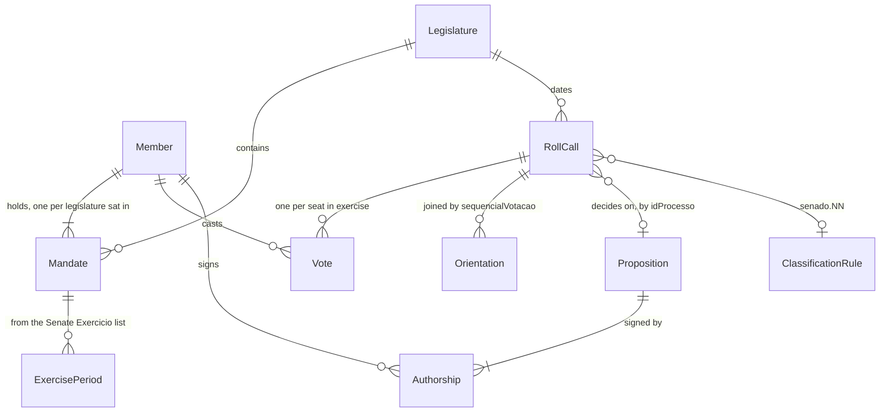

# etl-senado: Senate open data into contract v3

## Problem

The v2 covers the Senado (AD-014, v2 grilling decision 6, target 2027-02-01), but the ETL reads only the Câmara. `etl/src/mandato_etl/sources/` holds `camara.py` and `tse.py`. The approved contract-v3 plan fixes the shape a Senate directory must have (`data/v3/senado/`, its doors 1 to 7 and its S6 fixture), but nothing produces it. A visitor who looks up one of their three senators finds nothing. The Senate's 81 seats confirm ministers, ambassadors and judges and vote on every bill after the Câmara, and none of those votes has a record anywhere in the product.

The research (`research/07-fontes-senado.md`) shows the data exists, and in one place it is richer than the Câmara's: every Senate roll call carries one record per seat, with the official reason when a senator did not vote. In two places it is poorer. The government orientation exists for about 76% of open roll calls (134 of 176 in 2023-2026) and never for a secret one. Symbolic decisions exist only as free-text agenda results, not as roll-call records. The source gives no traffic or demand figure; the urgency is the date the maintainer set.

When this ships, `mandato-etl build --contract 3 --house senado` writes a validated `data/v3/senado/`. It holds every senator who sat in the legislature, every Senate plenary roll call with each seat's official entry and its house-independent position, a published Senate classification ruleset, and the contract's indicators. Each indicator is computed by the contract's rule and states what the Senate data cannot support.

## Flow

This reuses the HTTP policy, raw cache and manifest of `sources.camara` (`_get`, retry on 429/503 and, since this build, on a body cut short, `User-Agent`, `_entry`), the `readers` allowlist, and contract-v3's `classify`, `contract_v3` and `publish.write`. It does not write a second Senate-only assembler or validator.

1. `mandato-etl build --contract 3 --house senado [--years] [--refresh] [--out] [--quiet]` -> `cli` (exists) - accepts `senado` for `--house` under `--contract 3` only; `--out` defaults to `data/v3/senado`
2. `cli` -> `sources.senado` (new, no door - placement per conventions) - for every legislature from the 57th whose start is on or before the build date, it downloads `/votacao` and `/plenario/votacao/orientacaoBancada` per calendar year inside the legislature, plus `/senador/lista/legislatura/{n}?exercicio=S`, `/senador/lista/atual`, `/processo?codigoParlamentarAutor={id}&dataInicioApresentacao={start}` per senator and `/processo/{id}` for multi-author bills. Each is cached in `data/raw/` with one manifest entry in the existing shape
3. raw JSON -> `readers` (exists) - Senate field allowlist (door 1); personal fields never leave this hop
4. records -> `classify` (contract-v3 door 6) - applies the Senate ruleset version 1 (door 2) to each roll call and the Senate position maps (door 3) to each vote and orientation; stops on a value outside the map
5. `contract_v3` (contract-v3 door 1) - fed with Senate records keyed by door 4: deduplicated roll calls, mandates per legislature with exercise periods converted to the contract's half-open intervals, the government orientation joined by `sequencialVotacao`, authorship
6. out: `publish.write` (exists) validates against `etl/schema/v3/` and swaps `data/v3/senado/` atomically; the app importer reads it, and `data/out/` (v2) and `data/v3/camara/` are untouched

## Impact

| Front | What changes |
| --- | --- |
| domain | existing term: `house` gains its first `senado` records. The app importer (app-skeleton) branches on it for photo credit and profile URL; the v2 site never sees them |
| domain | existing term: `position` `notVoting` - for the Câmara it means an empty value; for the Senate it covers 8 official codes, from `P-NRV` (present, no vote) to `LS` (health leave). The reason survives only in `official` verbatim, so a consumer that wants to say why reads `official`, never `position` |
| domain | existing term: `participation` - same contract rule as the Câmara (contract AC 27), but on Senate data `presiding` (`Presidente (art. 51 RISF)`) and `secret` (`Votou`) count as participating, and every justified absence counts as `notVoting`, inside the total |
| domain | existing term: `governmentAlignment` - the Senate base is open roll calls with a `Governo` orientation of `yes` or `no`; secret roll calls never enter it because their position is `secret` |
| domain | existing term: `symbolicMerit` - the Senate publishes no symbolic roll-call record, so the value is not a count of zero events (open question 1) |
| stored data | nothing to migrate. `data/v3/senado/` is new and rebuilt from empty on each run. `data/raw/` gains Senate files under new names, and the manifest gains entries in its existing shape |
| dependency on another feature | needs contract-v3's `classify`, `contract_v3`, `etl/schema/v3/` and its `--house` flag merged first. Until then this feature has nothing to call and no schema to validate against |
| operations | about 140 list calls plus up to about 1,500 `/processo/{id}` calls per run with the raw cache empty, at 4 concurrent requests. This is an estimate from research section 6, not a measurement |

## Relations

One-way constraints: the same as contract-v3 (`Member`, `RollCall`, `Proposition` unique per (`house`, `id`); `Vote` unique per (`house`, roll call, member)). The Senate adds two. A `Mandate` exists for (senator, legislature) only when an `Exercicio` intersects that legislature or the senator has a vote record in it (AC 8). A `RollCall` id is the `codigoSessaoVotacao` of the record that survives deduplication (door 4). No columns and no types here.

## Surface

`None - nothing consumed over a route`. The consumed signature is contract-v3's file contract. This feature adds the `senado` value of `--house`, walked in `## Observable`, and the Senate rows of doors 2 to 4, which consumers read through `kindRule`, `official` and the ids.

## Landing

| One-way door | Literal shape | Alternative rejected |
| --- | --- | --- |
| 1. Senate field allowlist | `readers.ALLOWLIST` gains `senado-*` kinds. Kept: `CodigoParlamentar`, `NomeParlamentar`, `SiglaPartidoParlamentar`, `UfParlamentar`, mandate legislature numbers and dates, `DescricaoParticipacao`, `Exercicio` `DataInicio`/`DataFim`; roll-call fields `codigoSessaoVotacao`, `sequencialVotacao`, `codigoSessao`, `dataSessao`, `descricaoVotacao`, `idProcesso`, `codigoMateria`, `sigla`, `numero`, `ano`, `ementa`, `resultadoVotacao`, `votacaoSecreta`, `totalVotosSim`, `totalVotosNao`, `totalVotosAbstencao`; vote fields `codigoParlamentar`, `siglaPartidoParlamentar`, `siglaUFParlamentar`, `siglaVotoParlamentar`; orientation `sequencialVotacao`, `partido`, `voto`; process fields of research section 6 plus `autoriaIniciativa[].ordem`/`codigoParlamentar`. Never read: `NomeCompletoParlamentar`, `SexoParlamentar`, `sexoParlamentar`, `EmailParlamentar`, `Telefones`, `DataNascimento`, `Naturalidade`, `EnderecoParlamentar`, any key containing `cpf` | reading whole objects and deleting fields later: one forgotten path publishes an e-mail or a phone number. AD-003 and AGENTS.md allow only name, party, UF, photo and acts of office |
| 2. Senate classification ruleset version 1 | `classification-rules.json` rows `{id, house: "senado", kind, field: "descricaoVotacao", pattern, description}`, applied in order after contract-v3's normalisation: `senado.01` procedural `^\(?votacao nominal (?:do \|de )?(?:requerimento\|rqs)\b`; `senado.02` procedural `^(?:solicita\|requer)\b`; `senado.03` procedural `\bquestao de ordem\b`; `senado.04` amendment `\bdestacad[oa]s?\b`; `senado.05` final `\bemenda (?:n[oº] ?)?[\d.]+ ?\(substitutivo\)`; `senado.06` final `\b(?:mensagem\|oficio) n[oº]`; `senado.07` final `\b(?:projeto\|proposta de emenda\|pec\|plp\|pl\|pdl\|plv\|prs\|substitutivo\|medida provisoria\|mpv)\b`. A trial on the 423 records of 2023 to 2026-10-02 left none unclassified (research section 4) | rules on `sigla`/`identificacao`: the twin records attach a requirement vote to the main bill (`7045` carries `PL 2234/2022` for a vote on `RQS 857/2024`). Matching any `destaque`: "ressalvados os destaques" describes the main-text vote (`6831`), not the destaque |
| 3. Senate position maps | vote `official` = `siglaVotoParlamentar` verbatim. `position`: `Sim` -> `yes`, `Não` -> `no`, `Abstenção` -> `abstention`, `Votou` -> `secret`, `Presidente (art. 51 RISF)` -> `presiding`, and `P-NRV`, `AP`, `MIS`, `LS`, `LP`, `LAP`, `NCom`, `NA` -> `notVoting`. Orientation `official` = `voto` verbatim, `bench` = `partido` verbatim. `position`: `SIM` -> `yes`, `NÃO` -> `no`, `ABSTENÇÃO` -> `abstention`, `OBSTRUÇÃO` -> `obstruction`, `LIVRE` -> `free`; an entry with `voto: null` is not written. Any other value stops the build (contract AC 25) | an `other` position for unknown codes: contract-v3 rejected it because an indicator would silently change meaning. Masking `LS` in `official`: contract-v3 door 7 requires the verbatim value. That leaves the health-data concern of research section 8 to open question 2 |
| 4. Senate source identity | member `id` = `CodigoParlamentar`; roll-call `id` = `codigoSessaoVotacao` as decimal digits; proposition `id` = `idProcesso`. Twins: a record with `sequencialVotacao: null` is dropped when another record of the same `codigoSessao` has a non-null `sequencialVotacao` and the same set of (`codigoParlamentar`, `siglaVotoParlamentar`) pairs | `sequencialVotacao` as id: it is null on 10 of 423 records. `codigoMateria` as proposition id: the API calls it the legacy MATE code, and the new `/processo` service keys on `idProcesso`. Keeping both twins: one act of voting would count twice in every indicator |
| 5. Vote `nomeParlamentar` kept (added 2026-10-02 while deriving checks) | the Senate vote allowlist is door 1's four fields plus `nomeParlamentar`, the parliamentary name the Senate prints on every record | door 1's vote fields alone: AC 11 takes a member's `name` from the latest vote record, which then has no name to give, and the member would carry the list's `NomeParlamentar` from the legislature start. The value is the same public parliamentary name door 1 already keeps as `NomeParlamentar`, so nothing personal is added |
| 6. Where the Senate allowlist lives (added 2026-10-02 while deriving checks) | `readers.SENADO_ALLOWLIST = {"senado-votacao", "senado-orientacao", "senado-legislatura", "senado-atual", "senado-processos", "senado-processo"}`, each a nested map from kept key to `None` or to the map of the object under it, applied by `readers.read_senado(kind, path)`; `readers.ALLOWLIST` stays the CSV column table | the `senado-*` kinds inside `readers.ALLOWLIST`, as door 1's literal says: etl-camara's `test_readers_keep_only_allowlisted_columns` renders every kind of that table as a CSV with `COLUMNS[kind]`, so a JSON kind there fails an approved test this feature may not weaken; the field list of door 1 is unchanged |

- Nothing else in this change is hard to reverse

## Criteria

### S1: Download and snapshot (P1)

Every Senate source a build used is on disk, hashed and dated, or the build stops before computing.

**Acceptance Criteria**

1. WHEN `mandato-etl build --contract 3 --house senado` runs with an empty `data/raw/` THEN the system SHALL download, for each built legislature, `/dadosabertos/votacao` and `/dadosabertos/plenario/votacao/orientacaoBancada` for each calendar year in `--years` clamped to the legislature's dates, `/dadosabertos/senador/lista/legislatura/{n}?exercicio=S` and `/dadosabertos/senador/lista/atual`, and SHALL write one manifest entry per file with `file`, `sourceUrl`, `sha256`, `bytes` and `downloadedAt`
2. WHEN a Senate file is already in `data/raw/` and `--refresh` is absent THEN the system SHALL not issue an HTTP request for it
3. IF a Senate request fails after the existing retries (429 and 503 retried after 1, 2 and 4 s) THEN the system SHALL exit with code 2, print the failing URL on stderr, leave no `.part` file and leave `data/v3/senado/` as it was
4. WHEN fetching per-senator authorship or per-process details THEN the system SHALL run at most 4 requests concurrently
5. IF a Senate response carries a `Deprecation` or `Sunset` header THEN the system SHALL print on stderr a warning naming the URL and the `Sunset` date, and continue
6. IF a Senate response lacks its expected envelope (`/votacao` not a JSON list, a legislature list without `Parlamentares.Parlamentar`) THEN the system SHALL exit with code 1 naming the file
7. IF `--house senado` is given without `--contract 3` THEN the system SHALL exit 1, print the usage on stderr and write nothing

**Independent test:** two runs against a fake HTTP server; the second issues zero requests and every manifest hash matches its file.

### S2: Senators and mandates (P1)

The member set and the time each one held the seat come from the Senate's own lists.

**Acceptance Criteria**

8. The system SHALL write a mandate for (senator, legislature) for each `CodigoParlamentar` of `/senador/lista/legislatura/{n}?exercicio=S` that has an `Exercicio` intersecting the legislature's dates or a vote record in that legislature, and no mandate otherwise (19 of the 125 listed for the 57th have neither)
9. WHEN converting an `Exercicio` THEN the system SHALL write `start` = `DataInicio` at `T00:00:00` and `end` = the day after `DataFim` at `T00:00:00`, clipped to the legislature, and for an `Exercicio` without `DataFim` SHALL close it at the earlier of the build time and the next legislature's start, as contract AC 11 does
10. WHEN the Senate serializes a single `Mandato`, `Exercicio` or `Suplente` as an object instead of a list THEN the system SHALL read it as a one-item list
11. The system SHALL take a member's `name`, `party` and `uf` from the latest vote record overall, and each mandate's `party` and `uf` from the latest vote record inside its legislature. WHEN no vote record exists THEN it SHALL fall back to `NomeParlamentar`, `SiglaPartidoParlamentar` and the mandate's `UfParlamentar`
12. The system SHALL set `photoUrl` to `https://www.senado.leg.br/senadores/img/fotos-oficiais/senador{id}.jpg` and `sourceUrl` to `https://www25.senado.leg.br/web/senadores/senador/-/perfil/{id}`
13. The strings `cpf`, `NomeCompletoParlamentar`, `SexoParlamentar`, `EmailParlamentar`, `Telefones`, `DataNascimento`, `Naturalidade` and `EnderecoParlamentar`, in any case, SHALL not occur as keys in any file under `data/v3/senado/`, and the values of those fields in the fixture SHALL not occur anywhere in it

**Independent test:** a fixture with a holder who resigned in the 57th, the alternate who took the seat, and a senator whose only `Exercicio` ended in 2021 yields two members with 57th mandates, with periods ending at the day after `DataFim`, and no record for the third.

### S3: Roll calls, votes and classification (P1)

Every Senate plenary roll call of the legislature appears once, classified by a published rule, with each seat's official entry.

**Acceptance Criteria**

14. The system SHALL write one roll call per surviving `/votacao` record whose `dataSessao` falls inside a built legislature, after dropping twins by door 4
15. WHEN reading the 2025 records `7045` and `7046` THEN the system SHALL write roll call `"7046"` and no roll call `"7045"`
16. The system SHALL set `ballot` to `secret` when `votacaoSecreta` is `"S"` and to `nominal` when it is `"N"`, and SHALL write no `symbolic` Senate roll call
17. WHEN classifying the official examples `6755` and `7046` (procedural), `6921` (procedural), `6709` and `6757` (amendment), `6679` and `7017` (final, `senado.05`), `6748` and `7018` (final, `senado.06`), `6680` and `6704` (final, `senado.07`) THEN the system SHALL assign each the kind and rule id door 2 names
18. The system SHALL map every vote and orientation value by door 3, and IF a value is outside door 3 THEN SHALL exit 1 naming the value and the roll-call id, leaving `data/v3/senado/` unchanged
19. WHEN a roll call is open THEN the system SHALL write `tallies` by counting `Sim`, `Não` and `Abstenção` in its votes (`others` = `Abstenção`), and WHEN it is secret THEN SHALL take `totalVotosSim`, `totalVotosNao` and `totalVotosAbstencao`
20. WHEN the orientation feed has an entry with the roll call's `sequencialVotacao` THEN the system SHALL write its non-null orientations, and SHALL set `governmentOrientation` to the position of the bench `Governo`, or `null`. WHEN the roll call's `sequencialVotacao` is null THEN no orientation is written
21. The system SHALL set each roll call's `at` to `dataSessao` at `T00:00:00`, its `sourceUrl` to `https://legis.senado.leg.br/dadosabertos/votacao?codigoSessao={codigoSessao}`, its `openingDescription` to `descricaoVotacao` and its `lastPresentationDescription` to `null`
22. The system SHALL set each proposition's `sourceUrl` to `https://www25.senado.leg.br/web/atividade/materias/-/materia/{codigoMateria}`
23. WHEN a senator holds a vote record in a roll call outside all their exercise periods, or has none in a roll call inside one THEN the system SHALL print on stderr one line per legislature with the number of such mismatches

**Independent test:** the 2025 twin pair yields one roll call; a secret ballot yields `official: "Votou"`, `position: "secret"` and the official tallies; an `LAP` entry yields `notVoting`; an invented code `XYZ` stops the build.

### S4: Indicators per mandate (P1)

Every number follows contract AC 27 to 34 and is computed per mandate, with the Senate's own exceptions written down.

**Acceptance Criteria**

24. The system SHALL compute `participation`, `governmentAlignment` and `partyAlignment` on the `all` and `merit` bases exactly as contract AC 27 to 31 define them, over the Senate roll calls of the mandate's legislature
25. IF a vote's `party` is `S/Partido` THEN the system SHALL write `partyMajority: null` for it and leave that roll call out of the member's `partyAlignment` totals
26. WHEN a senator's fixture holds 3 `Sim`, 1 `Votou`, 1 `Presidente (art. 51 RISF)`, 1 `P-NRV` and 1 `LS` entry in roll calls inside one exercise period THEN the system SHALL write `participation.all` = `{count: 5, total: 7}`
27. The system SHALL count `authoredCount` and `firstSignerCount` over processes from `/processo?codigoParlamentarAutor={id}&dataInicioApresentacao={legislature start}` whose `identificacao` matches `^(PL|PLP|PEC|PDL|PRS) \d+/\d{4}$`, whose `autoria` starts with `Senador` or `Senadora`, and whose `dataApresentacao` falls inside the legislature
28. WHEN an authored process's `autoria` names one author THEN the system SHALL treat the senator as first signer, and WHEN it names more than one THEN the senator is first signer only if `/processo/{id}` lists them at `autoriaIniciativa` `ordem: 1`
29. The system SHALL count `requirementsCount` over the same query's processes whose `identificacao` starts with `RQS `, `REQ ` or `INS ` and whose `dataApresentacao` falls inside the legislature
30. The system SHALL write `symbolicMerit` as open question 1 settles, and SHALL not write `0` for it unless that answer chooses `0`

**Independent test:** a fixture with `PL 2434/2019 (Substitutivo-CD)` authored by "Câmara dos Deputados" and a 27-author PEC yields one authored PEC, no substitute, and `firstSignerCount` from the detail fixture.

### S5: Contract output (P1)

The Senate directory is a self-contained contract-v3 directory.

**Acceptance Criteria**

31. WHEN the build finishes THEN every file under `data/v3/senado/` SHALL validate against `etl/schema/v3/`, and `mandato-etl validate data/v3/senado` SHALL exit 0
32. IF any Senate document fails its schema THEN the system SHALL exit 1 naming the file and the first error, and SHALL leave the previous `data/v3/senado/` unchanged
33. WHEN writing `meta.json` THEN the system SHALL write `house: "senado"`, `classification.version: 1`, `legislatures` with `sourceUrl` `https://legis.senado.leg.br/dadosabertos/plenario/legislatura/{YYYYMMDD of the start}`, one `coverage` row per legislature, and every Senate file read in `sources`
34. WHEN two builds run on identical raw files and clock THEN the system SHALL produce byte-identical files under `data/v3/senado/`
35. WHEN the build finishes THEN the system SHALL print on stderr `senado <legislature>: <n> roll calls (<nominal> nominal, <secret> secret, 0 symbolic), <u> unclassified` per legislature, unless `--quiet` is given

**Independent test:** build the fixture cache twice and `diff -r` is empty; `mandato-etl validate data/v3/senado` exits 0; corrupt one field and the previous directory survives an exit 1.

## Out of scope

| Excluded | Why |
| --- | --- |
| Symbolic Senate decisions | they exist only as free text in agenda results (`/plenario/resultado/mes/{data}`); turning them into roll calls means interpreting prose, which contract-v3 forbids for classification |
| Joint sessions of the Congresso (vetoes, PLN) | contract-v3 excludes them; they belong with the Presidência's vetoes |
| Committee votes (`/votacaoComissao/*`) | they count in no indicator under contract-v3 |
| Titular or alternate seat and the reason an exercise ended | the research has both (`DescricaoParticipacao`, `SiglaCausaAfastamento`), but contract-v3 has no field for them; adding one bumps `schema_version` (open question 4) |
| Full texts of Senate propositions (contract-v3 door 8) | door 8 was added for the Câmara inputs of ai-summaries; the Senate's `urlDocumento` PDFs need their own extraction check (open question 3) |
| 2026 candidacy badge for senators | contract-v3 keeps `candidacy2026` in v2 only |
| Linking a senator to their earlier Câmara record | contract-v3 leaves cross-house identity out (AD-003 rules out CPF) |
| A daily `data/v3/senado/` build in CI | contract-v3 gives the scheduler to the deploy feature |

## Assumptions

| Assumption | Chosen default | Rationale | Confirmed? |
| --- | --- | --- | --- |
| Verification profile | `standard`, as `etl-camara` and contract-v3 | the indicators and the ruleset are what a senator can contest; `light` would not notice an unproven map member | y |
| `NA` (Dispositivo não citado) | `notVoting` with `official: "NA"` | meaning undocumented; 31 entries in 2023-2026, all where no vote was recorded | y |
| Roll call `at` | `dataSessao` at `T00:00:00` | `/votacao` publishes no time, and the exercise ranges are whole days; the orientation feed's time exists only for joined roll calls | y |
| Records with `sequencialVotacao: null` and no twin | kept, with no orientation | a join by date and tally matched 3 of 4 in 2023 but is not a key; it removes at most 4 roll calls from the government base | y |
| `requirementsCount` types | `RQS`, `REQ`, `INS` | closest to the Câmara's `REQ`, `RIC`, `INC`; `R.S` and `RQN` stay out until their meaning is checked | y |
| Roll-call source link | the API query by `codigoSessao` | it carries each senator's entry, which is the proof; the session's HTML page lists no votes per senator in a checkable form | y |
| `lastPresentationDescription` | `null` for the Senate | the Senate has no field like the Câmara's `ultimaApresentacaoProposicao_descricao` | y |
| Raw cache content | Senate responses kept verbatim in `data/raw/` (no CPF in any of them); personal fields are dropped at read (door 1) | the Câmara cache follows the same rule and keeps everything but the CPF; `data/raw/` is never published | y |
| First signer for multi-author bills | one `/processo/{id}` call each, cached | the list's text matched the ordered authors in 6 of 6 samples, but it carries names, not codes | y |

**Open questions:** none - resolved on 2026-10-02 by the orchestrator under the maintainer's delegation (`research/decisions-log.md`):

1. `symbolicMerit` and the symbolic coverage count are nullable in contract v3; `null` means the house publishes no symbolic records. The Senate writes `null` (AC 30), the Câmara keeps counts. Passed to the contract-v3 builder as a door 4 amendment.
2. Health and private-life absence codes are generalised: `LS`, `LP` and `LAP` are published as `official: "Licença"`, position `notVoting`; the verbatim code stays only in the unpublished raw cache (LGPD art. 5 II and 11). Contract-v3 door 7 is amended to allow a per-house sensitive map, recorded as AD-018. Door 3 of this plan follows that map, overriding the "verbatim" wording of its literal shape.
3. Full texts of Senate bills are out of this feature; AI summaries cover the Câmara first, and a later feature adds the Senate's texts.
4. Seat (titular or suplente) and the end reason of an exercise stay out of v3; a later contract version can add them if the profile needs them.

**Approval:** approved by the orchestrator under the maintainer's delegation on 2026-10-02, every assumption confirmed. Build starts after contract-v3 lands with both amendments.

## Observable

| Surface | Decision | Landing |
| --- | --- | --- |
| command `mandato-etl build --contract 3 --house senado` | output format and verbosity | AC 35 for the summary line, AC 5 and AC 23 for warnings; `--quiet` as in v2 |
| command `mandato-etl build --contract 3 --house senado` | every flag and its default | AC 7 (`senado` only with `--contract 3`); `--out` default `data/v3/senado` (Flow hop 1); `--years` and `--refresh` existing - same meaning as for the Câmara |
| command `mandato-etl build --contract 3 --house senado` | exit codes | AC 3 (2); AC 6, 7, 18, 32 (1) |
| command `mandato-etl build --contract 3 --house senado` | what it prints when it fails halfway | AC 3, 18, 32 - the URL, value or file on stderr, previous `data/v3/senado/` intact |
| command `mandato-etl validate data/v3/senado` | flags, exit codes | existing - contract-v3 AC 5 and 44; AC 31 here |
| document `classification-rules.json` (Senate rows) | structure, tone, depth, what the reader does next | door 2 for structure; contract-v3 AC 21 for the pt-BR description; the reader reruns a rule against `descricaoVotacao` at the roll call's `sourceUrl` |
| collection: Senate roll calls by `kind` | grouping, naming, ordering, duplicates, the exception | door 2 (rule order, first match), AC 14 and 15 (twins), contract-v3 AC 18 (`unclassified`) |
| collection: senators by legislature | grouping, duplicates, the exception | AC 8 (one mandate per legislature sat in; the 19 never-sat excluded), AC 10 (single-object lists) |
| `data/v3/senado/` as an import source | versioning, rate limits | existing - contract-v3 door 2; n/a for rate limits - static files on disk |

## Sources

- `research/07-fontes-senado.md` - every endpoint, field, vocabulary, count and rule trial this plan relies on, each marked verified or not
- `.worktrees/contract-v3/.specs/features/contract-v3/plan.md`, approved 2026-10-02 - doors 1 to 8 and AC 5, 11, 21, 25, 27 to 34 that this plan conforms to
- `.specs/STATE.md` AD-002 to AD-005 and AD-014 - versioned contract, no CPF, `{count, total}` with no "faltou", provenance, Senate in v2
