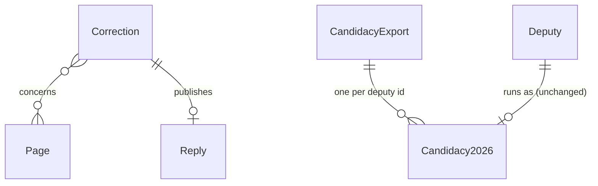

# launch: legal pages, correction channel, deploy and daily publication

## Problem

Today `main` builds a site nobody can visit. `site/dist/` exists only on the maintainer's machine, `SITE_URL` is the placeholder `https://mandatoaberto.org`, and every profile links to `/metodologia/#<indicator>`, a page that does not exist. The legal research (`research/01-pesquisa-juridica.md`, section 2.2) makes a launch before the first round defensible only under five conditions, and four of them are pages or channels the repository does not have: identified maintainers (Quem somos), a published method for every derived number (Metodologia e fontes), a working correction channel with deadlines (Reportar erro, Correções) and the footer sentence that the site neither supports nor opposes candidacies. Section 3.4 of the same research says a derived number without a public method "vira opinião disfarçada" and that a data error with no correction channel becomes "culpa grave". The 2026 candidacy badge, chosen as the launch hook (grilling decision 8), is `null` in every build the repository can run on its own: the TSE file is not in the repository and cannot be, because it carries the CPF of every candidate (AD-003).

Dates from the sources: today is 2026-09-27; the target go-live is 2026-10-02 (grilling decision 13, unconfirmed); the first round is 2026-10-04. Figures from the site handoff: 643 deputies, 1,597 roll calls, about 2,241 routes; `dist/` is 313 MB (cards 128 MB, profiles 111 MB, largest page 730 KB); the real build takes about 65 s and the ETL 40 s to 1.5 min with its cache; `data/raw/` is 536 MB and the photo cache holds 643 photos in 20 MB.

When this ships, the site is public at the `.org` domain, rebuilt every day from the official sources by GitHub Actions and deployed to a static host. Every page carries the legal footer with links to Metodologia e fontes, Quem somos, Dados e privacidade and Correções. Every profile and roll call carries a "Reportar erro" link to a form that opens the visitor's mail client, with no backend. The corrections page is generated from files versioned in the repository. An unknown URL shows the site's own 404 page. The candidacy badge reaches production from a CPF-free file. Analytics, when enabled, sets no cookie and no identifier.

Fit in the date: slices S1 to S6 and S8 are what the legal checklist requires for go-live and are built first; S7 (analytics) and S9 (headers, README, balancing test) can land in the same week after go-live without changing what a visitor reads. The inputs only the maintainer has (domain, names, e-mail, TSE file, Cloudflare secrets) gate go-live, not the build: everything is built with placeholders that the launch PR replaces. Sequence assumed: plan review 2026-09-28, checks and build 2026-09-29 to 09-30, verification and PR review 2026-10-01, domain, secrets and first publication 2026-10-02.

## Flow

Reuses the site's single data layer, `Base` layout and forbidden-terms scan, the ETL's TSE match and CLI, and the existing CI jobs; nothing here recomputes an indicator or reads the contract outside `data.ts`.

Pages:

1. `site/src/layouts/Base.astro` (exists) - the footer becomes the legal footer; the analytics beacon is rendered only when `CF_ANALYTICS_TOKEN` is set (door 5)
2. `site/src/pages/` (exists) - gains the routes of door 2: `metodologia`, `quem-somos`, `dados-e-privacidade`, `correcoes`, `reportar-erro`, `404`; the profile and roll-call pages gain the `Reportar erro` link
3. `corrections/*.md` (door 3) -> the `correcoes` page - read once per build, validated, rendered newest first
4. `site/src/lib/forbidden-terms.ts` (exists) - the scan also covers `.md` under `site/src/`
5. out: `site/dist/` with the new pages, `404.html`, `_headers` and `_redirects` (door 1)

Candidacy:

6. `mandato-etl build --tse-csv <csv> --export-candidacy <json>` (`cli` and `sources.tse` exist; flag from door 7) - matches as today and also writes `etl/inputs/candidacy-2026.json`
7. `mandato-etl build --candidacy-json etl/inputs/candidacy-2026.json` (door 7) -> `cli` (exists) reads the file in place of the match; `compute.assemble` (exists) is unchanged

Publication:

8. `.github/workflows/publish.yml` (door 6) - on schedule, on push to `main` and by hand: ETL from an empty `data/raw/` -> candidacy guard -> restore `site/.cache/photos/` -> `npm run build` with `SITE_URL` -> deploy `site/dist/` (door 1) -> save the photo cache
9. `.github/workflows/ci.yml` (exists) - jobs unchanged; the site job now builds the new pages and the `corrections/` fixture

## Impact

| Front | What changes |
| --- | --- |
| domain | new term: `correction` - one file in `corrections/` describing a reported error, its status and, when there is one, the parliamentarian's reply; rendered on `/correcoes/` (door 3) |
| domain | new term: `candidacy export` - `etl/inputs/candidacy-2026.json`, the CPF-free, per-deputy-id result of one local match against the TSE file; the only candidacy input CI sees (door 7) |
| domain | existing term: `meta.candidacy.file` named the TSE CSV; it now names whichever file the build read (`consulta_cand_2026_BRASIL.csv` locally, `candidacy-2026.json` in CI); nothing branches on the name, `mandato-etl build --tse-csv` keeps its behaviour |
| domain | existing term: `SITE_URL` - the placeholder default in `astro.config.mjs` becomes the real origin when the domain exists; `Base.astro` and `cards.ts` already read `Astro.site` and nothing else branches on it |
| copy | the current footer (`Fonte: dados abertos da Câmara dos Deputados...` and `Cada número mostra a sua base de cálculo...`) is replaced by the legal footer on every page; no site test pins the current footer (checked 2026-09-27: only the card's `Fonte:` line is pinned, and cards do not change) |
| stored data | nothing to migrate - `data/out/` is rebuilt by every run; the first `publish.yml` run seeds the photo cache from scratch (643 downloads, measured at 63 s for the whole build in the site handoff) |
| repository | `.gitignore` stops ignoring `etl/inputs/candidacy-2026.json` and keeps ignoring `etl/inputs/tse/`; `corrections/` and `research/03-teste-de-balanceamento-lgpd.md` are new; `README.md` loses "presença" and the Senate and Presidency promise |
| other features | `etl-camara`: `--tse-csv` and every approved check unchanged; two optional flags added (door 7). `site`: approved checks unchanged; the fixture build gains the new pages and a `corrections/` fixture |
| secrets | `CLOUDFLARE_API_TOKEN` and `CLOUDFLARE_ACCOUNT_ID` (repository secrets), `SITE_URL` and `CF_ANALYTICS_TOKEN` (repository variables) are read only by `publish.yml` |

## Relations

One-way constraints: a `Correction` is one file whose name starts with its `receivedAt` date, its `status` is one of four values, and it carries no field for the reporter's identity (door 3); a `Candidacy2026` in the export is keyed by the Câmara deputy id and carries only the four fields the contract already publishes (door 7). No columns and no types here.

## Surface

Only routes this adds. Public URLs are consumed outside the codebase the moment one is shared or linked from a reply.

| Route | In | Out | Status |
| --- | --- | --- | --- |
| `GET /metodologia/` | none | HTML with sections `#participacao`, `#alinhamento-governo`, `#alinhamento-partido`, `#proposicoes`, `#candidatura-2026`, `#fontes` | `200` |
| `GET /quem-somos/` | none | HTML | `200` |
| `GET /dados-e-privacidade/` | none | HTML | `200` |
| `GET /correcoes/` | none | HTML: the list, or the empty state | `200` |
| `GET /reportar-erro/` | optional query `p`: a site path | form HTML | `200` |
| `GET /<any path with no page>` | any | the content of `404.html` | `404` |
| `GET http://<domain>/*`, `GET https://www.<domain>/*` | any | redirect to `https://<domain>/*` | `301` |

## Landing

| One-way door | Literal shape | Alternative rejected |
| --- | --- | --- |
| Static host | Cloudflare Pages project `mandato-aberto`, deployed by direct upload from Actions: `cloudflare/wrangler-action@v4` with `command: pages deploy site/dist --project-name=mandato-aberto`, `apiToken: ${{ secrets.CLOUDFLARE_API_TOKEN }}`, `accountId: ${{ secrets.CLOUDFLARE_ACCOUNT_ID }}`; custom domains `<domain>` and `www.<domain>` on the project; `site/public/_redirects` holds `https://www.<domain>/* https://<domain>/:splat 301`; `site/public/_headers` holds the three headers of AC 58; `dist/404.html` is the not-found page the host serves. Limits read on 2026-09-27: 20,000 files per site, 25 MiB per file, 500 deploys a month on the free plan; this site has about 3,600 files, the largest 730 KB, and at most 31 scheduled deploys a month | GitHub Pages - a soft cap of 100 GB of bandwidth a month (read 2026-09-27) on a 313 MB site whose 200 KB share cards are the part meant to spread; no response headers, no redirect rules; analytics would need a third party the host does not already see |
| Public paths of the new pages | `/metodologia/`, `/quem-somos/`, `/dados-e-privacidade/`, `/correcoes/`, `/reportar-erro/`, `/404.html`; trailing slash as the rest of the site; the four methodology anchors exactly as the profile already links them | one `/sobre/` page with everything - the legal checklist names four documents and each must be linkable on its own from the footer and from the answer to a complaint; `/privacidade/` - the page also lists the sources and the fields, which the checklist puts together under one title |
| Correction record | `corrections/YYYY-MM-DD-<slug>.md` at the repository root; frontmatter `receivedAt` (`YYYY-MM-DD`), `pages` (list of site paths), `status` (`triage`, `corrected`, `reply-published` or `no-change`), `resolvedAt` (`YYYY-MM-DD`, optional), `action` (one line: what changed and the PR, optional); body: the summary of the report in Portuguese, then an optional `## Resposta` section with the parliamentarian's reply verbatim; no field for the reporter | one JSON log - a reply is prose and a JSON string diff is unreadable in review; GitHub issues as the record - editable by third parties, outside the git audit trail the AD-008 rationale names, no place for the verbatim reply |
| Error-report channel | `/reportar-erro/` composes `mailto:<CORRECTIONS_EMAIL>?subject=Erro em <path>&body=<the four fields, one per line>` on the client; without JavaScript the page shows the address as a `mailto:` link and the four items to include; the site sends nothing to any server | a form service such as Formspree - a third party receiving the reporter's e-mail, which the privacy page would have to name as an operator; a Pages Function - a runtime backend, against AD-001 |
| Analytics | Cloudflare Web Analytics by the beacon `` in `Base.astro`, rendered only when `CF_ANALYTICS_TOKEN` is set at build; the token is a repository variable; the dashboard's automatic injection stays off | the host's one-click injection - invisible to the repository and to the build test that proves no other script loads; Google Analytics - cookies and a client identifier; Plausible or GoatCounter - a second third party on every visit where the host already sees the request |
| Daily publication | `.github/workflows/publish.yml`: `on: schedule: [{cron: "0 9 * * *"}], push: {branches: [main]}, workflow_dispatch:`; `concurrency: {group: publish, cancel-in-progress: false}`; one job: checkout, `astral-sh/setup-uv`, `actions/setup-node` (Node 24), `uv run mandato-etl build` from an empty `data/raw/` (with `--candidacy-json etl/inputs/candidacy-2026.json` when the file exists), the candidacy guard, `actions/cache/restore` and `actions/cache/save` on `site/.cache/photos/` with key `photos-${{ github.run_id }}` and `restore-keys: photos-`, `npm ci`, `npm run build` with `SITE_URL=${{ vars.SITE_URL }}`, then the deploy of door 1 | caching `data/raw/` between runs - the ETL never re-downloads a file it holds unless `--refresh` re-downloads all of them, so the current year's roll calls would freeze at the first run; a deploy from the maintainer's machine - a daily job cannot depend on a laptop |
| Candidacy input for CI | `mandato-etl build --tse-csv <csv> --export-candidacy <json>` writes `{"source": {"file", "sha256", "bytes", "modifiedAt"}, "matched": {"<deputyId>": {"office", "party", "ballotNumber", "situation"}}, "ambiguous": [<deputyId>]}` with sorted keys; `mandato-etl build --candidacy-json <json>` reads it in place of the match; `--tse-csv` and `--candidacy-json` are mutually exclusive; `etl/inputs/candidacy-2026.json` is committed while `etl/inputs/tse/` stays ignored | committing the TSE CSV - CPF of every candidate in a public repository (AD-003); a column-stripped copy of the CSV - civil name and birth date of about 30,000 candidates who are not deputies, which the site has no purpose for; the file in an Actions cache only - evicted after 7 days without use and impossible to reproduce from git |
| `_redirects` follows `SITE_URL` (found while building, 2026-09-27) | `dist/_redirects` is written at the end of `astro build` by an integration in `site/astro.config.mjs` from the configured `site`: one line `https://www.<host>/* https://<host>/:splat 301`; `_headers` has no domain in it and stays a static `site/public/_headers` | a static `site/public/_redirects` as door 1 first read - it names the domain, so it needs a hand edit when question 1 is answered and cannot match the fixture origin that C46 reads |

- Nothing else in this change is hard to reverse

## Criteria

`<domain>` and `<CORRECTIONS_EMAIL>` stand for the values of open questions 1 and 2. Every copy string is in Portuguese and contains no term of `site/src/lib/forbidden-terms.ts`.

### S1: Legal footer, 404 page and copy scan (P1)

Every page says what the site is not, credits its sources, and leads to the four legal pages.

**Acceptance Criteria**

1. The system SHALL render on every page a footer containing, verbatim, `Este site não apoia nem se opõe a candidaturas, partidos ou federações. Todos os dados provêm de fontes oficiais indicadas em cada página. Não recebe recursos de partidos, candidatos ou campanhas.`
2. The footer SHALL contain `Dados: Câmara dos Deputados e TSE (dados abertos). Fotos: Câmara dos Deputados.` with `Câmara dos Deputados` linked to `https://dadosabertos.camara.leg.br/` and `TSE` linked to `https://dadosabertos.tse.jus.br/`
3. The footer SHALL link to `/metodologia/`, `/quem-somos/`, `/dados-e-privacidade/`, `/correcoes/`, `/reportar-erro/` and `https://github.com/augusto-dmh/mandato-aberto` with the texts `Metodologia e fontes`, `Quem somos`, `Dados e privacidade`, `Correções`, `Reportar erro` and `Código-fonte`
4. WHEN `npm run build` runs THEN the system SHALL write `dist/404.html` containing the title `Página não encontrada`, the sentence `O endereço pode ter sido digitado errado ou a página pode ter deixado de existir.`, a link to `/` with the text `Voltar à busca de deputados`, and the footer
5. WHEN a path with no page is requested at the host THEN the host SHALL respond with status `404` and the content of `dist/404.html`
6. The forbidden-terms scan SHALL cover `.md` files under `site/src/` in addition to `.astro`, `.vue` and `.ts`, and SHALL find no term in any of them

**Independent test:** build the fixture, read the footer sentence and the six links on the home, a profile, a roll call and `404.html`; after go-live, `curl -i https://<domain>/nada/` returns `404` with `Página não encontrada`.

### S2: Reportar erro (P1)

A visitor who spots an error reaches the maintainers in two clicks, and nothing is sent anywhere by the site itself.

**Acceptance Criteria**

7. WHEN `/deputados/{id}/` or `/votacoes/{id}/` renders THEN the page SHALL contain a link with the text `Reportar erro nesta página` to `/reportar-erro/?p=/deputados/{id}/` or `/reportar-erro/?p=/votacoes/{id}/` respectively
8. WHEN `/reportar-erro/` renders THEN the system SHALL show a form with the fields `Página com o erro` (single line), `O que está errado` (multi-line), `Onde está o dado correto (link para a fonte oficial, se tiver)` (single line, optional) and `Seu e-mail, se quiser resposta` (single line, optional), and a submit control with the text `Enviar por e-mail`
9. WHEN the visitor submits the form THEN the system SHALL open `mailto:<CORRECTIONS_EMAIL>` with the subject `Erro em <Página com o erro>` and a body carrying the four fields, each on its own line prefixed by its label, and SHALL issue no HTTP request
10. WHEN the page loads with a query `p` whose value matches `^/[A-Za-z0-9/_-]{1,200}$` THEN the system SHALL prefill `Página com o erro` with that value
11. IF the query `p` is absent or its value does not match `^/[A-Za-z0-9/_-]{1,200}$` THEN the system SHALL leave `Página com o erro` empty
12. WHILE JavaScript is unavailable the page SHALL show `<CORRECTIONS_EMAIL>` as a `mailto:` link and the sentence `Sem JavaScript, escreva para o endereço acima com os quatro itens do formulário.`
13. The page SHALL state `Toda mensagem recebe triagem em até 48 horas. A correção, ou a resposta do parlamentar, é publicada em até 7 dias na página Correções.` with `Correções` linked to `/correcoes/`

**Independent test:** open a built profile, follow `Reportar erro nesta página`, see the path prefilled, fill the other fields and submit: the mail client opens with the subject and the four lines; the network panel shows no request.

### S3: Metodologia e fontes (P1)

Every number on a profile leads to a method a reader can reproduce by hand from the official files.

**Acceptance Criteria**

14. WHEN `/metodologia/` renders THEN the system SHALL contain sections with the ids `participacao`, `alinhamento-governo`, `alinhamento-partido`, `proposicoes`, `candidatura-2026` and `fontes`, in that order, each opened by an `<h2>`
15. The `participacao` section SHALL state that the count is the plenary nominal roll calls in which the deputy has a record with any value (`Sim`, `Não`, `Abstenção`, `Obstrução`, `Artigo 17`, or a record in a secret ballot), that the base is the plenary nominal roll calls held while the deputy was in exercise according to the Câmara's status history (periods with status `Exercício`; licences and every other status excluded), that committee roll calls are excluded, and that the open data gives no reason for a missing record, so the site states none
16. The `alinhamento-governo` section SHALL state that only votes `Sim`, `Não`, `Abstenção` or `Obstrução` count, only in roll calls where the `GOVERNO` bench orientation is one of those four values, and that `Liberado`, a missing orientation, `Artigo 17` and secret ballots leave the roll call out of both count and base
17. The `alinhamento-partido` section SHALL state that the party is the one recorded at the vote, that the majority is computed among the other deputies of that party in the same roll call over the same four values with the deputy's own vote excluded, and that a tie or no other member leaves the roll call out of both count and base
18. The `proposicoes` section SHALL state that `PL`, `PLP`, `PEC`, `PDL` and `PRC` presented from `01/02/2023` with the deputy as proponent are counted, that `primeiro signatário` means first in the signature order, and that `REQ`, `RIC` and `INC` are counted separately as requerimentos
19. The `candidatura-2026` section SHALL state that the source is the TSE dataset `candidatos-2026` at `https://dadosabertos.tse.jus.br/dataset/candidatos-2026`, that the match uses civil name, birth date and UF, that CPF is never read, that a deputy matched by more than one candidacy shows no badge, and that the situation shown is the one in the TSE file at its last manual update, recorded in the repository history
20. The `fontes` section SHALL link to the six yearly bulk files (`votacoes`, `votacoesVotos`, `votacoesOrientacoes`, `votacoesProposicoes`, `proposicoes`, `proposicoesAutores`) under `https://dadosabertos.camara.leg.br/arquivos/`, to `deputados.csv`, to the API endpoints `/deputados` and `/deputados/{id}/historico` under `https://dadosabertos.camara.leg.br/api/v2/`, and to the TSE dataset, and SHALL state the legislature start `01/02/2023`, that the data is rebuilt every day and that every page shows its collection date
21. The page SHALL state that in a secret ballot the Câmara records who voted and not the vote, and that the totals shown for it are the Câmara's official totals
22. The page SHALL state that the site lists every deputy with at least one vote record in the 57th legislature, suplentes and deputies out of exercise included, and that `Em exercício` means the deputy is in the Câmara's current list of deputies
23. The page SHALL state that photos are the Câmara's official photos, served unaltered and credited `Foto: Câmara dos Deputados`

**Independent test:** open the built page from a profile's `Como este número é calculado` link, land on the matching section, and recompute one fixture deputy's `4 de 5` participation by hand from the rules stated.

### S4: Quem somos and Dados e privacidade (P1)

The people behind the site are named, and a visitor or a deputy can read what is processed, why, under which basis, and where to write.

**Acceptance Criteria**

24. WHEN `/quem-somos/` renders THEN the system SHALL show each maintainer's full name and city, the contact e-mail as a `mailto:` link, and the sentences `O Mandato Aberto é mantido por pessoas físicas, sem vínculo com partidos, candidatos, federações ou campanhas.` and `Não recebe dinheiro nem qualquer vantagem de partidos, candidatos, campanhas ou empresas, e não paga impulsionamento de conteúdo.`
25. The `quem-somos` page SHALL state that the code is public at `https://github.com/augusto-dmh/mandato-aberto` and that the site is rebuilt every day from the sources listed in Metodologia e fontes, with a link to `/metodologia/#fontes`
26. WHEN `/dados-e-privacidade/` renders THEN the system SHALL list the fields processed per deputy (nome parlamentar, partido, UF, foto oficial, períodos em exercício, votos em votações nominais, proposições de autoria and, for 2026 candidates, cargo, partido, número e situação no TSE) and SHALL state that civil name and birth date from the Câmara are read only to match the TSE registry and are never shown
27. The `dados-e-privacidade` page SHALL state the purpose `dar acesso público aos atos do mandato de cada deputado federal`, the legal basis `art. 7º, IX e §3º da Lei 13.709/2018 (LGPD)` together with `art. 8º da Lei 12.527/2011 (LAI)`, SHALL name the controllers as the maintainers of Quem somos with a link to `/quem-somos/`, and SHALL give `<CORRECTIONS_EMAIL>` as the channel for the rights of `art. 18 da LGPD`
28. The `dados-e-privacidade` page SHALL state that no CPF, telephone, address, e-mail, race, religion or any other field of the sources is processed, and that the error form sends nothing until the visitor sends the e-mail from their own mail client
29. The `dados-e-privacidade` page SHALL state that the site sets no cookie and stores nothing in the visitor's browser, that visit counts come from Cloudflare Web Analytics without cookies and without an individual identifier, and that the host (Cloudflare) processes requests under its own policy, with a link to `https://www.cloudflare.com/privacypolicy/`
30. The `dados-e-privacidade` page SHALL link to `https://github.com/augusto-dmh/mandato-aberto/blob/main/research/03-teste-de-balanceamento-lgpd.md` with the text `teste de balanceamento`

**Independent test:** read both built pages end to end; every sentence above is present and no name, e-mail or address other than the maintainers' appears.

### S5: Correções (P1)

Every reported error and every reply is public, in order, from files anyone can audit in git.

**Acceptance Criteria**

31. WHEN `npm run build` runs THEN `/correcoes/` SHALL list every file in `corrections/`, newest `receivedAt` first, each entry showing the date as `DD/MM/AAAA`, each path of `pages` as a link, the status as `Em análise`, `Corrigido`, `Resposta publicada` or `Sem alteração`, the body, and `resolvedAt` (as `DD/MM/AAAA`) and `action` when present
32. WHERE a record has a `## Resposta` section the page SHALL render its content verbatim under the heading `Resposta do parlamentar`
33. IF `corrections/` holds no record THEN the page SHALL show `Nenhuma correção registrada até DD/MM/AAAA.` with the collection date
34. IF a record lacks `receivedAt`, `pages` or `status`, or its `status` is outside the four values, or its file name does not start with its `receivedAt` THEN the build SHALL exit non-zero naming the file
35. The page SHALL state that anyone can report an error by the form at `/reportar-erro/` or by `<CORRECTIONS_EMAIL>`, that every message is triaged within 48 hours, and that a confirmed error is corrected, and a parliamentarian's reply published on this page with the same prominence as the contested data, within 7 days

**Independent test:** build the fixture with two records (one with a reply) and read them newest first; build with an empty `corrections/` and read the empty state; add a record with `status: fixed` and see the build fail naming it.

### S6: Deploy, domain and daily publication (P1)

The site is rebuilt from the official sources every day and a failed run changes nothing visitors see.

**Acceptance Criteria**

36. WHEN `publish.yml` runs on the daily schedule, on a push to `main` or by hand THEN the system SHALL run the ETL from an empty `data/raw/`, restore the photo cache, build the site with `SITE_URL` from the repository variable and deploy `site/dist/` to the Cloudflare Pages project, in that order
37. WHERE `etl/inputs/candidacy-2026.json` exists the ETL step SHALL pass `--candidacy-json etl/inputs/candidacy-2026.json`
38. IF `etl/inputs/candidacy-2026.json` exists and `meta.candidacy.matched` in the built `data/out/meta.json` is `0` THEN the workflow SHALL fail before building the site
39. IF the repository variable `SITE_URL` is empty THEN the workflow SHALL fail before building the site
40. IF any step exits non-zero THEN the workflow SHALL run no later step, deploy nothing and leave the previous deployment live
41. WHILE a `publish` run is in progress a second run SHALL wait for it instead of running concurrently or cancelling it
42. WHEN a run finishes the site build THEN it SHALL save `site/.cache/photos/` to the Actions cache under a key the next run restores
43. WHEN `http://<domain>/deputados/` or `https://www.<domain>/deputados/` is requested THEN the host SHALL respond `301` to `https://<domain>/deputados/`
44. WHEN `whois <domain>` runs THEN its output SHALL show no maintainer name, e-mail, telephone or postal address

**Independent test:** trigger `publish.yml` by hand with the secrets set; the run finishes green, `https://<domain>/` serves the home with the day's collection date, and a profile's `og:image` resolves at the same origin.

### S7: Analytics without cookies (P2)

Visit counts exist without a cookie, an identifier or a second third party.

**Acceptance Criteria**

45. WHERE `CF_ANALYTICS_TOKEN` is set at build time every page SHALL contain exactly one `` and no other `<script src>` from an origin other than the site's own
46. IF `CF_ANALYTICS_TOKEN` is unset THEN no page SHALL contain a `<script src>` from an origin other than the site's own
47. The site's own scripts SHALL contain no `document.cookie`, `localStorage` or `sessionStorage`
48. WHEN any page is requested at the host THEN the response SHALL carry no `Set-Cookie` header

**Independent test:** build with the variable set and without it, grep `dist/` for `<script src`; after go-live, open the home with the browser's storage panel empty and see it stay empty.

### S8: Candidacy input for the daily build (P1)

The badge reaches production from a file that contains nothing but what the site already shows.

**Acceptance Criteria**

49. WHEN `mandato-etl build --tse-csv <csv> --export-candidacy <json>` runs THEN the system SHALL match as today and write `<json>` with `source` (`file`, `sha256`, `bytes` and `modifiedAt` of the CSV), `matched` keyed by deputy id with `office`, `party`, `ballotNumber` and `situation`, and `ambiguous`, with sorted keys and no other key at any depth
50. WHEN `mandato-etl build --candidacy-json <json>` runs THEN the system SHALL set `candidacy2026` of each deputy from `matched[<id>]` or `null`, list `ambiguous` in `meta.candidacy.ambiguous`, set `meta.candidacy.file` to the JSON file name and `meta.candidacy.matched` to the number of matched ids present in the deputy set, and SHALL read no TSE CSV
51. IF `--tse-csv` and `--candidacy-json` are both given, or `--export-candidacy` is given without `--tse-csv` THEN the system SHALL exit `1` and print the usage on stderr
52. IF `--candidacy-json` names a file that does not exist, does not parse as JSON, has a `matched` entry lacking one of the four fields, or contains a key named `cpf` in any case at any depth THEN the system SHALL exit `1` and print the file name on stderr
53. The repository SHALL ignore `etl/inputs/tse/` and SHALL not ignore `etl/inputs/candidacy-2026.json`

**Independent test:** run the build on the test legislature with the 4-row TSE fixture and `--export-candidacy`, read two matched ids and one ambiguous id in the JSON; run again with `--candidacy-json` on that file and `diff -r` the two `data/out/` directories apart from `meta.candidacy.file`.

### S9: Around the launch (P2)

What the checklist asks for beyond the pages.

**Acceptance Criteria**

54. The repository SHALL contain `research/03-teste-de-balanceamento-lgpd.md`, in Portuguese, dated, naming the controllers, with the headings `Finalidade`, `Necessidade`, `Balanceamento` and `Salvaguardas`
55. The root `README.md` SHALL describe the four indicators with the labels of `site/src/lib/indicators.ts` and `Proposições de autoria`, SHALL name only the Câmara dos Deputados for the current version with Senado and Presidência as future increments, and SHALL contain no term of `site/src/lib/forbidden-terms.ts`
56. The root `README.md` SHALL document `publish.yml`, the two candidacy flags and the four repository secrets and variables of `Impact`
57. WHEN `npm run build` runs THEN `dist/_headers` and `dist/_redirects` SHALL exist with the content of door 1
58. WHEN any page is requested at the host THEN the response SHALL carry `X-Content-Type-Options: nosniff`, `Referrer-Policy: strict-origin-when-cross-origin` and `X-Frame-Options: SAMEORIGIN`

**Independent test:** `curl -sI https://<domain>/` shows the three headers; the README reads without the word the scan forbids.

## Out of scope

Product capabilities only. Process and harness rules live in AGENTS.md or as Observable `n/a`.

| Excluded | Why |
| --- | --- |
| Sitemap and search-engine submission | sharing is by URL (grilling decision 2); a dependency door for after launch |
| A backend or a stored copy of error reports | grilling decision 7, AD-001 |
| Comments, polls, a newsletter | AD-009 |
| A donations page or policy | AD-007: no donations until 2026-10-26, so the checklist item "Política de doações, se houver" does not apply |
| A legal entity, a `.com.br` domain | grilling decision 6, research section 2.1 |
| `Content-Security-Policy` | Astro's inline scripts and styles need nonces or hashes; after launch |
| A per-year refresh of the ETL cache | the daily job downloads everything (door 6); an optimisation for after launch |
| Automatic refresh of the TSE situation | the TSE portal blocks automated access; the export is regenerated by hand |
| Mail hosting or forwarding for the dedicated address | the maintainer's operation, outside the repository |
| Preview deployments per pull request | CI already builds the fixture; a preview needs the secrets on pull requests |
| Senate or Presidency credits in the footer | AD-006 |
| Telling two roll calls on the same proposition apart in the profile list | site handoff item 5; after launch |

## Assumptions

Defaults that are not already a numbered criterion.

| Assumption | Chosen default | Rationale | Confirmed? |
| --- | --- | --- | --- |
| Static host | Cloudflare Pages (door 1) | the grilling premise "Hospedagem" and the limits read on 2026-09-27 | y (2026-09-27) |
| Daily build time | `0 9 * * *` UTC (06:00 in Brasília) | the Câmara regenerates the bulk files overnight (prototype practice); a failure shows up at the start of the maintainer's day | n |
| Candidacy in CI | the export of door 7 | AD-003; nothing but what the site shows enters git | y (2026-09-27) |
| The full TSE CSV on the maintainer's disk | kept only in `etl/inputs/tse/` (ignored) while the export is produced, then deleted; `source.sha256` in the export proves which file it came from | the raw-cache redaction door treats a local cache holding CPF as persisting it; the same rule applies here | n |
| E-mail addresses | one dedicated address, `<CORRECTIONS_EMAIL>`, serves contact and corrections unless the maintainer supplies two | grilling decision 7 names one dedicated e-mail; two addresses double the triage | n |
| Site identity values | maintainers' names and city, the e-mail and the repository URL live in one module under `site/src/lib/`, filled in the launch PR; until then they read `[a definir]` and the go-live checks cannot pass | one place to change | n |
| Copy authorship | the builder drafts the copy of the six pages from the research and the indicator definitions; the maintainer reviews every sentence before merge and the PR's "Assistência de IA" section says so; no page describes a deputy | AD-009 covers content about candidates; page copy is the project's own text | n |
| Long-form pages | Markdown under `site/src/pages/` with the `Base` layout for Metodologia, Quem somos and Dados e privacidade; `.astro` for Reportar erro, Correções and 404 | listed only because it is why the scan gains `.md` (AC 6) | n |
| Analytics at go-live | enabled, with the token set as a repository variable once the Pages project exists; AC 29's copy assumes it | the maintainer wants to see whether the site spreads; door 5 | n |
| `www` | attached to the Pages project and redirected to the apex | one canonical origin for `og:url` and the canonical link | n |
| ETL `User-Agent` contact | stays the repository URL | the repository links to Quem somos; a domain-based URL would tie the ETL to the domain | n |
| Corrections and the forbidden-terms scan | records in `corrections/` are not scanned | the maintainer writes and reviews each record; a reply is quoted verbatim and may use any word | n |
| Duplicate reports | a second report of the same error updates the existing record instead of adding one (maintainer practice, not enforced) | one entry per error keeps the page readable | n |
| Public changelog | `/correcoes/` is the public changelog the checklist asks for; code changes stay in git history | the checklist ties the changelog to corrections | n |
| Priority under the date | if go-live slips, S7 and S9 follow within the same week; nothing in S1 to S6 and S8 is cut | research section 5, "Páginas obrigatórias" and "Produto" | n |
| Verification profile | `light` | project default; the ETL change touches no indicator | n |
| Balancing test | `research/03-teste-de-balanceamento-lgpd.md`, one to two pages, structured per the ANPD legitimate-interest guide as the research reads it | research section 3.1 | n |

**Open questions:**

| # | Kind | Question | Until answered |
| --- | --- | --- | --- |
| 1 | blocks go-live | The `.org` domain name, registered with WHOIS privacy | `SITE_URL` stays a placeholder; AC 43 and 44 cannot run |
| 2 | blocks go-live | Full names and city of the maintainers, the contact e-mail, and the dedicated corrections address | AC 9, 12, 24, 27 and 35 render `[a definir]` |
| 3 | blocks go-live | `consulta_cand_2026_BRASIL.csv` downloaded by hand, its licence field captured (research section 6, item 1), and confirmation of door 7 with the deletion default above | the export does not exist; `publish.yml` runs without the badge |
| 4 | blocks go-live | A Cloudflare account, the Pages project `mandato-aberto`, `CLOUDFLARE_API_TOKEN` and `CLOUDFLARE_ACCOUNT_ID` as repository secrets, `SITE_URL` as a repository variable | AC 36 cannot run |
| 5 | open | Confirmations in a browser: research section 6 items 2 to 5 and 7, and that Cloudflare Web Analytics sets no cookie and no identifier (the docs pages read on 2026-09-27 did not state it in so many words) | AC 29 stands as written; if the claim fails, the token stays unset and AC 46 holds |
| 6 | open | The launch date 2026-10-02 (grilling decision 13) | the sequence in Problem assumes it |
| 7 | open | A lawyer with electoral or free-speech practice identified beforehand (research section 5, "Operação") | nothing in the repository depends on it |

## Observable

Worksheet, not the review. `n/a` needs its reason.

| Surface | Decision | Landing |
| --- | --- | --- |
| screen `/metodologia/`, `/quem-somos/`, `/dados-e-privacidade/` | empty, loading, error, unauthorised states | n/a - static copy pages with no data at view time, public |
| screen `/metodologia/` | density and ordering | AC 14 - six sections in a fixed order |
| screen `/quem-somos/`, `/dados-e-privacidade/` | density and ordering | AC 24 to 30 - one page each, no list |
| screen `/correcoes/` | empty state | AC 33 |
| screen `/correcoes/` | loading, error, unauthorised states | n/a - static and public; a malformed record fails the build (AC 34) |
| screen `/correcoes/` | density and ordering | AC 31 |
| screen `/reportar-erro/` | empty state | AC 11 - no or invalid `p` |
| screen `/reportar-erro/` | loading state | AC 12 - the page works without JavaScript |
| screen `/reportar-erro/` | error state | n/a - the site sends nothing; a mail client that does not open is outside the page, and the address is visible (AC 12) |
| screen `/reportar-erro/` | unauthorised state | n/a - public |
| screen `/reportar-erro/` | destructive action confirms | n/a - no destructive action |
| screen 404 | every state | AC 4, AC 5 |
| all screens | footer | AC 1 to 3 |
| document footer | structure, tone, what the reader does next | AC 1 to 3 - one descriptive sentence, the credits, six links |
| document methodology copy | structure, tone, depth, what next | AC 14 to 23 - one section per number, each reproducible by hand from the files in `#fontes`; the reader follows a source link or `Reportar erro` |
| document Quem somos and privacy copy | structure, tone, depth | AC 24 to 30 - descriptive, no adjective, one e-mail |
| document correction record | structure | door 3 |
| document `README.md` | structure, what next | AC 55, AC 56 |
| document balancing test | structure | AC 54 |
| command `mandato-etl build` | output format and verbosity | existing ETL log; AC 49 for the export |
| command `mandato-etl build` | every flag and its default | AC 49, AC 50 - both new flags optional, off by default |
| command `mandato-etl build` | exit codes, what it prints when it fails halfway | AC 51, AC 52 - `1` with the usage or the file name; etl-camara AC 30 keeps `--out` intact |
| scheduled task `publish.yml` | output format and verbosity | existing - the ETL log and the Actions log; GitHub e-mails the repository owner when a scheduled run fails |
| scheduled task `publish.yml` | every flag and its default | AC 36, AC 37, AC 39 - `workflow_dispatch` takes no input |
| scheduled task `publish.yml` | exit codes, what happens when it fails halfway | AC 38, AC 40, AC 41 |
| collection `corrections/` | grouping criterion and naming | door 3 - one file per reported error, named by date and slug |
| collection `corrections/` | ordering | AC 31 |
| collection `corrections/` | duplicates | assumption "Duplicate reports" |
| collection `corrections/` | the exception that does not fit | AC 32 - a reply; AC 34 - a malformed record |
| API | n/a - no route takes input beyond the `p` query (AC 10, AC 11) |
| all new `GET` routes | versioning, rate limits | n/a - static files behind the host's own limits |

## Sources

- `research/01-pesquisa-juridica.md` sections 2.3, 5 and 6 - the pages, the footer sentence, the deadlines, what to confirm before publishing
- `research/02-grilling-escopo-mvp.md` decisions 6, 7, 8, 12, 13 and the premises "Hospedagem", "Analytics", "Atualização", "Fotos" - domain, correction channel, candidacy, daily build
- `.specs/features/site/plan.md` "Out of scope" and the assumptions `SITE_URL` and "Methodology links" - what the site left here and the anchors it fixed
- `.specs/features/etl-camara/plan.md` AC 17 to 27 and `.specs/features/secret-ballots/plan.md` AC 1 to 4 - the indicator definitions the methodology page states
- `.specs/STATE.md` AD-001, AD-003, AD-005, AD-007, AD-008, AD-009
- Cloudflare Pages limits and direct-upload docs, GitHub Pages limits, read 2026-09-27 - the figures in door 1
