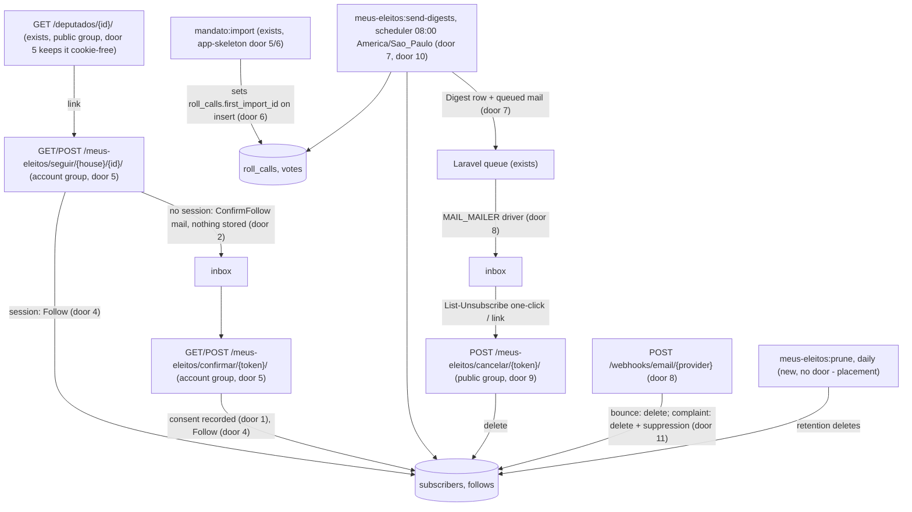
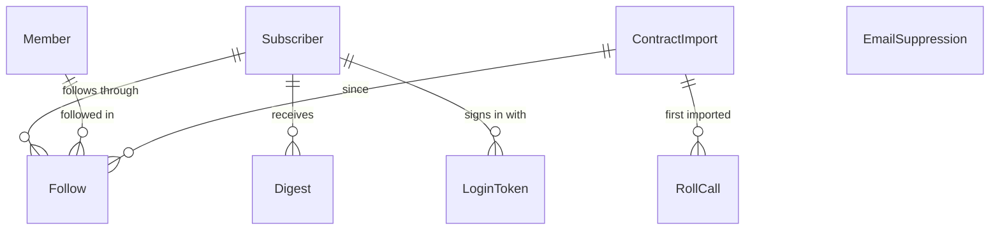

# Meus eleitos: follow parliamentarians and receive their votes by e-mail

## Problem

A voter who wants to know how the people they elected vote has to come back to the site, find
each profile and compare it with what they saw last time. Nothing tells them that a new nominal
roll call happened. The only Brazilian tools that do tell them are the Câmara's app, which covers
only the Câmara, and Placar Político, which wraps the record in a 1-to-99 score
(`research/06-pesquisa-design-e-concorrentes.md`, positioning move 6). TheyWorkForYou, GovTrack
and Parltrack show the demand abroad: e-mail alerts were GovTrack's original feature in 2004
(`research/design-anexos/a3-pares-internacionais.md`). The v2 grilling made "contas, meus eleitos e
alertas" delivery 2 (`research/05-grilling-escopo-v2.md`, decision 5). The source gives no
figure on demand; the cost is that the record exists and nobody is told when it grows.

What makes this different from every earlier feature: it is the first time the project stores
data about a visitor, and the data is political. A list of the parliamentarians someone follows
can reveal their political opinion, which LGPD art. 5 II classes as sensitive data, processable
under art. 11 only on a narrow set of bases (`research/01-pesquisa-juridica.md` section 3.1 treats
inferring political opinion as where the LGPD risk lives). The balancing test
(`research/03-teste-de-balanceamento-lgpd.md`) covers parliamentarians' data under legitimate
interest and says visitors are not processed at all. That stops being true here. Every decision
below is about storing as little as possible, for as short a time as possible, for one purpose
the person agreed to.

When this ships, a visitor on a deputy's profile can follow that deputy with only an e-mail
address. After they confirm from their own inbox and give specific consent, they get a daily
or weekly e-mail listing the new nominal plenary roll calls in which a followed member, from
either house, registered a vote. Each roll call carries the tally, the vote, a link to the
roll-call page and a link to the official record. They can stop in one click, download their data or delete it. No public page sets
a cookie, and nothing about them is stored before they consent.

## Flow

This reuses the app-skeleton's `Member`, `RollCall`, `Vote` and `ContractImport` rows (no second
copy of the record), Laravel's own mail drivers as the sending seam, Laravel's queue (`database`,
app-skeleton assumption) and scheduler, the skeleton's `public` middleware group for every
cookie-free route, and the design package's vote labels (`design/components/vote.js`) through a
parity test, as the skeleton does for the forbidden terms.

Hops in words, for the two paths that matter:

1. Subscribe, no session: the visitor enters an e-mail at `/meus-eleitos/seguir/{house}/{id}/`. The account group (door 5) handles the request. The controller validates the address and applies the rate limits. It sends `ConfirmFollow` through the mailer (door 8) with a link whose encrypted token carries the address, the member and the expiry (door 2). It writes no row.
2. The person clicks the link in their own inbox: the consent page (account group, door 5) decrypts the token and shows the consent copy. On POST with the box ticked, it creates the `Subscriber` with its consent record (door 1) and the `Follow` (door 4), then signs the person in with the `subscriber` guard (door 5).
3. Alert: `mandato:import` (exists) inserts new roll calls with `first_import_id` (door 6). At 08:00 Brasília `meus-eleitos:send-digests` (door 10 blackout, then door 7) selects per subscriber the roll calls imported after their cursor where a followed member has a `Vote` row. It writes one `Digest` row and queues one `DigestMail` (door 8). The queued job renders it and sends it, then advances the cursor.
4. out: an e-mail with no image and no tracking link, carrying `List-Unsubscribe` headers. The one-click POST deletes the subscriber (door 9).

## Impact

| Front | What changes |
| --- | --- |
| domain | new term: `Subscriber` - one e-mail address that consented to alerts; the whole "account". Has no name, password or profile. Lives in the app (`app/`) |
| domain | new term: `Follow` - a subscriber following one `Member` (either house), from the import that was current when they followed |
| domain | new term: `Digest` - one alert e-mail for one subscriber and one period (`daily:2027-03-02`, `weekly:2027-W10`), with the import window it covered |
| domain | existing term: `RollCall` (app-skeleton) gains "first imported by" - the `ContractImport` that inserted it. Only this feature branches on it |
| stored data | new tables `subscribers`, `follows`, `digests`, `login_tokens`, `email_suppressions`; `roll_calls` gains nullable `first_import_id`, backfilled with the latest `contract_imports.id` at migration time so no existing roll call is ever alerted |
| app-skeleton importer (door 6 there) | the upsert sets `first_import_id` on insert and leaves it out of the update columns. A roll call swept and later re-added gets a new value (see Assumptions) |
| app-skeleton profile page | `Deputies/Show` gains one link `Receber os votos por e-mail` to `/meus-eleitos/seguir/camara/{id}/`. The page stays in the `public` group and still sends no `Set-Cookie` (skeleton AC 26 still holds) |
| privacy promise | today's sentence "O site não grava cookie nem guarda nada no seu navegador" (`site/src/pages/dados-e-privacidade.astro`) stops being true for `/meus-eleitos/*` only. The consent page and the app's future privacy page carry the exception (AC 49) |
| `.specs/STATE.md` | on approval, doors 1, 2, 5 and 10 reach past this feature (the legal basis, nothing stored before consent, the cookie boundary, the election-day blackout) and get one AD row |
| sessions | `SESSION_DRIVER=file` app-wide (door 5): ai-summaries' Filament `/admin` login also runs on file sessions |
| `research/` | new `research/10-tratamento-meus-eleitos.md`, the processing record for this feature (AC 50), beside the balancing test it does not replace |

## Relations

One-way constraints: `Subscriber` unique on the e-mail's keyed hash, never on the address itself
(door 1); `Follow` unique on subscriber + member, member is a foreign key to the skeleton's
`Member`, deleted with its subscriber (door 4); `Digest` unique on subscriber + period key (door
7); `LoginToken` stores only a hash and is deleted with its subscriber (door 3); `RollCall` first
import is nullable and never changes after insert (door 6); `EmailSuppression` holds a keyed
hash and no address (door 11). No columns and no types here.

## Surface

Only routes this adds. Every path under `/meus-eleitos/` except the two `cancelar` routes runs in
the `account` group (door 5); the `cancelar` routes and the webhook run cookie-free.

| Route | In | Out | Status |
| --- | --- | --- | --- |
| `GET /meus-eleitos/seguir/{house}/{id}/` | `house` `camara` or `senado`, `id` digits | HTML (Inertia `MeusEleitos/Follow`): e-mail form, or one-click follow when signed in | `200`, `404` |
| `POST /meus-eleitos/seguir/{house}/{id}/` | `email`, honeypot `site`, CSRF | redirect to `/meus-eleitos/verifique-seu-email/`, or to `/meus-eleitos/` when signed in | `303`, `404`, `419`, `422`, `429` |
| `GET /meus-eleitos/verifique-seu-email/` | none | HTML, fixed copy | `200` |
| `GET /meus-eleitos/confirmar/{token}/` | encrypted token (door 2) | HTML (Inertia `MeusEleitos/Consent`): consent copy, unticked box | `200`, `410` |
| `POST /meus-eleitos/confirmar/{token}/` | `consent` = `1`, CSRF | redirect to `/meus-eleitos/`, session started | `303`, `410`, `419`, `422` |
| `GET /meus-eleitos/entrar/` | none | HTML, e-mail form | `200` |
| `POST /meus-eleitos/entrar/` | `email`, honeypot `site`, CSRF | redirect to `/meus-eleitos/verifique-seu-email/` | `303`, `419`, `422`, `429` |
| `GET /meus-eleitos/entrar/{token}/` | login token (door 3) | HTML, one button `Entrar` | `200`, `410` |
| `POST /meus-eleitos/entrar/{token}/` | CSRF | redirect to `/meus-eleitos/`, session started | `303`, `410`, `419` |
| `GET /meus-eleitos/` | session | HTML (Inertia `MeusEleitos/Index`): follows, cadence, scope, links to export and delete | `200`, `302` |
| `GET /meus-eleitos/adicionar/` | session, `uf` two letters | HTML: current members of both houses for that UF, with follow buttons | `200`, `302`, `422` |
| `POST /meus-eleitos/seguindo/` | session, `member` (house + id), CSRF | redirect to the referring page | `303`, `302`, `419`, `422` |
| `DELETE /meus-eleitos/seguindo/{house}/{id}/` | session, CSRF | redirect to `/meus-eleitos/` | `303`, `302`, `404`, `419` |
| `PATCH /meus-eleitos/preferencias/` | session, `cadence` `daily` or `weekly`, `scope` `merit` or `all`, CSRF | redirect to `/meus-eleitos/` | `303`, `302`, `419`, `422` |
| `GET /meus-eleitos/meus-dados.json` | session | `application/json` attachment `meus-dados-mandato-aberto.json` | `200`, `302` |
| `GET /meus-eleitos/excluir/` | session | HTML confirmation page | `200`, `302` |
| `DELETE /meus-eleitos/` | session, CSRF | redirect to `/meus-eleitos/excluido/`, session ended | `303`, `302`, `419` |
| `GET /meus-eleitos/excluido/` | none | HTML, fixed copy | `200` |
| `POST /meus-eleitos/sair/` | session, CSRF | redirect to `/` | `303`, `419` |
| `GET /meus-eleitos/cancelar/{token}/` and `.../{house}/{id}/` | unsubscribe token (door 9) | HTML, one button, no cookie | `200` |
| `POST /meus-eleitos/cancelar/{token}/` and `.../{house}/{id}/` | `List-Unsubscribe=One-Click` or form button, no CSRF | HTML result, no cookie | `200` |
| `POST /webhooks/email/{provider}` | provider payload and signature (door 8) | empty body | `204`, `403`, `404` |

Scheduled commands (door 10, door 7): `meus-eleitos:send-digests {--period=}`, exit `0` or `1`; `meus-eleitos:prune`, exit `0` or `1`.

## Landing

| One-way door | Literal shape | Alternative rejected |
| --- | --- | --- |
| 1. Account model and legal basis | `subscribers` = encrypted address (`'email' => 'encrypted'` cast, `APP_KEY`), `email_index` = hex HMAC-SHA256 of `mb_strtolower(trim(email))` keyed by `MEUS_ELEITOS_EMAIL_KEY`, unique; `cadence` `daily`\|`weekly` (default `daily`); `scope` `merit`\|`all` (default `merit`); consent record `consent_version` (`meus-eleitos/v1`), `consent_text_sha256` (of the rendered consent copy), `consented_at`; `unsubscribe_token`; `alerted_through_import_id`; `follows_empty_since`. No name, no password, no phone, no IP, no CPF. Basis: LGPD art. 11 I (specific, highlighted consent) for the follow list, which covers the address too (art. 7 I); one purpose only, "send this person the votes of the members they follow" | password accounts (Fortify or the starter kit): a credential to store, reset flows and a breach target, with no gain for a list that changes a few times a year; unique plaintext address: a database leak alone links each address to its political list; legitimate interest (art. 7 IX): it is not available for sensitive data under art. 11; a name field: no purpose needs it |
| 2. Nothing stored before consent | confirmation link `/meus-eleitos/confirmar/{token}/`, `token` = base64url of `Crypt::encryptString(json_encode(['v' => 1, 'e' => $email, 'h' => $house, 'm' => $sourceId, 'x' => $expiresUnix]))`, valid 24 h; replaying it is idempotent (AC 12); the only trace before consent is the rate-limiter counters keyed by `email_index` and a hash of the IP, in the cache, expiring with their window | a pending `subscribers` row with a pending follow: it holds "this address wants alerts about X", sensitive data, before anyone consented and possibly about a third party; a Laravel signed URL with the address in the query string: the address sits in clear in access logs and browser history |
| 3. Sign-in by e-mailed link only | `login_tokens` = subscriber, `token_sha256`, `expires_at` (now + 30 min), `used_at`; raw token is 32 random bytes base64url (43 chars), only in the e-mail; single use; consumed by a POST from a page with one button, so link scanners that GET it consume nothing | password: see door 1; `URL::temporarySignedRoute`: not single-use, a leaked link replays until expiry; consuming on GET: corporate mail scanners prefetch links and would burn or use the token |
| 4. Follow identity | `follows` unique `(subscriber_id, member_id)`, `member_id` FK `members.id` `restrict` (members are never swept, app-skeleton door 6), `subscriber_id` FK `on delete cascade`, `since_import_id` FK `contract_imports.id`; at most 50 follows per subscriber (application check) | follow by text `(house, source_id)` without FK: nothing stops an orphan; follow a `Membership`: the follow would end silently on 2027-02-01 when the 58th legislature starts |
| 5. Cookie boundary | middleware group `account` = `ConfigureAccountSession` (sets `session.cookie` `mandato_conta`, `session.path` `/meus-eleitos/`, `session.lifetime` 120, `session.expire_on_close` true, `session.same_site` `lax`, `session.secure` true outside `local` and `testing`), then Laravel's `EncryptCookies`, `AddQueuedCookiesToResponse`, `StartSession`, `ShareErrorsFromSession`, `ValidateCsrfToken`, `SubstituteBindings`, `HandleInertiaRequests`; guard `subscriber` (session driver, Eloquent provider `subscribers`); `SESSION_DRIVER=file`; every route outside `/meus-eleitos/` keeps the cookie-free `public` group (app-skeleton door 9), and so do `/meus-eleitos/cancelar/*` and `/webhooks/email/*`; public pages never read the session and never show follow state | the `web` group: cookie path `/` is sent with every public page view and shared with `/admin`; a stateless account area with a token in every URL: the token leaks through history and `Referer`; `database` sessions: Laravel's handler writes `ip_address` and `user_agent` into `sessions` |
| 6. "New" means first imported, not dated | `roll_calls.first_import_id` nullable FK `contract_imports.id`; `mandato:import` sets it on insert and excludes it from the upsert's update columns; the migration backfills every existing row with the latest import id; a digest window is `(subscriber.alerted_through_import_id, max committed contract_imports.id]` | the roll call's session date: bulk files arrive days late, and a roll call dated before the cursor would never be sent; an `imported_at` timestamp: an import that started before a digest run and committed after it would carry a time the cursor already passed, and its roll calls would be skipped forever; a per-subscriber log of roll calls already sent: a second, longer-lived copy of what each person follows |
| 7. One e-mail per subscriber and period | `digests` unique `(subscriber_id, period_key)`, `period_key` `daily:YYYY-MM-DD` or `weekly:YYYY-Www` (ISO week, Brasília); `window_from_import_id`, `window_to_import_id`, `status` `queued`\|`sent`\|`failed`, `roll_call_count`; the cursor advances only when the job marks the row `sent`; a subscriber with a `queued` digest is skipped by the next run | the scheduler's `withoutOverlapping()` alone: a manual run or a second worker still sends twice; advancing the cursor when queued: a provider failure would drop that period's roll calls |
| 8. Sending seam | Laravel Mail: `MAIL_MAILER` names the driver; this feature configures only `log` (local) and `array` (tests); Mailables `ConfirmFollowMail`, `LoginLinkMail`, `DigestMail`, `ReconfirmMail`, queued on queue `mail`; delivery events through `App\MeusEleitos\Delivery\DeliveryEventSource` (`verify(Request $r): bool`, `events(Request $r): iterable` of `DeliveryEvent{type: 'hard_bounce'\|'complaint', email}`), bound per provider in `config('meus_eleitos.delivery_events')`, route `POST /webhooks/email/{provider}`; no provider SDK in this feature | a provider SDK called from the digest code: the provider is the maintainer's choice and cost, and a change would become a rewrite; no bounce handling: providers suspend senders whose complaint rate climbs, and a complaint means the person wants no more mail |
| 9. Unsubscribe without signing in | `subscribers.unsubscribe_token` = 32 random bytes base64url, unique, never rotated; `GET`/`POST /meus-eleitos/cancelar/{token}/` (all) and `/meus-eleitos/cancelar/{token}/{house}/{id}/` (one member), cookie-free, no CSRF; every `DigestMail` carries `List-Unsubscribe: <{APP_URL}/meus-eleitos/cancelar/{token}/>` and `List-Unsubscribe-Post: List-Unsubscribe=One-Click` (RFC 8058) | sign-in to unsubscribe: not one click, and consent withdrawal has to be "facilitated" (art. 8 §5); a signed URL with expiry: links in old e-mails would stop working; an unsubscribe on GET: link scanners would delete people's lists without them knowing |
| 10. Election-day blackout | `config('meus_eleitos.blackout_dates')` = `['2028-10-01', '2028-10-29', '2030-10-06', '2030-10-27']` (Brasília dates, first and last Sunday of October); on a listed date `send-digests` creates no digest and sends nothing, and the next run's window covers the gap; the list is edited by commit when the TSE calendar is published | computing "first and last Sunday of October": the TSE has moved an election before (EC 107/2020 moved 2020 to November), and a rule that silently picks the wrong Sunday breaks a penal provision (Lei 9.504, art. 39, §5º, III, research 01 section 3.3); no blackout: the research lists election-day newsletters naming candidates as a never-do |
| 11. Suppression after a complaint | `email_suppressions` = `email_index` (door 1 hash) unique, `reason` `complaint`, `expires_at` = now + 12 months; a suppressed address receives no confirmation or login e-mail and the response is unchanged | keeping the address to suppress it: stores the address after the person asked to be left alone; no suppression: the subscribe form becomes a way to keep mailing someone who reported us as spam |

- Nothing else in this change is hard to reverse

## Criteria

### S1: Following a member takes an e-mail and the person's own consent (P1)

A visitor on a profile follows a member with one address and a consent they give from their own inbox. Nothing is stored before that.

**Acceptance Criteria**

1. WHEN `GET /meus-eleitos/seguir/{house}/{id}/` is requested for an imported member without a subscriber session THEN the system SHALL respond 200 with `<h1>` `Receber os votos de {nome} por e-mail`. The page SHALL hold one e-mail field and the sentence `Vamos enviar um link para este endereço. Nada fica guardado até você abrir o link e autorizar.`
2. IF `{house}` is not `camara` or `senado`, or `{id}` is not an imported member of that house, THEN the system SHALL respond 404 with the app-skeleton's "Página não encontrada" page
3. WHEN the form is posted with a valid address THEN the system SHALL queue exactly one `ConfirmFollowMail` to that address. The mail's only link SHALL be `{APP_URL}/meus-eleitos/confirmar/{token}/` and SHALL name the member. The system SHALL respond 303 to `/meus-eleitos/verifique-seu-email/`
4. WHEN the form is posted THEN the system SHALL write no row to `subscribers`, `follows`, `login_tokens` or `digests`, and no log line containing the address
5. The response to the subscribe form SHALL have the same status, redirect target and next-page body whether the address is new, already subscribed, already following that member, or suppressed (door 11). For a suppressed address no mail is queued
6. IF the address fails Laravel's `email:rfc` rule or exceeds 254 characters THEN the system SHALL respond 422 with the error `Digite um endereço de e-mail válido.` and queue no mail
7. IF the honeypot field `site` is not empty THEN the system SHALL respond as AC 3 and queue no mail
8. WHEN a valid, unexpired confirmation token is opened THEN the system SHALL respond 200 with the consent copy of AC 49 verbatim, the member's name, party and UF, an unticked checkbox and the button `Confirmar e receber alertas`
9. WHEN the consent form is posted with `consent=1` for an address with no subscriber THEN the system SHALL create one `Subscriber` with `consent_version` `meus-eleitos/v1`, the SHA-256 of the consent copy as rendered, `consented_at` now, cadence `daily` and scope `merit`, plus one `Follow` of that member. The system SHALL then sign the person in and respond 303 to `/meus-eleitos/`
10. IF the consent form is posted without `consent=1` THEN the system SHALL respond 422 with `Marque a autorização para continuar.` and create no row
11. IF the token is expired (older than 24 hours) or cannot be decrypted THEN the system SHALL respond 410 with `Este link não vale mais.` and a link to the member's follow page when the token names one, and create no row
12. WHEN a confirmation for an address that already has a subscriber is posted THEN the system SHALL add the follow without changing `consented_at` or `consent_version`. A second post of the same token SHALL leave exactly one `Follow`
13. IF a subscriber already has 50 follows THEN adding another SHALL respond 422 with `Você já segue 50 parlamentares. Deixe de seguir algum para adicionar outro.` and create no follow
14. WHILE a subscriber session exists, WHEN `GET /meus-eleitos/seguir/{house}/{id}/` is requested THEN the system SHALL show the button `Seguir {nome}`, and posting it SHALL create the follow with no e-mail and respond 303 to `/meus-eleitos/`
15. WHERE `meus_eleitos.sending_enabled` is true, WHEN `GET /deputados/{id}/` renders THEN the page SHALL contain one link with text `Receber os votos por e-mail` to `/meus-eleitos/seguir/camara/{id}/` and SHALL still send no `Set-Cookie` header

**Independent test:** post the form with `Mail::fake()`, assert table counts unchanged, open the faked link, post consent without and with the box.

### S2: The person manages, exports and deletes their data (P1)

The account area shows what is stored and lets the person change or erase it.

**Acceptance Criteria**

16. IF a request to `/meus-eleitos/`, `/meus-eleitos/adicionar/`, `/meus-eleitos/seguindo/*`, `/meus-eleitos/preferencias/`, `/meus-eleitos/meus-dados.json` or `/meus-eleitos/excluir/` carries no subscriber session THEN the system SHALL respond 302 to `/meus-eleitos/entrar/`
17. WHEN `POST /meus-eleitos/entrar/` is sent with the address of a subscriber THEN the system SHALL store one `LoginToken` (hash only, expiry 30 minutes), queue one `LoginLinkMail` linking to `/meus-eleitos/entrar/{token}/`, and respond 303 to `/meus-eleitos/verifique-seu-email/`. For an unknown or suppressed address it SHALL respond identically and queue nothing
18. WHEN a valid login token page is opened THEN the system SHALL respond 200 with one button `Entrar`, and SHALL not consume the token. Posting it SHALL mark the token used, start the session and respond 303 to `/meus-eleitos/`
19. IF a login token is used, expired or unknown THEN `GET` and `POST` SHALL respond 410 with `Este link não vale mais.` and a link to `/meus-eleitos/entrar/`
20. WHEN `GET /meus-eleitos/` renders for a subscriber THEN it SHALL list every follow as `{nome} ({PARTIDO}-{UF}) · {Câmara dos Deputados|Senado Federal} · desde DD/MM/AAAA`, ordered by name in pt-BR collation. Each follow SHALL carry a `Deixar de seguir` button. The page SHALL show the current cadence and scope as radio choices, the address being used and links to `Baixar meus dados` and `Excluir meus dados`
21. IF the subscriber follows nobody THEN `/meus-eleitos/` SHALL render `Você não segue nenhum parlamentar. Os alertas ficam parados até você seguir alguém.` and a link to `/meus-eleitos/adicionar/`
22. WHEN `GET /meus-eleitos/adicionar/?uf={UF}` is requested THEN the system SHALL list the members of that UF whose latest membership is in the current legislature of their house, grouped `Senado Federal` then `Câmara dos Deputados`, by name, each with `Seguir` or `Seguindo`. A UF outside the 27 SHALL respond 422
23. WHEN `DELETE /meus-eleitos/seguindo/{house}/{id}/` is sent THEN the system SHALL delete that follow only and respond 303 to `/meus-eleitos/`; when it was the last follow, `follows_empty_since` SHALL be set to today
24. WHEN `PATCH /meus-eleitos/preferencias/` is sent with `cadence` in `daily`, `weekly` and `scope` in `merit`, `all` THEN the system SHALL store both and respond 303; any other value SHALL respond 422 and change nothing
25. WHEN the subscriber requests `GET /meus-eleitos/meus-dados.json` THEN the system SHALL respond 200 with `Content-Disposition: attachment; filename="meus-dados-mandato-aberto.json"` and a JSON object with exactly the keys `email`, `cadence`, `scope`, `consent` (`version`, `textSha256`, `givenAt`), `follows` (each `house`, `memberId`, `name`, `since`) and `digests` (each `period`, `status`, `rollCallCount`, `sentAt`, for rows still retained)
26. WHEN `DELETE /meus-eleitos/` is sent after the confirmation page `Excluir meus dados` THEN the system SHALL delete the subscriber and every `Follow`, `Digest` and `LoginToken` of it in one transaction. It SHALL end the session and respond 303 to `/meus-eleitos/excluido/`, whose page reads `Pronto. Apagamos seu e-mail, a lista de quem você seguia e o histórico de envios.`
27. WHEN any `/meus-eleitos/*` route of the account group responds THEN any cookie it sets SHALL be named `mandato_conta` or `XSRF-TOKEN`, with `Path=/meus-eleitos/`, and `mandato_conta` SHALL be `HttpOnly` and `SameSite=Lax`
28. The system SHALL send no `Set-Cookie` header on any route outside `/meus-eleitos/`, on `/meus-eleitos/cancelar/*` or on `/webhooks/email/*`

**Independent test:** sign in through a faked login mail, add and remove follows, switch cadence, download the JSON, delete, then assert all four tables have no row for that subscriber.

### S3: A digest e-mail reports new votes of followed members, descriptively (P1)

Once a day (or a week) the person gets the roll calls that appeared since the last e-mail in which someone they follow registered a vote.

**Acceptance Criteria**

29. WHEN `meus-eleitos:send-digests` runs on a non-blackout date THEN for each subscriber whose cadence is `daily`, or `weekly` when the Brasília date is a Monday, and who has no `queued` digest, the system SHALL select the roll calls whose `first_import_id` is greater than the subscriber's cursor and at most the latest `contract_imports.id`. A selected roll call SHALL be a `nominal` or `secret` ballot and have a `Vote` row of a member the subscriber follows with `since_import_id` lower than the roll call's `first_import_id`. With scope `merit`, its kind SHALL be `final` or `amendment`
30. WHEN at least one roll call qualifies THEN the system SHALL create one `Digest` with the period key and import window and queue one `DigestMail`; WHEN none qualifies THEN it SHALL send nothing and set the cursor to the window's end
31. WHEN the queued `DigestMail` is sent THEN the system SHALL mark the digest `sent` and set the subscriber's cursor to `window_to_import_id` in one transaction
32. IF the mailer throws THEN the job SHALL retry after 1, 5 and 15 minutes, then mark the digest `failed`, leave the cursor unchanged and log `digest {id} failed: {exception class}`; the next run SHALL cover the same roll calls again
33. WHEN `send-digests` runs twice for the same period THEN the system SHALL hold one `Digest` per subscriber and period and queue one `DigestMail`
34. The digest subject SHALL be `Votos registrados de quem você segue · DD/MM/AAAA` (daily) or `Votos registrados de quem você segue · semana de DD/MM a DD/MM/AAAA` (weekly)
35. The digest SHALL show, for each roll call, the proposition title or `Votação nominal de DD/MM/AAAA`, the house name, the date and the result. It SHALL show the tally as `{sim} Sim, {não} Não, {outros} outros, de {total} votos registrados`. Each followed member with a vote follows as `{nome} ({PARTIDO}-{UF}): {rótulo}`, with the label of `design/components/vote.js` for that vote. Then a link `Ver a votação` to `{APP_URL}/votacoes/{id}/` (or the house's roll-call page) and a link `Registro oficial` to the roll call's source URL
36. The digest SHALL list roll calls oldest first by date then id, members by name inside a roll call, and at most 25 roll calls. Beyond 25 it SHALL add `E mais {k} votações. Veja todas no perfil de cada parlamentar.` with one profile link per followed member involved
37. The digest footer SHALL read `Dados abertos da Câmara dos Deputados e do Senado Federal, coletados em DD/MM/AAAA` (date of the window's latest import, Brasília) and `Você recebe este e-mail porque autorizou, em DD/MM/AAAA, alertas dos votos destes parlamentares.` It SHALL hold one `Deixar de seguir {nome}` link per member in the e-mail, `Gerenciar meus alertas` (`/meus-eleitos/entrar/`), `Cancelar todos os alertas` (door 9) and the controller's name and contact address
38. The system SHALL send every `DigestMail` with the headers `List-Unsubscribe: <{APP_URL}/meus-eleitos/cancelar/{token}/>` and `List-Unsubscribe-Post: List-Unsubscribe=One-Click`
39. The system SHALL send no e-mail of this feature that contains an ``, a tracking pixel, or a link whose host is other than `APP_URL`'s host or the host of a roll call's `sourceUrl` in the contract
40. The Pest suite SHALL fail when an e-mail template under `app/resources/views/mail/meus-eleitos` contains a term of the app's forbidden list or, whole-word and case-insensitive, `candidato`, `candidata`, `candidatura`, `eleição`, `eleições`, `reeleição`, `campanha`, `vote`, `votem`
41. The vote labels the e-mail uses SHALL equal, value for value, the labels `design/components/vote.js` exports, checked by a parity test while that file exists
42. WHILE the Brasília date is in `meus_eleitos.blackout_dates` the system SHALL create no digest and send no e-mail of this feature, and SHALL delay queued confirmation and login mails to 00:00 of the next Brasília day
43. WHILE `meus_eleitos.sending_enabled` is false (the default until the provider is chosen) `send-digests` SHALL create no digest, queue nothing and print `sending disabled`, exit 0
44. WHEN `send-digests` finishes THEN it SHALL print one line `Digests {period_key}: {n} queued, {n} empty, {n} skipped` and log nothing that contains an e-mail address

**Independent test:** import the fixture, follow two members, import a fixture with one new merit roll call and one procedural one, run the command with `Mail::fake()`, inspect the one mail; run again, assert no second mail.

### S4: Stopping is one click, and bounces and complaints stop mail (P1)

Withdrawing consent is easier than giving it, and the sender reacts to what the mailbox says.

**Acceptance Criteria**

45. WHEN `POST /meus-eleitos/cancelar/{token}/` is received, from the mail client's one-click header or from the page's single button, THEN the system SHALL delete the subscriber with all its follows, digests and login tokens, respond 200 with `Pronto. Você não vai mais receber alertas, e apagamos seu e-mail e a lista de quem você seguia.` and send no cookie
46. WHEN `GET /meus-eleitos/cancelar/{token}/` is requested THEN the system SHALL render one button `Cancelar todos os alertas` and change no row
47. WHEN `POST /meus-eleitos/cancelar/{token}/{house}/{id}/` is received THEN the system SHALL delete only that follow and render `Você deixou de seguir {nome}.`
48. IF the token matches no subscriber THEN both `cancelar` routes SHALL respond 200 with `Não há alerta ativo para este link.` and change no row

**Independent test:** post `List-Unsubscribe=One-Click` with no cookie and no CSRF token, assert 200 and zero rows.

### S5: The consent copy and the processing record (P1)

What the person reads before consenting, and what a reviewer reads before go-live.

**Acceptance Criteria**

49. The consent page SHALL render exactly this pt-BR copy, with `{controlador}`, `{contato}`, `{provedor}` and `{país do provedor}` filled from `config('meus_eleitos.controller')`, `config('meus_eleitos.contact')` and `config('meus_eleitos.provider')`:
    - `Confirme seus alertas`
    - `Você pediu para receber por e-mail os votos registrados de {lista de parlamentares}.`
    - `O que guardamos: este endereço de e-mail e a lista de parlamentares que você segue. Nada mais: sem nome, sem senha, sem CPF, sem telefone.`
    - `Por que pedimos sua autorização: a lista de quem você acompanha pode indicar sua opinião política, que a Lei Geral de Proteção de Dados trata como dado sensível (art. 5º, II). Por isso só usamos esses dados com o seu consentimento (art. 11, I) e para uma única finalidade: enviar a você os votos que esses parlamentares registrarem em votações nominais.`
    - `O que não fazemos: não usamos esses dados para outra finalidade, não os compartilhamos com partidos, campanhas ou qualquer outra pessoa, não os vendemos e não medimos se você abriu o e-mail ou clicou nos links.`
    - `Quem entrega o e-mail: {provedor} ({país do provedor}) recebe seu endereço e o conteúdo de cada alerta só para entregá-lo.`
    - `Quanto tempo guardamos: enquanto os alertas estiverem ativos. A cada 12 meses pedimos que você confirme de novo; sem resposta em 30 dias, apagamos tudo. Se você deixar de seguir todos, apagamos tudo depois de 30 dias.`
    - `Você pode, a qualquer momento, deixar de seguir alguém, cancelar tudo com um clique no fim de cada e-mail, baixar seus dados ou excluí-los em Meus eleitos. Ao cancelar, apagamos seu e-mail e sua lista na hora.`
    - `As páginas do site não gravam cookie. Só a área Meus eleitos usa um cookie de sessão, necessário para este formulário, que some quando você fecha o navegador.`
    - `Responsável pelos dados: {controlador}. Contato: {contato}.`
    - checkbox `Autorizo o uso do meu e-mail e da lista de parlamentares que sigo para receber esses alertas, nos termos acima.`
50. The repository SHALL contain `research/10-tratamento-meus-eleitos.md` in pt-BR, marked as drafted by AI and pending legal review. It SHALL have the sections `Finalidade`, `Base legal`, `Dados tratados`, `Dados não tratados`, `Operadores e transferência internacional`, `Retenção e exclusão`, `Direitos do titular`, `Riscos e salvaguardas` and `Período eleitoral`, and every number of retention and rate limit in it SHALL equal this plan's

**Independent test:** render the consent page with known config and compare it to the copy line by line; check the document's headings.

### S6: Data does not outlive its purpose (P2)

Retention runs by itself; nobody has to remember to delete.

**Acceptance Criteria**

51. WHEN `meus-eleitos:prune` runs (daily, 03:00 Brasília) THEN it SHALL delete login tokens past expiry or used, digests older than 30 days, suppressions past `expires_at`, and subscribers whose `follows_empty_since` is 30 or more days ago, and print `Pruned: {n} tokens, {n} digests, {n} subscribers, {n} suppressions`
52. WHEN a subscriber's `consented_at` is 12 months ago THEN the system SHALL queue one `ReconfirmMail` linking to a login token page (valid 30 days) whose button `Continuar recebendo` renders the consent copy of AC 49 and, when ticked and posted, resets `consented_at` and the consent version
53. IF a subscriber has not reconfirmed 30 days after `ReconfirmMail` was queued THEN `prune` SHALL delete the subscriber and everything it owns
54. WHEN `POST /webhooks/email/{provider}` carries a verified `hard_bounce` event THEN the system SHALL delete that address's subscriber and respond 204; for a verified `complaint` it SHALL also create an `EmailSuppression` expiring in 12 months
55. IF the webhook's signature does not verify THEN the system SHALL respond 403 and change nothing; IF `{provider}` has no bound `DeliveryEventSource` THEN 404

**Independent test:** travel time with `$this->travel()`, run `prune`, assert deletions; post a fake-driver webhook signed and unsigned.

### S7: Abuse cannot turn the form into a mailing cannon (P1)

The forms that send e-mail are bounded per address, per network and in total.

**Acceptance Criteria**

56. IF one IP hash posts the subscribe or sign-in form more than 10 times in 60 minutes THEN the system SHALL respond 429 with `Muitas tentativas. Tente de novo em uma hora.` and queue no mail
57. IF one address (by `email_index`) has been sent 3 confirmation or login mails in the last 24 hours THEN a further post SHALL respond as AC 3 or AC 17 and queue no mail
58. IF the app has queued 300 confirmation and login mails in the current clock hour THEN further posts SHALL respond 429 with the copy of AC 56 and log `mail cap reached` once per hour

**Independent test:** post the subscribe form 11 times from one IP and 4 times for one address; assert the 429 and the mail count.

## Out of scope

| Excluded | Why |
| --- | --- |
| Alerts on proposition status changes, keywords or themes | research 06 item 7 lists them; delivery 2 is "meus eleitos"; one trigger first |
| Alerts for Presidência (provisional measures, vetoes) | not a house and has no votes (contract-v3 door 3); its own entity lands in March 2027 at the earliest |
| Committee roll calls | the contract's indicators and the profile count plenary only |
| An alert about a member who registered no vote | without the house's justification data an e-mail about a missing vote reads as "faltou" (AD-004); the profile already shows participation as n of m with the method |
| AI summaries inside the e-mail | AD-014 publishes summaries on the site after review; e-mail would need its own review and the 2028 AI windows |
| RSS or Atom feeds | no personal data, cheap, but a separate surface; a later feature |
| Web push, SMS, WhatsApp, mobile app | each brings a new operator and identifier; e-mail is the only channel in delivery 2 |
| Sign-in with Google, gov.br or any other provider | adds an operator that learns who uses the site and, with gov.br, a CPF-bearing identity (AD-003) |
| Showing "você segue" on public pages | public pages would have to read a session cookie (door 5) |
| Real provider driver, sending domain, SPF, DKIM, DMARC | the provider and its cost are the maintainer's (Open questions 1); the domain belongs to the deploy feature |
| The app's full "Dados e privacidade" page | the consent page carries this feature's terms; the page itself is a later feature |

## Assumptions

| Assumption | Chosen default | Rationale | Confirmed? |
| --- | --- | --- | --- |
| Following without an account | following IS the account: an address with double opt-in and consent, no profile, no password; the account area is reached only by an e-mailed link | the least data that still lets the person manage, export and delete what is stored | y |
| Address normalisation | lowercase and trim only; dots and `+tags` kept | rewriting an address the person typed could mail someone else | y |
| Consent copy's legal reading | art. 11 I for the follow list, art. 7 I for the address, one consent covering both, one purpose; withdrawal deletes immediately (art. 8 §5, art. 15 III, art. 16) | the art. 11 bases other than consent (legal obligation, public policy, research, rights, life, health, fraud) do not fit a voluntary alert | y |
| Default scope | `merit` (kinds `final` and `amendment`); `all` adds `procedural` and `unclassified` | 570 of 1,123 Câmara nominal plenary roll calls are procedural (contract-v3 Problem); the rule is the published table, so no person picks | y |
| Secret ballots | included; the member line reads the `vote.js` label `Votação secreta` | the house records that the member took part; the label already exists and says no more | y |
| Default cadence and send time | daily at 08:00 America/Sao_Paulo; weekly on Mondays at 08:00 | the ETL runs daily (v2 grilling assumption); morning delivery after the night's import | y |
| Follow cap | 50 per subscriber | a UF bench reaches 70 deputies (SP) plus 3 senators, but following a whole bench is a different product (a UF digest); 50 bounds e-mail size and abuse | y |
| Unsubscribe page | GET renders a single button and POST acts; the header gives the true one click | link scanners GET every link; a GET that deletes would erase lists silently | y |
| A roll call swept and re-imported | gets a new `first_import_id` and may be sent again | the sweep only happens on an ETL correction (app-skeleton door 6); a second e-mail about corrected data is acceptable | y |
| E-mail format | HTML with a plain-text alternative carrying the same text and links | readers that block HTML and screen readers get the same content; no image means nothing is lost | y |
| Corrections after sending | an e-mail is a snapshot with its collection date; the linked page is always current; no correction e-mail | AD-005 provenance; a correction mail would be a second campaign-like send about a person | y |
| Rate-limit figures | 10 form posts per IP hash per hour, 3 mails per address per 24 h, 300 mails per hour in total | small enough to stop a script, large enough for a household behind one IP; costed against no provider yet | y |
| IP in the rate limiter | key is SHA-256 of IP + `APP_KEY`, in the cache only, expiring with the window; never logged | the limiter needs a network identity; the hash keeps the cache free of addresses | y |
| Retention figures | pending: nothing stored (door 2); login tokens 30 min; digests 30 days; no-follow subscribers 30 days; reconfirmation every 12 months with 30 days to answer; suppression 12 months | short enough to call it minimal (art. 6 III), long enough for the export to show recent sends | y |
| Campaign periods | alerts keep running during campaigns, with the AC 40 vocabulary rule and the AC 42 election-day blackout; no paid promotion of the sign-up, no imported lists, no referral incentive | a vote is an act of the mandate (Lei 9.504, art. 36-A, IV); research 01 section 2.3 forbids paid boosting and election-day newsletters naming candidates | y |
| Controller in the consent copy | read from config, so the natural persons today and the association later are a config change | identity is outside the orchestrator's delegation (`research/decisions-log.md`, 2026-10-02) | y |
| Build order | this feature starts after the app imports contract v3 (Senado members, `ballot`, `kind`, vote `position`) | criteria 29 and 35 read those fields; the skeleton imports v2 only | y |

**Open questions:**

| # | Kind | Question | Until answered |
| --- | --- | --- | --- |
| 1 | blocks go-live | Which e-mail provider, at what monthly cost, and in which country does it process data? The digest body names the members a person follows, so the provider receives sensitive data; a provider abroad is an international transfer (LGPD art. 33) that needs ANPD standard clauses or the consent copy's specific mention | `meus_eleitos.sending_enabled` stays false (AC 43); `{provedor}` and `{país do provedor}` in AC 49 have no value; no `DeliveryEventSource` exists (AC 54) |
| 2 | blocks go-live | Who is named as controller in the consent copy: the identified natural persons or the association? | AC 49 and AC 37 cannot render a real controller; identity is outside the delegation |
| 3 | blocks go-live | Legal review of the consent copy and of `research/10`. Does processing sensitive data take the project out of the small-agent regime of Resolução CD/ANPD 2/2022 (I could not confirm the text of its high-risk criteria), which would require a named encarregado and a RIPD? | the feature is built and tested, but the account area is not linked from public pages (the profile link of AC 15 stays behind `meus_eleitos.sending_enabled`) |

Resolved on 2026-10-02 by the orchestrator under the maintainer's delegation (`research/decisions-log.md`): (4) a separate feature, `app-contract-v3`, adds the app's v3 reader and Senate member pages after app-skeleton and contract-v3 land; this feature builds on it. Questions 1 to 3 (e-mail provider and its cost, controller identity, legal review) are outside the delegation and stay with the maintainer; sending stays off until they are answered.

**Approval:** approved by the orchestrator under the maintainer's delegation on 2026-10-02, every assumption confirmed. Build starts after `app-contract-v3`.

## Observable

| Surface | Decision | Landing |
| --- | --- | --- |
| screen `follow` (`/meus-eleitos/seguir/...`) | empty state | n/a - always about one existing member; unknown member is AC 2 |
| screen `follow` | loading state | n/a - server-rendered (app-skeleton SSR); a post is a full redirect |
| screen `follow` | error state | AC 6 (invalid address), AC 2 (404), AC 56 (429) |
| screen `follow` | unauthorised state | AC 1 (no session: e-mail form) and AC 14 (session: one-click follow) |
| screen `follow` | density and ordering | n/a - one field or one button |
| screen `consent` | error and expiry states | AC 10, AC 11 |
| screen `consent` | copy | AC 49 |
| screen `consent` | destructive action confirms | n/a - consenting creates, never deletes |
| screen `meus eleitos` (index) | empty state | AC 21 |
| screen `meus eleitos` | loading state | n/a - server-rendered |
| screen `meus eleitos` | error state | AC 24 (422 on preferences), AC 13 (cap) |
| screen `meus eleitos` | unauthorised state | AC 16 |
| screen `meus eleitos` | density and ordering | AC 20 (by name, pt-BR collation) |
| screen `meus eleitos` | destructive action confirms | AC 26 (delete-all has its own confirmation page); `Deixar de seguir` acts at once, being one row and redone in one click |
| screen `adicionar` | ordering and grouping | AC 22 |
| screen `adicionar` | empty and error states | AC 22 (422 on a bad UF); a valid UF always has members |
| screen `cancelar` | destructive action confirms | AC 46 (GET shows one button), AC 45 (POST acts); the one-click header acts with no page by RFC 8058 |
| screen `entrar` | error state | AC 19 (410), AC 56 (429) |
| all new `POST /meus-eleitos/*` | error shape and codes | AC 6, AC 10, AC 24 (422 with field message), AC 56 (429), AC 11, AC 19 (410); 419 is Laravel's CSRF response, existing |
| all new `/meus-eleitos/*` | who may call it | AC 16 (session), door 2 and door 3 (token pages), door 9 (unsubscribe token) |
| all new `/meus-eleitos/*` | rate limits | AC 56, AC 57, AC 58 |
| all new `/meus-eleitos/*` | versioning | n/a - HTML pages for people, not an API; paths follow the skeleton's pt-BR, trailing-slash shape |
| API `POST /webhooks/email/{provider}` | response and error shape | AC 54 (204), AC 55 (403, 404) |
| API `POST /webhooks/email/{provider}` | rate limits | n/a - signature-verified; an unsigned flood gets 403 without touching the database |
| API `GET /meus-eleitos/meus-dados.json` | response shape | AC 25 |
| command `meus-eleitos:send-digests` | output and verbosity | AC 44 |
| command `meus-eleitos:send-digests` | flags and defaults | `--period` defaults to the current Brasília date; the period key format is door 7 |
| command `meus-eleitos:send-digests` | exit codes | AC 43 (0 when disabled); 1 on a database error, Laravel default |
| command `meus-eleitos:send-digests` | what it prints when it fails halfway | AC 32 (failed digest, cursor kept); digests already queued stay queued |
| command `meus-eleitos:prune` | output, exit codes | AC 51 |
| document `digest e-mail` | structure, tone, what the reader does next | AC 34 to AC 40 |
| document `confirmation and login e-mails` | structure and next step | AC 3, AC 17 (one link, one action) |
| document `research/10-tratamento-meus-eleitos.md` | structure and depth | AC 50 |

## Sources

- `research/01-pesquisa-juridica.md` sections 2.3, 3.1 and 3.3 - sensitive-data risk of inferring political opinion, never-do list (paid boosting, election-day newsletters), art. 36-A IV
- `research/05-grilling-escopo-v2.md` decision 5 and `research/06-pesquisa-design-e-concorrentes.md` move 6 and item 7 - the delivery and its positioning: both houses, no score
- `.worktrees/app-skeleton/.specs/features/app-skeleton/plan.md` doors 4, 6, 9 and `.worktrees/contract-v3/.specs/features/contract-v3/plan.md` doors 3, 5, 6, 7 - the rows, the cookie-free group and the fields this feature reads
