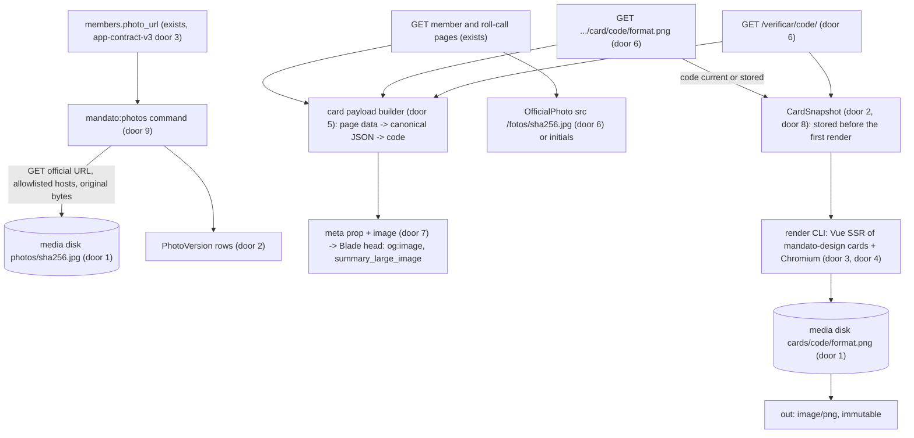
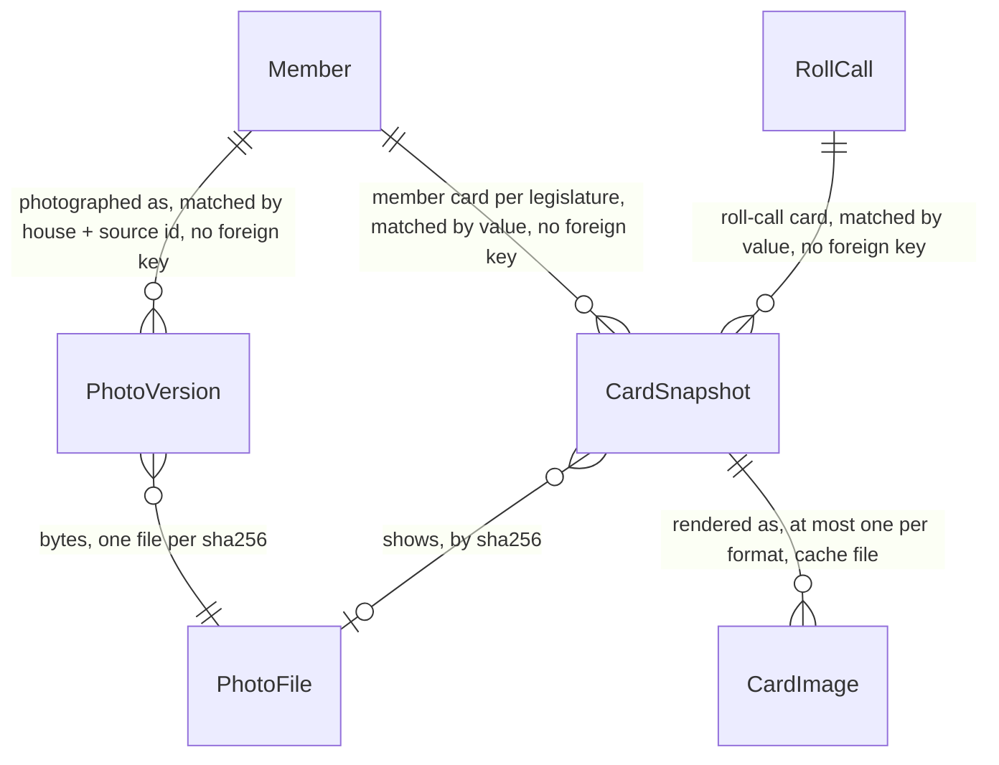

# share-cards: official photos from our origin, and verifiable share cards

## Problem

Every member page renders the initials frame instead of the official photo. App-skeleton AC 16 and app-contract-v3 AC 33 forbid hotlinking, and no cache exists to serve the photo from the app's own origin. A reader who meets a deputy or a senator on the site sees two letters where the house publishes a face.

A link to a member or a roll call shared on WhatsApp, X or Instagram previews with title and description only. The skeleton sets `twitter:card summary` until an image exists (its assumption "`twitter:card` without image"). The design research calls the share card the moment a reader decides to use the product (research 06 item 8, a1 section 6.3). It also names the risk that comes with it: a print of a card circulates long after the numbers change, and nobody can tell whether it was edited or is only old. The design system already fixed the card's layout (`design/screens/Card.vue`, 1200 × 630, tested for the longest name). No pipeline turns it into an image, and the template exists for one house and one size.

Who pays: readers, who get a weaker page and a bare link preview; the maintainer, who has the 2027-02-01 date (v2 grilling decision 2) and the legal duty to serve the official photo unaltered and credited (research 01 sections 3.2 and 4.4, checklist item 8). The MVP's evidence on cost: 643 Câmara photos weighed 20 MB, and 643 cards weighed 128 MB, about 200 KB each (launch plan, Problem). Measured on 2026-10-02: a Câmara photo is 354 × 472, 48 KB, served with `cache-control: no-cache` and an `ETag` the server does not honour (a conditional GET returned 200). A Senate photo is 480 × 600 (4:5, not 3:4), 233 KB, reached through a 301 to `legis.senado.leg.br`, with no `ETag` and no `Last-Modified`. An unknown Câmara id answers 404, while an unknown Senate id answers 200 with a small JPEG.

When this ships, member pages show the official photo served from `/fotos/`, with the house's credit. Member and roll-call pages carry an `og:image` card in three sizes, rendered from the design package's own components. Every card prints a code that opens `/verificar/{code}/`, which shows exactly the data the card showed and says whether the current data still match.

## Flow

This reuses the design package's card layout, components, tokens and fonts as the only template (design-system door 1, P15), the app's `PublicUrl` builders and route constraints (app-contract-v3 door 4), `positionCase` for the score marks (app-contract-v3 door 5), the Blade-rendered `meta` prop (skeleton door 8), the cookie-free `public` group (skeleton door 9) and Laravel's filesystem, cache locks and `Process`. It adds no second template and no image library.

## Impact

| Front | What changes |
| --- | --- |
| domain | new term: `PhotoVersion` - one set of official photo bytes fetched for one member, identified by its SHA-256; the member's current photo is the latest one not shared with another member |
| domain | new term: `CardSnapshot` - the exact values one card showed, stored as a canonical payload the first time that card is served; append-only |
| domain | new term: verification code - `YYYYMMDD-XXXXXXXX`, derived from the payload; the same data always gives the same code (door 5) |
| domain | new term: card format - `1200x630` (Open Graph), `1080x1350` (feed), `1080x1920` (stories); one payload and one code for all three |
| app-skeleton | AC 16 superseded: the profile renders the photo from `/fotos/` when one is stored. Assumption "`twitter:card` without image" superseded on member and roll-call pages: they carry `summary_large_image` with `og:image`. Door 8's `meta` prop gains `image`; pages without a card keep `summary` |
| app-contract-v3 | AC 33 superseded in its first half (photo now rendered); its second half (no `` outside our origin) still holds. Member and roll-call pages gain the share block (AC 42). Who branches on `OfficialPhoto`'s credit: the member pages, which now pass it by house |
| `design/` | new exported components `MemberCard.vue`, `RollCallCard.vue` with a `format` prop (door 4), and `components/card.js` with the house, ballot and kind labels both cards print; `screens/Card.vue` becomes a wrapper of `MemberCard` so the prototype and its tests keep running; `styles/components.css` gains the feed and story arrangements; `OfficialPhoto` is unchanged (its `object-fit: contain` in a 3:4 mat already shows a 4:5 Senate photo uncropped) |
| stored data | two new tables (door 2); nothing existing migrates. The first `mandato:photos` run downloads about 725 photos, roughly 50 MB, once |
| storage | new filesystem disk `media` (door 1); `app/storage/app/media/` gitignored |
| runtime | Chromium headless shell in the Sail image and in CI (door 3); a Vite SSR build of the card entry beside the Inertia SSR bundle |
| CI | job `app` installs the browser shell and runs the card tests; existing jobs untouched |
| privacy | unchanged promise: no third-party request from any page; photos and cards come from our origin |

## Relations

One-way constraints (door 2): `PhotoVersion` unique on house + member source id + sha256. `CardSnapshot` unique on code and unique on digest. A snapshot names its subject by house, kind, source id and legislature as stored values, with no foreign key, so a contract sweep or app-contract-v3's emptying migration never deletes verification history. Snapshots and photo files are never updated or deleted by this feature; `CardImage` files are a cache and may be pruned. No columns and no types here.

## Surface

Only routes this adds or whose signature changes. Every route is `GET`, in the cookie-free `public` group.

| Route | In | Out | Status |
| --- | --- | --- | --- |
| `GET /fotos/{sha256}.jpg` | `sha256` 64 lowercase hex | `image/jpeg`, the official bytes as fetched | `200`, `404`, `410` |
| `GET /deputados/{id}/legislatura/{n}/card/{code}/{format}.png` | member id, legislature, code, format | `image/png` of the format's size | `200`, `302`, `404`, `503` |
| `GET /senadores/{id}/legislatura/{n}/card/{code}/{format}.png` | as above | as above | `200`, `302`, `404`, `503` |
| `GET /votacoes/{id}/card/{code}/{format}.png` | Câmara roll-call id, code, format | as above | `200`, `302`, `404`, `503` |
| `GET /senado/votacoes/{id}/card/{code}/{format}.png` | Senate roll-call id, code, format | as above | `200`, `302`, `404`, `503` |
| `GET /verificar/` | optional query `codigo` | HTML (Inertia `Verify/Index`) · `meta` prop; with `codigo`, a redirect | `200`, `302` |
| `GET /verificar/{code}/` | code, any case and separators | HTML (Inertia `Verify/Show`) · `meta` prop | `200`, `301`, `404` |
| `GET /deputados/{id}/`, `/senadores/{id}/`, their `legislatura/{n}/`, `/votacoes/{id}/`, `/senado/votacoes/{id}/` (signature change) | unchanged | `meta` prop gains `image`; props gain `card` (`code`, three format URLs) and the member's `photo` (`url`, `credit`) | unchanged: `200`, `404` |

The `mandato:photos` and `mandato:cards:prune` commands (door 9) are called by the maintainer and later by the deploy feature's scheduler, never over HTTP.

## Landing

| One-way door | Literal shape | Alternative rejected |
| --- | --- | --- |
| 1. Photos are fetched by the app and kept behind a storage seam | `config/filesystems.php` disk `media` (`driver` `local`, `root` `storage_path('app/media')`, `visibility` `private`); `config('mandato.media_disk')` = `env('MANDATO_MEDIA_DISK', 'media')`; paths `photos/{sha256}.jpg` and `cards/{code}/{format}.png`; files are only ever read through the routes of door 6, never by a public symlink. Disk or S3-compatible storage is the deploy feature's choice of driver | an ETL step: the daily ETL rebuilds `data/` from empty (AD-012), so it would re-download about 50 MB a day or carry a cache as the MVP did, and the app would still copy every file into its own storage; binaries inside the JSON contract directory blur AD-002. The `public` disk with `storage:link`: the web server would serve files without our headers, 404 and suppression rule (AC 13), and ties the URL to a local path |
| 2. Stored schema | `photo_versions`: `house` check `in ('camara','senado')`, `member_source_id` text, `sha256` char 64, `source_url`, `final_url`, `bytes`, `width`, `height`, `fetched_at`, `checked_at`; unique `(house, member_source_id, sha256)`. `card_snapshots`: `code` unique, `digest` char 64 unique, `kind` check `in ('member','roll_call')`, `house` check, `source_id` text, `legislature` nullable, `template` integer, `payload` `jsonb`, `created_at`; index `(kind, house, source_id, legislature, id)`; no foreign key to any contract table; no update or delete path in the code | a `photo_sha` on `members`: app-contract-v3's migration empties `members`, and one pointer loses every earlier photo a snapshot references. Foreign keys with cascade: the importer's sweep (skeleton door 6) would delete the snapshot behind a code already printed. PNG bytes in the database: re-renderable cache in the backup |
| 3. Renderer: headless Chromium driven by Playwright, outside the request's PHP and outside the SSR server | `app/package.json` dependency `"playwright-core": "^1.63"`; browser installed with `npx playwright install --with-deps --only-shell chromium` in the published Sail `Dockerfile` and in CI; CLI `node bootstrap/cards/render.mjs` built by Vite SSR from `resources/js/cards/render.js`: reads one JSON `{kind, format, props, photo}` on stdin (`photo` a `data:image/jpeg;base64,` URI or `null`), renders `mandato-design/components/MemberCard.vue` or `RollCallCard.vue` with Vue `renderToString`, inlines `tokens.css` and `styles/components.css`, loads the Archivo and Source Serif 4 variable fonts from the `@fontsource-variable` packages as local files, sets the viewport to the format's size with `deviceScaleFactor` 1 and `colorScheme` `light`, aborts every request that is not `data:` or a local font file, screenshots the card element and writes the PNG to stdout; exit `0` rendered, `1` render failed (reason on stderr), `2` invalid input. PHP calls it through `Illuminate\Support\Facades\Process` with a 15 s timeout | satori 0.35 + resvg (the MVP's door 3): flexbox only, no stylesheet, no WOFF2, no variable-font axis, so the Archivo width axis (AD-015) and the grid layout of `Card.vue` would be rebuilt by hand in a second template, the drift the design-system Problem names. Takumi 2.14: supports grid, stylesheets, `var()` and variable fonts, but `oklch()` colours and the `wdth` axis through `font-stretch` are undocumented and it is not the engine `design/e2e` tests the card in; revisit if Chromium's cost bites. PHP images (Intervention, Imagick): no layout engine, a third template drawn by coordinates. Browsershot or `spatie/laravel-screenshot` 1.2: they screenshot a URL, so the card HTML would need an internal HTTP route, and they bring Puppeteer beside the Playwright the design package already uses. Rendering inside the Inertia SSR server: a hung Chromium would stall every page's SSR |
| 4. The card template lives in the design package | `design/components/MemberCard.vue` props `format` (`og` \| `feed` \| `story`), `house`, `legislature`, `member` (`name`, `party`, `uf`), `figures` (`[{count, total, label}]`), `votes` (app-contract-v3 door 5 inputs), `photo`, `photoCredit`, `generatedAt`, `code`, `verifyHost`; `design/components/RollCallCard.vue` props `format`, `house`, `heading`, `date`, `ballot`, `kind`, `approved`, `tallies` (nullable), `generatedAt`, `code`, `verifyHost`; root `.ma-card.ma-card--{format}` sized 1200 × 630, 1080 × 1350, 1080 × 1920; `design/screens/Card.vue` renders `MemberCard` with `format="og"` | cards written in `app/resources`: the design tests stop covering what ships (skeleton door 2). One component per format: three templates for one card, which a1 6.3 forbids ("três formatos do mesmo template"). Exporting `design/screens/Card.vue`: prototype copy and `contract.mjs` props (skeleton door 2) |
| 5. Card payload, digest and verification code | payload = `{template, kind, house, sourceId, legislature, generatedAt, photoSha256, ...card values}` with every displayed value and no format; `template` = `config('mandato.card_template')` = `1`, raised whenever a card's content rules change; canonical JSON = keys sorted recursively, `JSON_UNESCAPED_UNICODE \| JSON_UNESCAPED_SLASHES`, no whitespace, integers and strings only; `digest` = SHA-256 hex of it; `code` = Brasília date of `generatedAt` as `YYYYMMDD`, `-`, then the first 40 bits of the digest in Crockford base32 (`0123456789ABCDEFGHJKMNPQRSTVWXYZ`), 8 characters, for example `20270930-K7Q29XPD`; input normalisation uppercases, drops spaces and hyphens, maps `O` to `0` and `I`, `L` to `1` | date and member id only (a1 6.3's example): two imports on one day collide, and the code would not change when a correction changes a number. The full 64-hex digest: cannot be typed from a print. A random id: the same data served twice would get two codes. `ContractImport` ids: reset by app-contract-v3's migration and by any database rebuild |
| 6. Public URL shapes | `/fotos/{sha256}.jpg`; `{legislature path}card/{code}/{format}.png` for members, always with `/legislatura/{n}/`; `{roll-call path}card/{code}/{format}.png`; `{format}` in `1200x630`, `1080x1350`, `1080x1920`; `/verificar/` and `/verificar/{code}/`; every one built by `App\Support\PublicUrl` and answered with `Cache-Control: public, max-age=31536000, immutable` for images | the MVP's `/fotos/{id}.jpg`: a changed photo keeps its URL, so it cannot be cached as immutable and an old card would load the new photo. `/cards/{code}.png` alone: the image request could not rebuild a payload, so every page view would have to store a snapshot first. A `?v=` query: some preview crawlers drop the query and cache one image per path |
| 7. Share meta from the server, extended | `meta.image` = `{url, width: 1200, height: 630, alt}` or `null`; `app.blade.php` renders `og:image`, `og:image:width`, `og:image:height`, `og:image:type` `image/png`, `og:image:alt`, `twitter:image:alt` and `twitter:card` `summary_large_image` when it is set, `summary` otherwise | Vue `<Head>` for the image tags: they would vanish whenever SSR is down (skeleton door 8) |
| 8. A code exists only once its card is served | the image route stores the `CardSnapshot` with `insertOrIgnore` before invoking the renderer; pages compute the code without writing; no import or scheduled step creates snapshots or pre-renders images | snapshots for every subject inside the import transaction: couples the importer (skeleton door 6) to cards and writes about 700 rows a voting day that nobody shares, about 100 MB a year. Daily pre-rendering: about 140 MB of PNGs rewritten per voting day for cards nobody fetches |
| 9. Commands | `php artisan mandato:photos {--house=} {--member=} {--stale-after=7}`; `--member` requires `--house`; one `pg_try_advisory_lock` per run; concurrency 4, 250 ms pause per worker, timeout 15 s, User-Agent `mandato-aberto-app (+https://github.com/augusto-dmh/mandato-aberto)`, at most 3 redirects, each to `www.camara.leg.br`, `www.senado.leg.br` or `legis.senado.leg.br` over `https`; exit `0` run completed, `1` lock held, storage failure or every fetch of a house failed, `2` usage error. `php artisan mandato:cards:prune {--days=30}`; exit `0` or `1` | fetching inside `mandato:import`: a Senate photo outage would fail the data import, and the importer's transaction would hold its lock across HTTP calls. A queued job per member: the queue would hold about 725 jobs per run for what one command finishes in minutes |

- Nothing else in this change is hard to reverse

## Criteria

### S1: The official photo is cached from the house, byte for byte (P1)

`mandato:photos` keeps one unaltered copy of each member's official photo on our storage.

**Acceptance Criteria**

1. WHEN `php artisan mandato:photos` runs THEN the system SHALL request the `photo_url` of every member of `camara` and `senado` (or of `--house`) that has no current photo or whose latest check is older than `--stale-after` days, default 7, and SHALL skip the rest
2. WHEN a response is `200` with a body starting `FF D8 FF`, of at most 2 MiB, that PHP's `getimagesizefromstring` reads as JPEG with width and height of at least 100 THEN the system SHALL write the body to `photos/{sha256}.jpg` on the media disk unless that file exists, record a `PhotoVersion` with house, member source id, sha256, requested and final URL, byte size, width, height and fetch time, and the file's SHA-256 SHALL equal the body's
3. WHEN the fetched body's SHA-256 equals the member's current photo THEN the system SHALL record no new `PhotoVersion` and SHALL update only its `checked_at`
4. IF a request times out after 15 s, answers other than `200`, redirects more than 3 times or to a host other than `www.camara.leg.br`, `www.senado.leg.br` or `legis.senado.leg.br` over `https`, or returns a body failing AC 2 THEN the system SHALL keep the member's current photo, store nothing, and print `photo failed <house> <id>: <reason>` to stderr
5. WHEN a house's run ends THEN the system SHALL print `photos <house>: <n> checked, <n> new, <n> unchanged, <n> failed` and exit 0, or exit 1 when every one of at least one request of that house failed or a storage write failed
6. IF another `mandato:photos` run holds the lock THEN the system SHALL exit 1, print `another photo run is running` to stderr, and request nothing
7. IF `--house` is not `camara` or `senado`, or `--member` is given without `--house`, THEN the system SHALL exit 2 and print the usage to stderr
8. WHILE one sha256 is the latest `PhotoVersion` of two or more members THEN the system SHALL treat each of those members as having no current photo
9. WHEN `GET /fotos/{sha256}.jpg` is requested for a stored photo THEN the system SHALL respond 200 with `Content-Type: image/jpeg`, a body byte-identical to the stored file, `ETag: "{sha256}"`, `Cache-Control: public, max-age=31536000, immutable` and no `Set-Cookie`
10. IF `{sha256}` is not 64 lowercase hex characters or no such file is stored THEN the system SHALL respond 404

**Independent test:** fake the two hosts with `Http::fake` (a 354 × 472 JPEG, a 480 × 600 JPEG behind a 301, a 404, an HTML body, a redirect to another host), run the command twice, compare file hashes with the fake bodies and read the summary lines.

### S2: Member pages show the photo with the house's credit (P1)

**Acceptance Criteria**

11. WHEN a member page renders for a member with a current photo THEN `OfficialPhoto` SHALL have `src` `/fotos/{sha256}.jpg`, alt `Foto oficial de {name}`, and the caption `Foto: Câmara dos Deputados` for a Câmara member or `Foto: Agência Senado` for a Senate member
12. IF the member has no current photo THEN the page SHALL render the initials frame with no caption and no `` for the member
13. WHERE a member is listed in `config('mandato.photo_suppressed')` as `<house>:<id>` the system SHALL render that member's page and every card rendered afterwards with the initials frame, and SHALL answer 410 for that member's `/fotos/` files
14. The member pages SHALL contain no `` whose `src` is outside the app's origin

**Independent test:** store one photo per house through the fake, render a deputy, a senator and a member without a photo, read `src`, `alt` and the caption.

### S3: Cards render from the design template in three sizes (P1)

**Acceptance Criteria**

15. WHEN a card route is requested with the subject's current code and a format in `1200x630`, `1080x1350`, `1080x1920` THEN the system SHALL respond 200 with `Content-Type: image/png`, a PNG of exactly that width and height in pixels, `Cache-Control: public, max-age=31536000, immutable` and no `Set-Cookie`
16. WHEN a card image is served for a code the first time THEN the system SHALL have stored the `CardSnapshot` with that code and payload before the render, and SHALL store the PNG at `cards/{code}/{format}.png`
17. WHEN the same code and format is requested again THEN the system SHALL serve the stored PNG byte-identically without starting the render CLI
18. WHEN the code is not the subject's current code but a `CardSnapshot` of that subject has it THEN the system SHALL render from the stored payload and respond 200
19. IF the code is well formed but is neither current nor stored for that subject THEN the system SHALL respond 302 to the same format's URL for the current code
20. IF the subject does not exist, the member holds no mandate `{n}`, the format is not one of the three, or the code does not match `[0-9]{8}-[0-9A-HJKMNP-TV-Z]{8}` THEN the system SHALL respond 404
21. IF the render CLI exits non-zero or runs longer than 15 s THEN the system SHALL respond 503 with `Retry-After: 60`, store no PNG, and log `card render failed <code> <format>: <reason>` at level `error`
22. WHILE two renders are running THEN a request that would start a third SHALL receive 503 with `Retry-After: 60`, and two simultaneous requests for one code and format SHALL start one render
23. The render CLI SHALL build the card only from `mandato-design/components/MemberCard.vue` or `RollCallCard.vue`, the package's `tokens.css` and `styles/components.css` and the two variable font packages, and SHALL abort every page request whose URL is neither `data:` nor a local font file
24. WHEN the fixture member with the longest name and a 480 × 600 photo is rendered THEN the PNG SHALL weigh at most 300 KB at `1200x630`, 500 KB at `1080x1350` and 800 KB at `1080x1920`

**Independent test:** with the browser shell installed, request each format of one deputy, one senator and one roll call; read status, `image/png` size and headers; request again and assert the CLI ran once; request a stored old code after changing a vote, an unknown code and a malformed one.

**Amendment, decided after batch 2 by the orchestrator under the maintainer's delegation (2026-10-03), additive:** AC 15 holds for a card requested from a running server, not only from the CLI. `php artisan serve` (what Sail runs) drops the image's `ENV PLAYWRIGHT_BROWSERS_PATH` from the PHP it starts, and PHP-FPM clears the environment by default, so every served card answered 503. The renderer now hands the browsers path to the render CLI explicitly: `config('mandato.card_browsers_path')` = `env('PLAYWRIGHT_BROWSERS_PATH')`, passed through `Process::env` when set, and inherited from the environment when null. `.env.example` sets it to the Sail image's `/opt/ms-playwright`, which a served request reads from `.env`; CI sets its own path in job `app`'s environment, which wins over `.env`. Door 3 is unchanged.

### S4: Card content is fixed, the same for everyone, and limited (P1)

**Acceptance Criteria**

25. WHEN a member card renders THEN it SHALL show, in this order: `Mandato Aberto · {Câmara dos Deputados|Senado Federal} · {n}ª legislatura`; the `OfficialPhoto` with the AC 11 credit or the initials frame; the name exactly as stored, in the only `<h1>`; `{party} · {uf}` of the mandate; `Nas votações sobre propostas e emendas`; three figures, `Participação em votações nominais do plenário`, `Votos iguais à orientação do governo`, `Votos iguais à maioria do próprio partido`, each with the `merit` count and total as `n de m`; the label `{n} votações nominais do plenário com registro, da mais antiga à mais recente` above the compact `MandateScore` drawn by `positionCase`; and the footer of AC 28
26. IF a figure's total is 0 THEN the card SHALL write `Sem base de cálculo no período` for it and no number; IF the member has no vote in the legislature THEN it SHALL write `Nenhuma votação nominal do plenário com registro nesta legislatura.` and draw no score
27. WHEN a roll-call card renders THEN it SHALL show, in this order: `Mandato Aberto · {Câmara dos Deputados|Senado Federal}`; the page's heading (app-contract-v3 AC 41) in the only `<h1>`; `{ballot label} · {kind label} · DD/MM/AAAA`; `Aprovada`, `Rejeitada` or `Resultado não informado`; `{yes} Sim · {no} Não · {others} outros votos` with the `TallyBar`; and the footer of AC 28. IF the ballot is `symbolic` THEN it SHALL write `Votação simbólica: não há registro do voto de cada parlamentar nem placar.` instead of the tallies; IF the tallies are null THEN `Placar não publicado pela Casa.`
28. The footer of every card SHALL read `Fonte: {Câmara dos Deputados|Senado Federal}, dados de DD/MM/AAAA` with the Brasília date of the payload's `generatedAt`, and `Código {code} · confira em {host}/verificar/` with `{host}` the host of `APP_URL`
29. The text of every card SHALL contain no `%`, no term of the skeleton's forbidden list nor `importante`, `relevante`, `posição`, `percentil`, `lugar`, as whole words, case- and accent-insensitively, no member name other than the card's member, no member name on a roll-call card, no Senate official absence label, and no URL other than the AC 28 address
30. The rendered name SHALL equal the stored name character for character, with `text-transform` `none`
31. WHEN two members' cards of one format are rendered THEN their element trees SHALL have the same tags and classes in the same order, apart from score marks and the photo-or-initials node
32. WHEN a card of each format renders with a 48-character name and figures of 1.234 de 2.345 THEN no element SHALL extend beyond the card's box
33. The card SHALL draw the photo whole inside its 3:4 mat, at no more than its native width and height, with no `filter`, `mix-blend-mode`, `transform` or cropping `object-fit`

**Independent test:** in `design/`, render each component in each format in Playwright with the longest-name fixture and a Senate photo; in the app, render a deputy, a senator and a symbolic roll call and read the text of each card's HTML.

**Amendment, decided at batch 2 by the orchestrator under the maintainer's delegation (2026-10-03), additive:** a count of exactly one is written in the singular. AC 25's label reads `1 votação nominal do plenário com registro, da mais antiga à mais recente` for a member with one vote, and the plural for any other count. The same rule reaches `design/components/MandateScore.vue`'s table toggle, which reads `Ver a 1 votação como tabela` for one vote and `Ver as {n} votações como tabela` otherwise. `template` stays `1` although door 5 raises it when a content rule changes: no card has been served publicly yet (the app is not deployed), so no printed code carries the plural, and C23 holds `template` 1.

### S5: Every code opens the data the card showed (P1)

**Acceptance Criteria**

34. The system SHALL compute the code as door 5 states, and WHEN one payload is encoded twice, in two processes, THEN the codes SHALL be equal
35. WHEN any displayed value, the photo's sha256, `generatedAt` or `template` changes THEN the payload's code SHALL change
36. WHEN `GET /verificar/{code}/` is requested for a stored code THEN the system SHALL respond 200 with `<h1>` `Código {code}`, the `1200x630` image of that code with the AC 41 alt, every value of the payload as text, `Dados abertos da {Câmara dos Deputados|do Senado Federal}, coletados em DD/MM/AAAA.`, and a link to the subject's page
37. WHEN the subject's current code equals the stored one THEN the page SHALL write `Os dados atuais são iguais aos do card.`; WHEN it differs THEN `Os dados mudaram desde DD/MM/AAAA. O card mostra os dados daquela data.` with a link `Ver dados atuais`; IF the subject no longer exists THEN `Este registro não está nos dados atuais.`
38. WHEN `{code}` differs from a stored code only by case, spaces, hyphens, `O` for `0` or `I`, `L` for `1` THEN the system SHALL respond 301 to `/verificar/{code}/` in canonical form
39. IF no stored code matches after normalisation THEN the system SHALL respond 404 with `<h1>` `Código não encontrado` and the sentence `O código tem oito números, um hífen e oito letras ou números, como 20270930-K7Q29XPD.`
40. WHEN `GET /verificar/` is requested THEN the system SHALL respond 200 with a `GET` form whose field `codigo` is labelled `Código de verificação`, and WHEN `codigo` is given THEN it SHALL respond 302 to `/verificar/{normalised codigo}/`

**Independent test:** serve a card, change one vote and re-import, open the old code (mismatch sentence) and the new one (match sentence), then a lowercase variant (301) and a random code (404).

**Amendment, decided at batch 2 by the orchestrator under the maintainer's delegation (2026-10-03), additive:** in AC 37's third state (`Este registro não está nos dados atuais.`) the page renders the payload's values as text and no card image, so no `` points at a card URL that AC 20 answers with 404 once the subject is gone. AC 20 and AC 45 are unchanged.

**Amendment, decided after batch 2 by the orchestrator under the maintainer's delegation (2026-10-03), additive:** in the same third state the page points at nothing that answers 404. Its head follows door 7's rule for a page without a card: `twitter:card` `summary` and no `og:image` tag (AC 45's image tags apply to the first two states; `noindex` stays in all three). AC 36's link to the subject's page is not rendered; the subject's name stays on the page as plain text, in the payload's values.

### S6: Links preview the card and readers can download it (P1)

**Acceptance Criteria**

41. WHEN a member or roll-call page renders THEN the head SHALL hold `og:image` `{APP_URL}{card path}/{code}/1200x630.png`, `og:image:width` `1200`, `og:image:height` `630`, `og:image:type` `image/png`, `twitter:card` `summary_large_image`, and `og:image:alt` and `twitter:image:alt` equal to: for a member, `Card do Mandato Aberto: {name} ({party}-{uf}), {Câmara dos Deputados|Senado Federal}, {n}ª legislatura. Nas votações sobre propostas e emendas: participação em {c} de {t}; votos iguais à orientação do governo em {c} de {t}; votos iguais à maioria do partido em {c} de {t}. Dados de DD/MM/AAAA. Código {code}.`, with `sem base de cálculo` for a total of 0; for a roll call, `Card do Mandato Aberto: {heading}, {Câmara dos Deputados|Senado Federal}, DD/MM/AAAA. {result}. {yes} Sim, {no} Não, {others} outros votos. Dados de DD/MM/AAAA. Código {code}.`, with the AC 27 sentence in place of the tallies when they are absent
42. WHEN a member or roll-call page renders THEN it SHALL render after the source notes a section headed `Imagens para compartilhar` with links `Horizontal, 1200 × 630`, `Feed, 1080 × 1350` and `Stories, 1080 × 1920`, each to that format's card URL with a `download` attribute, and `Código de verificação: {code}` linking to `/verificar/{code}/`
43. WHEN a page renders THEN computing its code SHALL write no row
44. IF the SSR server is unreachable THEN the member and roll-call pages SHALL still carry every tag of AC 41
45. The `/verificar/{code}/` page SHALL carry the AC 41 image tags for its code and `<meta name="robots" content="noindex">`; the methodology, verification index and 404 pages SHALL carry `twitter:card` `summary` and no `og:image`
46. The system SHALL send no `Set-Cookie` header on any Surface route

**Independent test:** `curl` a member and a roll-call page with SSR up and down and read the head; follow `og:image` and get 200 `image/png`; count `card_snapshots` before and after the page request.

### S7: Storage stays bounded and history stays whole (P2)

**Acceptance Criteria**

47. WHEN `php artisan mandato:cards:prune` runs THEN the system SHALL delete every stored PNG older than `--days` (default 30) whose code is not the latest `CardSnapshot` of its subject, keep every other PNG, print `cards pruned: <n> files, <bytes> bytes`, and exit 0
48. WHEN a pruned card is requested again THEN the system SHALL render it from its stored snapshot and respond 200
49. The system SHALL delete no `CardSnapshot`, no `PhotoVersion` and no photo file in any command, import or migration of this feature, and SHALL log each render as `card rendered <code> <format> <ms> ms <bytes> bytes` at level `info`

**Independent test:** serve two codes of one subject, age the files, prune, and check the older PNG is gone, the latest is kept, both snapshots remain and the older code still renders.

## Out of scope

| Excluded | Why |
| --- | --- |
| Roll-call card by UF ("Como votaram os 70 deputados de SP", a1 6.3) | needs a member list on the card and its own template; the per-roll-call card comes first |
| A site-wide card for the home, methodology and listings | app-home's pages keep `summary`; a site card has no subject to verify |
| Pre-rendering cards after each import | door 8; the deploy feature can add a warm-up if measured first-render latency asks for it |
| A full snapshot of the page as it was on a date | the code keeps the card's own values; the whole page's history would mean a dated copy of the contract tables |
| QR code on the card | a1 6.3 lists none; the printed address and code serve the same purpose without a third visual element |
| TSE photos as fallback | research 01 limits them to members without a house photo before taking office; the app imports only members with a mandate |
| Cards inside e-mails (meus-eleitos) | that feature's template decides |
| The ementa on the roll-call card | official text cut to fit would change its meaning; the page shows it whole |
| Scheduling `mandato:photos` and `mandato:cards:prune` | the deploy feature owns the scheduler, as for `mandato:import` |
| Stating the photo handling on the privacy and Quem somos pages | those pages are not in the app yet |

## Assumptions

| Assumption | Chosen default | Rationale | Confirmed? |
| --- | --- | --- | --- |
| Verification profile | `ui` | the deliverable is images whose copy and arrangement are the risk (what never goes on a card); `ui` enumerates both per screen, as app-contract-v3 chose | y |
| Basis on the member card | the three indicators on the `merit` basis, the line `Nas votações sobre propostas e emendas` naming it once; the `all` basis stays on the page | four figures in two bases overflow the 1200 × 630 layout the design tests fixed; `merit` is the page's first basis and meus-eleitos' default | y |
| Photo recheck interval | 7 days; members with no photo every run | Câmara ignores conditional requests and Senate photos change rarely; a daily full pass would download about 50 MB a day from the houses | y |
| PNG retention | 30 days for codes that are not their subject's latest; snapshots forever | a snapshot is about 1 KB to 3 KB after PostgreSQL compression; a PNG about 200 KB and re-renderable from its snapshot | y |
| Snapshot storage estimate | worst case about 100 MB a year (every subject's card fetched on every voting day); realistic far less, since a snapshot exists only once its card was served | keeps the "kept forever" promise affordable without summarising old snapshots | y |
| Render concurrency | 2 simultaneous renders per app instance | one Chromium uses roughly 150 MB; a crawl of old card URLs must not exhaust a small server | y |
| Render time target | p95 of 3 s for a cold render, read from the AC 49 log line | a preview crawler that waits longer may show no image; a target, not a criterion | y |
| Feed and story arrangement | photo above the name, figures stacked, score at full width, same footer | the 3:4 photo and the score need the vertical space; one arrangement per format inside one component (door 4) | y |
| Card theme | light only, whatever the reader's system theme | an image outlives the page's theme, and the photo mat is specified in light (design-system AC 31) | y |
| Photo suppression | a config list `mandato.photo_suppressed` handled by the maintainer | research 01 asks for a 48 h removal process; a list in config is the smallest mechanism until the corrections admin exists | y |
| Placeholder detection | a sha256 shared by two or more members is no photo (AC 8) | an unknown Senate id answered 200 with a JPEG on 2026-10-02; a shared image cannot be anyone's official photo | y |
| Senate photo in the 3:4 mat | shown whole with mat bands, not reframed | one fixed template for everyone (a1 6.3) and no crop (P9) | y |

**Open questions:**

| # | Kind | Question | Until answered |
| --- | --- | --- | --- |
| 1 | blocks go-live | The card prints the host of `APP_URL` in `confira em {host}/verificar/`. The public domain is undecided (AD-012, deploy feature) | cards are built and tested with the configured host; cards served before a domain change print the old host, so the old host must keep redirecting `/verificar/` |

Resolved on 2026-10-02 by the orchestrator under the maintainer's delegation (`research/decisions-log.md`): (2) build with the credit "Foto: Câmara dos Deputados" as the live MVP already does; confirming that the `bandep` profile photos fall under the image bank's CC BY licence stays a pre-launch check in research 01 open item 5, and the cache can be emptied by one command if the answer is no; (3) AC 8's shared-hash rule is the guard; a stale small portrait is accepted as an official photo, because it is what the Senate publishes. Question 1 (the public domain) belongs to the deploy feature and the maintainer.

**Approval:** approved by the orchestrator under the maintainer's delegation on 2026-10-02, every assumption confirmed. Build starts after app-contract-v3.

## Observable

| Surface | Decision | Landing |
| --- | --- | --- |
| screen `member card` (three formats) | empty state | AC 26 (no base, no vote); AC 12 (no photo, initials) |
| screen `member card` | loading state | n/a - an image is either served whole or not at all |
| screen `member card` | error state | AC 21, AC 22 (503 with `Retry-After`) |
| screen `member card` | unauthorised state | n/a - public image, cookie-free (AC 46) |
| screen `member card` | density and ordering | AC 25, AC 31, AC 32 |
| screen `member card` | destructive action confirms | n/a - an image has no action |
| screen `roll-call card` | empty state | AC 27 (symbolic, no tally) |
| screen `roll-call card` | loading, unauthorised, destructive action | n/a - same reasons as the member card |
| screen `roll-call card` | error state | AC 21, AC 22 |
| screen `roll-call card` | density and ordering | AC 27 |
| screen `verification` | empty state | AC 37 (subject gone); AC 40 (index without a code) |
| screen `verification` | loading state | n/a - server-rendered (skeleton AC 24) |
| screen `verification` | error state | AC 39 (unknown code), AC 38 (malformed but recoverable) |
| screen `verification` | unauthorised state, destructive action | n/a - public, read-only |
| screen `verification` | density and ordering | AC 36, AC 37 |
| screen `member` and `roll call` (changed) | empty state | AC 12 (no photo) |
| screen `member` and `roll call` (changed) | density and ordering | AC 42 (share block after the source notes) |
| screen `member` and `roll call` (changed) | loading, error, unauthorised, destructive action | existing - app-contract-v3 Observable rows; this feature adds no state |
| document `card text` | structure, tone, depth, what the reader does next | AC 25, AC 27, AC 28, AC 29; the reader types the code at `/verificar/` |
| document `alt text` | structure, tone | AC 41 |
| all new image routes | response shape | AC 9, AC 15 (bytes and headers) |
| all new image routes | error shape and codes | AC 10, AC 13, AC 19 to AC 22 |
| all new image routes | who may call it | n/a - public, cookie-free (AC 46) |
| all new image routes | versioning | door 6: the URL is content-addressed, so a new version is a new URL |
| all new image routes | rate limits | AC 22 bounds renders; a request rate limit belongs to the deploy feature, in front of the app |
| route `/verificar/*` | response shape, error shape | AC 36 to AC 40 |
| route `/verificar/*` | versioning, rate limits | n/a - path shape does not version; rate limits as above |
| command `mandato:photos` | output format and verbosity | AC 4, AC 5 |
| command `mandato:photos` | every flag and its default | AC 1 (`--stale-after` 7), AC 7 (`--house`, `--member`), door 9 |
| command `mandato:photos` | exit codes | AC 5, AC 6, AC 7 |
| command `mandato:photos` | what it prints when it fails halfway | AC 4 (per member), AC 5 (summary per house; files already stored stay, each is complete by AC 2) |
| command `mandato:cards:prune` | output, flags, exit codes | AC 47 |
| collection: a member's photo versions | ordering, duplicates, the exception | AC 3 (same bytes, no new version), AC 8 (shared bytes, no photo) |
| collection: a subject's card snapshots | ordering, duplicates | door 2 (unique code and digest), AC 47 (latest kept) |

## Sources

- `research/design-anexos/a1-referencias-de-design.md` section 6.3 and principles P9, P14, P15 - one template for everyone, three sizes, the verification code, what never goes on a card, the photo as an untouchable object
- `research/01-pesquisa-juridica.md` sections 3.2, 4.4 and checklist item 8 - Câmara CC BY with credit, Senate reproduction with credit and no alteration, no crop, no filter, no recontextualisation, served from a cache of the official URL
- `.worktrees/app-skeleton/.specs/features/app-skeleton/plan.md` doors 8 to 10 and `.worktrees/app-contract-v3/.specs/features/app-contract-v3/plan.md` doors 3 to 5 (both approved 2026-10-02) - meta from the server, cookie-free pages, member and roll-call paths, `photo_url`, `positionCase`
